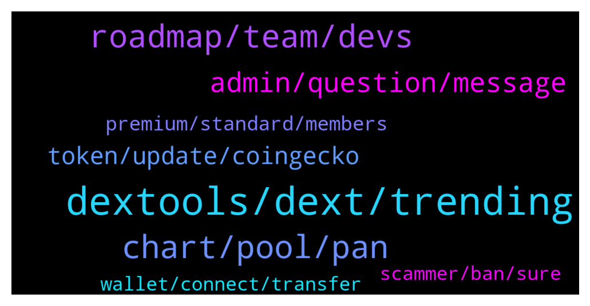

# **@DEXToolsCommunity**
 ## Analysis for **2022-01-22** - **2022-01-24**.

---

## 📊 **Basic Stats**

**n_messages_sent**: 208

---

---

## 🔝 **Top keywords and related messages**

1. **dextools, dext, trending**

    @hani_disclosed --- *How come? The dex launch yesterday* **--->** [TG Discussion](https://t.me/DEXToolsCommunity/327473)

    @thorex30 --- *DEXT is available on matic too?* **--->** [TG Discussion](https://t.me/DEXToolsCommunity/328094)

    @Dannie970 --- *How do I apply for dextool trending?* **--->** [TG Discussion](https://t.me/DEXToolsCommunity/327922)

    @Godsonisstilldamademan --- *When is Saitama paid ad for trending will runs out? Asking for a friend* **--->** [TG Discussion](https://t.me/DEXToolsCommunity/327524)

    @nate102 --- *this is the dextools verison, you can see theres candles where it stays flat, and the prices are completely off (although current price is now current), you can also see the green line above the chart making it look like its currently above all the time high when its not even half of it* **--->** [TG Discussion](https://t.me/DEXToolsCommunity/327366)

    @stanes --- *DEXT is a utility token. So holding DEXT gives you access to features. Check this page to have a look: https://www.dextools.io/#chooseyourplan* **--->** [TG Discussion](https://t.me/DEXToolsCommunity/327701)

2. **chart, pool, pan**

    @TBGOATOFFICIAL --- *Whenever you try go on the chart* **--->** [TG Discussion](https://t.me/DEXToolsCommunity/327497)

    @bastardganpunk --- *It’s because you’re looking at pan pool, so it shows the chart from this pool* **--->** [TG Discussion](https://t.me/DEXToolsCommunity/327387)

    @NikoDikooo --- *Hey Mooncat :) I have had questions from our community regarding this chart:  https://www.dextools.io/app/ether/pair-explorer/0xe7396f3210e93ba146468babf081141511ce2ef3  The current MCAP is actually around 7 million at the moment since all tokens aren’t in circulating supply. Can this be corrected/added to the Shiburai chart?* **--->** [TG Discussion](https://t.me/DEXToolsCommunity/328184)

    @yesplease83 --- *can someone explain what 0 buys - 3 sell mean on the chart transactions? how come 0 buys when they have 3 sells? are those airdropped tokens or wallet to wallet transfer if they didn't buy the token?* **--->** [TG Discussion](https://t.me/DEXToolsCommunity/327561)

    @nate102 --- *Normally it’s okay but at times like that it makes it look like chart is at all time high when it’s not even close* **--->** [TG Discussion](https://t.me/DEXToolsCommunity/327403)

    @nate102 --- *It’s just the launch of tokens doesn’t sync correctly to the chart* **--->** [TG Discussion](https://t.me/DEXToolsCommunity/327397)

3. **roadmap, team, devs**

    @un_defi_ned_F --- *Info are updated on FTMscan, I'm waiting for CMC/CG approval.* **--->** [TG Discussion](https://t.me/DEXToolsCommunity/327334)

    @nimrod620 --- *So nobody knows, it's all a big secret. Got it.* **--->** [TG Discussion](https://t.me/DEXToolsCommunity/327539)

    @bastardganpunk --- *Oh i see the flat part now thank you, will comment it* **--->** [TG Discussion](https://t.me/DEXToolsCommunity/327398)

    @nimrod620 --- *Hey do we have a roadmap or something* **--->** [TG Discussion](https://t.me/DEXToolsCommunity/327500)

    @JoeyDieleman --- *Team is working on an update of the roadmap* **--->** [TG Discussion](https://t.me/DEXToolsCommunity/327503)

    @nimrod620 --- *Just curious what the plan is for 2022 and what the team is working on to get us to the next level* **--->** [TG Discussion](https://t.me/DEXToolsCommunity/327525)

4. **admin, question, message**

    @NikoDikooo --- *No worries. Take your time. I will provide a screenshot via DM if needed for accurate numbers et cetera. Going to sleep now since I live in Sweden. We’ll be in touch 🙏* **--->** [TG Discussion](https://t.me/DEXToolsCommunity/328186)

    @Mickhalo --- *@FredericDEXT I sent you a DM if you can check it please* **--->** [TG Discussion](https://t.me/DEXToolsCommunity/328276)

    @bastardganpunk --- *i got no dm from you* **--->** [TG Discussion](https://t.me/DEXToolsCommunity/327590)

    @bastardganpunk --- *@IIISILVERFOXIII i deleted your message that other users won’t dm him 😉* **--->** [TG Discussion](https://t.me/DEXToolsCommunity/328083)

    @bastardganpunk --- *Also be careful, no admin will ever dm you first.* **--->** [TG Discussion](https://t.me/DEXToolsCommunity/327801)

    @JoanJunior --- *Hi, can i send you a DM* **--->** [TG Discussion](https://t.me/DEXToolsCommunity/327665)

5. **token, update, coingecko**

    @Cathy7717 --- *Hello, I would like to ask how to apply for the token's social networking software.* **--->** [TG Discussion](https://t.me/DEXToolsCommunity/327414)

    @bastardganpunk --- *About social Information for your token, please update etherscan.io, bscscan.com or the blockchain explorer from the chain your coin is built on or coingecko.com/ coinmarketcap We pull info from there.* **--->** [TG Discussion](https://t.me/DEXToolsCommunity/327333)

    @MoonstellarMoe --- *@admins can I list my token on your official website???* **--->** [TG Discussion](https://t.me/DEXToolsCommunity/327791)

    @JoeyDieleman --- *Can you give the token contract address?* **--->** [TG Discussion](https://t.me/DEXToolsCommunity/327621)

    @lil_cri --- *No one just what to trend my token* **--->** [TG Discussion](https://t.me/DEXToolsCommunity/328200)

    @MoonstellarMoe --- *I mean how can I get to have folks go on the dextools. io and view my token on there sir?* **--->** [TG Discussion](https://t.me/DEXToolsCommunity/327795)

6. **premium, standard, members**

    @Israelvolman --- *what is standard or premium members? where info about this?* **--->** [TG Discussion](https://t.me/DEXToolsCommunity/327933)

    @Arthur --- *Hi Team  -Can u please send me premium telegram group link?.  -in my understanding  venture group it’s  same for standard and premium members isn’t it?* **--->** [TG Discussion](https://t.me/DEXToolsCommunity/327307)

    @Asaprox --- *qual è il vantaggio di essere "standard"?* **--->** [TG Discussion](https://t.me/DEXToolsCommunity/328045)

    @stanes --- *You have to be a standard member to be able to vote.* **--->** [TG Discussion](https://t.me/DEXToolsCommunity/328031)

    @Arthur --- *I’m a premium member . Do I got benefits automatically with my membership or I have to  activate each benefit? I don’t think I mean* **--->** [TG Discussion](https://t.me/DEXToolsCommunity/327309)

    @JoeyDieleman --- *Contract, link won't work for new members* **--->** [TG Discussion](https://t.me/DEXToolsCommunity/327513)

7. **wallet, connect, transfer**

    @IceManCrypton --- *how do you bring the favorites tab back up* **--->** [TG Discussion](https://t.me/DEXToolsCommunity/327959)

    @bastardganpunk --- *correct, then you will be able to get the standard version just connecting your wallet* **--->** [TG Discussion](https://t.me/DEXToolsCommunity/327891)

    @Snodes88 --- *And so I must connect with the wallet which holds the tokens. I assume I can transfer between my wallets too?* **--->** [TG Discussion](https://t.me/DEXToolsCommunity/327893)

    @bastardganpunk --- *There is a little icon in the corner. Just click it.* **--->** [TG Discussion](https://t.me/DEXToolsCommunity/327960)

    @bastardganpunk --- *you need to connect then with the new wallet and your favourites etc get lost* **--->** [TG Discussion](https://t.me/DEXToolsCommunity/327895)

    @bastardganpunk --- *yes you can transfer, but then your account in the old wallet is not active anymore* **--->** [TG Discussion](https://t.me/DEXToolsCommunity/327894)

