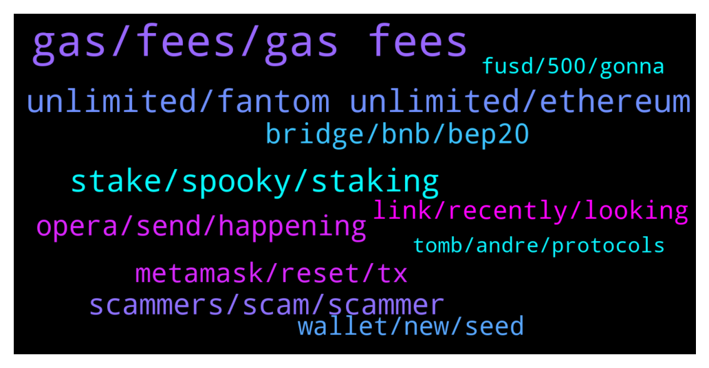

# **@Fantom_English**
 ## Analysis for **2022-01-23** - **2022-01-24**.

---

## 📊 **Basic Stats**

**n_messages_sent**: 431

---

---

## 🔝 **Top keywords and related messages**

1. **gas, fees, gas fees**

    @vvpreetham --- *Gas fees is differnt from cost per transfer. For example Eth gas fee right now is at 89 while FTM shows 389* **--->** [TG Discussion](https://t.me/Fantom_English/639212)

    @jabamun01 --- *Does gas price fluctuate on Fantom or is it always the same?* **--->** [TG Discussion](https://t.me/Fantom_English/639623)

    @pajamasfreak --- *1 sec ttf and you can look for dynamic gas price using /gas* **--->** [TG Discussion](https://t.me/Fantom_English/639187)

    @Lennart179 --- *Average gas price increased quite a lot over the last weeks. What will happen if we grow another 300% in a short time for example? Will the network be clogged likely? Are there things being optimized now for higher throughput/lower fees (outside of FVM)* **--->** [TG Discussion](https://t.me/Fantom_English/639563)

    @pajamasfreak --- *Some indeed like to pay on lower side, when gas spike up they just come out* **--->** [TG Discussion](https://t.me/Fantom_English/639206)

    @jabamun01 --- *there doesn't seem to be a way to get the gas price here... :(* **--->** [TG Discussion](https://t.me/Fantom_English/639648)

2. **unlimited, fantom unlimited, ethereum**

    @MichaelRosenberg --- *But buy getting onto the Fantom Opera network I can access Tomb and Spooky etc. And I'm not paying stupidly ridiculous gas fees - And you are supporting the network that you are investing in - Its stupid not to get into the Fantom system - Also once in the network its really easy and fun* **--->** [TG Discussion](https://t.me/Fantom_English/639622)

    @vvpreetham --- *Hi Team, QQ. Which launchpads are supporting Fantom today. Also what is the finality and cost per transaction.* **--->** [TG Discussion](https://t.me/Fantom_English/639178)

    @Ambiora --- *😂😂 But that's not true in case of Fantom. It's really undervalued my dear friend* **--->** [TG Discussion](https://t.me/Fantom_English/639818)

    @Gurgenphilip --- *Pls how much is one fantom* **--->** [TG Discussion](https://t.me/Fantom_English/638859)

    @Ikos --- *Well done Fantom team 👍🏻that’s insane* **--->** [TG Discussion](https://t.me/Fantom_English/639770)

    @Mcjig --- *Fantom on TG  Official: t.me/Fantom_English Announcements (official) : t.me/fantomfoundation Trading: t.me/FantomTrading French (Française): t.me/FantomFR Chinese (中文): https://t.me/FantomChinese Russian (русский): http://t.me/Fantom_Russian Vietnam : https://t.me/FantomVietnamGroup  Fantom on DIscord: chat.fantom.network  Fantom on Twitter: twitter.com/fantomfdn* **--->** [TG Discussion](https://t.me/Fantom_English/640078)

3. **stake, spooky, staking**

    @Xunobita --- *Hi there. I can't stake all of my Fantom (-2ftm) on pwallet, it require around 13 lesser, need advices please* **--->** [TG Discussion](https://t.me/Fantom_English/639422)

    @Mcjig --- *thats it, only stake on fwallet* **--->** [TG Discussion](https://t.me/Fantom_English/639654)

    @altay_ftm --- *On which wallet can i stake my FTM? Apart of Fantom wallet (I don’t like its design)* **--->** [TG Discussion](https://t.me/Fantom_English/639650)

    @FlorinGavrilescu --- *Hi all. Just a question,I have some different projects,is there a way to stake/farm all together or I have to do for each one on their site. eg. treeb,beets,brush..* **--->** [TG Discussion](https://t.me/Fantom_English/639972)

    @WedgeTailCrypto --- *Hi guys, can I ask a question about wFTM. Why is the that protocols like 0x only allow you to stake wFTM and not FTM. And if I have FTM in my wallet how do I turn that into wFTM?* **--->** [TG Discussion](https://t.me/Fantom_English/639358)

    @smart_boy77188 --- *and then what would happen? no reward for stakeing? cuz fees are so low* **--->** [TG Discussion](https://t.me/Fantom_English/639687)

4. **scammers, scam, scammer**

    @l0ve4all --- *i have entered in many cripto tg groups but never have been more than 3 scammer dm me, in this have been absolute record jajajja* **--->** [TG Discussion](https://t.me/Fantom_English/638778)

    @Deviant --- *New record - 6 scammers DM'd me after previous message* **--->** [TG Discussion](https://t.me/Fantom_English/640444)

    @DefiYoda --- *keep sending me messages scammers, so I know who to block* **--->** [TG Discussion](https://t.me/Fantom_English/639924)

    @Fjody --- *So delete and report each DM you will get. Many scammers will try to contact you now, offering you help.* **--->** [TG Discussion](https://t.me/Fantom_English/639525)

    @Deviant --- *Made sure to waste their time nicely* **--->** [TG Discussion](https://t.me/Fantom_English/640450)

    @Chip --- *Sounds like a total scam, but thanks for sharing* **--->** [TG Discussion](https://t.me/Fantom_English/639938)

5. **opera, send, happening**

    @Dtt --- *Hello Im trying to send my ftm tokens over to the opera network but it tells me there is insufficient liquidity everywhere!?!?* **--->** [TG Discussion](https://t.me/Fantom_English/639506)

    @Dcryptor --- *I see  ftm  in metamask  and in pwawallet but i can't send it anywhere* **--->** [TG Discussion](https://t.me/Fantom_English/639545)

    @JosephMello --- *What's ftm contract address for mainnet* **--->** [TG Discussion](https://t.me/Fantom_English/639091)

    @vvpreetham --- *Seems like Sending FTM is 0.009838* **--->** [TG Discussion](https://t.me/Fantom_English/639223)

    @noo_noo_sh --- *Better time for buying ftm is when?* **--->** [TG Discussion](https://t.me/Fantom_English/638871)

    @Crypthorian --- *Would you need to hold ftm to be eligible ?* **--->** [TG Discussion](https://t.me/Fantom_English/639018)

6. **bridge, bnb, bep20**

    @Mgsre --- *then please tell me about bridge  bep20 to ftm polygon to ftm* **--->** [TG Discussion](https://t.me/Fantom_English/639685)

    @encryptedhashfunction --- *Hi there !! Any help or suggestions are highly appreciated !! I´m stuck after bridging BNB to my Fantom wallet. Now I got BNB in my Fantom wallet but no FTM. I tried that gas fee faucet from Mentasuave01 twice but didn´t recieve it. Is there another faucet ? Thanks in advance !!* **--->** [TG Discussion](https://t.me/Fantom_English/639588)

    @MichaelRosenberg --- *I just did that, I did have FTM, go to spookyswap I think that you can swap your BNB for FTM* **--->** [TG Discussion](https://t.me/Fantom_English/639590)

    @AaH2o --- *What's the cheapest bridge from ETH to FTM?* **--->** [TG Discussion](https://t.me/Fantom_English/640080)

    @Mcjig --- *https://app.multichain.org/ you can choose 2 different ftms/ 1 is bridge 1 is router/ choose which one has liquidty* **--->** [TG Discussion](https://t.me/Fantom_English/639531)

    @phpflux --- *best bridge option for bsc -> ftm ?* **--->** [TG Discussion](https://t.me/Fantom_English/640417)

7. **metamask, reset, tx**

    @Mojofloat --- *Gets stuck in pending then eventually fails* **--->** [TG Discussion](https://t.me/Fantom_English/639920)

    @stifab --- *just did, would be really awesome!* **--->** [TG Discussion](https://t.me/Fantom_English/639432)

    @Janevietani --- *mean it has not broadcasted do you have a lot pending tx? if yes, reset your metamask then re-do your tx go to metamask setting -> advanced -> reset* **--->** [TG Discussion](https://t.me/Fantom_English/639538)

    @songosama --- *Is it still on ? Or I’m too late* **--->** [TG Discussion](https://t.me/Fantom_English/639743)

    @Deviant --- *Anyone having problems with transactions failing?* **--->** [TG Discussion](https://t.me/Fantom_English/640431)

    @Dcryptor --- *Hello all i have a question  Knows somebody why when I was sending a swap or transaction via the metamask, it is shows like pending, but in fact, it did not appear in ftmscan at all?* **--->** [TG Discussion](https://t.me/Fantom_English/639537)

8. **wallet, new, seed**

    @pajamasfreak --- *Make a new wallet and send your tokens from previous wallet to new one* **--->** [TG Discussion](https://t.me/Fantom_English/639341)

    @Timmy --- *with my old seed or new?* **--->** [TG Discussion](https://t.me/Fantom_English/639340)

    @bYhIsSpIrIt --- *Trying to restore my wallet with the right Mnemonic but after opening the wallet i find out it empty. Anyone with this same challenge?* **--->** [TG Discussion](https://t.me/Fantom_English/638925)

    @pajamasfreak --- *Get new wallet and send it there* **--->** [TG Discussion](https://t.me/Fantom_English/639339)

    @Mcjig --- *we will have a new wallet coming* **--->** [TG Discussion](https://t.me/Fantom_English/639670)

    @Mcjig --- *what do you need his wallet address for. that wont help him* **--->** [TG Discussion](https://t.me/Fantom_English/638946)

9. **link, recently, looking**

    @Crème brûlée --- *And follow the instructions in the article?* **--->** [TG Discussion](https://t.me/Fantom_English/639066)

    @vvpreetham --- *I got the answer I was looking for.* **--->** [TG Discussion](https://t.me/Fantom_English/639238)

    @pajamasfreak --- *Take a look at post below* **--->** [TG Discussion](https://t.me/Fantom_English/639423)

    @Mcjig --- *you will have to google for more info/ beyond what i told you. thats all the info i have* **--->** [TG Discussion](https://t.me/Fantom_English/639702)

    @KingMaozer --- *This is what im looking for thanks.* **--->** [TG Discussion](https://t.me/Fantom_English/639001)

    @Mcjig --- *all the links are in here* **--->** [TG Discussion](https://t.me/Fantom_English/639833)

10. **fusd, 500, gonna**

    @T --- *I’m sure a lot people gonna fomo 10 dollar* **--->** [TG Discussion](https://t.me/Fantom_English/640510)

    @LunaBull --- *Was gonna take fusd and conver to UST and earn 20% on anchor on terra* **--->** [TG Discussion](https://t.me/Fantom_English/640107)

    @Ambiora --- *But it's too undervalued from price perspective😢* **--->** [TG Discussion](https://t.me/Fantom_English/639807)

    @zenkert --- *Every coin/project fan thinks it's undervalued 😂* **--->** [TG Discussion](https://t.me/Fantom_English/639812)

    @forliferz --- *might just buy 100k fusd 🙈* **--->** [TG Discussion](https://t.me/Fantom_English/640598)

    @forliferz --- *are we just gonna ignore FUSD at 60 cents* **--->** [TG Discussion](https://t.me/Fantom_English/640595)

