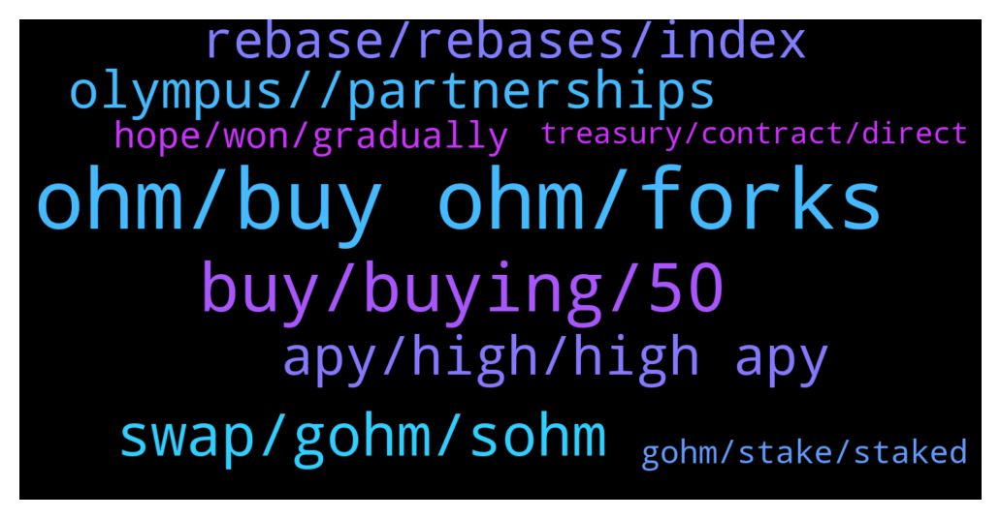

# **@OlympusTG**
 ## Analysis for **2022-01-23** - **2022-01-24**.

---

## 📊 **Basic Stats**

**n_messages_sent**: 1241

---

---

## 🔝 **Top keywords and related messages**

1. **ohm, buy ohm, forks**

    @Sebastian --- *There is no hope for OHM with mathematicians like you... loosing 90% means he bought OHM for about 700$* **--->** [TG Discussion](https://t.me/OlympusTG/168025)

    @VincentStatic --- *No. I still love Ohm. But its not perfect* **--->** [TG Discussion](https://t.me/OlympusTG/167288)

    @cdp279 --- *No they lend ohm to borrow other coins or more ohm.* **--->** [TG Discussion](https://t.me/OlympusTG/165910)

    @Yes&No --- *Is the price of ohm following btc or eth?* **--->** [TG Discussion](https://t.me/OlympusTG/167126)

    @bike4peace --- *If you would love OHM you would provide content that backs up your arguments   What you do is a mix of salty posting and saying ohm is not perfect while bringing ZERO solutions or anything that contributes to a community in terms of knowledge* **--->** [TG Discussion](https://t.me/OlympusTG/167291)

    @Novalisstark --- *With current OHM price approximately equal to backing, it is a no brainer* **--->** [TG Discussion](https://t.me/OlympusTG/167473)

2. **buy, buying, 50**

    @VincentStatic --- *Could we see below 50$? That would be so insane* **--->** [TG Discussion](https://t.me/OlympusTG/167170)

    @steveyh --- *What's the point of this when so many others bought later. Lol.* **--->** [TG Discussion](https://t.me/OlympusTG/168214)

    @Kng3000 --- *That's like buying at 300 not bad* **--->** [TG Discussion](https://t.me/OlympusTG/166562)

    @Ap0l1o --- *since you bought in November as you said* **--->** [TG Discussion](https://t.me/OlympusTG/166166)

    @abe1738384 --- *well i want to buy in size at 25* **--->** [TG Discussion](https://t.me/OlympusTG/165947)

    @Kng3000 --- *Guys if told you if pay 50 dollars to 60 dollars would you consider that a deal* **--->** [TG Discussion](https://t.me/OlympusTG/166534)

3. **swap, gohm, sohm**

    @D7 ⭐️ --- *If I buy gohm  will increase if I leave it in the wallet?* **--->** [TG Discussion](https://t.me/OlympusTG/165935)

    @mdqmatias --- *A friend has just had his gohm collateral liquidated, 17k 😢* **--->** [TG Discussion](https://t.me/OlympusTG/165896)

    @cdp279 --- *Number of gohm does not increase* **--->** [TG Discussion](https://t.me/OlympusTG/165942)

    @Twinkieboy333 --- *So I would just buy gOHM it goes into my meta mask and I’m done, nothing else to do? Tyty* **--->** [TG Discussion](https://t.me/OlympusTG/167818)

    @nfwaple --- *then just swap gOHM directly, or if you want to compare the price of swapping OHM, you can also check the dex price, if you want to swap OHM instead, just unstake your gOHM to OHM* **--->** [TG Discussion](https://t.me/OlympusTG/167036)

    @SMNFT7 --- *Yeah you get gOHM and just hold, nothing else is required* **--->** [TG Discussion](https://t.me/OlympusTG/167468)

4. **apy, high, high apy**

    @Marco --- *I keep getting muted by the TIME discord when I ask , “does the APY still apply with wmemo?”* **--->** [TG Discussion](https://t.me/OlympusTG/166809)

    @Ahmad --- *I agree with you. People love high APY and when Ohm APY decrease they jump ship and when to other protocols with high APY. I don't blame them, it is just business for them. For me, I believe Ohm will do well as their plans for 2022 look good.* **--->** [TG Discussion](https://t.me/OlympusTG/167144)

    @Sebastian --- *1000% Apy from 1$ is 2.4$ ....* **--->** [TG Discussion](https://t.me/OlympusTG/167519)

    @rasputen1 --- *Low price and low apy how will that even entice any ee buyers* **--->** [TG Discussion](https://t.me/OlympusTG/167397)

    @mitesh_harivadan --- *how long is the 1000% APY fpr* **--->** [TG Discussion](https://t.me/OlympusTG/166024)

    @cdp279 --- *In 1 year you make 10x just on apy. So not too bad* **--->** [TG Discussion](https://t.me/OlympusTG/165903)

5. **olympus, , partnerships**

    @nfwaple --- *IMO there should be a premium as Olympus as a protocol can generate revenue* **--->** [TG Discussion](https://t.me/OlympusTG/166481)

    @nfwaple --- *ideally we need people that are aligned with Olympus' vision but it is not always possible, therefore it should never have been a pump and dump kind of token, recently a lot of people are suggesting locked staking to rewards holders, but I am not too sure if it would work out, since Olympus is really the first one in defi doing what it is doing* **--->** [TG Discussion](https://t.me/OlympusTG/166500)

    @bestbotsro --- *so, let me tell you what I understand:    I have this sOHM, and when I go to olympus, it says that I need to migrate to v2.  I dont see anymore the value to raise, so the stake I think dont work, unless I migrate to v2.    v2 is still on ETH ? or can it be on AVAX too ?    I ask because of the big fees, and to see if worth to migrate.    thank you* **--->** [TG Discussion](https://t.me/OlympusTG/165968)

    @Lyubo --- *Guys can you share your opinion…Is it Olympus going in the right direction because the price is so much dropped ?* **--->** [TG Discussion](https://t.me/OlympusTG/165847)

    @BROHMZ --- *When the market bounces back and the bulls are back in town Olympus will go back to proper mcap because it isnt going anywhere but up once this bear sentiment is over and done with* **--->** [TG Discussion](https://t.me/OlympusTG/167267)

    @nfwaple --- *Most people found Olympus from all the 1000x crypto youtube videos 😂* **--->** [TG Discussion](https://t.me/OlympusTG/167605)

6. **rebase, rebases, index**

    @vladdevelop --- *where they are falling every rebase* **--->** [TG Discussion](https://t.me/OlympusTG/167522)

    @Kbuxton90 --- *Was thinking of higher rebases. How wrong I was.* **--->** [TG Discussion](https://t.me/OlympusTG/167046)

    @satoshi_whale --- *If it only still stays in positive rebase** **--->** [TG Discussion](https://t.me/OlympusTG/167777)

    @nfwaple --- *negative rebase is like negative interest, it exists but it would almost never happen* **--->** [TG Discussion](https://t.me/OlympusTG/167780)

    @D7 ⭐️ --- *So what is the rebases i will get ?* **--->** [TG Discussion](https://t.me/OlympusTG/165948)

    @cdp279 --- *Ser. Rebases are the yield you get based on the apy, a rebase is given every 8 hours.* **--->** [TG Discussion](https://t.me/OlympusTG/165960)

7. **hope, won, gradually**

    @BROHMZ --- *We are still far from this scenario* **--->** [TG Discussion](https://t.me/OlympusTG/166049)

    @VincentStatic --- *At some point we have to end droping* **--->** [TG Discussion](https://t.me/OlympusTG/167222)

    @Ap0l1o --- *we have not stopped at all* **--->** [TG Discussion](https://t.me/OlympusTG/166119)

    @Thor024 --- *the sooner this happens the better it is* **--->** [TG Discussion](https://t.me/OlympusTG/166309)

    @nfwaple --- *it will be positive for the foreseeable future* **--->** [TG Discussion](https://t.me/OlympusTG/167778)

    @PuppetDefi --- *Lmao fast forward 1 week 📉🥴* **--->** [TG Discussion](https://t.me/OlympusTG/167443)

8. **gohm, stake, staked**

    @cdp279 --- *Ser. You don’t need to stake gohm. It is wrapped version of sohm.* **--->** [TG Discussion](https://t.me/OlympusTG/166004)

    @nfwaple --- *gOHM is already staked, no need to do anything* **--->** [TG Discussion](https://t.me/OlympusTG/167817)

    @nfwaple --- *yes, you can go to the stake page and see your gOHM staked there afterward, you can also get gOHM from another chain* **--->** [TG Discussion](https://t.me/OlympusTG/167819)

    @allenkor --- *I staked my gohm in toke, I’m in the same boat. Can vote either unless I unstake from toke* **--->** [TG Discussion](https://t.me/OlympusTG/165850)

    @nfwaple --- *that's right, but gOHM is already staked, so there is no need to stake again* **--->** [TG Discussion](https://t.me/OlympusTG/167657)

    @nfwaple --- *same APY for gOHM and sOHM, gOHM comes staked* **--->** [TG Discussion](https://t.me/OlympusTG/167814)

