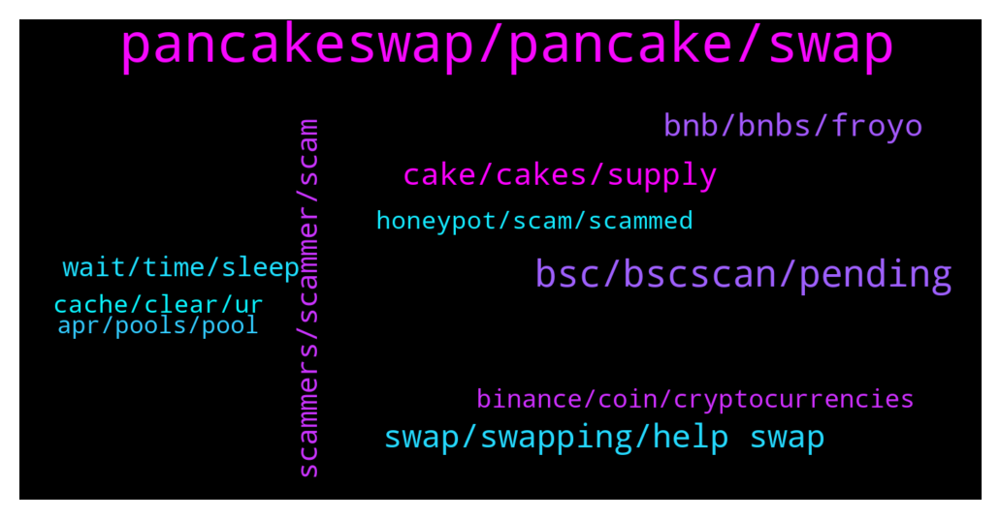

# **@PancakeSwap**
 ## Analysis for **2022-01-23** - **2022-01-24**.

---

## 📊 **Basic Stats**

**n_messages_sent**: 869

---

---

## 🔝 **Top keywords and related messages**

1. **pancakeswap, pancake, swap**

    @Mike --- *Transfer tokens to meta, use meta to swap for Eth fan, 30mins after transfer ON PANCAKESWAP. My meta was hacked/accessed through pancake. They drained all my funds.  The approval of site access was breached by a hacker to steal funds.* **--->** [TG Discussion](https://t.me/PancakeSwap/2295995)

    @Ceddi200 --- *Get contract address of the tokens you own from bscscan.com and input it to pancakeswap exchange (search) , then save it. https://t.me/PancakeSwap/2292154* **--->** [TG Discussion](https://t.me/PancakeSwap/2299155)

    @nnothing2 --- *there is official pancake discord. it's slow reply but safer from scammer 👍👍* **--->** [TG Discussion](https://t.me/PancakeSwap/2296963)

    @Ceddi200 --- *You might also be asking, “why can’t I buy with CAKE?”. That’s because we want EVERYONE to be able to trade on the NFT marketplace. Trading fees for Phase 1 will be set at 2%. 🔥🥞All fees collected by PancakeSwap will be used to buy back and BURN CAKE in our weekly burns!🔥🥞* **--->** [TG Discussion](https://t.me/PancakeSwap/2297662)

    @JJ --- *Hi, i got scammed and my autocake position is empty* **--->** [TG Discussion](https://t.me/PancakeSwap/2297083)

    @Ceddi200 --- *Bro you have a 3 month old tokenomics not that it’s 1 year old. If you are frustrated about the price. Why not try other dex. That’s one of the reason I compared tokens related to pancakeswap . Tell me when last uniswap gave update also* **--->** [TG Discussion](https://t.me/PancakeSwap/2299299)

2. **bsc, bscscan, pending**

    @aussieful --- *still peding transactions.. cant do any swap😂  this is like a hostage in bsc* **--->** [TG Discussion](https://t.me/PancakeSwap/2299281)

    @Shrimals --- *Ok.. I am trying and let you all know.. I am searching BScreceipt.* **--->** [TG Discussion](https://t.me/PancakeSwap/2299881)

    @M --- *did BSC broke for metamask?  all TXN is not going through and stuck* **--->** [TG Discussion](https://t.me/PancakeSwap/2299505)

    @Krypt07 --- *Then why my txn not showing on bscscan* **--->** [TG Discussion](https://t.me/PancakeSwap/2299448)

    @nywra --- *BSC down?, try to transaction always failed and pending* **--->** [TG Discussion](https://t.me/PancakeSwap/2299313)

    @89 --- *Wait few hours i guwss....bsc congested* **--->** [TG Discussion](https://t.me/PancakeSwap/2299586)

3. **swap, swapping, help swap**

    @clajma --- *please  I need help , i want to swap and it does not connect* **--->** [TG Discussion](https://t.me/PancakeSwap/2300244)

    @Rush_lover --- *Verse is a scam coin. leave it there. dont try to swap, its not working but it cost u fee.  https://bscscan.com/address/0xBB92B9d18DB99C3695BC820bf2c876D4B1527Fa5#comments* **--->** [TG Discussion](https://t.me/PancakeSwap/2296687)

    @aussieful --- *thats what im thinking as well. i did all procedure but nothing happen...  need to swap 😭 even transfer is not functioning as well* **--->** [TG Discussion](https://t.me/PancakeSwap/2299301)

    @mattcoinsniper --- *Man PCS is becoming unusable. 90% of my swaps fail, adding/removing liquidity is very combersome* **--->** [TG Discussion](https://t.me/PancakeSwap/2299866)

    @Henry Walter --- *Hi admin how can I swap my tether trc20 and palcoin Trc10* **--->** [TG Discussion](https://t.me/PancakeSwap/2298166)

    @Royalpink --- *How long does it take to swap ??* **--->** [TG Discussion](https://t.me/PancakeSwap/2299417)

4. **cake, cakes, supply**

    @Hephaistos1 --- *Depends on the price of cake...* **--->** [TG Discussion](https://t.me/PancakeSwap/2297838)

    @SemperFi69 --- *Trade of the day. Guy sells 10000 Cakes at the lowest point.🤦‍♂️* **--->** [TG Discussion](https://t.me/PancakeSwap/2297894)

    @Raj --- *I am new here, please anyone can tell me the future of cake. I want to invest for long term.* **--->** [TG Discussion](https://t.me/PancakeSwap/2297034)

    @Moon_Catcherr --- *So many scammer here. I just ask how many max supply. A bunch of scammer send me a message* **--->** [TG Discussion](https://t.me/PancakeSwap/2299651)

    @John --- *I have a question  How do you deal with the increasing amount of cake added every day?  Does burning really make the cake volume not add up?  Please tell me* **--->** [TG Discussion](https://t.me/PancakeSwap/2299488)

    @Moon_Catcherr --- *So the suplly of CAKE is increasing by the time?* **--->** [TG Discussion](https://t.me/PancakeSwap/2299624)

5. **bnb, bnbs, froyo**

    @isaacmichaan --- *i was doing some swaps, but how does it got all my bnbs?* **--->** [TG Discussion](https://t.me/PancakeSwap/2298697)

    @Evar --- *I connected my trust wallet to pancake swap, but it still shows me zero balance while I have BNB in my wallet* **--->** [TG Discussion](https://t.me/PancakeSwap/2296731)

    @unknown_guy5 --- *@admin tell me who give .4BNB in return of 0.06 BNB 🤣🤣🤣* **--->** [TG Discussion](https://t.me/PancakeSwap/2297960)

    @alanwalker988 --- *i just swap my bcoin to bnb, but it shown insufficient amount, but i have enough bcoin in my wallet* **--->** [TG Discussion](https://t.me/PancakeSwap/2297990)

    @buddyvin --- *wanna ask, I swapped bnb for froyo, but why is the route being swapped first to cake then froyo? I see theres a direct liq of bnb-froyo, im curious of whats happening? Now for some time, now I check from pcs app says the route is bnb-busd-froyo🧐* **--->** [TG Discussion](https://t.me/PancakeSwap/2296693)

    @Aosh1ma --- *https://bscscan.com/tx/0x3996461a18531fd1236dc06eca6a8bf7a68eb6b45573fd8fe397fccd6c1f5205  your all bnbs send to another address, but your tokens in your wallet ~$40usd* **--->** [TG Discussion](https://t.me/PancakeSwap/2298724)

6. **scammers, scammer, scam**

    @Alan --- *Don’t call me please stay away from me scammers* **--->** [TG Discussion](https://t.me/PancakeSwap/2296270)

    @M --- *hey please help me I am on the line with a scammer* **--->** [TG Discussion](https://t.me/PancakeSwap/2296385)

    @forc3r --- *That's not a proof of scam* **--->** [TG Discussion](https://t.me/PancakeSwap/2297966)

    @Taleb --- *Doing anything and not protecting people from scam companies, what's the point? Do you only take commission?* **--->** [TG Discussion](https://t.me/PancakeSwap/2295797)

    @Meganlouise89 --- *scammers contacting me don't bother 😂* **--->** [TG Discussion](https://t.me/PancakeSwap/2299385)

    @Salome Lee --- *Thank I'm aware the scammer's dey are everywhere in the world 😭* **--->** [TG Discussion](https://t.me/PancakeSwap/2295949)

7. **wait, time, sleep**

    @CakeCompounder --- *This is Amazon. It doesn’t happen overnight people. Relax and chill a bit. Focus on your health.* **--->** [TG Discussion](https://t.me/PancakeSwap/2300033)

    @SuperLuckyInvestor --- *its like that for 2hrs now. maybe wait later. go to sleep and wakeup  maybe is backup. if your country is night time.* **--->** [TG Discussion](https://t.me/PancakeSwap/2299331)

    @JJ --- *yes - i didn't realize - i'm in tears...* **--->** [TG Discussion](https://t.me/PancakeSwap/2297136)

    @Allison --- *Good night, have a sweet dream* **--->** [TG Discussion](https://t.me/PancakeSwap/2295853)

    @aussieful --- *its dinner time here in my place .. i might not sleep till i finish this. i still have hours time to wait then* **--->** [TG Discussion](https://t.me/PancakeSwap/2299343)

    @PILCAN --- *More than an hour has passed. 😢* **--->** [TG Discussion](https://t.me/PancakeSwap/2299587)

8. **binance, coin, cryptocurrencies**

    @HAH_007 --- *I used to have money and cryptocurrencies in the Meta Mask platform, and now they are no longer there* **--->** [TG Discussion](https://t.me/PancakeSwap/2297996)

    @Taleb --- *i do my reaserch by coinmarketcap and the teams and there site* **--->** [TG Discussion](https://t.me/PancakeSwap/2295808)

    @PanzerkampFren --- *everyone can make coin, can make web page saying they gonn be numba one , replace eth etc, and put coin on pacnakeswap ser* **--->** [TG Discussion](https://t.me/PancakeSwap/2295811)

    @Lilianklin --- *Please how can i stake my coin* **--->** [TG Discussion](https://t.me/PancakeSwap/2298575)

    @noahkav --- *How do we make sure we dont buy a coin we cant sell. Just read the white paper?* **--->** [TG Discussion](https://t.me/PancakeSwap/2299761)

    @Evar --- *Is there any coin called Binsncr Smart Chain?* **--->** [TG Discussion](https://t.me/PancakeSwap/2296735)

9. **cache, clear, ur**

    @Ceddi200 --- *Have you cleared cache and cookies and try again* **--->** [TG Discussion](https://t.me/PancakeSwap/2296978)

    @PILCAN --- *I have also tried resetting the activity history and also trying to cancel it by setting a temporary value, but I can't find a solution.* **--->** [TG Discussion](https://t.me/PancakeSwap/2299657)

    @yeusheng --- *I clear history in chrome.. still the same issue.. the “Confirm Supply” button is not clickable* **--->** [TG Discussion](https://t.me/PancakeSwap/2296986)

    @SuperLuckyInvestor --- *did tried to clear cache already. but still not work. maybe will try tomorrow then.* **--->** [TG Discussion](https://t.me/PancakeSwap/2299386)

    @Royalpink --- *So if it shows failed ! Then can I try again ??* **--->** [TG Discussion](https://t.me/PancakeSwap/2299500)

    @sheraz1297 --- *How do I check this if this is the issue ?* **--->** [TG Discussion](https://t.me/PancakeSwap/2296306)

10. **honeypot, scam, scammed**

    @Tigerhawk89 --- *WARNING: This token has been flagged due to evidence of a bug, hack, or scam  https://thebittimes.com/token-EFT-BSC-0x7074198142e88b12e0fa287aa47fe3f190718863.html* **--->** [TG Discussion](https://t.me/PancakeSwap/2296020)

    @unknown_guy5 --- *So when I paid him then it call scammed* **--->** [TG Discussion](https://t.me/PancakeSwap/2297971)

    @IreneDrip --- *The token eth fan was a scam contract!* **--->** [TG Discussion](https://t.me/PancakeSwap/2295996)

    @Tigerhawk89 --- *I am not allowed to send links here , just google thebittimes eth fsn token and they have identified a hack, plus many youtube videos proving its a scam* **--->** [TG Discussion](https://t.me/PancakeSwap/2296012)

    @AintSudo --- *Someone sold you a scam token. You can buy, can’t sell. Its called honeypot* **--->** [TG Discussion](https://t.me/PancakeSwap/2298525)

    @AwnihDrip --- *Honeypot , Congrats you are scammed ;)* **--->** [TG Discussion](https://t.me/PancakeSwap/2298522)

