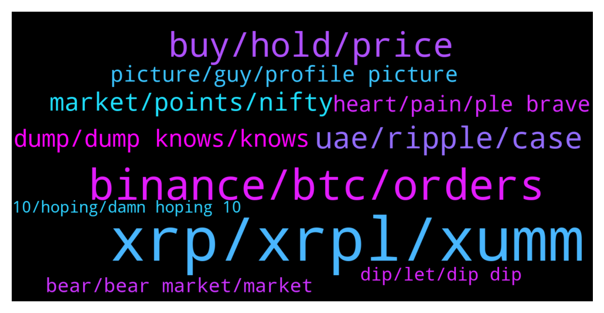

# **@Ripple**
 ## Analysis for **2022-01-23** - **2022-01-24**.

---

## 📊 **Basic Stats**

**n_messages_sent**: 317

---

---

## 🔝 **Top keywords and related messages**

1. **xrp, xrpl, xumm**

    @Pelawatsemesta --- *give me a reason why should i buy xrp coins* **--->** [TG Discussion](https://t.me/Ripple/3044362)

    @Tinkabellagal --- *You can connect XUMM to decentralised exchange There are many tokens on xrpl  https://t.me/Ripple/3045355* **--->** [TG Discussion](https://t.me/Ripple/3045367)

    @tijarist36 --- *Xrp will go to the mooooonnnn* **--->** [TG Discussion](https://t.me/Ripple/3044919)

    @TheBlurryBat --- *I just went ahead and bought more xrp!* **--->** [TG Discussion](https://t.me/Ripple/3045157)

    @GreenGecko --- *XRP has offices now? Can you send a pic please* **--->** [TG Discussion](https://t.me/Ripple/3044607)

    @XV --- *if XRP is for moving trillions of dollars then it needs to be worth a lot more than it is today* **--->** [TG Discussion](https://t.me/Ripple/3045115)

2. **binance, btc, orders**

    @NialPial --- *Futures on binance are tanking on shorts, ya’ll dont even check the orderbook enough, you can litrly see what they doin rn😂 just wait till the FED comes with their stupid plan on new crypto policy* **--->** [TG Discussion](https://t.me/Ripple/3044460)

    @NialPial --- *Look at the spikes last 2 hrs. 700€+ in 20 minutes on btc.. and at the same time u see Binance BTC liquidity going up lol* **--->** [TG Discussion](https://t.me/Ripple/3044468)

    @NialPial --- *I mean the overal holdings in futures Binance owns. No offense at all, but do you know what Future trading is? (Again, no offense, really)* **--->** [TG Discussion](https://t.me/Ripple/3044476)

    @NialPial --- *Well therefore i’m confused u dont see what Binance is doing. They’re literally playing with their future holdings, to manipulatethe BTC price lmao* **--->** [TG Discussion](https://t.me/Ripple/3044484)

    @SaveYourSelf2 --- *If you watch the order books long enough, a majority large orders are drop ceilings and floors. Watch for completion of the orders for true volume.* **--->** [TG Discussion](https://t.me/Ripple/3044466)

    @SaveYourSelf2 --- *That is normal for an exchange to manipulate order books. Keeps them hot. I thought you where refering to the completed orders not just open.* **--->** [TG Discussion](https://t.me/Ripple/3044488)

3. **buy, hold, price**

    @Ekkimukk10 --- *Loaded up a bit more yesterday. Never feel like it's enough* **--->** [TG Discussion](https://t.me/Ripple/3044847)

    @Voltaire123 --- *Or leverage down if you have the balls.* **--->** [TG Discussion](https://t.me/Ripple/3044803)

    @ReiTeh --- *I am just honestly too lazy to do anything about my bags. Just hold I guess. 🤷‍♂* **--->** [TG Discussion](https://t.me/Ripple/3045404)

    @Martijndelange --- *Did you guys buy more or wait on a even bigger crash?* **--->** [TG Discussion](https://t.me/Ripple/3044928)

    @marianmp --- *People fomo to buy when it's high price .....but not buy when it's cheep* **--->** [TG Discussion](https://t.me/Ripple/3045297)

    @Russty007 --- *Just like weak hands in poker* **--->** [TG Discussion](https://t.me/Ripple/3045270)

4. **uae, ripple, case**

    @RJ_DRS --- *$XRP to set up central offices in  🇦🇪 Dubai 🇦🇪… pay attention!!!* **--->** [TG Discussion](https://t.me/Ripple/3044565)

    @BtcSoL --- *When is the end of the lawsuit guys ?* **--->** [TG Discussion](https://t.me/Ripple/3044614)

    @gerrymchugh --- *Unlikely. More likely to be relisted on one's that actually removed it once case is over* **--->** [TG Discussion](https://t.me/Ripple/3044772)

    @XRP_Saitama --- *Regulations will be this year. SEC case ends this year. If ripple wins or settles we’ll see a reversal* **--->** [TG Discussion](https://t.me/Ripple/3045229)

    @Vincent758 --- *The biggest mistake ripple labs will make is to have their central office in Dubai UAE.  I've lived in Dubai for over 10 year's & their law changes like the weather.  I would totally avoid UAE & the rest of the middle east. The only reason why UAE is encouraging Crypto is because they are heavily in debt due to the Expo 2020 disaster.  Most people trading crypto will have their Crypto & assets seized in UAE. Mark it* **--->** [TG Discussion](https://t.me/Ripple/3044659)

    @hitman_with_love --- *Im just hoping we are in bull territory when sec case ends* **--->** [TG Discussion](https://t.me/Ripple/3044647)

5. **market, points, nifty**

    @Kbron123 --- *By how thing are going when do you expect Bitcoin to recover?* **--->** [TG Discussion](https://t.me/Ripple/3045216)

    @marianmp --- *No positive news , either stocks or krypto* **--->** [TG Discussion](https://t.me/Ripple/3045220)

    @arunmaster --- *Alert... Stock market Nifty 500 points down..* **--->** [TG Discussion](https://t.me/Ripple/3045107)

    @Jaiya --- *We just flipped Solana in market cap - now #7, next victim is ADA 😎* **--->** [TG Discussion](https://t.me/Ripple/3045050)

    @arunmaster --- *My god.. Stock market again crashing guys. Nifty 200 points down. Getting afraid of reaction of BTC* **--->** [TG Discussion](https://t.me/Ripple/3045037)

    @GULUacityinUganda --- *has the market stabilized already? are we expecting any more bad news* **--->** [TG Discussion](https://t.me/Ripple/3045015)

6. **dump, dump knows, knows**

    @NialPial --- *Its gonna be a dump, watch the news, it aint best* **--->** [TG Discussion](https://t.me/Ripple/3044629)

    @NialPial --- *Yeah, but if it’s going 🚀 anytime soon, is a question not much of us can answer. But hey thats the risk of crypto😂* **--->** [TG Discussion](https://t.me/Ripple/3044465)

    @Kbron123 --- *Is it still going down? Im afraid to look 😂* **--->** [TG Discussion](https://t.me/Ripple/3044451)

    @Gareth --- *It will get alot worse just hodl* **--->** [TG Discussion](https://t.me/Ripple/3045224)

    @marianmp --- *Untill we have good news....don't expect good things* **--->** [TG Discussion](https://t.me/Ripple/3045223)

    @anuj90322 --- *Tomorrow can be pump or dump..no one knows* **--->** [TG Discussion](https://t.me/Ripple/3044626)

7. **picture, guy, profile picture**

    @specialpatrolgroup --- *You are a scammers dream come true. Now stop the silly statements.* **--->** [TG Discussion](https://t.me/Ripple/3044981)

    @JesusJames --- *ya its all fake photoshopped stuff* **--->** [TG Discussion](https://t.me/Ripple/3044368)

    @Chinoe14 --- *Guy some random guy messing me from this group claiming there a free xrp airdrop and telling me that I need to connect with my wallet to claim for it, I think this guy is dodgy, I will take a screen shot of the chat, admin can you sort this guy out* **--->** [TG Discussion](https://t.me/Ripple/3044702)

    @Schnuffel12345 --- *Hi Scott! You have to get a Profile picture and a @Username in this channel. Channel rules cause of scammers. Hook up with an Admin, there are several in here. They will help you!* **--->** [TG Discussion](https://t.me/Ripple/3045192)

    @JustNNM --- *That is a scammer, block, report and delete* **--->** [TG Discussion](https://t.me/Ripple/3044734)

    @Chinoe14 --- *I think its a dodgy, this user need to be band* **--->** [TG Discussion](https://t.me/Ripple/3044705)

8. **heart, pain, ple brave**

    @anandpatel600 --- *Mark my words...you will get more pain 😂* **--->** [TG Discussion](https://t.me/Ripple/3044459)

    @Petjuuuh --- *For now nothing is happening for me @ 0.20 it starts to tingle if it does for some people now you bougth to high and you just need to wait* **--->** [TG Discussion](https://t.me/Ripple/3044520)

    @DeltaOMI --- *When i see it today my heart dont work for some seconds 😭🤣* **--->** [TG Discussion](https://t.me/Ripple/3045266)

    @Russty007 --- *Life has no mercy, but I’d still give you a hug as I feel your pain* **--->** [TG Discussion](https://t.me/Ripple/3045261)

    @DeltaOMI --- *This is painful for the head and heart 😭* **--->** [TG Discussion](https://t.me/Ripple/3045251)

    @TheConMan007 --- *And cry in ya sleep always helps me out* **--->** [TG Discussion](https://t.me/Ripple/3044385)

9. **bear, bear market, market**

    @gerrymchugh --- *I'm not selling either, bear markets dont bother me as I'm not day or swing trading 👍* **--->** [TG Discussion](https://t.me/Ripple/3044786)

    @marianmp --- *Bear market starts probably under 30k per BTC* **--->** [TG Discussion](https://t.me/Ripple/3044773)

    @gharry1 --- *I’m not sure if we are in bear that price could rise?* **--->** [TG Discussion](https://t.me/Ripple/3044751)

    @Crypto_Djinn --- *I guess that's why we need bear markets, to flush these silly statements 😂* **--->** [TG Discussion](https://t.me/Ripple/3045006)

    @marianmp --- *Every down trend starting -20% From ATJ it's considered bear market* **--->** [TG Discussion](https://t.me/Ripple/3044776)

    @marianmp --- *My opinion is this...we shouldn't be worried until BTC goes under 30k....people made allot of money in this so called bear market specialy last year ....metavers and gaming exploded so no bear market until entire market is down probably 80-90% from ATH* **--->** [TG Discussion](https://t.me/Ripple/3044777)

10. **dip, let, dip dip**

    @Riaje2 --- *I have buyed this dip 🚀* **--->** [TG Discussion](https://t.me/Ripple/3045382)

    @Riaje2 --- *I don't know, I just apply buy each dip because of DCA. If we going down again I will rebuy.  But on my mind it's a good entry point, let's see* **--->** [TG Discussion](https://t.me/Ripple/3045391)

    @SJ --- *After me buying the dip all great grandfathers of the dip arrived* **--->** [TG Discussion](https://t.me/Ripple/3045280)

    @ReiTeh --- *Let's gooo! Dip of the dip of the dip* **--->** [TG Discussion](https://t.me/Ripple/3045145)

    @Chinoe14 --- *I'm buying more of the dip* **--->** [TG Discussion](https://t.me/Ripple/3044693)

    @yassinetrades --- *Detaching oneself from the chart and price action is the key. The mission is the end-goal, not the journey.  Buy the dip if you can and do something else away from the charts IMO. (=* **--->** [TG Discussion](https://t.me/Ripple/3044383)

