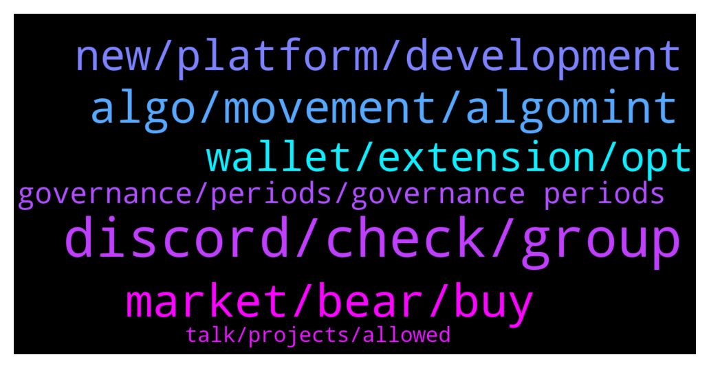

# **@algorand**
 ## Analysis for **2022-01-23** - **2022-01-24**.

---

## 📊 **Basic Stats**

**n_messages_sent**: 160

---

---

## 🔝 **Top keywords and related messages**

1. **discord, check, group**

    @LoLo3PK2 --- *Great... I'll be back soon with more questions😂😂* **--->** [TG Discussion](https://t.me/algorand/334737)

    @MackDenver --- *Yes, it was shared with the community.* **--->** [TG Discussion](https://t.me/algorand/334893)

    @NightAlgorand --- *It would be best if you reach out to our discord about this  https://discord.gg/84AActu3at* **--->** [TG Discussion](https://t.me/algorand/334851)

    @MackDenver --- *Hello there, You can check them here:https://www.algorand.com/ecosystem* **--->** [TG Discussion](https://t.me/algorand/334707)

    @NightAlgorand --- *You can check it here https://algoexplorer.io/rewards-calculator* **--->** [TG Discussion](https://t.me/algorand/334601)

    @angelo9007 --- *You can find better clarity on our discord* **--->** [TG Discussion](https://t.me/algorand/334669)

2. **market, bear, buy**

    @Tiny_Philosopher_784 --- *"Consistent downtrend" (you mean the price is going down, so take that to the price chat)  Also, you think a certain period of time, during which the US and world market pressures have been very hawkish with an unprecedented pandemic raging, means a bear market?   My goodness... the level of education needed to explain this would cost about $650k and 4 years of your life at Harvard or Yale.* **--->** [TG Discussion](https://t.me/algorand/334758)

    @kramercrypto --- *We have been in a consistent downtrend for 3+ months. Bear market's don't have to be multi year etc* **--->** [TG Discussion](https://t.me/algorand/334703)

    @paulinhoa1 --- *not the time yet, wait for a few days then buy* **--->** [TG Discussion](https://t.me/algorand/334736)

    @terphlil2 --- *it seems they start to grow a little, maybe now is the time. What to buy? I want to long-term invest into some cmc top coin* **--->** [TG Discussion](https://t.me/algorand/334739)

    @terphlil2 --- *hey everyone, the market stopped falling? when is time to buy?* **--->** [TG Discussion](https://t.me/algorand/334735)

    @cryptomanmachine --- *Even during bull market it was here last summer so it’s same business as usual, buy dips on tinyman* **--->** [TG Discussion](https://t.me/algorand/334609)

3. **algo, movement, algomint**

    @Cryptothefuture2022 --- *Can i a question...is algo bot connected  on this coin* **--->** [TG Discussion](https://t.me/algorand/334692)

    @Cryptothefuture2022 --- *Algo scalp autotrade 6% per day* **--->** [TG Discussion](https://t.me/algorand/334695)

    @aralfox --- *Hey there algofam I have a quick announcemet. Really appreciate the attention thanks fellas :)* **--->** [TG Discussion](https://t.me/algorand/334987)

    @bebofolies --- *Hello, I moved yesterday my Algo to the Algo wallet, I used to stake at 4% in Coinbase and I read it's supposed to be around 7% on the wallet. First 24 hours in and I calculated I'm at around 1.5%. Would you know the exact % in the Algo wallet?* **--->** [TG Discussion](https://t.me/algorand/334600)

    @acrachael --- *Like this morning sold @ 0.9550 bought back at 0.8480 I increase the quantity of my ALGO* **--->** [TG Discussion](https://t.me/algorand/334971)

    @ninjamillar --- *I’m trying to opt in algo mint* **--->** [TG Discussion](https://t.me/algorand/335049)

4. **new, platform, development**

    @traderbrew --- *I just wanted to talk to some algorand developers to discover if this is the right crypto for me to develop on.* **--->** [TG Discussion](https://t.me/algorand/334661)

    @traderbrew --- *I am new to dapp development. I was wondering what advantages there is to algorand over other crypto platforms.* **--->** [TG Discussion](https://t.me/algorand/334671)

    @Sem --- *Hi guys, Iam new here Iam interested in both algorand and radix. They seem both very promising projects. Which project do you guys think will have more chances to succeed in the future?* **--->** [TG Discussion](https://t.me/algorand/334730)

    @mathis_be --- *maybe it is true about solana but cardano does have a lot of working applications already and they keep growing the network.* **--->** [TG Discussion](https://t.me/algorand/334742)

    @paulinhoa1 --- *not a good idea to invest in sol, they are highly centralized and have pumped capitalization. ADA still does not have many applications.* **--->** [TG Discussion](https://t.me/algorand/334741)

    @traderbrew --- *I am just looking for the best dapp development platform that is great for new developers.* **--->** [TG Discussion](https://t.me/algorand/334679)

5. **wallet, extension, opt**

    @MackDenver --- *1. https://www.algorand.com/ecosystem/use-cases  2. Mobile Wallet: https://algorandwallet.com/support/  Web wallet: https://wallet.myalgo.com/  Extension: https://chrome.google.com/webstore/detail/algosigner/kmmolakhbgdlpkjkcjkebenjheonagdm   3. We don't have an L2 right now.* **--->** [TG Discussion](https://t.me/algorand/334726)

    @Adders28 --- *Have you added asa? Need remove if you have* **--->** [TG Discussion](https://t.me/algorand/334784)

    @ub_core --- *hey guys is algorand wallet available on chrome?* **--->** [TG Discussion](https://t.me/algorand/335023)

    @paulinhoa1 --- *try to compare the numbers of apps on cardano with other blockchains* **--->** [TG Discussion](https://t.me/algorand/334743)

    @LoLo3PK2 --- *Thanks Mack! A few questions I have: 1. Where to see projects already running on Algorand? Mainly focusing on DeFi. 2. Where can I find official wallets for Algo? I use Brave, so if there is any browser extension for Brave, even better. 3. I assume ALGO network is not EVM compatible, so is there any L2 already launched for metamask? Any plans about it?  Thanks in advance!!!* **--->** [TG Discussion](https://t.me/algorand/334724)

    @ninjamillar --- *i still cant pre opt in asset* **--->** [TG Discussion](https://t.me/algorand/335043)

6. **governance, periods, governance periods**

    @SavoryMonkey --- *This sessions governance voting is set to begin February 1st but their is still nothing to vote on?  Am I missing the proposals?  It just says coming soon on the governance page.* **--->** [TG Discussion](https://t.me/algorand/334972)

    @kramercrypto --- *Can you point me in the right direction Mack? I can see that rewards are planned to 2029, is that the expected length of Governance periods?* **--->** [TG Discussion](https://t.me/algorand/334894)

    @juquinbu --- *All rewards will all be based on Governance voting now. Check “Governance”* **--->** [TG Discussion](https://t.me/algorand/334719)

    @kramercrypto --- *Is there a currently known cap on how many governance periods there will be?* **--->** [TG Discussion](https://t.me/algorand/334891)

    @MackDenver --- *Please head over to the Algorand governance page and read the FAQ. https://governance.algorand.foundation/* **--->** [TG Discussion](https://t.me/algorand/334895)

    @mawa73 --- *Have the rewards become much less than they were a few months ago?* **--->** [TG Discussion](https://t.me/algorand/334689)

7. **talk, projects, allowed**

    @NightAlgorand --- *Hi, this is not the right place to talk about BTC 🙂* **--->** [TG Discussion](https://t.me/algorand/334846)

    @NightAlgorand --- *Please refrain from talking about other projects* **--->** [TG Discussion](https://t.me/algorand/334760)

    @stomski --- *i don't think you allowed to talk about other projects here* **--->** [TG Discussion](https://t.me/algorand/334757)

    @Insecurity_Romania --- *You wanted to talk ,say here* **--->** [TG Discussion](https://t.me/algorand/334667)

    @traderbrew --- *They were hurt that I wasn't an easy target.* **--->** [TG Discussion](https://t.me/algorand/334657)

