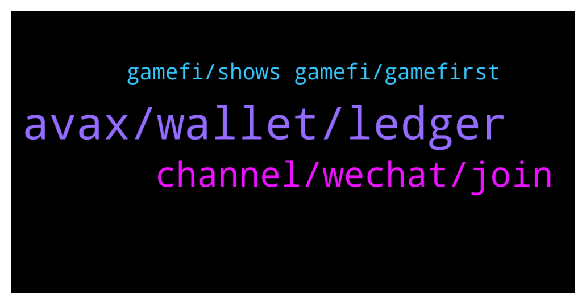

# **@avalancheavax**
 ## Analysis for **2022-01-23** - **2022-01-24**.

---

## 📊 **Basic Stats**

**n_messages_sent**: 89

---

---

## 🔝 **Top keywords and related messages**

1. **avax, wallet, ledger**

    @Lukmankhalique --- *Hey there. Are there any avax specific launchpads beside avalaunch?* **--->** [TG Discussion](https://t.me/avalancheavax/324138)

    @defirlkp --- *just check on snowtrace which address has that avax, your avax is only ever on the blockchain its never stored on any external device* **--->** [TG Discussion](https://t.me/avalancheavax/324192)

    @YuYuHakusho22 --- *what are the best and most active avax defi communities to find out about new projects with utilities on the chain? best social media outlets. tg Twitter etc? thanks in advance* **--->** [TG Discussion](https://t.me/avalancheavax/324082)

    @CryptoPapitv --- *Can anyone help me solve this (Swap Failed: Ledger device Unknown Error. It’s been happening for the last 2 hours. I did all of the trouble shooting as well. Please help* **--->** [TG Discussion](https://t.me/avalancheavax/324088)

    @FelixAdi --- *Hey guys, I have a problem. Anyway I was in the process of transferring my metamask to ledger nano s, and I'm about all done besides my AVAX. So I tested a small amount, it shows both in wallet and app and snowtrace, then I transferred my full amount. After that I find out somehow there's a bug with metamask and I can't access that avax, it's giving enable smart contract error (it's already enabled ofc),,, I contacted metamask support already and filed a ticket but not confident they will get back to me quickly. Is there any way I can access that AVAX? I tried different PC, different metamask, same bug.* **--->** [TG Discussion](https://t.me/avalancheavax/324191)

    @Legendofthecrypt --- *Solana going down again is hilarious!!!🤣🤣🤣* **--->** [TG Discussion](https://t.me/avalancheavax/324029)

2. **channel, wechat, join**

    @oathtobarbatos --- *I'm not sure what WeChat means but, there's a channel for the Chinese community https://t.me/avalanche_zh* **--->** [TG Discussion](https://t.me/avalancheavax/324070)

    @Nicolas_A --- *Contact one of their moderator in their Telegram* **--->** [TG Discussion](https://t.me/avalancheavax/324159)

    @pleb001 --- *Issue is that there’s no start-here channel showed up but only verify here which is all blank* **--->** [TG Discussion](https://t.me/avalancheavax/324249)

    @Andy_Lau_Tak_wah --- *Can I find avalanche on WeChat Chinese channel* **--->** [TG Discussion](https://t.me/avalancheavax/324068)

    @YuYuHakusho22 --- *do you have the links or will they come up like that from searching* **--->** [TG Discussion](https://t.me/avalancheavax/324087)

    @Feina_777 --- *LoL kafi SCAMMERs muze DM kar rhe hai how can I stop this DM is there any option like who can DM me or not?* **--->** [TG Discussion](https://t.me/avalancheavax/324127)

3. **gamefi, shows gamefi, gamefirst**

    @iwouldbediogenes --- *Fake news. Competitors are scared.. Avalanche tech is the N. 1* **--->** [TG Discussion](https://t.me/avalancheavax/324049)

    @Vico007 --- *This chat is for avalanche topics* **--->** [TG Discussion](https://t.me/avalancheavax/324183)

    @M_OEZ --- *Hi guys. When I talk to people outside of the Avalanche world I often hear saying Avalanche is also not capable to proceed very high volume of transactions so they will get to a limit at some time. Do you maybe have a paper or an article etc. where these concerns are clarified ?* **--->** [TG Discussion](https://t.me/avalancheavax/324047)

    @Cody_0x --- *My understanding is Avalanche actually solves scalability issues with its 3 tier blockchain technology. If I search avalanche scalability issues I only find information on how it solves this problem.   It makes me think these concerns may come from competitors who are scared?* **--->** [TG Discussion](https://t.me/avalancheavax/324048)

    @ersintaskin --- *At Dextools the #1 hot token traded on Avalanche is $HeC. It surpasses even stable coins. It is a GameFirst GameFi project. I think this shows that GameFi 2 and Metaverse can stand against the bear and really good projects with great teams that can deliver long term GameFirst vision can decouple from BTC. It also shows that GameFi may be really taking off on Avalanche.* **--->** [TG Discussion](https://t.me/avalancheavax/324110)

    @iwouldbediogenes --- *I think you can check the official Avalanche website, where you can find all the info you need my friend* **--->** [TG Discussion](https://t.me/avalancheavax/324052)

