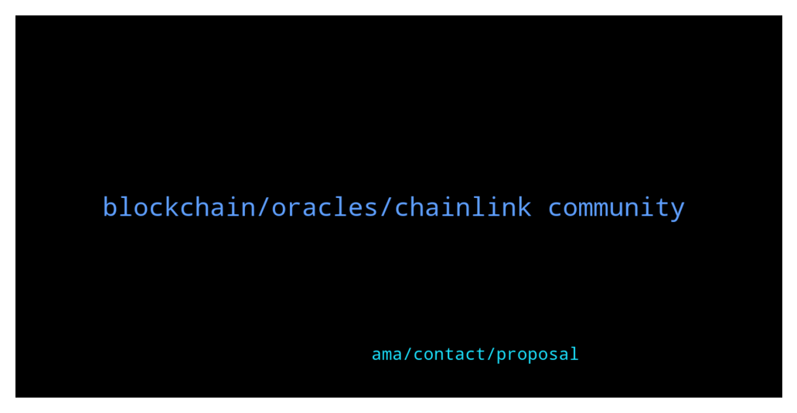

# **@chainlinkofficial**
 ## Analysis for **2022-01-23** - **2022-01-24**.

---

## 📊 **Basic Stats**

**n_messages_sent**: 79

---

---

## 🔝 **Top keywords and related messages**

1. **blockchain, oracles, chainlink community**

    @marcromeron --- *Chainlink was created in 2017 by Sergey Nazarov and Steve Ellis (2 genius), who co-authored a whitepaper introducing the Chainlink protocol.  The same year they network with Ari Juels (Cornell University professor).  Their vision was that Chainlink acts as a "bridge" between a blockchain and off-chain environaments, to solve the oracle problem.  The network is used by smart contracts and was formally launched in 2019 on Ethereum mainnet.  Chainlink published a second white paper in April 2021. That paper, Chainlink 2.0: Next Steps in the Evolution of Decentralized Oracle Networks.  There is detailed a vision for expanding the role and capabilities of decentralized oracle networks to include hybrid smart contracts, which utilize on-chain code and off-chain services provided by oracle networks.  https://chain.link/whitepaper* **--->** [TG Discussion](https://t.me/chainlinkofficial/368330)

    @davidgokhshtein --- *Hey — who works on partnerships for ChainLink?* **--->** [TG Discussion](https://t.me/chainlinkofficial/368057)

    @marcromeron --- *You can find some groups by searching Telegram for "Chainlink Community" but be aware that they are not operated or endorsed by the Chainlink team or admins of this chat.* **--->** [TG Discussion](https://t.me/chainlinkofficial/367989)

    @Sylvarantt --- *Hi @sonny_dbb what do you mean by "adding a token to the Oracle"? Do you mean requesting a new price feed? If that's the case please feel free to fill this form and someone from the integrations team will reach you out shortly, or if you prefer feel free to DM me more details about your request* **--->** [TG Discussion](https://t.me/chainlinkofficial/368577)

    @TheNavigator6 --- *Is anyone running a chainlink node? Is it profitable? Any help is very much welcome* **--->** [TG Discussion](https://t.me/chainlinkofficial/368259)

    @CryptologistFox --- *Hi guys I have some question about Oracle that I couldnt find the answer yet. I would appreciate if you could help me with this.  1. I was wondering when and who first created the oracles?   2. Is Oracle machine theory the base of the oracle network?  3. Is the Chainlink first who lunched oracle in blockchain and decentrilized it.  Thank you in advance for your help* **--->** [TG Discussion](https://t.me/chainlinkofficial/368328)

2. **ama, contact, proposal**

    @marcromeron --- *Hi. We don't pay for AMA nor reward. Thank you.* **--->** [TG Discussion](https://t.me/chainlinkofficial/368354)

    @angelaFitri1 --- *To whom should I submit an AMA proposal?* **--->** [TG Discussion](https://t.me/chainlinkofficial/368352)

    @ValerieElash2 --- *Who the right person for discuss ama proposal?* **--->** [TG Discussion](https://t.me/chainlinkofficial/368233)

    @smoki102 --- *Hello everyone I Have an AMA proposal, whom should I contact to directly discuss about it?* **--->** [TG Discussion](https://t.me/chainlinkofficial/368225)

    @Zarar124 --- *Whom should i contact for AMA marketing proposal with you?* **--->** [TG Discussion](https://t.me/chainlinkofficial/368066)

    @sonny_dbb --- *I did fill out a contact form about a week ago, but there was no reply, so I tried asking here* **--->** [TG Discussion](https://t.me/chainlinkofficial/368578)

