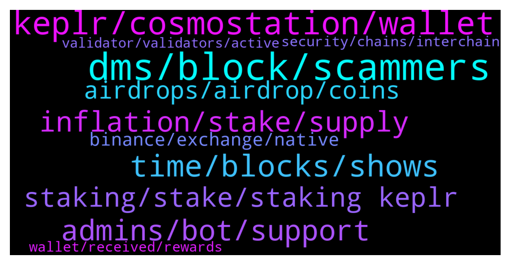

# **@cosmosproject**
 ## Analysis for **2022-01-23** - **2022-01-24**.

---

## 📊 **Basic Stats**

**n_messages_sent**: 331

---

---

## 🔝 **Top keywords and related messages**

1. **dms, block, scammers**

    @AtomJazz --- *No. Block all scammers DMing you. Keolr team is only reachable through  https://keplr.crunch.help/* **--->** [TG Discussion](https://t.me/cosmosproject/480132)

    @JasonOfArgonaut --- *Never follow a.link given in a dm.  They use lookalike.account logins to phish you.  You can find any site yourself through searching.* **--->** [TG Discussion](https://t.me/cosmosproject/479651)

    @tylerfyu --- *Why? They needed to verify my wallet on here. And they hacked and stole all coins. I don't want other people met again like this.* **--->** [TG Discussion](https://t.me/cosmosproject/480030)

    @staycat1on --- *Need to promote 2 admins for Chinese group. There were scammers and adv flooder.* **--->** [TG Discussion](https://t.me/cosmosproject/480021)

    @Jennycake82 --- *Why are you trying to scam me when to seem so helpful in this chat?* **--->** [TG Discussion](https://t.me/cosmosproject/479633)

    @SlippingJimmy09 --- *Never enter your seedphrase unless it's an absolutely trusted source and you triple-checked it's not a scam.* **--->** [TG Discussion](https://t.me/cosmosproject/479981)

2. **keplr, cosmostation, wallet**

    @Grgiorgi --- *Does anybody have else have a problem with keplr, app is crashing* **--->** [TG Discussion](https://t.me/cosmosproject/479955)

    @ZoltanAtom --- *Hey,Cosmostation and Keplr are the recommended wallets. Keplr is needed to access Cosmos dexs too. I do use Cosmostation mobile app,Keplr mobile App and Keplr web wallet.   Links and tutorials are at the pinned message.   Start with Keplr to get Cosmos account and import your mnemonics to Cosmostation might be better.* **--->** [TG Discussion](https://t.me/cosmosproject/480326)

    @Simo --- *free, you also have cosmostation wallet if you need a mobile version, but I prefer Keplr* **--->** [TG Discussion](https://t.me/cosmosproject/479401)

    @AtomJazz --- *On-chain directly. Keplr and Cosmostation are recommended wallets* **--->** [TG Discussion](https://t.me/cosmosproject/479779)

    @ZoltanAtom --- *Hi there.welcome to Cosmos!   Suggested wallets are Keplr and Cosmostation. You need to have Cosmos account and connect to cosmos dexs via Keplr for liquidity pools.   Osmosis, Sifchain and Gravitydex(Emeris) some of Cosmos dexs.* **--->** [TG Discussion](https://t.me/cosmosproject/480068)

    @Beginnerxx --- *Okay sir. Thanks. Is keplr wallet free to use or is there a fee associated with keplr wallet ?* **--->** [TG Discussion](https://t.me/cosmosproject/479398)

3. **time, blocks, shows**

    @Jennycake82 --- *Yeah...I grasped the importance of that lol* **--->** [TG Discussion](https://t.me/cosmosproject/479648)

    @emm747 --- *Next time I will, I erased it before blocking. Thx* **--->** [TG Discussion](https://t.me/cosmosproject/480076)

    @SlippingJimmy09 --- *Does it say 'pending'? If so, try clearing your browser cache.* **--->** [TG Discussion](https://t.me/cosmosproject/480000)

    @giansalex --- *only shows the last 50 blocks, you need more than that. bigdipper: https://cosmos.bigdipper.live/validator/D2D458F9209ECB8CA2AAB1D99E06611B812A8797/missed/blocks* **--->** [TG Discussion](https://t.me/cosmosproject/479702)

    @JasonOfArgonaut --- *You woke up.  That's a good start.* **--->** [TG Discussion](https://t.me/cosmosproject/479674)

    @Cordtus --- *Ouch that shows how attentive I am.* **--->** [TG Discussion](https://t.me/cosmosproject/479611)

4. **admins, bot, support**

    @sm_quantum --- *Hello, using Double counter bot in Discord chats is not a good idea. I started going through verification and always got that I was working from a VPN. But I didn't use it! I contacted Double counter support, they checked and said that my external IP is on the Spam list and they can't help. They just banned my ISP's entire ISP subnet. Now I can't get into the Cosmos ecosystem developer chat :(* **--->** [TG Discussion](https://t.me/cosmosproject/479831)

    @catdotfish --- *I just said that you don’t have to reach out the double counter support, but the server janitor as written in the welcome message* **--->** [TG Discussion](https://t.me/cosmosproject/479847)

    @jugadornumero12cabj --- *Congrats COSMOS for has the largest number of addresses assigned to our #DAO 👏🏼 ———— Start earning $XCT rewards now by assigning your address 👇🏼 http://link.medium.com/uH2p9bFx3mb* **--->** [TG Discussion](https://t.me/cosmosproject/480239)

    @Jokrogge --- *Any games play to earn to suggest? In cosmoverse of course😁* **--->** [TG Discussion](https://t.me/cosmosproject/479815)

    @tylerfyu --- *I meet him on this channel.* **--->** [TG Discussion](https://t.me/cosmosproject/480031)

    @Drey_CO --- *Did they have a telegram account?* **--->** [TG Discussion](https://t.me/cosmosproject/480366)

5. **inflation, stake, supply**

    @Numan_FF --- *İnvestors Vesting schedule of atom is over ? Any idea ?* **--->** [TG Discussion](https://t.me/cosmosproject/480260)

    @Wizard --- *Hi guys, where can I stake my ATOM?* **--->** [TG Discussion](https://t.me/cosmosproject/480321)

    @ZoltanAtom --- *Inflation is important to give incentive to staking: by implementing inflation, new tokens are created and distributed to the network participants who participate by securing the network and voting on new governance. Keep in mind, inflation is very useful in the early stages of a network’s growth, and as alternative incentives to staking arise, inflation can be slowly phased down after the network is healthy and robust. For now, ATOM employs the following model:  The inflation has a floor of 7% and a ceiling of 20%. The target percentage of total supply coins staked is 66%. The network uses an algorithm to maintain this level. When the staked percentage of total supply is above 66%, the inflation heads down to the floor of 7%. When the staked rate is below 66%, the inflation starts heading up towards the ceiling, 20%.   As mentioned above, some inflation is always necessary in order to create an additional, non-transaction reward for validators and to maintain strong security. With the Proof of Stake model, there can be potential consensus instability issues if the entire reward for validators is based on transaction rewards and not the overall block reward. Because of this, Proof of Stake (and Cosmos in this specific case)  is generally not designed to have a maximum supply, which necessitates inflation eventually going to zero once that supply is reached.* **--->** [TG Discussion](https://t.me/cosmosproject/480275)

    @Gnolang --- *Wouldn't he need like 1,000 atoms for a proposal? I'm not sure though* **--->** [TG Discussion](https://t.me/cosmosproject/479308)

    @ZoltanAtom --- *If you stake your Atom,you get staking rewards. It’s around %14  Also soon there will be “liquid staking” which helps to increase bonded ratio up and inflation will go to down.   Have a look at this;  https://liquidstaking.finance/* **--->** [TG Discussion](https://t.me/cosmosproject/480111)

    @ZoltanAtom --- *Atom is inflationary token. Inflation is around %9   Please check details of circulation supply at   https://cosmoscan.net/cosmos* **--->** [TG Discussion](https://t.me/cosmosproject/480108)

6. **staking, stake, staking keplr**

    @Jennycake82 --- *Hello 😊 Does anyone know if there's a minimum amount you can stake?* **--->** [TG Discussion](https://t.me/cosmosproject/479621)

    @Kickthetrend --- *Hi @admin, can you please advise which validator to be used while staking on keplr?* **--->** [TG Discussion](https://t.me/cosmosproject/479911)

    @Capt_Morgan --- *What’s the minimum for staking in Keplr?* **--->** [TG Discussion](https://t.me/cosmosproject/479336)

    @CristiTCM --- *thanks for the explanation, where can i see how much of the supply is staked?* **--->** [TG Discussion](https://t.me/cosmosproject/480278)

    @unfreshmilk --- *I'm talking about liquid staking such as on Persistence (pStake)* **--->** [TG Discussion](https://t.me/cosmosproject/479786)

    @AtomJazz --- *Staking is on-chain parameter. Wallets are just UIs for end users. It shouldn't matter what wallet you stake in* **--->** [TG Discussion](https://t.me/cosmosproject/479784)

7. **airdrops, airdrop, coins**

    @Edoardo --- *What do you mean? If it has a 0% fee it is not ok for the airdrop?* **--->** [TG Discussion](https://t.me/cosmosproject/479415)

    @Simo --- *you can find more info about airdrops here https://t.me/CosmosAirdrops* **--->** [TG Discussion](https://t.me/cosmosproject/479406)

    @Beginnerxx --- *Thank you. How much atom shoudl i hold for airdrop sir ?* **--->** [TG Discussion](https://t.me/cosmosproject/479404)

    @rawfootage --- *oh... well actually I would like to get airdrops... strange that they would get excluded* **--->** [TG Discussion](https://t.me/cosmosproject/479606)

    @Cordtus --- *I see they are only 0% initially to gain delegates. That in itself is not bad but if you are hoping for airdrops some will exclude the 0% commission validators when counting staked tokens* **--->** [TG Discussion](https://t.me/cosmosproject/479604)

    @Simo --- *Nope, no airdrop if it has 0 fees* **--->** [TG Discussion](https://t.me/cosmosproject/479421)

8. **binance, exchange, native**

    @tylerfyu --- *Please let me know where I can exchange binance to native token?* **--->** [TG Discussion](https://t.me/cosmosproject/479749)

    @Simo --- *send your Atom from CEX to keplr wallet and stake it to a validator, the validator must not be a CEX and at 0% commision* **--->** [TG Discussion](https://t.me/cosmosproject/479396)

    @Anothernoise --- *sned from trust to binance - trade on binance for stablecoin. Buy pegged ATOM. done* **--->** [TG Discussion](https://t.me/cosmosproject/480382)

    @ZoltanAtom --- *I think it’s better if he would ask his questions and get help from Binance.* **--->** [TG Discussion](https://t.me/cosmosproject/480364)

    @ZoltanAtom --- *Sorry I am not familiar with Binance. I can’t help you much.* **--->** [TG Discussion](https://t.me/cosmosproject/480341)

    @AtomJazz --- *I guess on Binance exchange. It's where you bought them right? We don't recommend our users to use Binance services* **--->** [TG Discussion](https://t.me/cosmosproject/479751)

9. **validator, validators, active**

    @AtomJazz --- *Becoming a validator is permisonless so unfortunately there's nothing anyone can do about it* **--->** [TG Discussion](https://t.me/cosmosproject/479811)

    @AtomJazz --- *Currently a validator needs to be in top 150 (number of delegations)* **--->** [TG Discussion](https://t.me/cosmosproject/479819)

    @H77_ZSD --- *When low cost bridges will be ready,  fire DEX 100% commission validators.* **--->** [TG Discussion](https://t.me/cosmosproject/479806)

    @Cordtus --- *You can check lots of the validators details on the different chains on mintscan.io* **--->** [TG Discussion](https://t.me/cosmosproject/479659)

    @Cordtus --- *A good validator has perfect uptime, doesn't miss voting on proposals, is possibly an active member of these chat groups.. @Galadrin* **--->** [TG Discussion](https://t.me/cosmosproject/479656)

    @ZoltanAtom --- *Make sure you avoid exchange validators! Other than that...The best validator is always subjective, here are some factors that might help:   - Commission Rate:  This is the % of earned rewards that go to the validator. Not the % of your total stake, just to eliminate that confusion.   - Self-Bonded rate:  This is the % of bonded ATOM that belong to the validator. Think of this as their skin in the game.   - Decentralization:  Choosing the smaller validators helps to decentralize the network which improves security overall. Again, decentralization should be a priority. On this point, centralized exchanges are not the best choice as they don't really support the network at all.   You can learn more about each validator in their profiles on the wallets and explorers.  The 8-10% is almost for everyone, feel free to use this reward calculator  https://www.stakingrewards.com/earn/cosmos  Commissions can be changed anytime so keep an eye on your validator via telegram or twitter* **--->** [TG Discussion](https://t.me/cosmosproject/480015)

10. **security, chains, interchain**

    @CristiTCM --- *hello. why Cosmos has no max supply? where can i understand this better?* **--->** [TG Discussion](https://t.me/cosmosproject/480272)

    @ZoltanAtom --- *Cosmos hub became IBC router after Vega upgrade.There is adoption period with “0 fee” and after that practically ibc fees will be paid to Atom stakers.* **--->** [TG Discussion](https://t.me/cosmosproject/480049)

    @ZoltanAtom --- *💥INTERCHAIN SECURITY COMING TO COSMOS HUB! 💥   🟪Interchain Security will allow Cosmos chains to lease security to each other. What this means, in practice, is that validators on one chain (the security provider) will be able to validate on another (the security consumer).  Earning Rewards On Many Chains  🟪Interchain Security will allow ATOM holders to earn staking rewards on a large number of Cosmos chains, just by staking their ATOMs. Consumer chains will benefit both from robust security from the Cosmos Hub validator set, and by getting their tokens in the hands of the Cosmos community of early adopters.  📄 For More Details Read This Blog Post* **--->** [TG Discussion](https://t.me/cosmosproject/479476)

    @AtomJazz --- *No idea what your point is but anyway... BSC can't be compared to Cosmos. Cosmos is not one L1 smart contracts chain like BSC, it's infinite number of interconnected application specific L1 blockchains https://mapofzones.com* **--->** [TG Discussion](https://t.me/cosmosproject/479828)

    @MrK_bulld0t --- *Ok thank you. Do developers using the cosmos sdk pay fees in atom or are part of luna and other chains fee paid out in atom ?* **--->** [TG Discussion](https://t.me/cosmosproject/479542)

    @MrK_bulld0t --- *Hi,  quick question, how does the usage of cosmos SDK to develop other blockchains such as Luna benefits to Atom token economy and price increase ?* **--->** [TG Discussion](https://t.me/cosmosproject/479539)

