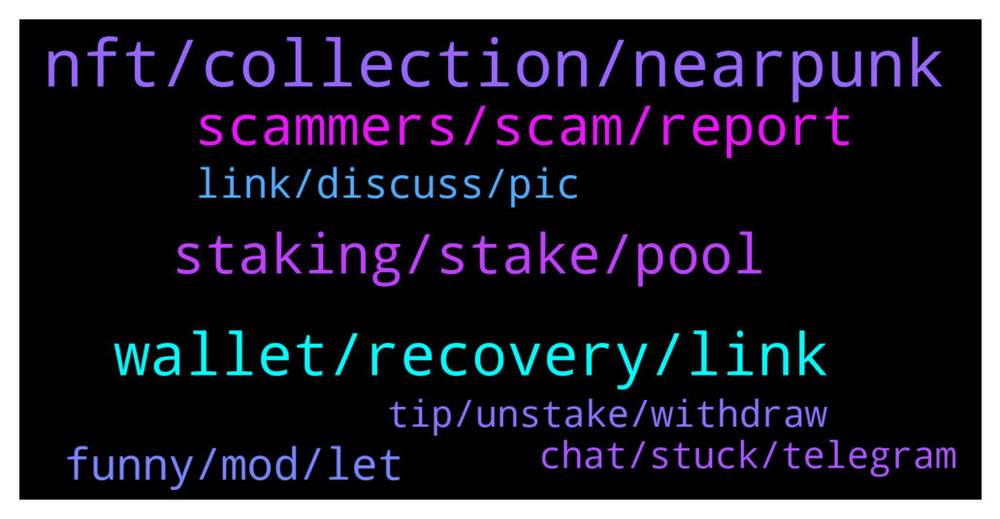

# **@cryptonear**
 ## Analysis for **2022-01-23** - **2022-01-24**.

---

## 📊 **Basic Stats**

**n_messages_sent**: 533

---

---

## 🔝 **Top keywords and related messages**

1. **nft, collection, nearpunk**

    @oppzsmoKe --- *Well Paras claiming this was the first   This is the first NFTs by an artist: https://paras.id/token/x.paras.near::2  This the first NFTs from the team: https://paras.id/token/x.paras.near::1  This is the first collection on Paras: https://paras.id/collection/zodiacs-ascension-by-parasnear* **--->** [TG Discussion](https://t.me/cryptonear/296750)

    @oppzsmoKe --- *See I’m heavily invested in Ethereum‘s NFTs The reason why I asked these questions is because I invested in early Ethereum NFT projects and they all have been success I brought a bunch of CryptoPunks which was the first so now I am moving over to near and I’m trying to find the Cryptopunk of near* **--->** [TG Discussion](https://t.me/cryptonear/296758)

    @kv9990 --- *Btw there's a sequel to NEARPunk, NEARPunk Astro (launched 2 days ago) (series of 500 NFTs)and 30 would be dropped weekly  👀  Read more here   Here's the collection link 😄 https://paras.id/collection/nearpunk-astro-by-monztrenear* **--->** [TG Discussion](https://t.me/cryptonear/296775)

    @larry_lang --- *although the most prominent one IMO is NEARPunk by monztre.near: https://paras.id/collection/one-of-a-kind-by-monztrenear* **--->** [TG Discussion](https://t.me/cryptonear/296114)

    @kv9990 --- *Npunks came like months after NEARPunk by Monztre* **--->** [TG Discussion](https://t.me/cryptonear/296637)

    @oppzsmoKe --- *I guess nobody doesn’t know the official first NFT ever on near* **--->** [TG Discussion](https://t.me/cryptonear/296138)

2. **wallet, recovery, link**

    @mike0273 --- *I am trying to send near to another wallet but this page keeps loading* **--->** [TG Discussion](https://t.me/cryptonear/296245)

    @st_orif --- *hello. I can't send near from my near wallet.   An error occurred. Your send transaction was cancelled. Cannot read properties of null (reading '-1')  I have been open in my profile in incognito but the same error. Have can I solve it?* **--->** [TG Discussion](https://t.me/cryptonear/296582)

    @thevu687294 --- *Hello admin, i need your help , can i take Near Back to my Near wallet, if I sent Near coin to wallet of  single use funding adress ? Pls?* **--->** [TG Discussion](https://t.me/cryptonear/296214)

    @Malpoymalpoy --- *why I can't see it my near on wallet even though the delivery was successful* **--->** [TG Discussion](https://t.me/cryptonear/297174)

    @NearFritz --- *Again, the wallet team will be more helpful 🤘 please let's not waste any more time and let's solve this, you should open a ticket asap and wait for them 🚀* **--->** [TG Discussion](https://t.me/cryptonear/296473)

    @m1kr0k0t1k --- *Here is a bug in wallet. Don't choose "Use Max" when you are sending money, type it directly.* **--->** [TG Discussion](https://t.me/cryptonear/296248)

3. **staking, stake, pool**

    @supersaiyan_goku --- *Native staking on Near wallet is risk free* **--->** [TG Discussion](https://t.me/cryptonear/296063)

    @supersaiyan_goku --- *As my understand about Near staking, you do not transfer your coin to validator, you only delegating your coin to them, your coin stay on the wallet, noone can take your fund* **--->** [TG Discussion](https://t.me/cryptonear/296071)

    @dehraw --- *I was reading about that "slashing" is a big risk in staking but I am having a hard time understanding what it is? Do you happen to have some short explanation for it? I don't even know if it applies to NEAR. I am new to crypto, sorry for all these horrendous questions.* **--->** [TG Discussion](https://t.me/cryptonear/296090)

    @dehraw --- *Are there any good staking opportunities for NEAR that doesn't involve any major risks?* **--->** [TG Discussion](https://t.me/cryptonear/296062)

    @GeorgePro1 --- *Hey, You can choose Everstake. Checkout guide to stake with NEAR wallet  https://medium.com/everstake/how-to-stake-near-using-the-near-wallet-a-beginners-guide-7b089b0e9c19* **--->** [TG Discussion](https://t.me/cryptonear/297067)

    @dehraw --- *Only the validation will lose their staked amount or anybody who staked in the pool aswell?* **--->** [TG Discussion](https://t.me/cryptonear/296136)

4. **scammers, scam, report**

    @plat123456 | plat123456.sol --- *cex,  the second i post a question, tons of scammer dm me, i better delete my question, its too annoying* **--->** [TG Discussion](https://t.me/cryptonear/296684)

    @happyeveryday2368 --- *okay, I sent SCAM in that group and been kicked out immedately :))* **--->** [TG Discussion](https://t.me/cryptonear/296939)

    @happyeveryday2368 --- *I find a scam group in TG* **--->** [TG Discussion](https://t.me/cryptonear/296930)

    @Namzhil --- *Hi, I suppose everybody knows that there are a lot of SCAM near group un Telegram. Did you try to report them? Cause they steal Near investors money* **--->** [TG Discussion](https://t.me/cryptonear/296564)

    @bradimas --- *How do you turn off DMs on TG? I asked a question earlier abiut how to buy and I have DM after DM from "near support". These scammers suck.* **--->** [TG Discussion](https://t.me/cryptonear/295949)

    @PongTY --- *Hi, admin , What can i do ?* **--->** [TG Discussion](https://t.me/cryptonear/297149)

5. **funny, mod, let**

    @larry_lang --- *=))) better keep an eye on this one ser=))) https://medium.com/nearprotocol/wannaswap-brings-new-app-launchpad-to-near-ecosystem-8e7501a2554d* **--->** [TG Discussion](https://t.me/cryptonear/297000)

    @larry_lang --- *ah cool u have already been there=)))* **--->** [TG Discussion](https://t.me/cryptonear/295960)

    @larry_lang --- *and your level of criticism as well=))) i can tell that from the time u ask for Skyward=))))* **--->** [TG Discussion](https://t.me/cryptonear/296817)

    @kv9990 --- *Can check this thread too =))  https://twitter.com/AlexBert99/status/1484630101790806020?t=ADbxr-mifjrIbQd0zOnYEQ&s=19* **--->** [TG Discussion](https://t.me/cryptonear/295989)

    @larry_lang --- *u guys always love to do that =]]* **--->** [TG Discussion](https://t.me/cryptonear/296941)

    @larry_lang --- *also @Kripto_Raptor shared this with me back then=)))* **--->** [TG Discussion](https://t.me/cryptonear/296841)

6. **link, discuss, pic**

    @larry_lang --- *maybe u can seek it in this article. https://twitter.com/sanket_naikwadi/status/1445042381531746310?s=21* **--->** [TG Discussion](https://t.me/cryptonear/296066)

    @sun quan|123456789.near --- *I asked and no one answered* **--->** [TG Discussion](https://t.me/cryptonear/295962)

    @larry_lang --- *may i ask for the link of that article* **--->** [TG Discussion](https://t.me/cryptonear/296731)

    @uadeveloper --- *Probably reply the author who has a trouble. I am trying to get details to help him* **--->** [TG Discussion](https://t.me/cryptonear/296442)

    @felipedevicente --- *Sorry for the link! This is a link of the one artwork.* **--->** [TG Discussion](https://t.me/cryptonear/296719)

    @choc0707 --- *You can discuss this in this  grouphttps://t.me/merchantsofnear* **--->** [TG Discussion](https://t.me/cryptonear/296964)

7. **tip, unstake, withdraw**

    @Simon --- *this is the 9th epoch since my unstake, still not available to withdraw. what is wrong?* **--->** [TG Discussion](https://t.me/cryptonear/296431)

    @Simon --- *i successfully withdrawn unstaked coins before, just can not this time* **--->** [TG Discussion](https://t.me/cryptonear/296465)

    @Simon --- *i initiated an unstake 9 epochs ago and it is still not available to withdraw* **--->** [TG Discussion](https://t.me/cryptonear/296462)

    @Kripto_Raptor --- *unstaking takes 4 full epoches thats it* **--->** [TG Discussion](https://t.me/cryptonear/296461)

    @NEARverse_xd --- *Unstaking will take upto 3 days to unstake your token. You will see withdrawal option after this period* **--->** [TG Discussion](https://t.me/cryptonear/296182)

    @larry_lang --- *you have to wait at least 4 epoch* **--->** [TG Discussion](https://t.me/cryptonear/296180)

