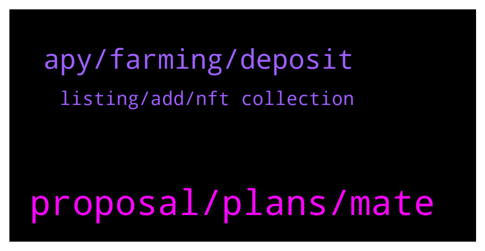

# **@dypfinance**
 ## Analysis for **2022-01-23** - **2022-01-24**.

---

## 📊 **Basic Stats**

**n_messages_sent**: 59

---

---

## 🔝 **Top keywords and related messages**

1. **proposal, plans, mate**

    @DhoniMSD516 --- *Hey https://t.me/dypannouncements is good source to know the latest news 😀* **--->** [TG Discussion](https://t.me/dypfinance/242241)

    @DhoniMSD516 --- *No plans for now but we are flexible with roadmap and may include in between* **--->** [TG Discussion](https://t.me/dypfinance/242232)

    @Vl_investor --- *Hello, when do you plan to release the news?* **--->** [TG Discussion](https://t.me/dypfinance/242238)

    @popper1989 --- *hey guys long time that im here so ask wat is comming news ?* **--->** [TG Discussion](https://t.me/dypfinance/242371)

    @Lordofsales --- *Any plans to go on Fantom network???* **--->** [TG Discussion](https://t.me/dypfinance/242231)

    @Disguy125 --- *Hey everyone I'm really looking forward to a good week ahead !!!  MY BIRTHDAY IS TUESDAY! BIG 3 0* **--->** [TG Discussion](https://t.me/dypfinance/242322)

2. **apy, farming, deposit**

    @shinigamikami --- *Hi guys, I have a few questions regarding kyber farm.  How often are the rewards paid? Also will the team extend the farm? I see it only has 19 days remaining* **--->** [TG Discussion](https://t.me/dypfinance/242220)

    @iamJubi --- *Decrease of the price of tokens involved on the pool, the more users deposit the lesser the APY.* **--->** [TG Discussion](https://t.me/dypfinance/242151)

    @iamJubi --- *Total users, total tvl, price of the tokens involved in the pool affects the APy* **--->** [TG Discussion](https://t.me/dypfinance/242149)

    @iamJubi --- *Maximize your Yield Farming Rewards on #Avalanche  24,389 #AVAX worth $1,458,706 paid to the farmers!  Join farming by automatically adding liquidity and earn 435% APY https://dyp.finance/farmv2/avax  👉https://twitter.com/dypfinance/status/1484927132346298379* **--->** [TG Discussion](https://t.me/dypfinance/242194)

    @Frolman --- *I see 90k$ tvl and let's say I want to deposit the same amount, will it impact the apy?* **--->** [TG Discussion](https://t.me/dypfinance/242143)

    @Elavenil17 --- *How to joint yield farming admin* **--->** [TG Discussion](https://t.me/dypfinance/242313)

3. **listing, add, nft collection**

    @DhoniMSD516 --- *Hey we are launching CAWS NFT collection soon going to be minted but you can whitelist your address https://dyp.finance/whitelist A tier 1 listing, Launchpad, Polygon expansion on cards too please head here to find our Roadmap https://dyp.finance/roadmap and you can subscribe to our announcements https://t.me/dypannouncements* **--->** [TG Discussion](https://t.me/dypfinance/242372)

    @Jeffzon --- *Any update on Tier 1 exchange listing for dyp?* **--->** [TG Discussion](https://t.me/dypfinance/242171)

    @DhoniMSD516 --- *The top 5 exchanges can be considered as tier 1 CEX* **--->** [TG Discussion](https://t.me/dypfinance/242376)

    @popper1989 --- *bnb,ftx,coinbase,kucoin,hitbtc are they tier 1 ?* **--->** [TG Discussion](https://t.me/dypfinance/242382)

    @popper1989 --- *ow nice it wil cost alot off money to add on the tier 1 sec* **--->** [TG Discussion](https://t.me/dypfinance/242377)

