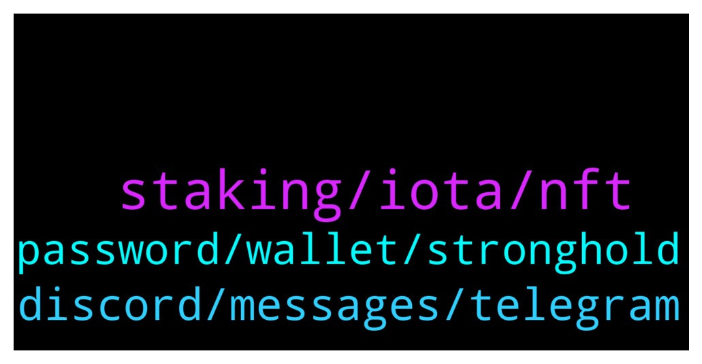

# **@iotatangle**
 ## Analysis for **2022-01-23** - **2022-01-24**.

---

## 📊 **Basic Stats**

**n_messages_sent**: 90

---

---

## 🔝 **Top keywords and related messages**

1. **staking, iota, nft**

    @topmusicdope --- *too late to start the staking?* **--->** [TG Discussion](https://t.me/iotatangle/307378)

    @itsmedev --- *I got 1 gold as well* **--->** [TG Discussion](https://t.me/iotatangle/307418)

    @davicico94 --- *But tanglelabs its from iota 🤔* **--->** [TG Discussion](https://t.me/iotatangle/307407)

    @Jogadoh --- *I missed this campaign, I didn't know there would be this sale.* **--->** [TG Discussion](https://t.me/iotatangle/307396)

    @MAM --- *Hi everyone, I want to know if someone has your NFT in Metamask, I have it in the page in my dashboard, but it doesn't appear in Metamask, and in the information in the page nft tanglelabs info said that it will appear* **--->** [TG Discussion](https://t.me/iotatangle/307468)

    @davicico94 --- *Dude of 11100, i think many ppl dont voted* **--->** [TG Discussion](https://t.me/iotatangle/307412)

2. **discord, messages, telegram**

    @PiernasLocas --- *Again answer deleted by the bot 😭* **--->** [TG Discussion](https://t.me/iotatangle/307557)

    @itsmedev --- *Okay. We sent multiple messages and even pinned a few regarding this.* **--->** [TG Discussion](https://t.me/iotatangle/307397)

    @itsmedev --- *But overall response is dull from the telegram community I believe* **--->** [TG Discussion](https://t.me/iotatangle/307414)

    @sergyjer --- *and i from ru my english bad😂* **--->** [TG Discussion](https://t.me/iotatangle/307421)

    @itsmedev --- *Sorry for that. You are right. It's text only. I pasted above.* **--->** [TG Discussion](https://t.me/iotatangle/307490)

    @PiernasLocas --- *The bot from this group is working bad because is like the second time that im writing something and it is deleted and it wasnt an image or link.  it was simple text with details about the difference between staking and nft* **--->** [TG Discussion](https://t.me/iotatangle/307488)

3. **password, wallet, stronghold**

    @Nikson36 --- *I can provide all transactions proving that this is my wallet. if possible, please help* **--->** [TG Discussion](https://t.me/iotatangle/307554)

    @Nikson36 --- *hello is there any way to recover the password from the Firefly wallet 24 words I don't have I only know the pincode and there is a backup copy* **--->** [TG Discussion](https://t.me/iotatangle/307527)

    @Nikson36 --- *I don't have anything remotely, maybe you can look in some folder the password is stored, I just forgot the password, but I didn't save the words* **--->** [TG Discussion](https://t.me/iotatangle/307540)

    @PiernasLocas --- *How did you lost access to your wallet? Because if you remember your pin maybe you can try to login in your wallet and transfer the money?  the folder where was installed firefly is deleted? Maybe you can recovery that folder with software to recovery lost/deleted files* **--->** [TG Discussion](https://t.me/iotatangle/307538)

    @langya131419 --- *Why is the money in the wallet often missing? Also not pledge, also can not transfer?* **--->** [TG Discussion](https://t.me/iotatangle/307443)

    @⠠⠵ Lucas! --- *use https://explorer.iota.org to input the destination address. There you can check whether the transaction was actually issued by your exchange* **--->** [TG Discussion](https://t.me/iotatangle/307436)

