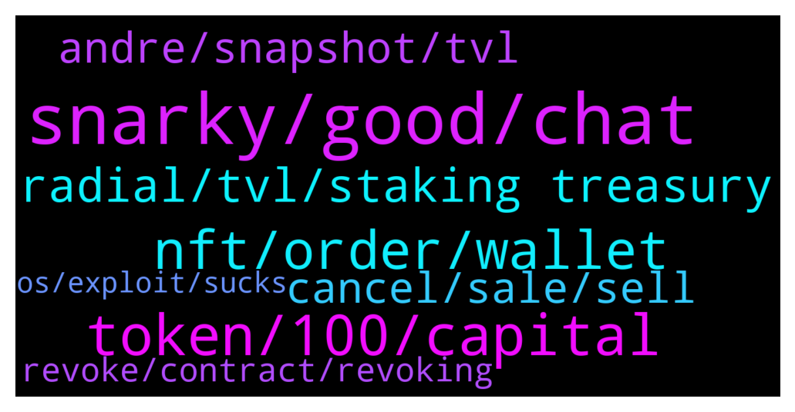

# **@lobsters_chat**
 ## Analysis for **2022-01-23** - **2022-01-24**.

---

## 📊 **Basic Stats**

**n_messages_sent**: 288

---

---

## 🔝 **Top keywords and related messages**

1. **snarky, good, chat**

    @MilianCrypto --- *better not, will result in more chaos and drama :)* **--->** [TG Discussion](https://t.me/lobsters_chat/318131)

    @vardhanam --- *Hey @paulcr2009 with all respect to what you do  https://twitter.com/RobKapito/status/1485043859344310273  this is most probably fake, as the profile was created January 2022* **--->** [TG Discussion](https://t.me/lobsters_chat/318085)

    @adrianleb --- *that too, im mostly talking about human nature tho* **--->** [TG Discussion](https://t.me/lobsters_chat/318150)

    @ivangbi --- *Maybe @jeff093 can pull a chat* **--->** [TG Discussion](https://t.me/lobsters_chat/318034)

    @Ceazor --- *im a bit late.. but.. yes.. better now then never.* **--->** [TG Discussion](https://t.me/lobsters_chat/318035)

    @RobAnon --- *You can DM me, can't promise anything though. Sounds like you're already SOL* **--->** [TG Discussion](https://t.me/lobsters_chat/317983)

2. **token, 100, capital**

    @jeff093 --- *if the collateral isnt tradeable, isnt the borrowing as vulnerable* **--->** [TG Discussion](https://t.me/lobsters_chat/318164)

    @RobAnon --- *So I'm building something very akin to an AMM, but that deals in trades that are optional.  1. What are the best ways to incentivize and attrack liquidity providers? 2. Is Uniswap V2 still the best thing to fork for such purposes? These aren't highly correlated assets, so x*y=k seemingly makes sense, but my knowledge of AMM theory is fairly pedestrian* **--->** [TG Discussion](https://t.me/lobsters_chat/317966)

    @RobAnon --- *I suppose it'd be fairly false of me to say that no capital is locked, whoever provides liquidity to the system does get locked into that for a period. But they're profiting off of fees is the idea. Their IL would ultimately be equivalent to depositing liquidity to a traditional AMM* **--->** [TG Discussion](https://t.me/lobsters_chat/318014)

    @SpikeSpiege1 --- *There's borrow then there's tradeable. Most of value in past year on crypto prob came from borrowing. $100 USD put in for $100 usdc. Then borrow mim. Then UST. Then more USDC etc until $100 equals $1000 and poof $2 trillion market cap of crypto.* **--->** [TG Discussion](https://t.me/lobsters_chat/318163)

    @Arv1ee --- *yeah, but than Multichain basically gets the control* **--->** [TG Discussion](https://t.me/lobsters_chat/318226)

    @XekFukOff --- *Is it just me or did it take in crypto until '21 and now the beginning of '22, to see crypto investors/traders get so excited about something that isn't theirs?  OHM & OHM fork's treasuries and now the ve 3,3 NFTs. Is it just me or maybe it's a lack of misunderstanding protocols. I know people in $TIME that think the $900m treasury relates to them somehow, and now that's even a more confusing situation without rebases.* **--->** [TG Discussion](https://t.me/lobsters_chat/318251)

3. **nft, order, wallet**

    @Wilson_tg --- *HE apparantly moved it to another wallet and still got sold?? https://twitter.com/ToastVirtual/status/1485597413838626823?t=2EgkTg75UjIvPX53shimRg&s=19* **--->** [TG Discussion](https://t.me/lobsters_chat/318430)

    @paulcr2009 --- *thanks, some og nfts already congrats seems fake body* **--->** [TG Discussion](https://t.me/lobsters_chat/318088)

    @sonicblend --- *The bug is related to selling a NFT and buying the same one back. It sounds like you didn't sell, so there's nothing to do.* **--->** [TG Discussion](https://t.me/lobsters_chat/318316)

    @BasicVersion --- *at what point was moving an nft back and forth from a wallet cheaper than canceling a listing* **--->** [TG Discussion](https://t.me/lobsters_chat/318372)

    @henkreative30 --- *what i can't understand is how this can affect my nft. can i lose it? Can you buy it for me at a very cheap price?* **--->** [TG Discussion](https://t.me/lobsters_chat/318331)

    @nickbtts --- *https://medium.com/@informationtokendao/the-case-of-the-disappearing-erc-1155-tokens-bc43a05ce7f  some more info on Opensea issue here.  Summary:  If you placed a sell order and did not cancel, it remains active even if you sell the NFT (default 6 months on Opensea). If you buy back, it is still active, but *doesn't show on opensea frontend* Open orders show correctly on Rarible  The above discusses 1155 as it applies to whole collection, not individual pieces. It makes sense as you have to make a tx to cancel the order, it's not incorporated in a sell tx. So it's a frontend problem, and has been raised with Opensea multiple times over last months.* **--->** [TG Discussion](https://t.me/lobsters_chat/318300)

4. **radial, tvl, staking treasury**

    @akashking0 --- *how Radial TVL is different than it's MasterChef* **--->** [TG Discussion](https://t.me/lobsters_chat/318052)

    @SpikeSpiege1 --- *Can you sell yvMIM on market? That's the tale of the tape for me. What's sellable should be counted in TVL* **--->** [TG Discussion](https://t.me/lobsters_chat/318159)

    @jeff093 --- *it doesnt count towards defi llama tvl and its probably too late to push a PR now* **--->** [TG Discussion](https://t.me/lobsters_chat/318098)

    @ivangbi --- *most likely vedao, 0xdao, and radial would die (as well as other “farms")* **--->** [TG Discussion](https://t.me/lobsters_chat/318132)

    @alexinlife --- *will the toggles (staking, treasury etc) on defillama count towards the tvl? or is the ranking without the toggles?* **--->** [TG Discussion](https://t.me/lobsters_chat/318061)

    @engineerking --- *if I have yvMIM (staked mim on yearn) then stake that token on radial who "claims" that as their tvl? Yearn? Radial? Both?* **--->** [TG Discussion](https://t.me/lobsters_chat/318151)

5. **andre, snapshot, tvl**

    @engineerking --- *Pretty sure he did it by TVL to get a ton of inflows onto the fantom chain.. some will migrate to the next popular drop on another chain but some will stay on fantom.  Think that was his giga brain reason for doing tvl* **--->** [TG Discussion](https://t.me/lobsters_chat/318221)

    @MilianCrypto --- *fair enough, but new ones will popup as well to replace them on the next snapshot* **--->** [TG Discussion](https://t.me/lobsters_chat/318136)

    @Suk4b1y4t --- *Probably they just don't think they'll get another 150m tvl by snapshot time* **--->** [TG Discussion](https://t.me/lobsters_chat/318220)

    @engineerking --- *Honestly Andre can still do whatever he wants with the drop.. it would be nice if he included top 30-50 and just weight it by Tvl. So at least the tiny tiny projects get some crumbs..* **--->** [TG Discussion](https://t.me/lobsters_chat/318218)

    @engineerking --- *we all as the community tried to push through the TVL in the last hours.  We haven’t made the cut for the Top 20.  Meaning we will not get the NFT.   Let’s see what happens here with Solidly from the sidelines.   We appreciate all the Popsicle community for participating, we look forward to pushing our expected projects of the leveraged stable PLPs and yes Limone lemon eyes    Seems like they think the snapshot just happened? That for sure?* **--->** [TG Discussion](https://t.me/lobsters_chat/318214)

    @ivangbi --- *andre making snapshot jokes on twitter in his parent’s basemenet* **--->** [TG Discussion](https://t.me/lobsters_chat/318222)

6. **cancel, sale, sell**

    @mann0000 --- *well, sellers cutting corners to avoid paying $30 to cancel sales properly on assets worth $50k+ definitely played a role* **--->** [TG Discussion](https://t.me/lobsters_chat/318383)

    @zariat_5D --- *it seems straightforward to just prompt users to cancel sale offers on transfer* **--->** [TG Discussion](https://t.me/lobsters_chat/318415)

    @henkreative30 --- *So should we cancel our sell orders? Im trying to understand that bug. Dont know how to protect my  lob* **--->** [TG Discussion](https://t.me/lobsters_chat/318311)

    @henkreative30 --- *So must i cancel and create a new sale order? Or just cancel it?* **--->** [TG Discussion](https://t.me/lobsters_chat/318314)

    @zariat_5D --- *i think people weren't necessarily avoiding fees as much as being ignorant of how onchain offers work. if opensea prompted users to cancel as part of the transfer process, many would have done it. speaking from personal experience.* **--->** [TG Discussion](https://t.me/lobsters_chat/318392)

    @zariat_5D --- *what i mean is that i don't think it was a matter of users being cheap as much as just being unaware. i'm seeing a lot of "they shouldn't have tried to get around the fees" when i genuinely don't think that was the issue.   is it not possible to prompt "cancel sale offer" before allowing users to transfer assets?* **--->** [TG Discussion](https://t.me/lobsters_chat/318399)

7. **revoke, contract, revoking**

    @yic_alex --- *I am not sure whether revoking helps actually.* **--->** [TG Discussion](https://t.me/lobsters_chat/318322)

    @fozzysbo --- *Let’s say you approve a contract to do an action. On removal of that approval can the contract trigger an action inside the revoke function?* **--->** [TG Discussion](https://t.me/lobsters_chat/318456)

    @xmons --- *Usually no bc the revoke tx is an approval called on some underlying token contract* **--->** [TG Discussion](https://t.me/lobsters_chat/318458)

    @pussinboots --- *yes, nothing enforces that the fish matches what it says on the tin (abi) maybe i misunderstood ur q, i mean revoke could do funky stuff* **--->** [TG Discussion](https://t.me/lobsters_chat/318457)

    @adrianleb --- *revoke.cash or this yes, no moar spam* **--->** [TG Discussion](https://t.me/lobsters_chat/318350)

    @sentinelv --- *you can use etherscan to revoke too* **--->** [TG Discussion](https://t.me/lobsters_chat/318347)

