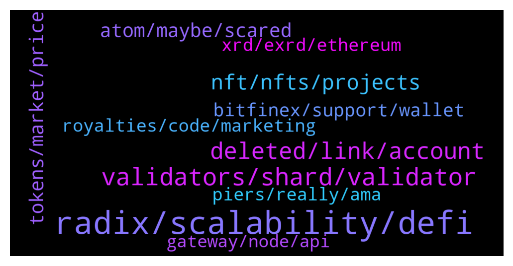

# **@radix_dlt**
 ## Analysis for **2022-01-23** - **2022-01-24**.

---

## 📊 **Basic Stats**

**n_messages_sent**: 440

---

---

## 🔝 **Top keywords and related messages**

1. **radix, scalability, defi**

    @MilkyWayBlackHole --- *Hello, i am new here, first time heard today about Radix. It looks incredible. My question is that due to fact that now about 9,75B xrd is in circulation and the rest of the 24B will not be fully released in next 40 years will that not mean that the price could be higher because of that? Only concern i see is that dev team could dump their coins? I know Radix is not a meme without usecase but in theory it would be possible? Sorry for my silly questions😅* **--->** [TG Discussion](https://t.me/radix_dlt/344521)

    @Gabrielfty --- *https://medium.com/coinmonks/unhyped-comparison-of-blockchain-platforms-679e122947c1  has anyone done a full tabled comparison summary for radix and other blockchain as shown in the link above ?* **--->** [TG Discussion](https://t.me/radix_dlt/345233)

    @crypt_punk --- *i know this is for 1year ago  ok let's talk about radix in next upgrade of radix , how many TPS can reachable? and how many TPS can process in each node?(each shard) how radix solve problem of storage ? i know it has unlimited shard so storge can be aparted (horizontal)* **--->** [TG Discussion](https://t.me/radix_dlt/345188)

    @Jazzer9F --- *Excellent article from Coin Telegraph highlighting the current issues faced by Solidity developers, and detailing how Radix will give developers the power to build quickly, securely, and know that scale will never be a bottleneck!  https://cointelegraph.com/news/watch-out-solidity-new-project-aims-to-tackle-downsides-of-coding-defi-projects* **--->** [TG Discussion](https://t.me/radix_dlt/344653)

    @stupidm0ney --- *I was curious about privacy on radix. Is it planned to be a fully open chain? Could just be me but it kinda feels like privacy and scalability are the two things defining the race for the next gen blockchain* **--->** [TG Discussion](https://t.me/radix_dlt/345011)

    @Kansuler --- *Do you want to get notifications when new radix projects get announced? Subscribe to the Radixlist announcement channel, and you'll be the first to know!  https://t.me/radixlist* **--->** [TG Discussion](https://t.me/radix_dlt/344674)

2. **validators, shard, validator**

    @Lexluttt --- *Hi guys and admins; any documentation on how to set up a validator node? Would like to get started :-)* **--->** [TG Discussion](https://t.me/radix_dlt/345219)

    @peterkimkz --- *Question: what about the security issues when validators corrupting a shard that participate on parallel transaction? #ama* **--->** [TG Discussion](https://t.me/radix_dlt/344986)

    @Tom --- *As far as I understand, each shard has a set of validators. In order to achieve finality for a transaction, 2/3 of the validators in the set need to agree, for each shard that is touched in the transaction. Please correct me if I am wrong* **--->** [TG Discussion](https://t.me/radix_dlt/345005)

    @peterkimkz --- *How much validator need to verify 1 shard on 1 transaction, is that all of them or not?* **--->** [TG Discussion](https://t.me/radix_dlt/345021)

    @Tom --- *No. One validator can have many thousands or millions of shards on it. The same shards can and will be on many other validators. So One shard can have many validators, and one validator can have many shards. In a consensus round, A set of validators, which have the target shard, is created, and these validators then will vote. If over 60% agree, finality is achieved, (for a simple transaction which touches only one shard).* **--->** [TG Discussion](https://t.me/radix_dlt/345058)

    @Tom --- *Yes, as I said before, a shard can and will be on many different validators* **--->** [TG Discussion](https://t.me/radix_dlt/345051)

3. **deleted, link, account**

    @ALFRED_DULAIRE --- *telegram channel plz? (no announcement one)* **--->** [TG Discussion](https://t.me/radix_dlt/344889)

    @bextmany --- *I am u the invitation. Sure you can ignore it.* **--->** [TG Discussion](https://t.me/radix_dlt/344723)

    @phwaa --- *No, I’m subscribed to the Chanel’s. So looks like a hack.* **--->** [TG Discussion](https://t.me/radix_dlt/345239)

    @bextmany --- *How has a discord app account here? I need an urgent assistance please* **--->** [TG Discussion](https://t.me/radix_dlt/344709)

    @Tom --- *Why stefan, head of marketing of councel account deleted?* **--->** [TG Discussion](https://t.me/radix_dlt/344537)

    @phwaa --- *Ahhh, is YouTube being hacked? I’ve just got notifications from two big influencer Chanel’s showing the same dodgy weird advertisement for some One World crypto?* **--->** [TG Discussion](https://t.me/radix_dlt/345237)

4. **nft, nfts, projects**

    @Tom --- *Whoever pays money for all these low quality auto generated nft‘s is out of his mind, prove me wrong* **--->** [TG Discussion](https://t.me/radix_dlt/344816)

    @mattiabe98 --- *You just need to wait 24 hours since you joined this group, then you can post all the links you want. Anyway, if you're interested in showing more about your NFT, you can get it listed on RadixTalk.  More info here: https://radixtalk.com/t/how-to-get-your-nft-added-on-radixtalk/267* **--->** [TG Discussion](https://t.me/radix_dlt/344729)

    @tesslerc --- *People like to gamble and NFTs is simply a way to capitalize on this. If people took a break and looked into the fundamental value they'd see that most NFTs (across all platforms) aren't created by known artists, aren't super impressive from a creative point of view and don't have any real utility.  So as I can go to the local mall and purchase prettier art for the sake of art, these NFTs are clearly a way of short term speculative gambling 🙂  Interesting NFT projects are those that use the non-fungible property and combine it with utility 😄* **--->** [TG Discussion](https://t.me/radix_dlt/344687)

    @BlAzAk --- *This is why our NFTs will take a part in our game.  I don’t talk about badges, I repeat, our badges are not NFTs. This is just a reflect of your wallet activity to play to the coming game (or current leaderboard).  I talk about our Avatar Series NFT collection. They will have a big utility in the game. But we do not want a pay 2 win so it’s important to find the balance.  It takes times. The requested time for quality !* **--->** [TG Discussion](https://t.me/radix_dlt/344691)

    @chrisijoyah --- *What if a set of NFTs were geographically located around the world, and after completing a set of challenges to find them you would obtain said NFTs for free. I think this would make for an interesting NFT concept.* **--->** [TG Discussion](https://t.me/radix_dlt/344897)

    @bonafideplug --- *Hey there. Sorry for the shill but I thought it should be said. There are a lot of NFT projects sprouting up. And despite us being founded very early, possibly top 5. We still thought it best till we wait.  We are, in fact, so confident that we are bringing something new. We let everyone oversaturate the Radix NFT Market… to bring something fresh. And when I say fresh… I mean: fresh, raw, organic #Radish  I encourage everyone to check us out.   We are teasing our first NFT, this friday. We are launching the website in a couple of weeks. We are releasing a whitepaper publicly in a month or so. And right around that time, we release the NFT.* **--->** [TG Discussion](https://t.me/radix_dlt/345000)

5. **tokens, market, price**

    @m_a_r_k0 --- *Folks, I don’t get the market cap thing. I bought some exrd in Jan 2021, price did not change a lot. But market cap is on rank 66 is or so right now? Shouldn’t the price have increased more if a project rises in mcap?* **--->** [TG Discussion](https://t.me/radix_dlt/344574)

    @chrisijoyah --- *Seems like everyone is getting this INU token* **--->** [TG Discussion](https://t.me/radix_dlt/344568)

    @TheCodeisTheLaw --- *The token unlock like Florian said, all tokens are unlocked(minus staking emissions) so although there are more circulating tokens, the price stayed the same which equates to a higher mcap.  Going into "price chat" territory.* **--->** [TG Discussion](https://t.me/radix_dlt/344578)

    @CaptainMooseInc --- *That's what I thought. I just couldn't find it anywhere quickly. The economics paper is gone from what I see. Probably because of the unlock being removed?* **--->** [TG Discussion](https://t.me/radix_dlt/344563)

    @Magal36 --- *Sorry but we can't speculate on price on this channel* **--->** [TG Discussion](https://t.me/radix_dlt/344524)

    @Azatis --- *I see two different coins on market with different supplies and marketcaps* **--->** [TG Discussion](https://t.me/radix_dlt/344591)

6. **atom, maybe, scared**

    @aus87 --- *this unhyped comparison is hyped towards making the tired argument about btc energy consumption* **--->** [TG Discussion](https://t.me/radix_dlt/345289)

    @peterkimkz --- *Need some mind in making comparision like this* **--->** [TG Discussion](https://t.me/radix_dlt/345276)

    @peterkimkz --- *Actually it hyped toward ATOM, see the bottom chart* **--->** [TG Discussion](https://t.me/radix_dlt/345292)

    @Squirtle247 --- *Maybe a new Language some ppl could think downside?* **--->** [TG Discussion](https://t.me/radix_dlt/345030)

    @chrisijoyah --- *A potential war  might effect the price of crypto, or so I've heard 👀* **--->** [TG Discussion](https://t.me/radix_dlt/345377)

    @peterkimkz --- *maybe you need a comparision with ATOM? Here https://t.me/radix_dlt/191924* **--->** [TG Discussion](https://t.me/radix_dlt/345294)

7. **bitfinex, support, wallet**

    @Alex --- *Hey guys I try to transfer XRD from bitfinex to the radix wallet. Usually that works without any problem but today my transaction is pending for almost an hour… please help* **--->** [TG Discussion](https://t.me/radix_dlt/345325)

    @minimalibu --- *Anyone else having trouble loading the instapass site? https://instapass.io* **--->** [TG Discussion](https://t.me/radix_dlt/344572)

    @Alex --- *So everyone who read my problem with the transfer from Bitfinex to olympia. It resolved itself, just took much longer than anticipated! Thanks y’all for the support!* **--->** [TG Discussion](https://t.me/radix_dlt/345370)

    @strotzky --- *im trying to withdraw from bitfinex to my radix wallet… the approval only says loading… for ages. anyone had this problem?* **--->** [TG Discussion](https://t.me/radix_dlt/344531)

    @GQ --- *Hello,  I have sent a LARGE amount of exrd using instabridge from my Metamask to Radix wallet. It’s been 3 hours already & I still don’t see it in my wallet. I’m so stressed out right now. The etherscan shows the transfer was a success.  What can I do now?* **--->** [TG Discussion](https://t.me/radix_dlt/344921)

    @expaat --- *Withdraws and deposits getting “stucked”. Need to contact customer support to fix it, and that process takes anywhere from 1 to n days* **--->** [TG Discussion](https://t.me/radix_dlt/345347)

8. **xrd, exrd, ethereum**

    @Azatis --- *Any admin / team member here to ask few questions about XRD ?* **--->** [TG Discussion](https://t.me/radix_dlt/344582)

    @Magal36 --- *actually eXRD will keep on existing as long as Ethereum exists, and will always be swappable 1:1 for XRD (no dead line), but it surely will become less relevant when XRD reaches a wider adoption* **--->** [TG Discussion](https://t.me/radix_dlt/344769)

    @IsochronicHog --- *EXRD or XRD? Which is better to hold and why?* **--->** [TG Discussion](https://t.me/radix_dlt/344757)

    @IsochronicHog --- *So is there a plan to eventually phase out EXRD?* **--->** [TG Discussion](https://t.me/radix_dlt/344764)

    @Cpt_Charles --- *Iirc development started in 2013, eXRD launched in nov 2020, XRD (mainnet) in july 2021l* **--->** [TG Discussion](https://t.me/radix_dlt/345121)

    @Smith --- *Is xrd worth a buy? Will get listed on some more exchanges ?* **--->** [TG Discussion](https://t.me/radix_dlt/344984)

9. **royalties, code, marketing**

    @Blind5ight --- *If AI produces code, then the royalties should go to the AI or the creator of the AI I guess In regards to farming royalties via social media marketing, not sure if devs care about that, they are a community and will probably know each other as colleagues rendering marketing somewhat useless* **--->** [TG Discussion](https://t.me/radix_dlt/345162)

    @ITProfligate --- *AI producing code and getting royalties - well I gess so. I need to think about this as what AI may actually do is produce code in the sence of chaning its behaviour dynamically. Would it then produce code dynamically? I am uncertain, perhaps it would. “farming royalties via social media marketing” not sure what this means, but perhaps it is a good idea. I don’t think all devs know each other. Huge disparate group.* **--->** [TG Discussion](https://t.me/radix_dlt/345285)

    @sonotopia --- *thanks for all the answers, though i still see that a lot of code today is written by AIs and smart algos, which will become more and more in the coming decade. i wonder if those won't be able to make the effort for plagiarism so low that they can a) avoid paying royalties or b) farm royalties by pushing their "product" with social media marketing* **--->** [TG Discussion](https://t.me/radix_dlt/345158)

    @Blind5ight --- *The big rationale imo is that crowd-sourced innovation will grind to a halt when it's not sustained somehow The cost reduction of this sort of innovation far outweighs, referencing a blueprint and paying a one-time royalty Most of the royalties falls on the user base, on a per tx basis* **--->** [TG Discussion](https://t.me/radix_dlt/345144)

    @Blind5ight --- *There will be freeriders still, but there should be (hopefully) enough devs that acknowledge that paying royalties is in their own best interest* **--->** [TG Discussion](https://t.me/radix_dlt/345155)

    @Blind5ight --- *The cost of developing the code themselves* **--->** [TG Discussion](https://t.me/radix_dlt/345149)

10. **piers, really, ama**

    @Jacob_XRD --- *CEO of RDX Works Piers Ridyard will be live with Staking Rewards at 1:05 PM UTC!  If you have not heard Piers speak live before, you are in for a treat!  🚀  SET REMINDER NOW: https://www.youtube.com/watch?v=K2hteew5kSA* **--->** [TG Discussion](https://t.me/radix_dlt/345282)

    @sonotopia --- *would be nice to have the video interview "fragmented" with each question as a time stamp and written out as a link to be able to check out the answer to what one is most interested and to be able to share it here if it pops up in chat* **--->** [TG Discussion](https://t.me/radix_dlt/345307)

    @Magal36 --- *Watch the debate, Piers does a better job debating this subject than I can ever do over telegram* **--->** [TG Discussion](https://t.me/radix_dlt/344836)

    @tesslerc --- *Great podcast tbh 🙂 Really enjoyed it* **--->** [TG Discussion](https://t.me/radix_dlt/344784)

    @sonotopia --- *Oh I didn't know there was a spotify podcast, thanks 🙏* **--->** [TG Discussion](https://t.me/radix_dlt/344841)

    @Jazzer9F --- *The latest technical AMA between RDX Works Founder Dan Hughes, and CEO Piers Ridyard is now live on YouTube!  https://youtu.be/Jn2FfMFzq0U* **--->** [TG Discussion](https://t.me/radix_dlt/345095)

