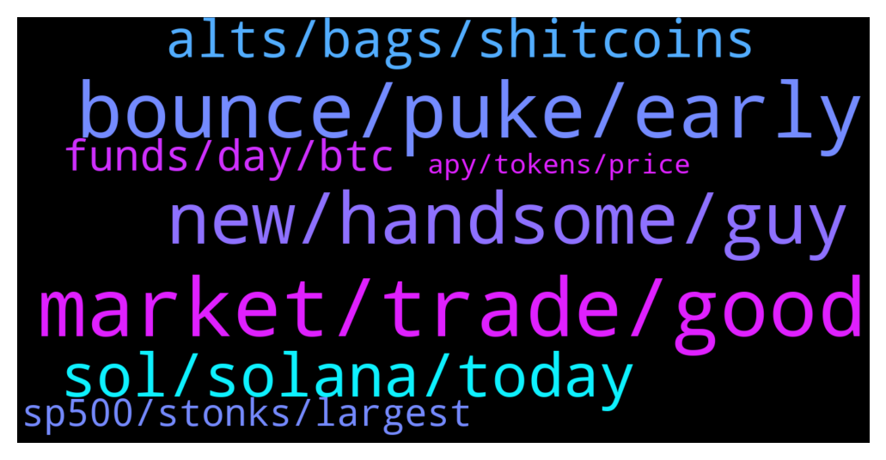

# **@shitpool**
 ## Analysis for **2022-01-23** - **2022-01-24**.

---

## 📊 **Basic Stats**

**n_messages_sent**: 249

---

---

## 🔝 **Top keywords and related messages**

1. **market, trade, good**

    @da0man --- *he flips within a year and gets it for 90% discount or so* **--->** [TG Discussion](https://t.me/shitpool/719128)

    @da0man --- *Good news is that Litecoin will do a 3x 5x* **--->** [TG Discussion](https://t.me/shitpool/719569)

    @Antonioalcantara --- *tornado, if this is bear market, spell will do -90%* **--->** [TG Discussion](https://t.me/shitpool/719171)

    @grammi --- *Imagine chamath saying he sold which means  All his vc frens already sold or will immediately sell  This was at $180 😂* **--->** [TG Discussion](https://t.me/shitpool/719125)

    @BeAMightyKing --- *Getting ready for the Jan 2023 halving trade eh?* **--->** [TG Discussion](https://t.me/shitpool/719572)

    @reamBay --- *Sir did you started shopping or waiting for capitulation?* **--->** [TG Discussion](https://t.me/shitpool/719276)

2. **bounce, puke, early**

    @BeAMightyKing --- *I'm not sure. Corn could also go sideways here as L1's further bleed* **--->** [TG Discussion](https://t.me/shitpool/719273)

    @goldencatpat --- *thats just shorters creating a range to build position* **--->** [TG Discussion](https://t.me/shitpool/719371)

    @Rjknew --- *I shorted 83 with CGS but would go to bearish on it (closed 77)* **--->** [TG Discussion](https://t.me/shitpool/719304)

    @wojackdegreate --- *What is this, a bounce for ants?* **--->** [TG Discussion](https://t.me/shitpool/719456)

    @da0man --- *@BeAMightyKing should we be worried about a dominance run?* **--->** [TG Discussion](https://t.me/shitpool/719252)

    @majesticwhelk --- *We just closed the CME gap, so this move was logical even with the bear case still in play.  I'm not saying I know either way, I just know it is definitely too early for bulls to declare victory here* **--->** [TG Discussion](https://t.me/shitpool/719421)

3. **new, handsome, guy**

    @wanker007 --- *hola amigos, hoy me presento ante ustedes para anunciar lo bien que estoy, ¡pero estoy comprando el chapuzón!* **--->** [TG Discussion](https://t.me/shitpool/719197)

    @yesbutalsono --- *To rich and handsome to care* **--->** [TG Discussion](https://t.me/shitpool/719398)

    @tornadotrading --- *but that was not the question 🙂 Is there a future for spell you think?* **--->** [TG Discussion](https://t.me/shitpool/719169)

    @da0man --- *below 30k legit 0 target as Saylor is forced out and his assets liquidated* **--->** [TG Discussion](https://t.me/shitpool/719318)

    @TUR7L3 --- *It’s been a while since I’ve taken any Spanish classes, but he’s basically just saying hello and that he’s buying the dip.* **--->** [TG Discussion](https://t.me/shitpool/719202)

    @CharliePolite --- *What in the actual fuck are you doing?* **--->** [TG Discussion](https://t.me/shitpool/719200)

4. **sol, solana, today**

    @wojackdegreate --- *Finally got my ust on sol. “24 hours later”* **--->** [TG Discussion](https://t.me/shitpool/719152)

    @brendanplayford --- *breakdown of LUNA - short from the breakdown this morning. Targeting $55-58* **--->** [TG Discussion](https://t.me/shitpool/719301)

    @da0man --- *SOL really drilling a hole today* **--->** [TG Discussion](https://t.me/shitpool/719123)

    @Breddao --- *wormhole is also down for retrieving, even if you managed to send to it?* **--->** [TG Discussion](https://t.me/shitpool/719112)

    @wojackdegreate --- *My ust still stuck in the bridge, can’t claim. Send it to zero.* **--->** [TG Discussion](https://t.me/shitpool/719111)

    @da0man --- *time to moon solana to 1k* **--->** [TG Discussion](https://t.me/shitpool/719155)

5. **alts, bags, shitcoins**

    @da0man --- *we might be at the 2019 stage sir where bitcoin pumped from 3k to 13k but alts got obliterated* **--->** [TG Discussion](https://t.me/shitpool/719278)

    @da0man --- *good luck. if you  are not buying low 30ks on bitcoin I don’t know what you are doing.* **--->** [TG Discussion](https://t.me/shitpool/719316)

    @da0man --- *let the alts dump to 0 for a while until btc goes above 50k* **--->** [TG Discussion](https://t.me/shitpool/719329)

    @da0man --- *every time he FUDs an alt it pumps, has so far* **--->** [TG Discussion](https://t.me/shitpool/719109)

    @BeAMightyKing --- *I don't have any desire to fomo alts when we just had 21 months of up-only* **--->** [TG Discussion](https://t.me/shitpool/719277)

    @da0man --- *lose 30k alts will do -50% candle* **--->** [TG Discussion](https://t.me/shitpool/719585)

6. **funds, day, btc**

    @wojackdegreate --- *Literally everyone on chain is getting liquidated because they cant deposit funds or pay off debts, claim funds from bridges, etc 😂* **--->** [TG Discussion](https://t.me/shitpool/719146)

    @brendanplayford --- *Same with BTC - money continues to flow out* **--->** [TG Discussion](https://t.me/shitpool/719330)

    @tornadotrading --- *Question: I have some 'investments' in crypto assets, in which I did not place a stoploss, for real longer term. Among them was Spell, and well, as you know, that sucker keeps on dumping.  I did read some concerning thins here, is it a scam, or would it make sense to hold it and not looking at it for a while?* **--->** [TG Discussion](https://t.me/shitpool/719164)

    @da0man --- *Btc itself too, didn’t last year, bounced off it* **--->** [TG Discussion](https://t.me/shitpool/719529)

    @da0man --- *Saylor liquidation is the end of bitcoin as nobody on the Wall St would ever publicly touch this crap* **--->** [TG Discussion](https://t.me/shitpool/719326)

    @brendanplayford --- *everything will continue to weaken as liquidity gets sucked out every day* **--->** [TG Discussion](https://t.me/shitpool/719308)

7. **sp500, stonks, largest**

    @onchainjoe --- *he means that, and generally he's not wrong but here it's kind of naive to pretend tech stonks and crypto are only coincidentally related* **--->** [TG Discussion](https://t.me/shitpool/719640)

    @tornadotrading --- *if the saga continues, and sp500 is bouncing up, we follow* **--->** [TG Discussion](https://t.me/shitpool/719429)

    @tornadotrading --- *The SP 500 is probably doing a relieve bounce, and crypto follows the sp500* **--->** [TG Discussion](https://t.me/shitpool/719422)

    @tornadotrading --- *tight stops, as the SP500 might either see a relief bounce, or continue to dump and taking crypto with it (sigh)* **--->** [TG Discussion](https://t.me/shitpool/719377)

    @tornadotrading --- *but if there is some fed news item, and it becomes clear, that Russia is not, we could see a strong spike up on the sp500, and then crypto will follow , which could lead to another (feeble) shortlived rally* **--->** [TG Discussion](https://t.me/shitpool/719177)

    @tornadotrading --- *but yeah, I have to admit that trading crypto has become way more difficult, as it follows the SP500* **--->** [TG Discussion](https://t.me/shitpool/719386)

