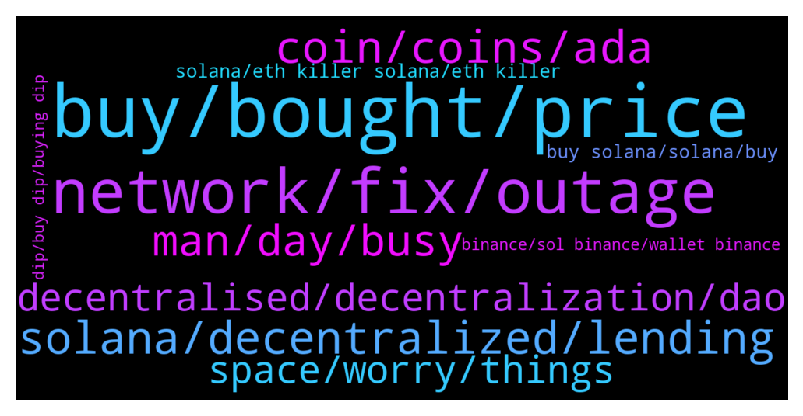

# **@solana**
 ## Analysis for **2022-01-23** - **2022-01-24**.

---

## 📊 **Basic Stats**

**n_messages_sent**: 1192

---

---

## 🔝 **Top keywords and related messages**

1. **buy, bought, price**

    @medasyko --- *I bought 100 tokens at $92 dollars a pop* **--->** [TG Discussion](https://t.me/solana/915457)

    @Best 100x signals in my profile BIO🚀 --- *Now I’m sure 100x is possible this year. Real whales from that signal group will post about us (LINK in my profile BIO, check for yourself!)* **--->** [TG Discussion](https://t.me/solana/916342)

    @GambleBlood --- *I wonder if I will ever get back to $136 so I can break even.* **--->** [TG Discussion](https://t.me/solana/913557)

    @Kbs --- *Buy now u wil get 30 more  in same price* **--->** [TG Discussion](https://t.me/solana/915719)

    @Sunoanshul --- *I am also bought at 124 😢 20 sol* **--->** [TG Discussion](https://t.me/solana/915712)

    @DAVID --- *I need advise should I still buy or sell off all* **--->** [TG Discussion](https://t.me/solana/913607)

2. **network, fix, outage**

    @taaisen --- *The network is down. It literally doesn’t work..* **--->** [TG Discussion](https://t.me/solana/916119)

    @nizzux --- *I think Is down. Based on reddit community* **--->** [TG Discussion](https://t.me/solana/916078)

    @chillcrypto3 --- *What a disgrace having my post removed for making a prediction. Not a good look just means you have something to hide. Face the facts having continuous outages means you have problems. Please answer as to how you expect to fix this and make it slightly more realible? Anything please this is frustrating.* **--->** [TG Discussion](https://t.me/solana/916403)

    @taaisen --- *An inconsistent, unreliable network isn’t though. How will the team fix that?* **--->** [TG Discussion](https://t.me/solana/916149)

    @mickyd2nv --- *I spoke to one of the dev and he said they had to shut down the blockchain for maintenance.. It will be back up in 72hrs* **--->** [TG Discussion](https://t.me/solana/915705)

    @Emonty62 --- *price being down is ok, network down AGAIN is NOT ok* **--->** [TG Discussion](https://t.me/solana/913496)

3. **solana, decentralized, lending**

    @Dirk --- *Can't even compare Cardano and Solana. Cardano is one of the most if not the most decentralized blockchain running. It's a true decentralized blockchain that was developed with years of academic rigor.  Alana is not decentralized certainly not in the way that cryptocurrency supposed to be.  The problems Solana is facing are directly on the Solana blockchain. Sunday swap is a DEX on the cardano network.* **--->** [TG Discussion](https://t.me/solana/917074)

    @tommasooo05 --- *Guys do you think thath thee technical problems that solana has had in the last period could cause damage in the market in the long run?* **--->** [TG Discussion](https://t.me/solana/916771)

    @mahib45 --- *Hello 👋  Any Projects can build on Solana but Solana doesn't offer any endorsement or investment advice.  Do your own research! Thanks for the understanding ❤* **--->** [TG Discussion](https://t.me/solana/915192)

    @UnknownIdentity --- *Even the usdc is on solana network. Huge projects are on it how it is dead . Just asking . Really meaningless if we think it is dead . Solana will be future i hope ...* **--->** [TG Discussion](https://t.me/solana/916116)

    @Parthimc84 --- *Ups and downs are a part of project life cycle, sure solana will bounce back stronger* **--->** [TG Discussion](https://t.me/solana/916145)

    @nofearnickishere --- *You should read about SBF and the future of Solana.  Theres no point in debating if you honestly believe Solana is hype and VCs will abandon it.  That’s about as ignorant to the facts as you could get…  The market tanked, but if you educate yourself and do the research you’ll see nothing has changed for Solana. They are loaded, growing like no other, and killing it.  Solana is on course  to be the most useful utility blockchain in crypto period. Decentralized chains cannot compete if they are not as fast, secure and convenient.* **--->** [TG Discussion](https://t.me/solana/916703)

4. **coin, coins, ada**

    @jagabanoflala --- *I sale to those who want to buy in small quantities and large quantities or any coin of  their choice* **--->** [TG Discussion](https://t.me/solana/915626)

    @Bhavnasatish --- *Ever coins does same, no coin is recovering* **--->** [TG Discussion](https://t.me/solana/913684)

    @okbro1 --- *Sol wtf wrong happen ada is 7% down n u are 25% for 3 consecutive days.... Come on* **--->** [TG Discussion](https://t.me/solana/913676)

    @Adnaan1 --- *It does'nt make any sense lost 70-90% and get 5-10% annualy* **--->** [TG Discussion](https://t.me/solana/913535)

    @jagabanoflala --- *Am a vendor  Feel relaxed to chat me up if you wanna buy any coin but in bulk and small quantities* **--->** [TG Discussion](https://t.me/solana/915619)

    @bozo1 --- *yes, but I’m still in a big plus with other coins* **--->** [TG Discussion](https://t.me/solana/916637)

5. **man, day, busy**

    @Sunnyvilla --- *If you don't know an answer to a question, best thing is to shut up* **--->** [TG Discussion](https://t.me/solana/916084)

    @Rootpt --- *Lol, they don't even know what's up?* **--->** [TG Discussion](https://t.me/solana/915823)

    @zet07 --- *Then he cannot understand it or stacks to many subjects on it additionaly* **--->** [TG Discussion](https://t.me/solana/917176)

    @Kbs --- *I better understand your definition than his... He is on drugs may be copy paste from Google definition* **--->** [TG Discussion](https://t.me/solana/917189)

    @Arslan --- *and it's top 10 soo acknowledge this beast stop shitting around dude* **--->** [TG Discussion](https://t.me/solana/915541)

    @Kbs --- *That's wt i told him.. He says it's false... Read up* **--->** [TG Discussion](https://t.me/solana/917175)

6. **decentralised, decentralization, dao**

    @zet07 --- *Centralized takes power of the people, it is like a huge dictator that cou cannot and should not trust  Decentralized is like a open field of people who like the idea and join in, with the time, power comes trough the people to the people* **--->** [TG Discussion](https://t.me/solana/917173)

    @Dirk --- *Price has nothing to do with  decentralization.* **--->** [TG Discussion](https://t.me/solana/917082)

    @Kbs --- *Then wts ur tot between decentralised vs centralised? Can u elaborate so we can understand nicely* **--->** [TG Discussion](https://t.me/solana/917164)

    @Sevith --- *He's specifically referring to the development of bitcoin.  I have already stated this several times;.....................  DECENTRALIZATION ONLY HAS TO DO WITH THE GEOPHRAPHICAL NETWORK DISTRIBUTION OF NODES IN A PARTICULAR SYSTEM; Nothing more; Nothing less.* **--->** [TG Discussion](https://t.me/solana/917170)

    @Sevith --- *Jonny ELI5 decentralization for me then.* **--->** [TG Discussion](https://t.me/solana/917180)

    @Kbs --- *Decentralised means not government by central Bank or any organisation or person... It runs autonomously without any control or authority .... Centralised is opposite run by someone authority* **--->** [TG Discussion](https://t.me/solana/917125)

7. **space, worry, things**

    @Bhavnasatish --- *Cryptocurrencies is not for the weak minds* **--->** [TG Discussion](https://t.me/solana/913680)

    @Ricky --- *Don't worry.. volatility is common in crypto..* **--->** [TG Discussion](https://t.me/solana/914533)

    @rosannerosse --- *UAE 🇦🇪 are shutting down crypto?* **--->** [TG Discussion](https://t.me/solana/914696)

    @Wills --- *Soonest.  For now, I just keep my eyes off the project and focus on some other things. It's the best thing to do when loosing in crypto* **--->** [TG Discussion](https://t.me/solana/916622)

    @cryptolover1987 --- *As a trader I would say whole crypto is down.. need to be patient.* **--->** [TG Discussion](https://t.me/solana/916153)

    @Wills --- *For how long have you been in the crypto space* **--->** [TG Discussion](https://t.me/solana/916655)

8. **solana, eth killer solana, eth killer**

    @g_v_d_s --- *Remember solana is still in beta* **--->** [TG Discussion](https://t.me/solana/915926)

    @lalelilulos --- *Well you’re not really smart are you. That’s not solanas fault tho* **--->** [TG Discussion](https://t.me/solana/915393)

    @LetsGoRide --- *Solana is getting hit hard cause it's not living up to it's potential with tps. It's a while off before truly an Eth killer* **--->** [TG Discussion](https://t.me/solana/915458)

    @Akshay --- *Solana is dropping the most :(* **--->** [TG Discussion](https://t.me/solana/915780)

    @Charles_Cripto23Cm --- *Sola , solum , solanax are Sc.a.m 😡😡* **--->** [TG Discussion](https://t.me/solana/915190)

    @machaalany --- *If ur a crap doesn't mean solana is a crap noob* **--->** [TG Discussion](https://t.me/solana/915406)

9. **buy solana, solana, buy**

    @netblizz --- *Okay this shit is gonna happen anyway I hope solana can go as low as $2.50 so I could load shit tons to my wallet.* **--->** [TG Discussion](https://t.me/solana/916247)

    @Robert --- *I want some of that weed he's smoking... Solana tumbled from over 200 to 82 dollars and people are talking of 100x. 😂* **--->** [TG Discussion](https://t.me/solana/916548)

    @MRX8880 --- *Is it good to buy solana at 90$??* **--->** [TG Discussion](https://t.me/solana/913411)

    @GambleBlood --- *I might just cut my losses here. I bought at 136 and it's been blood red since that day. Solana has a terrible reputation of failed transactions now.* **--->** [TG Discussion](https://t.me/solana/913578)

    @Alienmusk2 --- *Reversal is coming 🚀🚀🚀❤️ just bought 9 of them but im still happy to buy because i know what solana is capable of* **--->** [TG Discussion](https://t.me/solana/914217)

    @jvvmh --- *I disagree. My TA leaves say Solana will be at $300 in 24 minutes.* **--->** [TG Discussion](https://t.me/solana/914674)

10. **binance, sol binance, wallet binance**

    @Boragora --- *Binance is another story, they do whatever they want with your tokens. Be patient and ask to tech support to solve the issue* **--->** [TG Discussion](https://t.me/solana/914176)

    @Boragora --- *my experience is that when Binance say congested but blockchain is working fine, tokens arrive fine and usually fast anyway* **--->** [TG Discussion](https://t.me/solana/914177)

    @Alexandru --- *It s working mate But not on binance.* **--->** [TG Discussion](https://t.me/solana/914477)

    @Liz --- *Binance doesn’t have my sol tokens I’m trying to send them from my sol wallet to binance but they won’t send to them yet so I am waiting patiently* **--->** [TG Discussion](https://t.me/solana/914188)

    @Farah100 --- *When I transferred mine through binance it went smoothly, it was gate io that was my issue* **--->** [TG Discussion](https://t.me/solana/914206)

    @HunterMoss --- *Binance seems to be big, but some kind of muddy exchange.* **--->** [TG Discussion](https://t.me/solana/913375)

