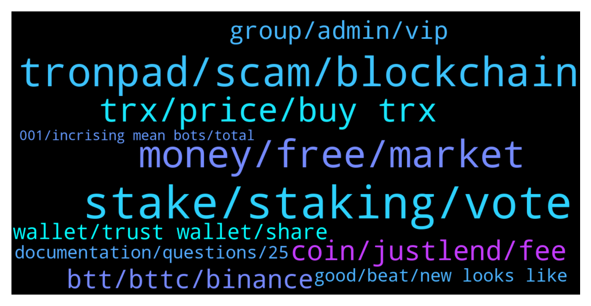

# **@tronnetworkEN**
 ## Analysis for **2022-01-23** - **2022-01-24**.

---

## 📊 **Basic Stats**

**n_messages_sent**: 373

---

---

## 🔝 **Top keywords and related messages**

1. **stake, staking, vote**

    @Abelrajuz --- *In voting is all the reward given as trx itself* **--->** [TG Discussion](https://t.me/tronnetworkEN/3849802)

    @Zer0log --- *Where can i stake simple and secure i don't want to go through vote and ....* **--->** [TG Discussion](https://t.me/tronnetworkEN/3849672)

    @HimanshuHoneyBee --- *They are Offering 3% Daily Income.. We have to deposit only 100$ On Tron link pro App* **--->** [TG Discussion](https://t.me/tronnetworkEN/3849968)

    @Rahul --- *I don't think so Because there is earning trx regularly as an community rewards and also referal reward  What's your take on this* **--->** [TG Discussion](https://t.me/tronnetworkEN/3850502)

    @its_naveen_chouhan --- *How to stake tron and wink ??* **--->** [TG Discussion](https://t.me/tronnetworkEN/3850533)

    @KingsDove_TRX --- *Don't stake just because you're going to, actually have a solid plan* **--->** [TG Discussion](https://t.me/tronnetworkEN/3849769)

2. **tronpad, scam, blockchain**

    @MilNoslen --- *Tronpad is not associated with the Tron Foundation* **--->** [TG Discussion](https://t.me/tronnetworkEN/3850791)

    @Moneyversac --- *You gotta admit Tronfoundation is a company 😂* **--->** [TG Discussion](https://t.me/tronnetworkEN/3849470)

    @Alex8883 --- *Any potential on TRONPAD token?  Seems like dump harder than TRX* **--->** [TG Discussion](https://t.me/tronnetworkEN/3850789)

    @Alex8883 --- *Meaning TRONPAD is not project by TRON?* **--->** [TG Discussion](https://t.me/tronnetworkEN/3850839)

    @Alei1122 --- *You know someone said he is Admin of TRON* **--->** [TG Discussion](https://t.me/tronnetworkEN/3851800)

    @ruh_hastasi77 --- *Who will be the next CEO for Tron after J.Sun. How the Coin will be affected* **--->** [TG Discussion](https://t.me/tronnetworkEN/3851090)

3. **money, free, market**

    @KingsDove_TRX --- *Nothing is free you must buy first and then you can earn* **--->** [TG Discussion](https://t.me/tronnetworkEN/3849704)

    @Cerah --- *When will the market start to improve* **--->** [TG Discussion](https://t.me/tronnetworkEN/3851588)

    @davedine --- *Patient is the key. Money management will help a lot. Money is circulate on many instrument. There are commodities, currencies, stocks, and cryptocurrencies. Most of peoples just look on one instrument. And that is not investing wise* **--->** [TG Discussion](https://t.me/tronnetworkEN/3851156)

    @Alei1122 --- *I just bought it recently before coin crash down* **--->** [TG Discussion](https://t.me/tronnetworkEN/3851140)

    @Alei1122 --- *Ahahaha but some money need to spend daily* **--->** [TG Discussion](https://t.me/tronnetworkEN/3851132)

    @steve1191 --- *I want to trade usdt who can do that* **--->** [TG Discussion](https://t.me/tronnetworkEN/3851329)

4. **trx, price, buy trx**

    @Alei1122 --- *I have buy TRX since 0.07X but now ...* **--->** [TG Discussion](https://t.me/tronnetworkEN/3851123)

    @Alei1122 --- *How do you predict the price of TRX?* **--->** [TG Discussion](https://t.me/tronnetworkEN/3851160)

    @Moneyversac --- *Where do you get 80% with TRX* **--->** [TG Discussion](https://t.me/tronnetworkEN/3849634)

    @Alei1122 --- *But I put only 100 TRX* **--->** [TG Discussion](https://t.me/tronnetworkEN/3851235)

    @YJump --- *How much TRX Justin own now?* **--->** [TG Discussion](https://t.me/tronnetworkEN/3851103)

    @agentpiki --- *Do you want to see the chart of trx getting burned daily?* **--->** [TG Discussion](https://t.me/tronnetworkEN/3851540)

5. **coin, justlend, fee**

    @Zer0log --- *I mean if i don't want to transfer my coins and just by prooving the ownership of the wallet on CEX* **--->** [TG Discussion](https://t.me/tronnetworkEN/3849760)

    @IDG1998 --- *I have PAL coin ( play n Like coin TRC10) and now I want to swap to trX, is it possible to swap? An admin can help??* **--->** [TG Discussion](https://t.me/tronnetworkEN/3851709)

    @Henry Walter --- *Hi admin please how can I swap tether trc20 and pal Trc10* **--->** [TG Discussion](https://t.me/tronnetworkEN/3849904)

    @agentpiki --- *You can borrow trx in justlend.org  But you need to supply your trc currencies and set them as collateral* **--->** [TG Discussion](https://t.me/tronnetworkEN/3851991)

    @jennifer2364 --- *You need Trx or bnb as charges fee* **--->** [TG Discussion](https://t.me/tronnetworkEN/3848258)

    @coinguy555 --- *Im using justlend , take trx loan there, using usdj , im tronix man* **--->** [TG Discussion](https://t.me/tronnetworkEN/3851695)

6. **btt, bttc, binance**

    @KingsDove_TRX --- *BTTC, GameFi, A. I., And much more* **--->** [TG Discussion](https://t.me/tronnetworkEN/3849749)

    @Moneyversac --- *BTT rewards are still amazing tho* **--->** [TG Discussion](https://t.me/tronnetworkEN/3849646)

    @Sunil --- *Bittorrent  chain  price ???* **--->** [TG Discussion](https://t.me/tronnetworkEN/3849246)

    @ginyagami --- *also btt is no longer listed in binance?* **--->** [TG Discussion](https://t.me/tronnetworkEN/3849221)

    @Moneyversac --- *BTTC means Bittorrent chain. BTT is the token. Go to www.google.com Type in "BTT price In INR"* **--->** [TG Discussion](https://t.me/tronnetworkEN/3849432)

    @whoizit --- *Can someone tell me about btt please??* **--->** [TG Discussion](https://t.me/tronnetworkEN/3851721)

7. **group, admin, vip**

    @agentpiki --- *We don't host VIP groups. Those are probably scams* **--->** [TG Discussion](https://t.me/tronnetworkEN/3850625)

    @cool_man78 --- *Ask a question here. Group managers know the answer better* **--->** [TG Discussion](https://t.me/tronnetworkEN/3848379)

    @Thisisselva --- *Sir do u have any VIP group?.. I was invited into an Tron Official Group it says "TRON official VIP group, only those who are invited can enter.”* **--->** [TG Discussion](https://t.me/tronnetworkEN/3850620)

    @agentpiki --- *https://t.me/TronOfficialDevelopersGroupEn  This group might come handy and informative to you in the future.* **--->** [TG Discussion](https://t.me/tronnetworkEN/3849315)

    @xPommepote --- *No. Simply because they NEVER dm you* **--->** [TG Discussion](https://t.me/tronnetworkEN/3850308)

    @Grogu80081 --- *I have pinned this group in telegram* **--->** [TG Discussion](https://t.me/tronnetworkEN/3849318)

8. **wallet, trust wallet, share**

    @IDG1998 --- *Really, I purchased from p2p trade direct to my trust wallet* **--->** [TG Discussion](https://t.me/tronnetworkEN/3851740)

    @A.M --- *İ can Share the Receiver  Wallet Adresse now maybe someone knows that Wallet. İts a big Wallet 😁* **--->** [TG Discussion](https://t.me/tronnetworkEN/3851034)

    @Richard --- *I have made a deposit from tron to my wallet but it didn't drop up to now* **--->** [TG Discussion](https://t.me/tronnetworkEN/3848470)

    @Rarediamond --- *Do they ask for wallet address?* **--->** [TG Discussion](https://t.me/tronnetworkEN/3850303)

    @xPommepote --- *From where to where ? Transaction are processed in less than a minute, can you share the hash ?* **--->** [TG Discussion](https://t.me/tronnetworkEN/3849094)

    @Carlos_TRX --- *what wallet? share the hash pls* **--->** [TG Discussion](https://t.me/tronnetworkEN/3848524)

9. **documentation, questions, 25**

    @Grogu80081 --- *sorry for the umb questions ... havent gone through all the documentation yet. just focusing on the back-end part at the moment* **--->** [TG Discussion](https://t.me/tronnetworkEN/3849312)

    @coinguy555 --- *So whats in it for you?* **--->** [TG Discussion](https://t.me/tronnetworkEN/3851637)

    @Grogu80081 --- *i have been in IT for 25 years mate. asking questions that are stated in documentation ... irritates ppl* **--->** [TG Discussion](https://t.me/tronnetworkEN/3849321)

    @agentpiki --- *Nono, based on your laugh wkwk* **--->** [TG Discussion](https://t.me/tronnetworkEN/3851661)

    @ruh_hastasi77 --- *Are there some Infos to read through? Thx* **--->** [TG Discussion](https://t.me/tronnetworkEN/3851091)

    @KingsDove_TRX --- *So if you could wait then you can introduce both in your tutorial 😉* **--->** [TG Discussion](https://t.me/tronnetworkEN/3849703)

10. **good, beat, new looks like**

    @KingsDove_TRX --- *Just stay positive and helpful 👍* **--->** [TG Discussion](https://t.me/tronnetworkEN/3851651)

    @KingsDove_TRX --- *I'm just f** around Lol 😅* **--->** [TG Discussion](https://t.me/tronnetworkEN/3851479)

    @KingsDove_TRX --- *@Tech665 I like your username 👍* **--->** [TG Discussion](https://t.me/tronnetworkEN/3851450)

    @simon866 --- *Good to have you back and well @Moneyversac 🙌* **--->** [TG Discussion](https://t.me/tronnetworkEN/3849883)

    @KingsDove_TRX --- *Let's try to be a little more nicer please ☺️* **--->** [TG Discussion](https://t.me/tronnetworkEN/3849593)

    @KingsDove_TRX --- *Kinda hard to beat it 😅* **--->** [TG Discussion](https://t.me/tronnetworkEN/3849791)

