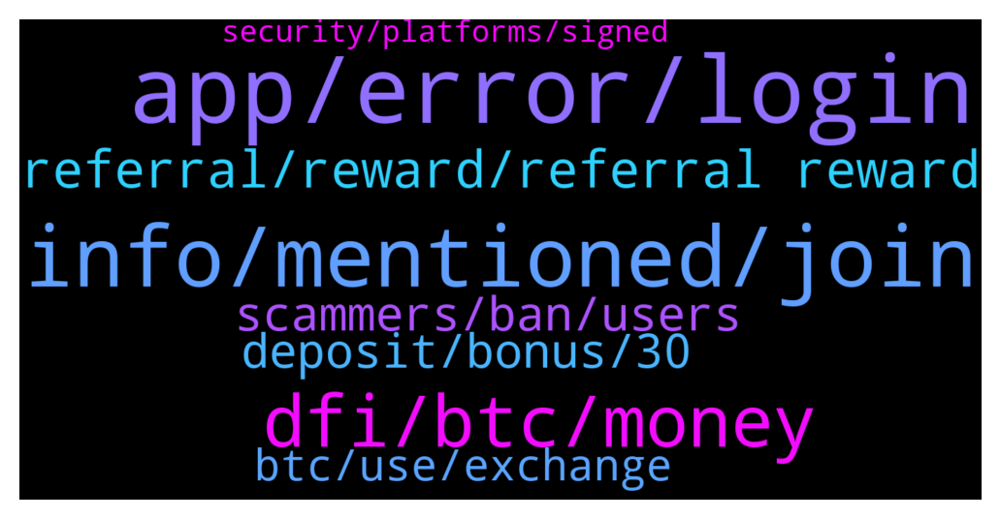

# **@CakeDeFi_EN**
 ## Analysis for **2022-01-24** - **2022-01-25**.

---

## 📊 **Basic Stats**

**n_messages_sent**: 239

---

---

## 🔝 **Top keywords and related messages**

1. **app, error, login**

    @Michael_Schredl --- *Everything works fine for me, what error do you get?* **--->** [TG Discussion](https://t.me/CakeDeFi_EN/167653)

    @Bald --- *Yes. Using Samsung. Downloaded the app from playstore. But was told the app was outdated. Problem is Playstore do not have any update* **--->** [TG Discussion](https://t.me/CakeDeFi_EN/167755)

    @sunilpnwr --- *It shows network error but my connection seems fine. I can reload but I can't upload the docs.* **--->** [TG Discussion](https://t.me/CakeDeFi_EN/167655)

    @sunilpnwr --- *It shows the same error in a different browser.* **--->** [TG Discussion](https://t.me/CakeDeFi_EN/167657)

    @JetFuelGenius --- *When I opened up the app earlier today, it told me it was out of date and needed to be updated. I was directed to the App Store, but no update was available. It is available now.* **--->** [TG Discussion](https://t.me/CakeDeFi_EN/167805)

    @JetFuelGenius --- *When you release an update, it would be nice if you would make sure it’s live and actually available before blocking the old version.* **--->** [TG Discussion](https://t.me/CakeDeFi_EN/167803)

2. **info, mentioned, join**

    @jezzkng --- *in addition to the FAQ mentioned in below, you can cross reference this page  https://support.google.com/accounts/answer/185839?hl=en&co=GENIE.Platform%3DDesktop* **--->** [TG Discussion](https://t.me/CakeDeFi_EN/167932)

    @Kenneth --- *I see Thanks for the valuable info 😁* **--->** [TG Discussion](https://t.me/CakeDeFi_EN/167715)

    @Bald --- *I see. Thanks for the info* **--->** [TG Discussion](https://t.me/CakeDeFi_EN/167873)

    @Rumi --- *I want to understand what I'm doing there...* **--->** [TG Discussion](https://t.me/CakeDeFi_EN/168180)

    @JL --- *And no answer. Thanks for typing anyway* **--->** [TG Discussion](https://t.me/CakeDeFi_EN/167996)

    @StarGazerTM --- *hah i know i wait from saturday morning* **--->** [TG Discussion](https://t.me/CakeDeFi_EN/167837)

3. **dfi, btc, money**

    @Cedric --- *But dfi keep dropping and my money always worth less* **--->** [TG Discussion](https://t.me/CakeDeFi_EN/168103)

    @Kenneth --- *Isn't buying BTC to convert to DFI not worth it given the expensive fees in BTC purchase?* **--->** [TG Discussion](https://t.me/CakeDeFi_EN/167726)

    @JL --- *I'm here because my funds are always stuck. I didnt buy dfi and see it drop 5 to 2.5 like u, so i don't hate it, not sure why you love it, but i definitely respect it.* **--->** [TG Discussion](https://t.me/CakeDeFi_EN/168042)

    @Bald --- *How come I can't swap DFI to BTC?* **--->** [TG Discussion](https://t.me/CakeDeFi_EN/167868)

    @Cedric --- *Hope dfi will rise then I can breakeven my capital But I think is  very hard now need wait many years* **--->** [TG Discussion](https://t.me/CakeDeFi_EN/168127)

    @fadfunky --- *Today is a strong sell off. Oh god. Just waiting for reversal* **--->** [TG Discussion](https://t.me/CakeDeFi_EN/167773)

4. **referral, reward, referral reward**

    @muhammedbyrkn --- *How much is the referral reward?* **--->** [TG Discussion](https://t.me/CakeDeFi_EN/167562)

    @apoyzkie09 --- *And I am already verified.. can I still put someone else referral on my account? And How.* **--->** [TG Discussion](https://t.me/CakeDeFi_EN/168006)

    @DmgBautista --- *Yes, 25% of 1%. You will receive up to the maximum of 1% of the total holdings of all your referrals, per year, if they comply with the rules.* **--->** [TG Discussion](https://t.me/CakeDeFi_EN/167605)

    @gaytanmisael --- *How is the percentages for referral calculated?* **--->** [TG Discussion](https://t.me/CakeDeFi_EN/167599)

    @muhammedbyrkn --- *How many months is the $10 referral reward?* **--->** [TG Discussion](https://t.me/CakeDeFi_EN/167569)

    @andreasisaak --- *The referral reward is $30. The Learn reward is locked too.* **--->** [TG Discussion](https://t.me/CakeDeFi_EN/167573)

5. **scammers, ban, users**

    @fabioandreatta --- *We are open for constructive critism, constant complaining is a violation of our community guidelines.* **--->** [TG Discussion](https://t.me/CakeDeFi_EN/168073)

    @weng --- *You mean road to 50 cents? Admin pls ban him , he spread fud* **--->** [TG Discussion](https://t.me/CakeDeFi_EN/168137)

    @DmgBautista --- *Will delete this post, as print screens of scammers or possible suspicious individuals are not endorsed. Lets not give scammers nore attention than the one they deserve :)  If you wish to help making a faster ban on a scammer, just DM a mod with the print screen of such conversation so the mod can ban them.  Showing the printscreen here allows the scammers to run away if they are seeing, just to return a few minutes later impersonating anyone else or another mod. Lets not make their life easy 😉* **--->** [TG Discussion](https://t.me/CakeDeFi_EN/167891)

    @DmgBautista --- *I would block and report, with all due respect, not knowing who it may be, do not engage in DM's. DM other users is also against the community policy in order to avoid any risks.  Also, the person in question is not even in the group, so another reason to suspicion, enter and jump out is a clear scammer sign.  Always take care, you will be approached by many DM or even calls claiming to be what they are not. Block and report them. Only the official channels are to be considered.   Anyone with questions will ask here. Anyone wanting to help, will do the same here, not hidding behind a DM 😉* **--->** [TG Discussion](https://t.me/CakeDeFi_EN/167887)

    @DmgBautista --- *Dear god 🤦‍♂️ Not even one hour passed since I issued the warning. Those scammers dont even bother to read my warning to you 😂  If those scammers could direct that will to scam people to actually do something productive, they could make humanity advance decades 😂  Just block and report them! Stay safe! 👍* **--->** [TG Discussion](https://t.me/CakeDeFi_EN/167881)

    @YSL --- *😂 scammers work 24 / 7 … the moment we posted a question here and the next second ll received DM from them* **--->** [TG Discussion](https://t.me/CakeDeFi_EN/167877)

6. **deposit, bonus, 30**

    @zachgax --- *If I may add on. Cake is not a spot trading platform. It’s an investment platform with long term goals for staking and liquidity mining. So don’t think of it as a run-and-gun scenario where you put in the minimum of $50 to get the $30 bonus and try to cash out immediately. Your $30 bonus is frozen for 6-months anyway.  You could put in a comfortable buffer of about $100, freeze along with the $30 for the same 6 month period. Use the time to learn more about Cake and Defichain, see how your rewards accumulate. I can guarantee that within this 6 month lock-in period, you’d be confident enough with the project to invest more.* **--->** [TG Discussion](https://t.me/CakeDeFi_EN/167722)

    @Kassius84 --- *Sorry I got you wrong, if you register at Cake DeFi and deposit cryptos worth $50, your $30 sign up bonus is locked for 180 days* **--->** [TG Discussion](https://t.me/CakeDeFi_EN/167568)

    @Kassius84 --- *If you register yourself at Cake DeFi and you deposit at least crypto worth $50, you will receive a sign up bonus in DFI worth $30.* **--->** [TG Discussion](https://t.me/CakeDeFi_EN/167566)

    @Kenneth --- *First time deposit promotion, I mean* **--->** [TG Discussion](https://t.me/CakeDeFi_EN/167704)

    @Kassius84 --- *If someone uses you refferal code, you will receive DFI worth $10 and up to 1% p.a. on your referral's investments on Cake DeFi* **--->** [TG Discussion](https://t.me/CakeDeFi_EN/167563)

    @Kenneth --- *Does that make you eligible for the first time deposit promotion?* **--->** [TG Discussion](https://t.me/CakeDeFi_EN/167708)

7. **btc, use, exchange**

    @Bald --- *What's the cheapest way to deposit fund to cake defi? Currently I transfer LTC from Crypto.com to Cake Defi (Crypto.com take 0.001LTC fee). Then in Cake Defi I need to swap LTC to DFI (Cake take 5%). Thereafter I need to swap DFI to BTC & ETH (another 5% + 5%)* **--->** [TG Discussion](https://t.me/CakeDeFi_EN/167860)

    @YyeapY --- *should i use trc network when i withdraw frm other wallet to cake?* **--->** [TG Discussion](https://t.me/CakeDeFi_EN/168076)

    @andywazzaa --- *probably better to send NEO, XLM to Kucoin and convert to DFI before sending them over to CakeDefi.. cakedefi charges a 15% premium if im not wrong..* **--->** [TG Discussion](https://t.me/CakeDeFi_EN/167709)

    @@arife --- *Hello friends. Can you send me your referral link to Cake Defi?* **--->** [TG Discussion](https://t.me/CakeDeFi_EN/167985)

    @Kassius84 --- *Hey, Cake DeFi doesn't supports the Tron Blockchain yet. Please use the native network of the coin or for USDT/USDC the Ethereum Blockchain. 😃 👍* **--->** [TG Discussion](https://t.me/CakeDeFi_EN/168086)

    @zachgax --- *What other wallet? If you’re depositing into cake, you use the native network of the coin you’re depositing. If you’re transferring within the defichain, you use defichain network.   If TRC refers to Terracoin, Cake doesn’t support this coin yet.* **--->** [TG Discussion](https://t.me/CakeDeFi_EN/168082)

