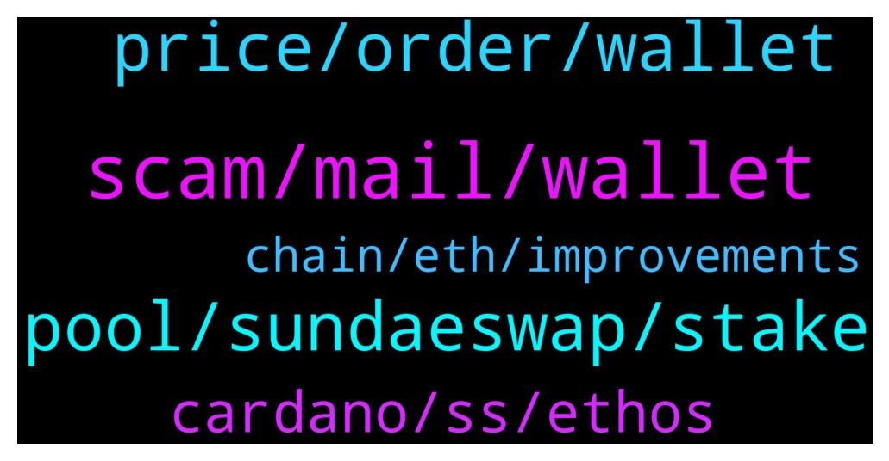

# **@Cardano**
 ## Analysis for **2022-01-24** - **2022-01-25**.

---

## 📊 **Basic Stats**

**n_messages_sent**: 88

---

---

## 🔝 **Top keywords and related messages**

1. **scam, mail, wallet**

    @Magi --- *I need help against a scammer who steal my whole Ada from binance with scam* **--->** [TG Discussion](https://t.me/Cardano/775167)

    @SeVen_AgoraNodes --- *You could also contact HashEX. They have recovered funds along with companies like CipherTrace in rare (usually large amounts big $ clients) occasions but the most they can is black list the scammer and coins so if they take them to a CEX they will get confiscated.* **--->** [TG Discussion](https://t.me/Cardano/775234)

    @glitch04 --- *If you send your funds they are gone* **--->** [TG Discussion](https://t.me/Cardano/775180)

    @jthomson1 --- *(By the way, beware of direct messages from scammers. Just  block them and reply in the group.)* **--->** [TG Discussion](https://t.me/Cardano/775093)

    @glitch04 --- *There are scammers here that will dm you and act as support or admins and try to steal your wallets if anyone dm's you please block and report the accounts.* **--->** [TG Discussion](https://t.me/Cardano/774867)

    @Ilirkicks --- *@Zyroxa Someone is using your name and picture to scam people on telegram* **--->** [TG Discussion](https://t.me/Cardano/774774)

2. **pool, sundaeswap, stake**

    @ChrisSTR8 --- *This is not a channel for sundaeswap support if you need help you should use their official discord https://discord.gg/Sundae* **--->** [TG Discussion](https://t.me/Cardano/774913)

    @walterdmw --- *What place or pool do you recommend for staking, I bought cardano for long term (i Will block dm)* **--->** [TG Discussion](https://t.me/Cardano/775026)

    @WhoisKaymind --- *how can i join in liquidity pool in sundaeswap anyone pls thnx* **--->** [TG Discussion](https://t.me/Cardano/774846)

    @gmark --- *Sure, Do you know when Hydra is, cause I cant tell?* **--->** [TG Discussion](https://t.me/Cardano/774799)

    @notPoetEnough --- *I'm a little late to the party but just want to confirm that Sundaeswap is pretty much completely unusuable right now, correct?* **--->** [TG Discussion](https://t.me/Cardano/774918)

    @Sasamihajlov --- *Can you recommend what pool to use for staking ada to get sundee* **--->** [TG Discussion](https://t.me/Cardano/775395)

3. **price, order, wallet**

    @FlamingElim --- *Hello. I want to ask about minswap. Can I ask in this forum ? Their twitter said minswap will be on testnet @25Jan. But I could see the MINt token listed already at sundaeswap dex. So is it tradeable right now ?* **--->** [TG Discussion](https://t.me/Cardano/774900)

    @Voorval --- *Hello Can someone help me?  When i want to swap on Sundeaswap and for example i want to buy Sundea for ada. When i swap the price is for example 0.85 cent. But when the transaction will complete and  the price of sundea drops to 0.79. Will the transaction do it on 0.79 or still for 0.85* **--->** [TG Discussion](https://t.me/Cardano/775401)

    @Apath00 --- *It says they processing orders from 1 day ago.. there might be some delays, should go to their discord.. or just use Musliswap* **--->** [TG Discussion](https://t.me/Cardano/774919)

    @Apath00 --- *Just go to Musliswap to get MIN and MINt 🥛* **--->** [TG Discussion](https://t.me/Cardano/774917)

    @Rkingx --- *i found the flaw in the system, my order is on Sundaeswap and the scoop status is: Price over limit so it hasnt processed and its waiting for becoming 0.18 cents again ...* **--->** [TG Discussion](https://t.me/Cardano/774770)

    @Bartleby --- *I use Namiwallet and cannot send or buy anything,no NFT,not on Sundaeswap,no transaction going through any more,not beautiful but am still glad to be there early.* **--->** [TG Discussion](https://t.me/Cardano/774769)

4. **cardano, ss, ethos**

    @gmark --- *Any updates/news how cardano team plan to address to fix this ‘3rd gen’, ‘peered reviewed network’ and not be congested - ‘it was a single Dex that launched’, so how we expect to sustain scalability? Does anyone feel we need an update as did not expect it to be this bad from my end?* **--->** [TG Discussion](https://t.me/Cardano/774793)

    @Lgbeano --- *Did you ever look at the roadmap?* **--->** [TG Discussion](https://t.me/Cardano/774797)

    @SXBlock101 --- *Very surprised the ADA price hasn't dunk through the floor as yet. It's not a good look for the cardano ecosystem especially with SS launch being hailed as a watershed moment for Cardano in DeFi. SS and Cardstarter have handled things poorly and with cFund being an investor in SS it reflects badly on them too.* **--->** [TG Discussion](https://t.me/Cardano/774921)

    @Reco --- *Seeking Cardano devs please dm me ASAP* **--->** [TG Discussion](https://t.me/Cardano/774877)

    @Reco --- *Are we allowed to share Cardano based projects here* **--->** [TG Discussion](https://t.me/Cardano/774835)

    @Lgbeano --- *Sol yeah I believe. It's not the fact it's a competitor, words quickly get added when they are shilled by bots in here. At some point there would have been multiple account joining this channel posting about Solana and shilling. It gets too much to handle that a bot needs to take over.   Unfortunetly this channel has seen the same with many cardano projects as well.* **--->** [TG Discussion](https://t.me/Cardano/774813)

5. **chain, eth, improvements**

    @CalusB --- *What embarrassment ? Chain is running great. It’s literally at max and I can send and receive transactions in minutes still. Even sundae swap transactions are reasonable still. And all at decent cost. Considering this is all done with almost no improvements it’s quite impressive* **--->** [TG Discussion](https://t.me/Cardano/774798)

    @Lgbeano --- *@CalusB : Once these improvements come in we can be sure even higher transaction volumes will at most be a mild inconvenience and not break the chain like Sol or the ridiculous fees in eth I have eth positions on chain I literally can’t unwind because it would cost more then it’s worth* **--->** [TG Discussion](https://t.me/Cardano/774805)

    @CalusB --- *Are you serious? Have you been living under a rock they have launched like 3 blog posts multiple videos and there are improvements coming in both the February hard fork and June hard fork as well as improvements in node and block size in the coming weeks* **--->** [TG Discussion](https://t.me/Cardano/774794)

    @CalusB --- *Wow this auto bot is kinda insane. Both our competitors have issues with super high volume either completely rendering the chain unusable or fees so high that it’s virtually unusable for regular transactions* **--->** [TG Discussion](https://t.me/Cardano/774802)

    @CalusB --- *Meh those are smoothbrains who are just using what they heard to promote fud reality is the chain is usable if slightly slow but things are getting through* **--->** [TG Discussion](https://t.me/Cardano/774807)

    @Deji --- *Question:. Can we please refer to Eth 2.0 as "The upgrade formerly known as Eth 2.0" rather than "The ETH consensus upgrade"?* **--->** [TG Discussion](https://t.me/Cardano/775412)

