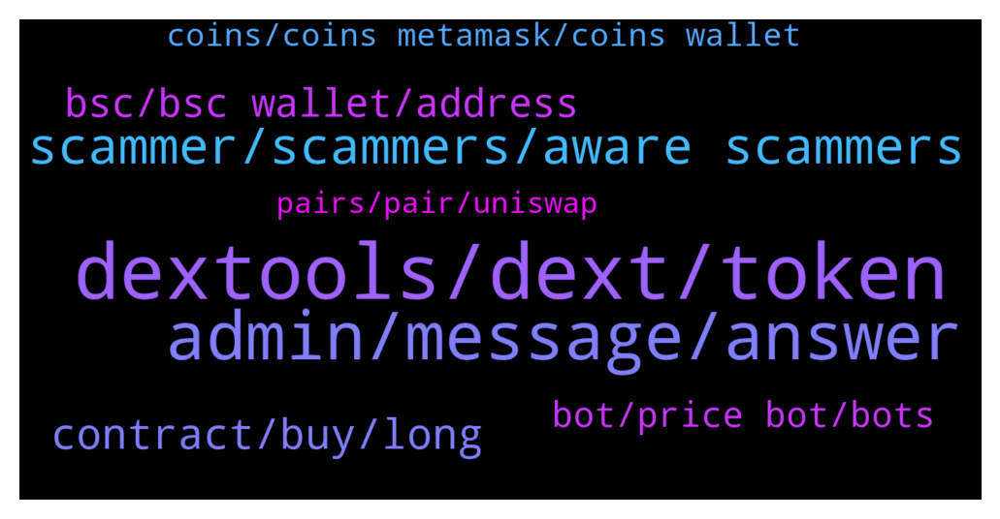

# **@DEXToolsCommunity**
 ## Analysis for **2022-01-23** - **2022-01-25**.

---

## 📊 **Basic Stats**

**n_messages_sent**: 259

---

---

## 🔝 **Top keywords and related messages**

1. **dextools, dext, token**

    @thorex30 --- *DEXT is available on matic too?* **--->** [TG Discussion](https://t.me/DEXToolsCommunity/328094)

    @Dannie970 --- *How do I apply for dextool trending?* **--->** [TG Discussion](https://t.me/DEXToolsCommunity/327922)

    @stanes --- *DEXT is a utility token. So holding DEXT gives you access to features. Check this page to have a look: https://www.dextools.io/#chooseyourplan* **--->** [TG Discussion](https://t.me/DEXToolsCommunity/327701)

    @badelelele --- *dexscreener grew their chains in lightspeed* **--->** [TG Discussion](https://t.me/DEXToolsCommunity/328440)

    @FredericDEXT --- *We have all the tokens listed on any supported DEX* **--->** [TG Discussion](https://t.me/DEXToolsCommunity/327792)

    @Bandolero1986 --- *If i launch a project how can i add the project to dextools and to have a dextools chart* **--->** [TG Discussion](https://t.me/DEXToolsCommunity/327944)

2. **admin, message, answer**

    @NikoDikooo --- *No worries. Take your time. I will provide a screenshot via DM if needed for accurate numbers et cetera. Going to sleep now since I live in Sweden. We’ll be in touch 🙏* **--->** [TG Discussion](https://t.me/DEXToolsCommunity/328186)

    @stanes --- *Just read the message above your 😉* **--->** [TG Discussion](https://t.me/DEXToolsCommunity/327759)

    @Jeoffrey_thewatcher --- *do you have any job vacancy for community moderator/manager?? i can manage both philippines community and english community.* **--->** [TG Discussion](https://t.me/DEXToolsCommunity/328551)

    @stanes --- *Ahah It's ok, now you know how to do it 👌 You are welcome 👍* **--->** [TG Discussion](https://t.me/DEXToolsCommunity/328637)

    @JoanJunior --- *Nope. I am suggesting you now, because I have a problem that needs your advice.* **--->** [TG Discussion](https://t.me/DEXToolsCommunity/327697)

    @hmk18990 --- *if you've any questions you can directly ask here in the group* **--->** [TG Discussion](https://t.me/DEXToolsCommunity/328313)

3. **scammer, scammers, aware scammers**

    @MoonstellarMoe --- *Also I have been scammed a lot by people claiming to be your workers really so I decided to come here and DYOR 😔* **--->** [TG Discussion](https://t.me/DEXToolsCommunity/327798)

    @stanes --- *This is a support channel, I prefer people here being aware scammers are around.* **--->** [TG Discussion](https://t.me/DEXToolsCommunity/328582)

    @bastardganpunk --- *no, he can’t, he’s a scammer* **--->** [TG Discussion](https://t.me/DEXToolsCommunity/327660)

    @stanes --- *I don't have any message from you. Be aware of scammers.* **--->** [TG Discussion](https://t.me/DEXToolsCommunity/327696)

    @pedrosfernandez --- *they ask me to accept on Meatamask what I did* **--->** [TG Discussion](https://t.me/DEXToolsCommunity/328607)

    @stanes --- *No sorry I don't understand why we should stop warning people of scammers.  This is not related to the app. I find your messages a bit concerning tbh, you just look like a scammer yourself 🤔* **--->** [TG Discussion](https://t.me/DEXToolsCommunity/328593)

4. **contract, buy, long**

    @pedrosfernandez --- *Hope this contract will stay for a long time because I Hodl all coins for long time* **--->** [TG Discussion](https://t.me/DEXToolsCommunity/328684)

    @pedrosfernandez --- *is it because of the old contract ?* **--->** [TG Discussion](https://t.me/DEXToolsCommunity/328650)

    @stanes --- *Yes. We don't have plan to change contract and even if it was the case you would get the new one automatically. You have to know no holder lost any money when we changed contract.* **--->** [TG Discussion](https://t.me/DEXToolsCommunity/328685)

    @BubblesTU --- *if you didn't buy to long ago you can still use the underlying liquidity to swap it back to the amount you used to buy.* **--->** [TG Discussion](https://t.me/DEXToolsCommunity/328664)

    @stanes --- *But don't expect getting more than few dollars as there is no liquidity left.* **--->** [TG Discussion](https://t.me/DEXToolsCommunity/328659)

    @BubblesTU --- *oh its okay we know that, our current TVL  is 35,037,691$  We started 4 days ago* **--->** [TG Discussion](https://t.me/DEXToolsCommunity/328404)

5. **bsc, bsc wallet, address**

    @gumbercules --- *lower fees on BSC but less decentralized chain* **--->** [TG Discussion](https://t.me/DEXToolsCommunity/327928)

    @pedrosfernandez --- *Could I user BSC too ?* **--->** [TG Discussion](https://t.me/DEXToolsCommunity/328589)

    @pedrosfernandez --- *Oh I have it on BSC wallet* **--->** [TG Discussion](https://t.me/DEXToolsCommunity/328628)

    @bastardganpunk --- *No, it’s on bsc and eth* **--->** [TG Discussion](https://t.me/DEXToolsCommunity/328096)

    @Snodes88 --- *I couldn't find the bsc contract address on cmc* **--->** [TG Discussion](https://t.me/DEXToolsCommunity/327887)

    @stanes --- *We are currently experiencing some issue with few BSC pairs. Devs are already on it and it will be fixed asap. Thank you for your patience 🙏* **--->** [TG Discussion](https://t.me/DEXToolsCommunity/327757)

6. **bot, price bot, bots**

    @Asaprox --- *as for "bots", are there any pre-set bots?* **--->** [TG Discussion](https://t.me/DEXToolsCommunity/328039)

    @louisparallel --- *How can i config the Price Bot showing Marketcap ?* **--->** [TG Discussion](https://t.me/DEXToolsCommunity/327681)

    @memeape1 --- *so when btc drops dex new pairs bot doesnt work?* **--->** [TG Discussion](https://t.me/DEXToolsCommunity/327861)

    @TK1337 --- *dext new pairs bot not working anymore?* **--->** [TG Discussion](https://t.me/DEXToolsCommunity/327599)

    @stanes --- *Bots are for setting your own limit orders.* **--->** [TG Discussion](https://t.me/DEXToolsCommunity/328040)

    @gumbercules --- *ah you're talking about the bot* **--->** [TG Discussion](https://t.me/DEXToolsCommunity/327863)

7. **coins, coins metamask, coins wallet**

    @pedrosfernandez --- *Here is the transactions : https://bscscan.com/tx/0xef29ced18791cce8501f7ccc99181a58c1d32808da6e7c4a7151dfa53c1b7ead https://bscscan.com/tx/0x0e6c4a1b0a1e8f4509b7a3ecd2e20937f8735e606bfb1c21f9b418113b52354d https://bscscan.com/tx/0x044e65b49893f68184444800ac88721cdbccc0ac8b84850fb2b0035e1f399a41* **--->** [TG Discussion](https://t.me/DEXToolsCommunity/328556)

    @pedrosfernandez --- *I click on the Metamask Icon but still don't have any coins* **--->** [TG Discussion](https://t.me/DEXToolsCommunity/328595)

    @pedrosfernandez --- *I lost this coins then ?* **--->** [TG Discussion](https://t.me/DEXToolsCommunity/328652)

    @stanes --- *I already helped you, the coins are in your wallet.* **--->** [TG Discussion](https://t.me/DEXToolsCommunity/328577)

    @stanes --- *If your pb is you can't see the coins on your Metamask, click here on the pair page.* **--->** [TG Discussion](https://t.me/DEXToolsCommunity/328558)

    @stanes --- *What is your issue with these tx? Coins are in your wallet.* **--->** [TG Discussion](https://t.me/DEXToolsCommunity/328557)

