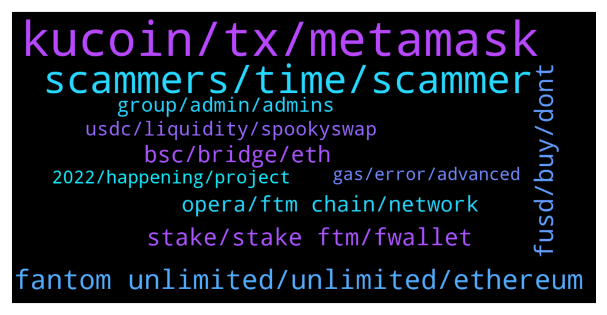

# **@Fantom_English**
 ## Analysis for **2022-01-24** - **2022-01-25**.

---

## 📊 **Basic Stats**

**n_messages_sent**: 319

---

---

## 🔝 **Top keywords and related messages**

1. **kucoin, tx, metamask**

    @nat_nat2525 --- *Ahhh. That’s the problem. Kucoin runs on the eth chain. You’ve probably lost it all in the transfer. Contact kucoin support. But I believe that is the problem.* **--->** [TG Discussion](https://t.me/Fantom_English/640823)

    @Hard Money --- *Need some help.  Bridged ETH USDT to Fantom and now hold fUSDT. Trying to buy FTM on Spooky. I use metamask with Ledger. Each time I try to approve the use of my fUSDT I go through the steps I'm told to through but never get the "review transaction" screen on ledger. I've done this hundreds of times on other chains. Anyone have any idea what's going on? Scammers, don't bother DM'ing, you'll be blocked.* **--->** [TG Discussion](https://t.me/Fantom_English/639899)

    @Janevietani --- *check your tx hash on ftmscan.com , if success , contact Kucoin support and send tx hash to them* **--->** [TG Discussion](https://t.me/Fantom_English/641566)

    @CoffCapital --- *anyone know what's going on with Kucoin?  Trying to w/d and it says "address unavailable."* **--->** [TG Discussion](https://t.me/Fantom_English/641181)

    @Mcjig --- *kucoin has withdraws suspended at this time* **--->** [TG Discussion](https://t.me/Fantom_English/640088)

    @Mcjig --- *kucoin only has 10 ftm in their wallet. so you need to contact kucoin support* **--->** [TG Discussion](https://t.me/Fantom_English/640720)

2. **scammers, time, scammer**

    @Deviant --- *New record - 6 scammers DM'd me after previous message* **--->** [TG Discussion](https://t.me/Fantom_English/640444)

    @vlaadutsz --- *These people have no shame, trying to prey on the newbies. That's why i barely use telegram, too many clown scammers rofl. DM me now you clowns :))) provide support* **--->** [TG Discussion](https://t.me/Fantom_English/640449)

    @DefiYoda --- *keep sending me messages scammers, so I know who to block* **--->** [TG Discussion](https://t.me/Fantom_English/639924)

    @Deviant --- *Made sure to waste their time nicely* **--->** [TG Discussion](https://t.me/Fantom_English/640450)

    @Aghori_S --- *So you guys treat say the same things to all the Venture capitalists out there, maybe try treating everyone equal* **--->** [TG Discussion](https://t.me/Fantom_English/640534)

    @Deviant --- *and literally 4.,5 hours later two more scammers try their luck. That's 8 now* **--->** [TG Discussion](https://t.me/Fantom_English/640668)

3. **fantom unlimited, unlimited, ethereum**

    @Ikos --- *Well done Fantom team 👍🏻that’s insane* **--->** [TG Discussion](https://t.me/Fantom_English/639770)

    @Ambiora --- *😂😂 But that's not true in case of Fantom. It's really undervalued my dear friend* **--->** [TG Discussion](https://t.me/Fantom_English/639818)

    @Dolph --- *What is the best place to get fantom? Having trouble getting it from okex to metamask* **--->** [TG Discussion](https://t.me/Fantom_English/641068)

    @jobklarenbeek --- *Hi,  I got fantom bep2 in my trust wallet. Any tips how to get them in liquid driver??  Bought fantom erc20 in coinbase, send them to trust wallet. Could not connect to liquid driver. Changed them to fantom bep2. Also does not work. Getting totally lost here🙈🤷‍♂️* **--->** [TG Discussion](https://t.me/Fantom_English/640367)

    @Tilkesh --- *Can fantom give good return in future??* **--->** [TG Discussion](https://t.me/Fantom_English/641121)

    @squareeyez --- *I cant seem to swap some UST on Fantom / Metamask I received. Any suggestions on how to swap it for Fantom? I've tried so many Swappers I'm losing track. 👍* **--->** [TG Discussion](https://t.me/Fantom_English/641343)

4. **fusd, buy, dont**

    @okidanok --- *so, no need to buy fusd* **--->** [TG Discussion](https://t.me/Fantom_English/640629)

    @T --- *I’m sure a lot people gonna fomo 10 dollar* **--->** [TG Discussion](https://t.me/Fantom_English/640510)

    @LunaBull --- *Was gonna take fusd and conver to UST and earn 20% on anchor on terra* **--->** [TG Discussion](https://t.me/Fantom_English/640107)

    @Mcjig --- *if you dont feel comfortable then dont do it* **--->** [TG Discussion](https://t.me/Fantom_English/640521)

    @zenkert --- *Every coin/project fan thinks it's undervalued 😂* **--->** [TG Discussion](https://t.me/Fantom_English/639812)

    @Ambiora --- *But it's too undervalued from price perspective😢* **--->** [TG Discussion](https://t.me/Fantom_English/639807)

5. **stake, stake ftm, fwallet**

    @FlorinGavrilescu --- *Hi all. Just a question,I have some different projects,is there a way to stake/farm all together or I have to do for each one on their site. eg. treeb,beets,brush..* **--->** [TG Discussion](https://t.me/Fantom_English/639972)

    @KaueBistriche --- *i'm trying to stake in fWallet. it says i dont have balance, but i have then in my metamask. Already connected my metamask to the fWallet. What can i do?* **--->** [TG Discussion](https://t.me/Fantom_English/640682)

    @vlaadutsz --- *Same when i asked about staking earlier* **--->** [TG Discussion](https://t.me/Fantom_English/640447)

    @M --- *Anyone know where i can discuss tarot?* **--->** [TG Discussion](https://t.me/Fantom_English/640358)

    @vlaadutsz --- *Hey guys! How can you stake ftm? What’s the best option? Newbie here, thanks!* **--->** [TG Discussion](https://t.me/Fantom_English/640303)

    @CoffCapital --- *are there any other places to stake besides fwallet?  I can't get my tokens to show up on this wallet* **--->** [TG Discussion](https://t.me/Fantom_English/640346)

6. **bsc, bridge, eth**

    @Diego --- *Guys, how to bridge FTM from BSC to Fantom?* **--->** [TG Discussion](https://t.me/Fantom_English/640980)

    @T Tom --- *yes...i stuck at approve bsc usdc .was trying to bridge from bsc usdc to ftm* **--->** [TG Discussion](https://t.me/Fantom_English/640244)

    @AaH2o --- *What's the cheapest bridge from ETH to FTM?* **--->** [TG Discussion](https://t.me/Fantom_English/640080)

    @Neringakriziute --- *Guys, how to bridge FTM from BSC to Fantom?* **--->** [TG Discussion](https://t.me/Fantom_English/640997)

    @Janevietani --- *Helpful tip:   if you want a cheaper alternative than bridging ftm and paying eth gas From binance(US) ,crypto.com or kucoin, get BNB and withdraw as BNB BEP20, then use https://spookyswap.finance/bridge To bridge BNB BEP20 to BNB Fantom Then use spookyswap to swap BNB Fantom to FTM  You will need ftm gas for transaction. Use the faucet https://www.mentasuave01-tools.com/* **--->** [TG Discussion](https://t.me/Fantom_English/641201)

    @T Tom --- *hi all, can i directly bridge my bsc usdc to fantom use spookyswap?* **--->** [TG Discussion](https://t.me/Fantom_English/640158)

7. **opera, ftm chain, network**

    @Cryptopratz --- *I choose ftm network to deposit* **--->** [TG Discussion](https://t.me/Fantom_English/641564)

    @g_xarkon --- *hello,can i directly withdraw FTM from binance to my metamask fantom opera network?* **--->** [TG Discussion](https://t.me/Fantom_English/640262)

    @Janevietani --- *you can check it on ftmscan* **--->** [TG Discussion](https://t.me/Fantom_English/641272)

    @r5ive --- *hi guys i want to collaterise my FTM for stablecoins but on avax network  does anybody know what would h the easiest way* **--->** [TG Discussion](https://t.me/Fantom_English/641275)

    @pajamasfreak --- *if you are referring to usdt on ftm mainnet, definitely.* **--->** [TG Discussion](https://t.me/Fantom_English/641038)

    @Czero_C --- *easiest way to receive FTM on ftm chain in a new wallet without owning FTM prior and also not using a CEX? Synapse and AnySwap doesn't allow FTM taker.* **--->** [TG Discussion](https://t.me/Fantom_English/640843)

8. **group, admin, admins**

    @NFT for Metaverse --- *Hi guys! any admin or Dev i can dm? Thank you!* **--->** [TG Discussion](https://t.me/Fantom_English/641462)

    @pajamasfreak --- *We don’t have that group, sorry* **--->** [TG Discussion](https://t.me/Fantom_English/641390)

    @GEMUni - Official Com..... --- *I'm having issues with joining the discord group* **--->** [TG Discussion](https://t.me/Fantom_English/640631)

    @Johnnyfantom --- *Just keep in mind who the admins here are* **--->** [TG Discussion](https://t.me/Fantom_English/640780)

    @Chip --- *In another group I'm in they tried to Dm the admin ..... while using that same admin's name/pic* **--->** [TG Discussion](https://t.me/Fantom_English/640710)

    @Alex_Tradin --- *Sorry to disturb Pls who is the admin  I want to chat with him privately* **--->** [TG Discussion](https://t.me/Fantom_English/640548)

9. **usdc, liquidity, spookyswap**

    @Deswiffer --- *Ok, so I used the bridge from spiritswap and it seems I received anyUSDC and not USDC* **--->** [TG Discussion](https://t.me/Fantom_English/640122)

    @marcel9401 --- *ok thx, so swapping USDT should work better* **--->** [TG Discussion](https://t.me/Fantom_English/641037)

    @Reid --- *Hey there! Anyone have any experience using spookyswap and can tell me the approximate fees for wrapping and bridging eth to native FTM?* **--->** [TG Discussion](https://t.me/Fantom_English/641190)

    @pajamasfreak --- *Go to https://app.multichain.org/#/pool , check usdc pool and swap to chain you prefer* **--->** [TG Discussion](https://t.me/Fantom_English/640126)

    @BornEvilDope --- *Swap usdc it has deeper liquidity* **--->** [TG Discussion](https://t.me/Fantom_English/640985)

    @Wijaya0007 --- *Any idea why error can occur when swapping on spookyswap?   Swap failed: Network Error  Try raising slippage* **--->** [TG Discussion](https://t.me/Fantom_English/640183)

10. **2022, happening, project**

    @The_Kaiser9 --- *Hi there where do I find out about projects launching on FTM? Twitter only? Or is there a telegram?* **--->** [TG Discussion](https://t.me/Fantom_English/639766)

    @T --- *Ftm to the moon to the top 10* **--->** [TG Discussion](https://t.me/Fantom_English/641288)

    @matteonegri --- *Hello guys where i can learn about ftm ecosystem and white paper? It would appreciate if you could help me diving deep in this amazing project* **--->** [TG Discussion](https://t.me/Fantom_English/639767)

    @pajamasfreak --- *Only left with 277 ftm tho, beware* **--->** [TG Discussion](https://t.me/Fantom_English/640982)

    @Niraj --- *I am new in this group... can you tell what can be the APROX price of FTM by 2022 end?* **--->** [TG Discussion](https://t.me/Fantom_English/641231)

    @h_n0828 --- *does FTM has a new roadmap in 2022?* **--->** [TG Discussion](https://t.me/Fantom_English/640951)

