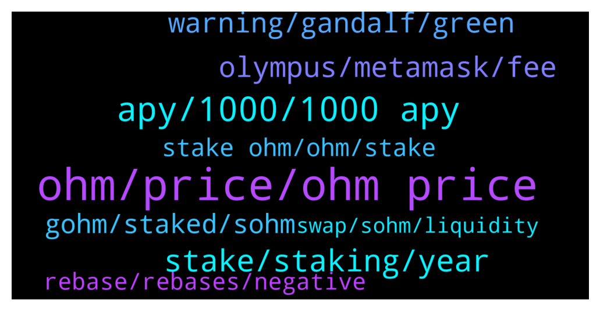

# **@OlympusTG**
 ## Analysis for **2022-01-24** - **2022-01-25**.

---

## 📊 **Basic Stats**

**n_messages_sent**: 1100

---

---

## 🔝 **Top keywords and related messages**

1. **ohm, price, ohm price**

    @Sebastian --- *There is no hope for OHM with mathematicians like you... loosing 90% means he bought OHM for about 700$* **--->** [TG Discussion](https://t.me/OlympusTG/168025)

    @VincentStatic --- *No. I still love Ohm. But its not perfect* **--->** [TG Discussion](https://t.me/OlympusTG/167288)

    @steveyh --- *I'll buy all the ohm u have, at $10 once we reach there* **--->** [TG Discussion](https://t.me/OlympusTG/168052)

    @B --- *And Why is sohm so Crazy down? WHO sell ohm? I dont Unterstand This shit 😅* **--->** [TG Discussion](https://t.me/OlympusTG/167263)

    @nfwaple --- *that's why I wanted to send my brother some OHM as well* **--->** [TG Discussion](https://t.me/OlympusTG/168976)

    @Sebastian --- *Ohm backing was over 110 3 weeks ago...* **--->** [TG Discussion](https://t.me/OlympusTG/167476)

2. **apy, 1000, 1000 apy**

    @CryptoAlex1 --- *Why is the APY dropping everyday and so fast?* **--->** [TG Discussion](https://t.me/OlympusTG/169221)

    @Sebastian --- *1000% Apy from 1$ is 2.4$ ....* **--->** [TG Discussion](https://t.me/OlympusTG/167519)

    @vladdevelop --- *have you calculate your rekt APY already?* **--->** [TG Discussion](https://t.me/OlympusTG/167517)

    @SMNFT7 --- *Guys what is the new APY goal? What is the APY % it aims to drop to?* **--->** [TG Discussion](https://t.me/OlympusTG/167299)

    @SAJ000111 --- *No Incentives can be multi dimensional rather than just APY* **--->** [TG Discussion](https://t.me/OlympusTG/167320)

    @Marco --- *And if APY is lower, less people will buy OHM* **--->** [TG Discussion](https://t.me/OlympusTG/169232)

3. **stake, staking, year**

    @satoshi_whale --- *Great. So it is associated with the staking time which means it changes for each user based on when they staked. This should be a gold mine for the early investors. Ofc price plays a factor too* **--->** [TG Discussion](https://t.me/OlympusTG/167759)

    @SMNFT7 --- *Check the calculations, if you stake at let’s say 27 OHM at $60 ($1.600 initial investment)at a 0.22% APY each rebase for a whole year (365 days) you would still make around 18K by then if price doesn’t recover* **--->** [TG Discussion](https://t.me/OlympusTG/167358)

    @Host_Matt --- *enter app, connect metamask, under dashboard you'll see stake* **--->** [TG Discussion](https://t.me/OlympusTG/169590)

    @alex --- *I staked 1 now I got 3 🤣🤣🤣🤣* **--->** [TG Discussion](https://t.me/OlympusTG/168124)

    @RuneMilc --- *Should I buy now and stake? R/R is crazy imo* **--->** [TG Discussion](https://t.me/OlympusTG/168166)

    @noexec --- *Just go there and u will find a stake page* **--->** [TG Discussion](https://t.me/OlympusTG/169585)

4. **olympus, metamask, fee**

    @Host_Matt --- *500+ this year but maybe thats fud, Topy says Olympus $1000 soon* **--->** [TG Discussion](https://t.me/OlympusTG/167274)

    @vipdent --- *I don’t intend in investing anymore for now in Olympus   Let’s see how it goes* **--->** [TG Discussion](https://t.me/OlympusTG/168929)

    @vipdent --- *I bought on Friday at $70  Totally newbie with Ohm and staking etc  ( I have some other cryptos but all in wallet ).   Very easy - once you have done it :-)  Transfer money to an exchange ( I use Binance but any big exchange will do).   Open a MetaMask account.  ( chrome extension or phone app).  Write down your 12 words.  ( do not share with anyone - ever).   In your exchange buy ETH with your currency.  Withdraw all the ETH to the address from MetaMask  ( the blue long address).   After 2-3 minutes the ETH appear in MetaMask.   Go to Olympus.finance  Click ( tap) enter app Then click wallet.  Then get on sushiswap or get on uniswap.  ( sushiswap didn’t work for me.  Transaction timed out 3 times.  So I used uniswap).   In uniswap, tap on connect wallet.   Go back to MetaMask.  It should ask you if you want to connect.  There is a small gas fee.  Click accept.  ( in my case nothing happened.  I had to close MetaMask.  Open it again - and then the window appeared)  Now uniswap ( or sushiswap) can see your wallet.  Select “from “ ETH.  It will show you your ETH balance.  Select “TO” ohm v2  Do not select MAX.  I did this mistake.  Leave £15 ( $20) for gas fees.  I had to transfer again.  I didn’t have enough for the bloody gas fees.   And convert to ohm v2.   Now import the token ohm.  Address of ohm can be found on their DOCs. Their website.   https://docs.olympusdao.finance/main/contracts/tokens  You need ohm v2.  Somewhere in the middle.   Add this token in MetaMask.  Your balance will appear.  I also added sohm and gohm in MetaMask wallet.  All addresses from their website above.   Then go to Olympus.  Tap wallet.  Connect.  Go back to MetaMask to approve the connection.  ( in my case didn’t work again. Close MetaMask. Open it again.  The window appears.  Approve connection. )  Now you can stake.  Max.  I chose sOHM.   Again you need to approve it in MetaMask.  There are again gas fees :(  That’s it.   Good luck.   It took me 4-5 hours to do it.  I feel you.   If any issues, reply here.* **--->** [TG Discussion](https://t.me/OlympusTG/168905)

    @BROHMZ --- *When the market bounces back and the bulls are back in town Olympus will go back to proper mcap because it isnt going anywhere but up once this bear sentiment is over and done with* **--->** [TG Discussion](https://t.me/OlympusTG/167267)

    @RecoDedon --- *Olympus is amazing. Just read the documentation. It's crazy. I will definitely buy at around 60 USD!* **--->** [TG Discussion](https://t.me/OlympusTG/167668)

    @nfwaple --- *no, reserve currency expands in supply, Olympus will still be a DAO* **--->** [TG Discussion](https://t.me/OlympusTG/169092)

5. **warning, gandalf, green**

    @Ap0l1o --- *Want me to be your niece as well :)* **--->** [TG Discussion](https://t.me/OlympusTG/168960)

    @cryptomemo57 --- *GL to you my friend ...* **--->** [TG Discussion](https://t.me/OlympusTG/168641)

    @bike4peace --- *YOU ALL SHOULD WATCH THIS VIDEO* **--->** [TG Discussion](https://t.me/OlympusTG/168574)

    @steveyh --- *That u need to acknowledge realities* **--->** [TG Discussion](https://t.me/OlympusTG/168226)

    @Kellydiana86 --- *Why has to be this way!* **--->** [TG Discussion](https://t.me/OlympusTG/169414)

    @ccryii --- *Me too . Fuck the world* **--->** [TG Discussion](https://t.me/OlympusTG/169416)

6. **gohm, staked, sohm**

    @nfwaple --- *gOHM is already staked, no need to do anything* **--->** [TG Discussion](https://t.me/OlympusTG/167817)

    @OGCryptoo --- *You do not need to stake gohm* **--->** [TG Discussion](https://t.me/OlympusTG/168787)

    @jejesabis --- *but I can see the option to stake gOHM and sOHM* **--->** [TG Discussion](https://t.me/OlympusTG/169588)

    @nfwaple --- *yes, you can go to the stake page and see your gOHM staked there afterward, you can also get gOHM from another chain* **--->** [TG Discussion](https://t.me/OlympusTG/167819)

    @Senddooz --- *i have converted finally from v1 to gOhm, now i have a certain amount of gOhm, and certain amount staked sOhm, is that correct?* **--->** [TG Discussion](https://t.me/OlympusTG/169476)

    @Ap0l1o --- *V2 migration is completed, so the voting should be only with gOhm* **--->** [TG Discussion](https://t.me/OlympusTG/168875)

7. **stake ohm, ohm, stake**

    @nfwaple --- *or get OHM v2 and stake* **--->** [TG Discussion](https://t.me/OlympusTG/169274)

    @RecoDedon --- *How can I buy and stake ohm the easiest and cheapest way?* **--->** [TG Discussion](https://t.me/OlympusTG/168886)

    @merovcapital --- *i thought ohm staking was only on eth chain* **--->** [TG Discussion](https://t.me/OlympusTG/167656)

    @nfwaple --- *if you get OHM you need to stake on the website* **--->** [TG Discussion](https://t.me/OlympusTG/167816)

    @Twinkieboy333 --- *Link to where I would stake my ohm via meta mask plz and ty :)* **--->** [TG Discussion](https://t.me/OlympusTG/167718)

    @Damar --- *Want to staked more ohm..can i* **--->** [TG Discussion](https://t.me/OlympusTG/169272)

8. **rebase, rebases, negative**

    @Cixex --- *Go for tokens that rebase faster.  8hr rebase is too long* **--->** [TG Discussion](https://t.me/OlympusTG/169531)

    @vladdevelop --- *where they are falling every rebase* **--->** [TG Discussion](https://t.me/OlympusTG/167522)

    @satoshi_whale --- *If it only still stays in positive rebase** **--->** [TG Discussion](https://t.me/OlympusTG/167777)

    @SecuriTech24 --- *No roadmaps now, no profit calculators, no way to see what the next rebase amount will be or what time, just to name a few things* **--->** [TG Discussion](https://t.me/OlympusTG/167926)

    @nfwaple --- *yea observe it for a few rebases, if you still have any questions you cna ask here* **--->** [TG Discussion](https://t.me/OlympusTG/168856)

    @Cixex --- *The 8hrs rebase is too poor for me* **--->** [TG Discussion](https://t.me/OlympusTG/167383)

