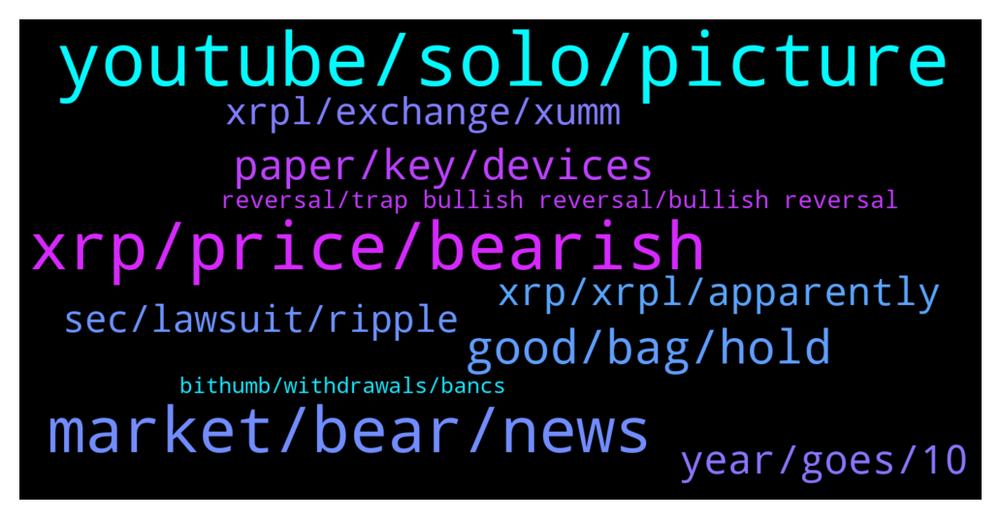

# **@Ripple**
 ## Analysis for **2022-01-24** - **2022-01-25**.

---

## 📊 **Basic Stats**

**n_messages_sent**: 319

---

---

## 🔝 **Top keywords and related messages**

1. **youtube, solo, picture**

    @Tinkabellagal --- *There is another better one I’ll find* **--->** [TG Discussion](https://t.me/Ripple/3045353)

    @Check10Check11 --- *You requested me to get a public profile pic so i now have one.* **--->** [TG Discussion](https://t.me/Ripple/3045873)

    @marianmp --- *You tube is a shyty place to receive infos sometimes* **--->** [TG Discussion](https://t.me/Ripple/3045470)

    @Yagiz342935 --- *I will look on youtube thanks* **--->** [TG Discussion](https://t.me/Ripple/3045351)

    @ibnusob666 --- *Lol , i dont know how to respon this* **--->** [TG Discussion](https://t.me/Ripple/3045781)

    @Yagiz342935 --- *i've been there too but nobody knows much about xumm* **--->** [TG Discussion](https://t.me/Ripple/3045350)

2. **xrp, price, bearish**

    @ibnusob666 --- *Wondering XRP will going above $5 😇* **--->** [TG Discussion](https://t.me/Ripple/3045422)

    @Chinoe14 --- *I'm feeling bullish about xrp but all this news making me feel like selling my load but I'm not going to sell it, I'm in it for the long term* **--->** [TG Discussion](https://t.me/Ripple/3044784)

    @xuavin --- *Good news that XRP will goes pass $5. But the bad news is not still 2025* **--->** [TG Discussion](https://t.me/Ripple/3045621)

    @Papayapapa --- *When is next date for xrp v sec* **--->** [TG Discussion](https://t.me/Ripple/3045016)

    @TheBlurryBat --- *I just went ahead and bought more xrp!* **--->** [TG Discussion](https://t.me/Ripple/3045157)

    @zurik86 --- *YouTube says that after the trial xrp will cost two thousand dollars.* **--->** [TG Discussion](https://t.me/Ripple/3045438)

3. **market, bear, news**

    @gerrymchugh --- *I'm not selling either, bear markets dont bother me as I'm not day or swing trading 👍* **--->** [TG Discussion](https://t.me/Ripple/3044786)

    @Kbron123 --- *By how thing are going when do you expect Bitcoin to recover?* **--->** [TG Discussion](https://t.me/Ripple/3045216)

    @Jakes1993 --- *Do you think price will drop soon again? Any bad news out there?* **--->** [TG Discussion](https://t.me/Ripple/3045722)

    @reaper00X1Chr --- *It's 50% down from ath.. bear enough .. investors increased crypto got known still we hitting fig of 17-20 that's messed* **--->** [TG Discussion](https://t.me/Ripple/3044778)

    @arunmaster --- *My god.. Stock market again crashing guys. Nifty 200 points down. Getting afraid of reaction of BTC* **--->** [TG Discussion](https://t.me/Ripple/3045037)

    @Jaiya --- *We just flipped Solana in market cap - now #7, next victim is ADA 😎* **--->** [TG Discussion](https://t.me/Ripple/3045050)

4. **good, bag, hold**

    @Ekkimukk10 --- *Loaded up a bit more yesterday. Never feel like it's enough* **--->** [TG Discussion](https://t.me/Ripple/3044847)

    @ReiTeh --- *I am just honestly too lazy to do anything about my bags. Just hold I guess. 🤷‍♂* **--->** [TG Discussion](https://t.me/Ripple/3045404)

    @Voltaire123 --- *Or leverage down if you have the balls.* **--->** [TG Discussion](https://t.me/Ripple/3044803)

    @Martijndelange --- *Did you guys buy more or wait on a even bigger crash?* **--->** [TG Discussion](https://t.me/Ripple/3044928)

    @Gareth --- *Yea so buy more or just hang in there* **--->** [TG Discussion](https://t.me/Ripple/3045228)

    @GULUacityinUganda --- *keep buying whenever i can, i am just dollar cost averaging* **--->** [TG Discussion](https://t.me/Ripple/3044930)

5. **paper, key, devices**

    @Cataneo02 --- *Well in that case paper back is the best choice the divice is just an extra lil tool* **--->** [TG Discussion](https://t.me/Ripple/3045914)

    @Cataneo02 --- *Those electric divices are not secure imo it's like a phone it could just not turn on all of a sudden for no reason* **--->** [TG Discussion](https://t.me/Ripple/3045910)

    @Moxie662 --- *No with a paper wallet you have to input keys* **--->** [TG Discussion](https://t.me/Ripple/3045925)

    @Cataneo02 --- *Iva had USB drive not work for no reason but I get your point because u can store all type of tokens on devise* **--->** [TG Discussion](https://t.me/Ripple/3045921)

    @Moxie662 --- *You do not understand how these devices work. Never use paper as a backup* **--->** [TG Discussion](https://t.me/Ripple/3045919)

    @anuj90322 --- *But u also have paper backup for those devices so why is device failure a problem* **--->** [TG Discussion](https://t.me/Ripple/3045912)

6. **year, goes, 10**

    @CARXVV --- *5 cents really? I hope we get clarity before that and can get to 10 15usd* **--->** [TG Discussion](https://t.me/Ripple/3044872)

    @ReiTeh --- *We have all been there. Bought mine at 1.60 as I was a new then* **--->** [TG Discussion](https://t.me/Ripple/3045852)

    @Russty007 --- *It will atleast quadruple from here if you keep it for a year... I know for crypto it don’t seem much but hey ! Still more than we make on our 8-5* **--->** [TG Discussion](https://t.me/Ripple/3045243)

    @XV --- *transactions would be far too expensive in market terms otherwise* **--->** [TG Discussion](https://t.me/Ripple/3045133)

    @XV --- *like david said, it CAN'T be dirt cheap* **--->** [TG Discussion](https://t.me/Ripple/3045132)

    @CallanF --- *But im also sure that the saudi empire could just sweep through one day and buy the lot ... at premium prices... and be unphased. Unlimited cash they have..* **--->** [TG Discussion](https://t.me/Ripple/3045091)

7. **xrp, xrpl, apparently**

    @pdogg123 --- *Apparently you must be new to xrp then.* **--->** [TG Discussion](https://t.me/Ripple/3045633)

    @Tinkabellagal --- *No It tells you about multiple uses of xrpl* **--->** [TG Discussion](https://t.me/Ripple/3045361)

    @tijarist36 --- *Xrp will go to the mooooonnnn* **--->** [TG Discussion](https://t.me/Ripple/3044919)

    @pdogg123 --- *Come on xrp it time let’s go* **--->** [TG Discussion](https://t.me/Ripple/3045796)

    @Russty007 --- *What’s your favorite non-hyped YouTubers for XRP* **--->** [TG Discussion](https://t.me/Ripple/3045686)

    @DGCRYPTO12 --- *Xrp has more than most lol* **--->** [TG Discussion](https://t.me/Ripple/3045452)

8. **sec, lawsuit, ripple**

    @Cointh88 --- *XRP community baffled as Ripple loses another 3 weeks amid SEC’s 180º on Hinman’s speech  The plaintiff has made a 180º turn by suggesting that the speech wasn’t merely peripheral to actual policy formulation”, but was in fact an “essential link” in the SEC’s deliberative process with respect to Ether” and other digital assets.   https://financefeeds.com/xrp-community-baffled-ripple-loses-another-3-weeks-amid-secs-180o-hinmans-speech/* **--->** [TG Discussion](https://t.me/Ripple/3045814)

    @pdogg123 --- *Really !!!  There a little thing called a lawsuit filed against them* **--->** [TG Discussion](https://t.me/Ripple/3045872)

    @Jake_ripple_XRP --- *Sounds like perjury? What is the judge to think about the SEC saying Hinman speech is peripheral to actual policy formulation - and then saying it was an "essential link" in the SEC's deliberative process with respect to other digital assets?* **--->** [TG Discussion](https://t.me/Ripple/3045838)

    @Nem --- *When I’m old: Sec and ripple still in lawsuit.* **--->** [TG Discussion](https://t.me/Ripple/3045682)

    @XRP_Saitama --- *Regulations will be this year. SEC case ends this year. If ripple wins or settles we’ll see a reversal* **--->** [TG Discussion](https://t.me/Ripple/3045229)

    @XV --- *i personally feel like this shit is embarrassing as a us citizen, what my country's government is doing to halt technological progress in such a cheap and underhanded way with this lawsuit* **--->** [TG Discussion](https://t.me/Ripple/3045139)

9. **xrpl, exchange, xumm**

    @Tinkabellagal --- *You can connect XUMM to decentralised exchange There are many tokens on xrpl  https://t.me/Ripple/3045355* **--->** [TG Discussion](https://t.me/Ripple/3045367)

    @Yagiz342935 --- *Hello everyone, are there mstaverse or nft coins on the xrp network?  If someone knows if I can get it from the Xumm wallet, I would be very grateful.* **--->** [TG Discussion](https://t.me/Ripple/3045324)

    @Yagiz342935 --- *I opened an account and sent some xrp, but now I'm trying to learn.  I'm doing research on what I can do.  There are only 15 available coins that I have seen.* **--->** [TG Discussion](https://t.me/Ripple/3045362)

    @Tinkabellagal --- *Connect XUMM to xrptoolkit to access xrpl decentralised exchange  How to use xrpl dex  https://m.youtube.com/watch?v=MivQ6SWRGXo* **--->** [TG Discussion](https://t.me/Ripple/3045355)

    @jajacode --- *Good evening, who developed the airdrop, can you help? The problem is that I made a bot, it drops only XRP, and there i need to change it to my coin. How can i do that&* **--->** [TG Discussion](https://t.me/Ripple/3045586)

    @Tinkabellagal --- *Our recommended wallets are in message 1  You can access the decentralised xrpl exchange via xrptoolkit using D’Cent* **--->** [TG Discussion](https://t.me/Ripple/3045381)

10. **reversal, trap bullish reversal, bullish reversal**

    @Emmanuel1612 --- *Is this real or seems like an altered chart* **--->** [TG Discussion](https://t.me/Ripple/3045823)

    @ibnusob666 --- *It will be long bullrun after the fake one* **--->** [TG Discussion](https://t.me/Ripple/3045782)

    @RyanHopp --- *I think it's a bull trap* **--->** [TG Discussion](https://t.me/Ripple/3045572)

    @XRP_Saitama --- *Not a bullish reversal this is a trap* **--->** [TG Discussion](https://t.me/Ripple/3045479)

    @CARXVV --- *Who knows, but this pantomime has no name.* **--->** [TG Discussion](https://t.me/Ripple/3045866)

    @marianmp --- *Is this a reversal or this is a reversal???* **--->** [TG Discussion](https://t.me/Ripple/3045462)

