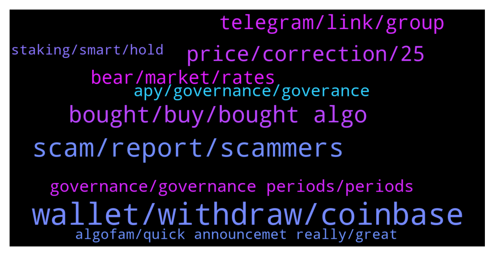

# **@algorand**
 ## Analysis for **2022-01-24** - **2022-01-25**.

---

## 📊 **Basic Stats**

**n_messages_sent**: 191

---

---

## 🔝 **Top keywords and related messages**

1. **wallet, withdraw, coinbase**

    @jumpfetus --- *that's not exactly right. You deposit USD to Coinbase, then on Coinbase Pro you "deposit" the USD from your Coinbase account, THEN buy Algo on Pro and you can send it immediately* **--->** [TG Discussion](https://t.me/algorand/335313)

    @Kendalljazz --- *Yeh it’s confusing. Someone on Algorand discord told me a way to get around the withdrawal wait time. They said I need deposit usd on coinbase from bank and then buy algo, and send algo to coinbase pro. And then I can withdraw algo to the Algorand mobile wallet app* **--->** [TG Discussion](https://t.me/algorand/335289)

    @Adders28 --- *Have you added asa? Need remove if you have* **--->** [TG Discussion](https://t.me/algorand/334784)

    @Kendalljazz --- *Anyone know the best app to buy Algorand that has instant withdrawal. I bought algo on coinbase pro and it says I have to wait 4 days to withdraw it. I’m trying to send it to my Algorand mobile wallet app* **--->** [TG Discussion](https://t.me/algorand/335244)

    @crypto_bearzz --- *i just need 1 ALGO sir ☺️🙏 Binance Exchange withdrawal min 10ALGO 😁* **--->** [TG Discussion](https://t.me/algorand/335235)

    @MackDenver --- *Hey Crypto Bearzz, You can buy from exchange. ALGO withdrawal fee is quite small.* **--->** [TG Discussion](https://t.me/algorand/335234)

2. **scam, report, scammers**

    @CryptoSLP --- *Thanks. I never do. Bunch of scammers thinking I'm some noob* **--->** [TG Discussion](https://t.me/algorand/335149)

    @Kendalljazz --- *I’ve gotten like 6 scam messages in last 30 minutes* **--->** [TG Discussion](https://t.me/algorand/335295)

    @auronsan --- *they fight for their life from money scam* **--->** [TG Discussion](https://t.me/algorand/335274)

    @MackDenver --- *If you receive such a dm, report them too* **--->** [TG Discussion](https://t.me/algorand/335270)

    @hackman31 --- *They should change their information on the site* **--->** [TG Discussion](https://t.me/algorand/335280)

    @MackDenver --- *Yes, it was shared with the community.* **--->** [TG Discussion](https://t.me/algorand/334893)

3. **bought, buy, bought algo**

    @acrachael --- *Like this morning sold @ 0.9550 bought back at 0.8480 I increase the quantity of my ALGO* **--->** [TG Discussion](https://t.me/algorand/334971)

    @CryptoSLP --- *Any future updates and road map for ALGO?* **--->** [TG Discussion](https://t.me/algorand/335140)

    @CryptoSLP --- *Bought a bunch of ALGO today. What are some other ALGO coins that have huge potential?* **--->** [TG Discussion](https://t.me/algorand/335193)

    @D --- *What's use case for algo anyone?* **--->** [TG Discussion](https://t.me/algorand/335214)

    @Kendalljazz --- *I’ve only bought algo to get into planetwatch but I’ve been thinking about some Algorand just to own* **--->** [TG Discussion](https://t.me/algorand/335126)

    @acrachael --- *Just bought ALGO for the first time yesterday* **--->** [TG Discussion](https://t.me/algorand/334976)

4. **price, correction, 25**

    @NightAlgorand --- *Here is the price discussion group-   https://t.me/algorand_price* **--->** [TG Discussion](https://t.me/algorand/335328)

    @FavourIvOsas --- *We’d be having our voting late hours of today.     Price is still pretty down from ath.    Now is the time I think you should buy and stack up 🅿️🕊* **--->** [TG Discussion](https://t.me/algorand/335200)

    @NightAlgorand --- *Hi guys, you can move to @algorand_price for price, movement, etc 🙂* **--->** [TG Discussion](https://t.me/algorand/335195)

    @Kendalljazz --- *Not trying to time the bottom but I’m hoping I can get it on a lower price* **--->** [TG Discussion](https://t.me/algorand/335127)

    @Chocoim --- *If stock marlet shit This shit will do 90% correction* **--->** [TG Discussion](https://t.me/algorand/335011)

    @ChrisEcon --- *We failed 40k consolidation so hopefully we will consolidate around 30-35k* **--->** [TG Discussion](https://t.me/algorand/334805)

5. **telegram, link, group**

    @NightAlgorand --- *You can check it here https://www.algorand.com/ecosystem/use-cases* **--->** [TG Discussion](https://t.me/algorand/335215)

    @Crystalwizz1 --- *Do you know more details in others chain* **--->** [TG Discussion](https://t.me/algorand/335163)

    @CryptoSLP --- *COTI, PBX, and C3 are your best bets for making insane profits via Cardano Having said that, I respect this is an AlGO group and will keep it focused there. I suggest you reach out to their telegram groups as well as their telegram traders groups.* **--->** [TG Discussion](https://t.me/algorand/335188)

    @NightAlgorand --- *It would be best if you reach out to our discord about this  https://discord.gg/84AActu3at* **--->** [TG Discussion](https://t.me/algorand/334851)

    @NightAlgorand --- *Please check with them with this link https://t.me/Algomint2* **--->** [TG Discussion](https://t.me/algorand/335062)

    @Crystalwizz1 --- *Link pls or DM  there link* **--->** [TG Discussion](https://t.me/algorand/335189)

6. **bear, market, rates**

    @domioo911 --- *Please be honest, its a Bull or bear market ?* **--->** [TG Discussion](https://t.me/algorand/335107)

    @rskr --- *Stick to ASAs and the bear won't matter, stack up on algos and ride it out* **--->** [TG Discussion](https://t.me/algorand/335123)

    @Andy26494 --- *I believe in a bright future for the bull market* **--->** [TG Discussion](https://t.me/algorand/335114)

    @ChrisEcon --- *High corona infections, High fed rates and seasonal affection* **--->** [TG Discussion](https://t.me/algorand/334916)

    @revfocused --- *it all depends on macro trends... interest rates, inflation, jobs #'s, etc.* **--->** [TG Discussion](https://t.me/algorand/334820)

    @ChrisEcon --- *Yeah then we'll deffo hit a hard bear market* **--->** [TG Discussion](https://t.me/algorand/334818)

7. **governance, governance periods, periods**

    @SavoryMonkey --- *This sessions governance voting is set to begin February 1st but their is still nothing to vote on?  Am I missing the proposals?  It just says coming soon on the governance page.* **--->** [TG Discussion](https://t.me/algorand/334972)

    @kramercrypto --- *Can you point me in the right direction Mack? I can see that rewards are planned to 2029, is that the expected length of Governance periods?* **--->** [TG Discussion](https://t.me/algorand/334894)

    @kramercrypto --- *Is there a currently known cap on how many governance periods there will be?* **--->** [TG Discussion](https://t.me/algorand/334891)

    @MackDenver --- *Please head over to the Algorand governance page and read the FAQ. https://governance.algorand.foundation/* **--->** [TG Discussion](https://t.me/algorand/334895)

    @juquinbu --- *It is there under the “Governance” tab.* **--->** [TG Discussion](https://t.me/algorand/335282)

    @kramercrypto --- *The FAQ indicates there are rewards until 2029. But I still don't know how many governance periods there is going to be* **--->** [TG Discussion](https://t.me/algorand/334904)

8. **apy, governance, goverance**

    @ladadida --- *is this how u calculate the APY* **--->** [TG Discussion](https://t.me/algorand/335205)

    @ladadida --- *can anyone tell me what is the exact APY  % for algo goverance #1 and goverance #2* **--->** [TG Discussion](https://t.me/algorand/335202)

    @NightAlgorand --- *Hi there, you can see the detailed calculation here https://algorand.foundation/news/algorand-governance-rewards-period-2* **--->** [TG Discussion](https://t.me/algorand/335207)

    @NightAlgorand --- *You can check below of the current APY https://algorand.foundation/governance* **--->** [TG Discussion](https://t.me/algorand/335161)

    @BranTaco --- *You get 10.05% apy using their governance though* **--->** [TG Discussion](https://t.me/algorand/335174)

    @ChrisEcon --- *I'm just wondering how 4% APY is sustainable* **--->** [TG Discussion](https://t.me/algorand/334828)

9. **algofam, quick announcemet really, great**

    @mcmaxims --- *Yes, @NightAlgorand and @MackDenver doing a great job :)* **--->** [TG Discussion](https://t.me/algorand/335219)

    @aralfox --- *Hey there algofam I have a quick announcemet. Really appreciate the attention thanks fellas :)* **--->** [TG Discussion](https://t.me/algorand/334987)

    @MackDenver --- *Thanks for the appreciation, Maxim 👍* **--->** [TG Discussion](https://t.me/algorand/335222)

    @NightAlgorand --- *Thank you @mcmaxims 😉 We are delighted to help our community 🙂* **--->** [TG Discussion](https://t.me/algorand/335220)

    @NightAlgorand --- *Thank you for that 🙂 And my pleasure.* **--->** [TG Discussion](https://t.me/algorand/335217)

    @NightAlgorand --- *Thank you for your heads up 🙂* **--->** [TG Discussion](https://t.me/algorand/335191)

10. **staking, smart, hold**

    @MrNice28 --- *Can a smart contract on algorand receive and hold algo? Can this smart contract receive 5% apy from staking?* **--->** [TG Discussion](https://t.me/algorand/334977)

    @hackman31 --- *Guys, does Trustwallet gives 6% staking of Algo?* **--->** [TG Discussion](https://t.me/algorand/335277)

    @NightAlgorand --- *You can hold Algo in the official wallets and get staking rewards automatically.* **--->** [TG Discussion](https://t.me/algorand/335151)

    @cryptomanmachine --- *I saw algostake is officially recognized by algorand. Very cool we need more staking!* **--->** [TG Discussion](https://t.me/algorand/335115)

    @KasyWillss --- *Just holding any amount of algo in wallets like MyAlgo, Atomicwallet etc qualifies you for staking rewards.* **--->** [TG Discussion](https://t.me/algorand/335080)

    @MrNice28 --- *Found it on docs. :D "Smart contracts can also hold Algos or ASAs balances and can be used as on-chain escrow accounts. Smart contracts have access to many on-chain values, such as balance lookups, asset configurations, and the latest block time."* **--->** [TG Discussion](https://t.me/algorand/334985)

