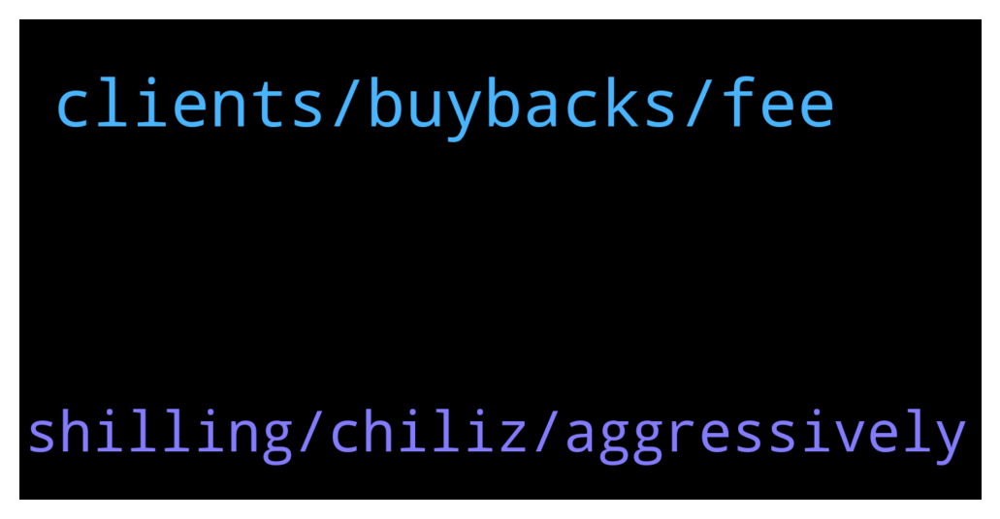

# **@ampnetapxchat**
 ## Analysis for **2022-01-20** - **2022-01-25**.

---

## 📊 **Basic Stats**

**n_messages_sent**: 35

---

---

## 🔝 **Top keywords and related messages**

1. **clients, buybacks, fee**

    @PFCBLic --- *Cool. Thanks for answer! So setup fee will be generating buybacks? Will this be visible as  public event?  I think validating that buyback actualy works is very important for future of this token  I understand that price cant be fixation for the team but some focus is to be expected since this community also supported this financial stabilty team has in upcomming period* **--->** [TG Discussion](https://t.me/ampnetapxchat/36622)

    @PFCBLic --- *Hey chat chief,  Any info on current business model? I mean about possible changes in it? If we dont generate income than buyback mechanism wont live. Paying for using your solution only upon successful funding is maybe questionable. Risk of failed campaign is on you instead on client side. Especially if you claim to be technology/solution provider.  I am here from beggining and i like vision for this project but are we going to see any adaptability on this road?  I support great efforts regarding onboarding of new clients and i like enthusiasm.  Stay safe!* **--->** [TG Discussion](https://t.me/ampnetapxchat/36619)

    @jakovtradingmentor --- *well i'm told we as ampnet cant really go around and shill the projects on our platform, something about the legality around it doesnt allow us to do so* **--->** [TG Discussion](https://t.me/ampnetapxchat/36779)

    @North --- *Fomo will increase as it gets towards  $500K. No way this doesn't get funded. Great news and hopefully we get some more details for AmpNet once we know it's going ahead* **--->** [TG Discussion](https://t.me/ampnetapxchat/36773)

    @PFCBLic --- *Maybe we can have some basic function to understand impact on aapx in correlation with complete campaign  For example:  "If total volume of Vatreni campaign is fullfilled we expect N revenues that will be directed to buyback in volume of N or will be put for staking in volume of N and so on"?  I would say this is ok start regarding presales* **--->** [TG Discussion](https://t.me/ampnetapxchat/36744)

    @jakovtradingmentor --- *with the recent clients onboarded the main change is we implemented a setup fee that + we increased the % we take as fee if campaign succeeds  this way we are protected on both sides* **--->** [TG Discussion](https://t.me/ampnetapxchat/36620)

2. **shilling, chiliz, aggressively**

    @jakovtradingmentor --- *but the community, you guys, you can do so if you're motivated to* **--->** [TG Discussion](https://t.me/ampnetapxchat/36780)

    @North --- *@jakovtradingmentor what do you think about timing of any shilling to Chiliz community? They obviously have aligned interests and so would probably be interested here too, but we should take care to not get ahead of ourselves* **--->** [TG Discussion](https://t.me/ampnetapxchat/36775)

    @North --- *Are we as the community allowed to talk about it here even or will posts be deleted? I had no idea it was even running yet, I thought you guys were still working on tokenomics and going to release more info* **--->** [TG Discussion](https://t.me/ampnetapxchat/36740)

    @jakovtradingmentor --- *could you elaborate by what you mean with shilling to chilliz community?* **--->** [TG Discussion](https://t.me/ampnetapxchat/36776)

    @mislavjavor --- *The community can of course promote* **--->** [TG Discussion](https://t.me/ampnetapxchat/36741)

    @jakovtradingmentor --- *alright so yeah we agree here :D* **--->** [TG Discussion](https://t.me/ampnetapxchat/36782)

