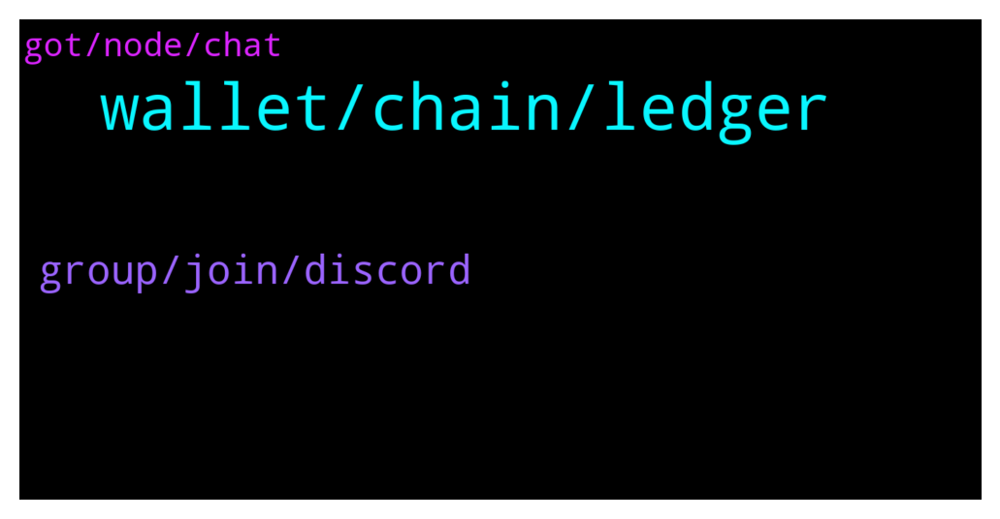

# **@avalancheavax**
 ## Analysis for **2022-01-24** - **2022-01-25**.

---

## 📊 **Basic Stats**

**n_messages_sent**: 110

---

---

## 🔝 **Top keywords and related messages**

1. **wallet, chain, ledger**

    @Rick --- *Guys, is everyone in the long on BTC? Some kind of prolonged correction, I'm thinking about closing all positions. Not destined to wait for the second altszn* **--->** [TG Discussion](https://t.me/avalancheavax/324376)

    @partybara --- *Hey guys! We just dropped a new NFT collection with reflections, a $PARTY buyback and future gaming integrations. Feel free to check it out! 🐰  https://twitter.com/partyswapdex/status/1485795561433411590?t=65sq1OuEbI7bweUevLmRqQ&s=19* **--->** [TG Discussion](https://t.me/avalancheavax/324349)

    @Lukmankhalique --- *Hey there. Are there any avax specific launchpads beside avalaunch?* **--->** [TG Discussion](https://t.me/avalancheavax/324138)

    @EJoker99 --- *https://docs.avax.network/build/tutorials/nodes-and-staking/run-avalanche-node  follow this page ,when synchronization is complete,can use RPC-API Service with C-chain ?* **--->** [TG Discussion](https://t.me/avalancheavax/324389)

    @FelixAdi --- *Hey guys, I have a problem. Anyway I was in the process of transferring my metamask to ledger nano s, and I'm about all done besides my AVAX. So I tested a small amount, it shows both in wallet and app and snowtrace, then I transferred my full amount. After that I find out somehow there's a bug with metamask and I can't access that avax, it's giving enable smart contract error (it's already enabled ofc),,, I contacted metamask support already and filed a ticket but not confident they will get back to me quickly. Is there any way I can access that AVAX? I tried different PC, different metamask, same bug.* **--->** [TG Discussion](https://t.me/avalancheavax/324191)

    @Liam --- *Something very strange is happening, all my money is gone* **--->** [TG Discussion](https://t.me/avalancheavax/324276)

2. **group, join, discord**

    @EJoker99 --- *join the discord server,then dm Nicolas_A ?* **--->** [TG Discussion](https://t.me/avalancheavax/324392)

    @Nicolas_A --- *Contact one of their moderator in their Telegram* **--->** [TG Discussion](https://t.me/avalancheavax/324159)

    @pleb001 --- *Issue is that there’s no start-here channel showed up but only verify here which is all blank* **--->** [TG Discussion](https://t.me/avalancheavax/324249)

    @Lynn --- *traderjoexyz is 404.what's wrong with it* **--->** [TG Discussion](https://t.me/avalancheavax/324487)

    @pleb001 --- *Hi I’m wondering how can I join the official discord channel? It doesn’t show me any verification message* **--->** [TG Discussion](https://t.me/avalancheavax/324241)

    @NFTmallAAYC --- *Hello mate, I just sent you a DM* **--->** [TG Discussion](https://t.me/avalancheavax/324339)

3. **got, node, chat**

    @Sephiroth --- *All Avalanche Validator Nodes hosted on @Allnodes were successfully updated to the latest 1.7.4 version. If you host your node there, no actions with node from your side are required. https://twitter.com/allnodes/status/1485849066789642240* **--->** [TG Discussion](https://t.me/avalancheavax/324420)

    @TheSEOdude --- *Heya, where can I find Dex aggregators list which supports Avalanche* **--->** [TG Discussion](https://t.me/avalancheavax/324473)

    @Vico007 --- *This chat is for avalanche topics* **--->** [TG Discussion](https://t.me/avalancheavax/324183)

    @wow1234567890 --- *Hello, any idea of where to lock liquidity on Avalanche? TrustSwap isn't working on Avalanche since about 5 days* **--->** [TG Discussion](https://t.me/avalancheavax/324457)

    @oathtobarbatos --- *I might not be able to help you with that, but, I'd suggest you talk about this on the Avalanche discord server. chat.avax.network   @Nicolas_A might be able to help you with that too* **--->** [TG Discussion](https://t.me/avalancheavax/324390)

    @Nicolas_A --- *There are several bridges that accept Weth from Avalanche. If the main one bridge.avax.network got hacked there might be some risk if the funds can't get recovered (exchange would confiscate the funds, stables would be frozen by Tether / Circle etc) The code is audited. All in all it's secure but yeah nothing in crypto has 0 risk* **--->** [TG Discussion](https://t.me/avalancheavax/324318)

