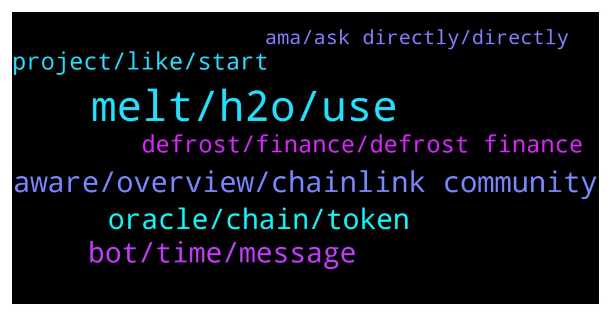

# **@chainlinkofficial**
 ## Analysis for **2022-01-24** - **2022-01-25**.

---

## 📊 **Basic Stats**

**n_messages_sent**: 152

---

---

## 🔝 **Top keywords and related messages**

1. **melt, h2o, use**

    @kento2021 --- *Does it have any properties that give it value?  I’ll read the white paper but am just curious why it’s worth owning.* **--->** [TG Discussion](https://t.me/chainlinkofficial/368743)

    @KevinChristopher1014 --- *I am going to deploy and use the smart contract in ethereum main net  But the deploy and calling function gas fee is too high than I expected in the mainnet.  I can't find the reason for this one.  I hope you check this smart contract file and help me with the reason* **--->** [TG Discussion](https://t.me/chainlinkofficial/368808)

    @Enrique126 --- *I mean total value locked sir* **--->** [TG Discussion](https://t.me/chainlinkofficial/368318)

    @Cryptodjens --- *Any idea when the. Staking can go live?* **--->** [TG Discussion](https://t.me/chainlinkofficial/368761)

    @DefiMichele --- *The way it works is that it allows investors to use their LPs on lending platforms and dexes - Curve, Benqi, Trader Joe and Pangolin at the moment - to mint H2O be committing those assets to our protocols. This happens through overcollateralization to maintain the peg of H2O.* **--->** [TG Discussion](https://t.me/chainlinkofficial/368875)

    @DefiMichele --- *If users mint their own H2O and farm MELT, they are at no risk of loss, as opposed to buy MELT on the market* **--->** [TG Discussion](https://t.me/chainlinkofficial/368934)

2. **aware, overview, chainlink community**

    @Sandeep_9879 --- *Why chainlink 2.o is not covered CCIP* **--->** [TG Discussion](https://t.me/chainlinkofficial/368987)

    @Linkederic --- *This article gives an overview of the Chainlink 2.0 Whitepaper, which provides a deep dive into current and future features under development https://blog.chain.link/chainlink-2-0-lays-foundation-for-adoption-of-hybrid-smart-contracts/* **--->** [TG Discussion](https://t.me/chainlinkofficial/368985)

    @marcromeron --- *To know more about Chainlink Keepers check our site:  https://chain.link/chainlink-vrf* **--->** [TG Discussion](https://t.me/chainlinkofficial/368929)

    @Linkederic --- *Total Value Secured is the appropriate and equivalent metric for Chainlink  https://www.coindesk.com/business/2021/11/04/value-secured-by-chainlink-data-soars-10-fold-in-less-than-a-year/?outputType=amp* **--->** [TG Discussion](https://t.me/chainlinkofficial/368322)

    @marcromeron --- *I listen Chainlink Price Feeds? 😉* **--->** [TG Discussion](https://t.me/chainlinkofficial/368982)

    @S --- *I am an ML Engineer from NTU Singapore  want to contribute to chainlink community as a deverloper, anyone here directly working as developer in chainlink? and can connect me to the right team* **--->** [TG Discussion](https://t.me/chainlinkofficial/368732)

3. **bot, time, message**

    @DefiMichele --- *Thank you Mark for front-running your bot and sharing some images of ours 🤝* **--->** [TG Discussion](https://t.me/chainlinkofficial/368939)

    @OuOSano --- *My message for deleted for some reason.  Anyone knows how long it takes for the CCIP expert to get in touch after filling up the form :)  Thank u* **--->** [TG Discussion](https://t.me/chainlinkofficial/368704)

    @sonny_dbb --- *I did fill out a contact form about a week ago, but there was no reply, so I tried asking here* **--->** [TG Discussion](https://t.me/chainlinkofficial/368578)

    @DefiMichele --- *Best of luck to you too, I'm sure there'll be plenty more chances to cooperate 💪* **--->** [TG Discussion](https://t.me/chainlinkofficial/368981)

    @DefiMichele --- *Thank you guys for having me, it's been a pleasure to be here. I hope the community has also enjoyed our chat 🙌* **--->** [TG Discussion](https://t.me/chainlinkofficial/368979)

    @marcromeron --- *Welcome and thank you for your time today.* **--->** [TG Discussion](https://t.me/chainlinkofficial/368860)

4. **oracle, chain, token**

    @marcromeron --- *Chainlink was created in 2017 by Sergey Nazarov and Steve Ellis (2 genius), who co-authored a whitepaper introducing the Chainlink protocol.  The same year they network with Ari Juels (Cornell University professor).  Their vision was that Chainlink acts as a "bridge" between a blockchain and off-chain environaments, to solve the oracle problem.  The network is used by smart contracts and was formally launched in 2019 on Ethereum mainnet.  Chainlink published a second white paper in April 2021. That paper, Chainlink 2.0: Next Steps in the Evolution of Decentralized Oracle Networks.  There is detailed a vision for expanding the role and capabilities of decentralized oracle networks to include hybrid smart contracts, which utilize on-chain code and off-chain services provided by oracle networks.  https://chain.link/whitepaper* **--->** [TG Discussion](https://t.me/chainlinkofficial/368330)

    @Linkederic --- *The LINK token is used to pay Chainlink node operators for their oracle services (on-chain data aggregation and submission & off-chain computation services). In addition, once Chainlink staking goes live, Chainlink node operators will be able to deposit a specific amount of LINK as collateral in order to be elegible to service specific requests. This was first outlined in the original whitepaper.  See also: https://blog.chain.link/explicit-staking-in-chainlink-2-0/* **--->** [TG Discussion](https://t.me/chainlinkofficial/368740)

    @CryptologistFox --- *Hi guys I have some question about Oracle that I couldnt find the answer yet. I would appreciate if you could help me with this.  1. I was wondering when and who first created the oracles?   2. Is Oracle machine theory the base of the oracle network?  3. Is the Chainlink first who lunched oracle in blockchain and decentrilized it.  Thank you in advance for your help* **--->** [TG Discussion](https://t.me/chainlinkofficial/368328)

    @sonny_dbb --- *Hi guys, who do I talk to about adding a token to the Oracle? Thanks!* **--->** [TG Discussion](https://t.me/chainlinkofficial/368576)

    @CryptologistFox --- *Thank you Mark But I wonder what is the base conception of Oracle* **--->** [TG Discussion](https://t.me/chainlinkofficial/368338)

    @HailHorror --- *I’m doing research on oracles, that’s why I wanna know more about the history and if it’s the first decentralized oracle 👀* **--->** [TG Discussion](https://t.me/chainlinkofficial/368332)

5. **defrost, finance, defrost finance**

    @marcromeron --- *Good way to learn about Defrost.* **--->** [TG Discussion](https://t.me/chainlinkofficial/368918)

    @DefiMichele --- *... and we came up with Defrost!* **--->** [TG Discussion](https://t.me/chainlinkofficial/368873)

    @marcromeron --- *Joining us from the Defrost Finance team, we have Michele - @DefiMichele.* **--->** [TG Discussion](https://t.me/chainlinkofficial/368859)

    @DefiMichele --- *You're not the first one asking I must say! We came up with the name Defrost as a branding strategy. Because we launched on AVAX - and as of now we are only available there - we wanted something that recalled snow and ice. So we are Defrost Finance, our stablecoin is H2O and our governance token is MELT (Defrost your LPs to MELT the Avalanche and get H2O 🔥)* **--->** [TG Discussion](https://t.me/chainlinkofficial/368881)

    @DefiMichele --- *So Defrost Finance was born when our team realized that there was a huge business space on Avalanche available for a native stablecoin.* **--->** [TG Discussion](https://t.me/chainlinkofficial/368871)

    @marcromeron --- *What is the best way for someone watching today to get started with Defrost Finance?* **--->** [TG Discussion](https://t.me/chainlinkofficial/368930)

6. **project, like, start**

    @DefiMichele --- *I'd actually like to start with two recent news we have had. Last week we have initialized our forum and governance mechanism, with a first vote already passed and implemented (within 24h from the vote if I may brag!)* **--->** [TG Discussion](https://t.me/chainlinkofficial/368947)

    @marcromeron --- *Where can the audience follow you and your project?* **--->** [TG Discussion](https://t.me/chainlinkofficial/368964)

    @DefiMichele --- *From that moment on, we focused on finding a way to create a project that would be self-sustainable in the long run and provide benefits to the community.* **--->** [TG Discussion](https://t.me/chainlinkofficial/368872)

    @DefiMichele --- *I gotta say this is one of the most exciting spaces ever. You're constantly challenged and need to adapt as fast as possible. Which I like a lot I must say* **--->** [TG Discussion](https://t.me/chainlinkofficial/368867)

    @marcromeron --- *What’s next on your project’s roadmap?* **--->** [TG Discussion](https://t.me/chainlinkofficial/368943)

    @marcromeron --- *As always, we’re interested on what makes your project special?* **--->** [TG Discussion](https://t.me/chainlinkofficial/368887)

7. **ama, ask directly, directly**

    @marcromeron --- *Hi. We don't pay for AMA nor reward. Thank you.* **--->** [TG Discussion](https://t.me/chainlinkofficial/368354)

    @Zibbaay --- *Do we post the questions somewhere before the AMA or will we just ask here directly for the KROMATIKA team?* **--->** [TG Discussion](https://t.me/chainlinkofficial/368735)

    @angelaFitri1 --- *To whom should I submit an AMA proposal?* **--->** [TG Discussion](https://t.me/chainlinkofficial/368352)

    @Linkederic --- *Just ask directly here during the AMA I believe* **--->** [TG Discussion](https://t.me/chainlinkofficial/368737)

    @pra_rz --- *I’m here for krom ama 👀* **--->** [TG Discussion](https://t.me/chainlinkofficial/368657)

    @marcromeron --- *Thank you very much @DefiMichele for hoting this AMA!!! Amazing one.* **--->** [TG Discussion](https://t.me/chainlinkofficial/368974)

