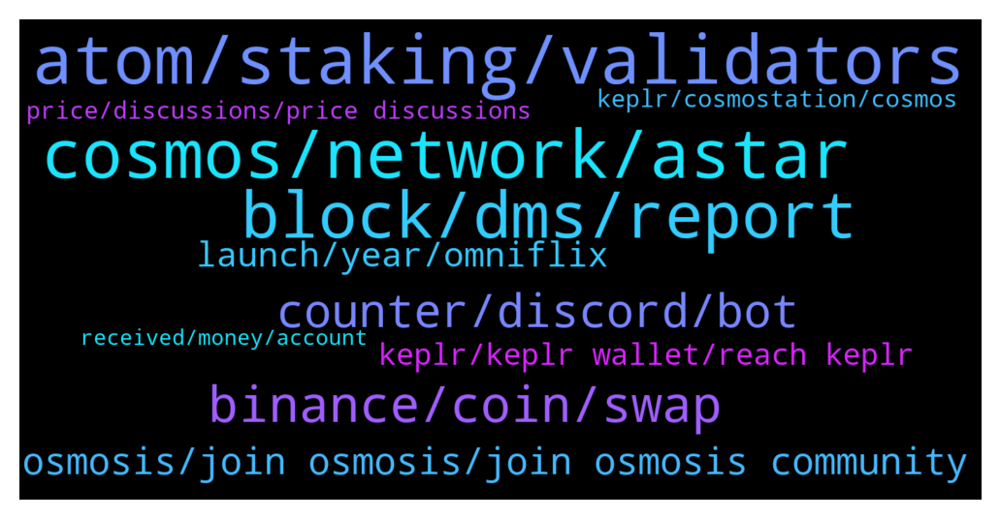

# **@cosmosproject**
 ## Analysis for **2022-01-24** - **2022-01-25**.

---

## 📊 **Basic Stats**

**n_messages_sent**: 309

---

---

## 🔝 **Top keywords and related messages**

1. **atom, staking, validators**

    @Numan_FF --- *İnvestors Vesting schedule of atom is over ? Any idea ?* **--->** [TG Discussion](https://t.me/cosmosproject/480260)

    @babauziu --- *Heyy, I am new to atom and I'd like to ask about the staking:) Is there a minimal amount in order to be eligible for airdrops?   Also, someone said that not all validators make you eligible? Is that true?  Thanks!* **--->** [TG Discussion](https://t.me/cosmosproject/480828)

    @ZoltanAtom --- *Atom is inflationary token. Inflation is around %9   Please check details of circulation supply at   https://cosmoscan.net/cosmos* **--->** [TG Discussion](https://t.me/cosmosproject/480108)

    @ZoltanAtom --- *If you stake your Atom,you get staking rewards. It’s around %14  Also soon there will be “liquid staking” which helps to increase bonded ratio up and inflation will go to down.   Have a look at this;  https://liquidstaking.finance/* **--->** [TG Discussion](https://t.me/cosmosproject/480111)

    @kmtm12 --- *Please ask travala to list ATOM      https://twitter.com/travalacom/status/1486017826053771266?s=21* **--->** [TG Discussion](https://t.me/cosmosproject/480919)

    @william28619 --- *Only ATOM? where do i read how this works? sorry new to the ecosystem* **--->** [TG Discussion](https://t.me/cosmosproject/480411)

2. **cosmos, network, astar**

    @CristiTCM --- *hello. why Cosmos has no max supply? where can i understand this better?* **--->** [TG Discussion](https://t.me/cosmosproject/480272)

    @AtomJazz --- *So basically there's no one rule. Cosmos is an ecosystem of application specific blockchains so new Cosmos project like to airdrop a part of their supply to bootstrap community. Osmosis, Juno, Stars, Desmos, HUAHUA and many others all dropped to ATOM stakeholders. You can read more about it on https://t.me/CosmosAirdrops* **--->** [TG Discussion](https://t.me/cosmosproject/480416)

    @lolwutakel --- *i read a few times these days about dual rewards on cosmos, can someone tell me what this means?* **--->** [TG Discussion](https://t.me/cosmosproject/480458)

    @AtomJazz --- *No idea what your point is but anyway... BSC can't be compared to Cosmos. Cosmos is not one L1 smart contracts chain like BSC, it's infinite number of interconnected application specific L1 blockchains https://mapofzones.com* **--->** [TG Discussion](https://t.me/cosmosproject/479828)

    @AtomJazz --- *Hey, there are few videos made by Cryptocito but for details pls join https://t.me/osmosis_chat* **--->** [TG Discussion](https://t.me/cosmosproject/480715)

    @AtomJazz --- *https://t.me/osmosis_chat join Osmo channel for more exact explanation* **--->** [TG Discussion](https://t.me/cosmosproject/480466)

3. **block, dms, report**

    @AtomJazz --- *No. Block all scammers DMing you. Keolr team is only reachable through  https://keplr.crunch.help/* **--->** [TG Discussion](https://t.me/cosmosproject/480132)

    @rudeflow --- *U kno wat sucks to ask for help from the real guy then get scammed by the fraudster just learned that the hard way* **--->** [TG Discussion](https://t.me/cosmosproject/480939)

    @ponci0x --- *I'm telling them to eat a bag of dicks* **--->** [TG Discussion](https://t.me/cosmosproject/480133)

    @margin_called --- *oh nice a fake version of you @zoltanatom00 just DMd me, sounds like a friendly chap maybe i'll give him my seed phrase* **--->** [TG Discussion](https://t.me/cosmosproject/480354)

    @staycat1on --- *Need to promote 2 admins for Chinese group. There were scammers and adv flooder.* **--->** [TG Discussion](https://t.me/cosmosproject/480021)

    @tylerfyu --- *Why? They needed to verify my wallet on here. And they hacked and stole all coins. I don't want other people met again like this.* **--->** [TG Discussion](https://t.me/cosmosproject/480030)

4. **binance, coin, swap**

    @Anothernoise --- *I don't think you can swap for pegged coin. It would be a sell and buy* **--->** [TG Discussion](https://t.me/cosmosproject/480343)

    @oleg_moskovskiy --- *Is it possible to withdraw delegated tokens in a cosmostation earlier than after 21 days?  What will happen?* **--->** [TG Discussion](https://t.me/cosmosproject/480773)

    @Drey_CO --- *I mean how can I swap cosmos coin to binance-peg cosmos* **--->** [TG Discussion](https://t.me/cosmosproject/480340)

    @Liu --- *hi I have questions this coin is deflationary?? it burning mechanism?* **--->** [TG Discussion](https://t.me/cosmosproject/480897)

    @Drey_CO --- *Then can’t I swap it to some other bep20 coin?* **--->** [TG Discussion](https://t.me/cosmosproject/480345)

    @Drey_CO --- *Hello Admin pls how can I swap my Cosmos coin to cosmos BEP20???* **--->** [TG Discussion](https://t.me/cosmosproject/480335)

5. **counter, discord, bot**

    @sm_quantum --- *Hello, using Double counter bot in Discord chats is not a good idea. I started going through verification and always got that I was working from a VPN. But I didn't use it! I contacted Double counter support, they checked and said that my external IP is on the Spam list and they can't help. They just banned my ISP's entire ISP subnet. Now I can't get into the Cosmos ecosystem developer chat :(* **--->** [TG Discussion](https://t.me/cosmosproject/479831)

    @catdotfish --- *I just said that you don’t have to reach out the double counter support, but the server janitor as written in the welcome message* **--->** [TG Discussion](https://t.me/cosmosproject/479847)

    @Drey_CO --- *None of their admin will reply your text either in the group or in private messages* **--->** [TG Discussion](https://t.me/cosmosproject/480379)

    @SlippingJimmy09 --- *Does it say 'pending'? If so, try clearing your browser cache.* **--->** [TG Discussion](https://t.me/cosmosproject/480000)

    @thiagorochaoc --- *The problem I'm having is not on their list. Do you know a chat, email or something?* **--->** [TG Discussion](https://t.me/cosmosproject/480608)

    @Drey_CO --- *Did they have a telegram account?* **--->** [TG Discussion](https://t.me/cosmosproject/480366)

6. **osmosis, join osmosis, join osmosis community**

    @ReadyFireAim --- *Thanks. I'm trying to pass the captcha and it's not working. Also trying to find where I can type "/pool" and see details for LPs on Osmosis. Thanks* **--->** [TG Discussion](https://t.me/cosmosproject/480097)

    @ZoltanAtom --- *Hi there please join Osmosis community and ask it to there ;  https://t.me/osmosis_chat* **--->** [TG Discussion](https://t.me/cosmosproject/480843)

    @jaloek --- *What is the purpose of osmosis ?* **--->** [TG Discussion](https://t.me/cosmosproject/480846)

    @Antifa --- *Is there anyway to view or know how much total liquidity is bonded vs unbonded in osmosis lp pools? A timeline of when and how much will be unbonded?* **--->** [TG Discussion](https://t.me/cosmosproject/480842)

    @crypto4life4eva --- *Hey guys how can I bridge from osmosis to terra? Thanks* **--->** [TG Discussion](https://t.me/cosmosproject/479936)

    @ZoltanAtom --- *Hi there, better to join Osmosis community and ask it to them;  https://t.me/osmosis_chat* **--->** [TG Discussion](https://t.me/cosmosproject/480669)

7. **launch, year, omniflix**

    @Lebron --- *any news when it will launch?  at what year ?* **--->** [TG Discussion](https://t.me/cosmosproject/480484)

    @Roundersyy --- *when does the adoption period end？* **--->** [TG Discussion](https://t.me/cosmosproject/480051)

    @akki925 --- *How soon? A month or two?* **--->** [TG Discussion](https://t.me/cosmosproject/480220)

    @WaveDave1988 --- *The nft market place is gonna launch on the 29th of jan if I'm not mistaken* **--->** [TG Discussion](https://t.me/cosmosproject/480687)

    @AtomJazz --- *Likely but nothing official for now* **--->** [TG Discussion](https://t.me/cosmosproject/480483)

    @WaveDave1988 --- *Sorry, it will launch end of February* **--->** [TG Discussion](https://t.me/cosmosproject/480689)

8. **keplr, keplr wallet, reach keplr**

    @Grgiorgi --- *Does anybody have else have a problem with keplr, app is crashing* **--->** [TG Discussion](https://t.me/cosmosproject/479955)

    @AtomJazz --- *You can reach Keplr team through https://keplr.crunch.help/   Can't help in any other way as they're third party service provider 🤷🏼‍♀️* **--->** [TG Discussion](https://t.me/cosmosproject/480400)

    @Dani --- *Hi guys.Are problem whit keplr wallet on iphone?* **--->** [TG Discussion](https://t.me/cosmosproject/480399)

    @skizosmatic --- *Hi I m new here. Would like to know how do I Bridge my UST that is in my Sol wallet to my Keplr wallet?* **--->** [TG Discussion](https://t.me/cosmosproject/480390)

    @Totalspud --- *Can you send cro straight from keplr to Ftx?* **--->** [TG Discussion](https://t.me/cosmosproject/480838)

    @thiagorochaoc --- *How can I reach out Keplr? I didn't find support on their website* **--->** [TG Discussion](https://t.me/cosmosproject/480604)

9. **price, discussions, price discussions**

    @AtomJazz --- *https://t.me/ATOMCosmonauts is a better place for this* **--->** [TG Discussion](https://t.me/cosmosproject/480142)

    @ZoltanAtom --- *Hi there,no price discussions allowed here. Please join @Atomprice* **--->** [TG Discussion](https://t.me/cosmosproject/480696)

    @Rafaell11 --- *Hello admin, I have a marketing proposal that may kindly interest you through our Hispanic community..* **--->** [TG Discussion](https://t.me/cosmosproject/480634)

    @AtomJazz --- *Hey Carolina. @AtomPrice is more suitable chat for price ups and downs* **--->** [TG Discussion](https://t.me/cosmosproject/480154)

    @ZoltanAtom --- *Thanks for feedback. We are working on it.* **--->** [TG Discussion](https://t.me/cosmosproject/480026)

    @ZoltanAtom --- *Please join @Atomprice ! No price discussions here.* **--->** [TG Discussion](https://t.me/cosmosproject/480746)

10. **keplr, cosmostation, cosmos**

    @ZoltanAtom --- *Hey,Cosmostation and Keplr are the recommended wallets. Keplr is needed to access Cosmos dexs too. I do use Cosmostation mobile app,Keplr mobile App and Keplr web wallet.   Links and tutorials are at the pinned message.   Start with Keplr to get Cosmos account and import your mnemonics to Cosmostation might be better.* **--->** [TG Discussion](https://t.me/cosmosproject/480326)

    @ZoltanAtom --- *Hi there.welcome to Cosmos!   Suggested wallets are Keplr and Cosmostation. You need to have Cosmos account and connect to cosmos dexs via Keplr for liquidity pools.   Osmosis, Sifchain and Gravitydex(Emeris) some of Cosmos dexs.* **--->** [TG Discussion](https://t.me/cosmosproject/480068)

    @junxplus --- *What is best wallet for cosmos?* **--->** [TG Discussion](https://t.me/cosmosproject/480290)

    @akki925 --- *Any way to get stablecoin in cosmos ecosystem, other than ust?* **--->** [TG Discussion](https://t.me/cosmosproject/480213)

    @Anothernoise --- *anything in the ecosystem on the horizon to deposit FIAT so I don't have to pay fees to binance or coinbase. I'd rather that money stay in the cosmos ecosystem* **--->** [TG Discussion](https://t.me/cosmosproject/480455)

    @ZoltanAtom --- *Keplr and Cosmostation suggested wallets. Links and tutorials are at the pinned message.Both wallets have mobile app* **--->** [TG Discussion](https://t.me/cosmosproject/480291)

