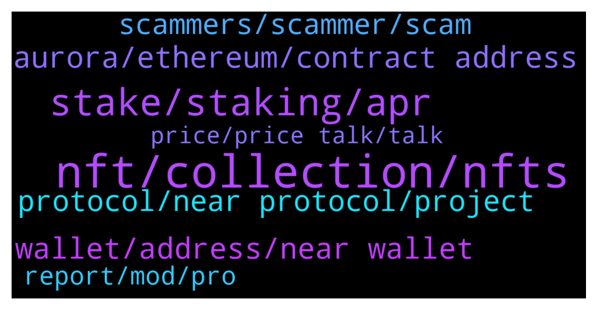

# **@cryptonear**
 ## Analysis for **2022-01-24** - **2022-01-25**.

---

## 📊 **Basic Stats**

**n_messages_sent**: 668

---

---

## 🔝 **Top keywords and related messages**

1. **nft, collection, nfts**

    @oppzsmoKe --- *Well Paras claiming this was the first   This is the first NFTs by an artist: https://paras.id/token/x.paras.near::2  This the first NFTs from the team: https://paras.id/token/x.paras.near::1  This is the first collection on Paras: https://paras.id/collection/zodiacs-ascension-by-parasnear* **--->** [TG Discussion](https://t.me/cryptonear/296750)

    @oppzsmoKe --- *See I’m heavily invested in Ethereum‘s NFTs The reason why I asked these questions is because I invested in early Ethereum NFT projects and they all have been success I brought a bunch of CryptoPunks which was the first so now I am moving over to near and I’m trying to find the Cryptopunk of near* **--->** [TG Discussion](https://t.me/cryptonear/296758)

    @dreadcoil1 --- *I have a question, whats the best place to get started as a nft creator on near protocol?* **--->** [TG Discussion](https://t.me/cryptonear/298183)

    @naveenkandwal --- *It has been just a week since Near Buddies have started minting [Minting Time: 19 Jan, 5 PM UTC] and today they are holding the 7 days Top chart position with 931 #NFTs sold out the worth of 1899 $NEAR  mind-boggling!!  So what is this #NFTCollection all about?  Find out here: https://twitter.com/NearNft/status/1485995500495314946 Join: https://t.me/nftclubNEAR* **--->** [TG Discussion](https://t.me/cryptonear/298318)

    @iforbusiness2 --- *hey mate you can dive to our NFT projects here https://awesomenear.com/categories/nft/* **--->** [TG Discussion](https://t.me/cryptonear/298214)

    @kv9990 --- *Btw there's a sequel to NEARPunk, NEARPunk Astro (launched 2 days ago) (series of 500 NFTs)and 30 would be dropped weekly  👀  Read more here   Here's the collection link 😄 https://paras.id/collection/nearpunk-astro-by-monztrenear* **--->** [TG Discussion](https://t.me/cryptonear/296775)

2. **stake, staking, apr**

    @stevenn00 --- *so if the staker increase the apr is decrease* **--->** [TG Discussion](https://t.me/cryptonear/297811)

    @TheGo1denBull --- *What's not enough information? Could you send me a dm please with the screenshot of the page that show the staking page.* **--->** [TG Discussion](https://t.me/cryptonear/296439)

    @harryfrottercrypto --- *No like im genuinely curious - howd you find your way into an obscure chain , find the telegram, buy near ,but not know how or what staking is - and not just that, but do zero research at all* **--->** [TG Discussion](https://t.me/cryptonear/297868)

    @NearFritz --- *If everyone unstake then the few that keep staking will earn more rewards* **--->** [TG Discussion](https://t.me/cryptonear/297799)

    @stevenn00 --- *alright where i have to stake i want huge apr* **--->** [TG Discussion](https://t.me/cryptonear/297738)

    @plat123456 | plat123456.sol --- *thanks for the answer, where can i stake on chain?* **--->** [TG Discussion](https://t.me/cryptonear/296690)

3. **aurora, ethereum, contract address**

    @JohnnyNguyen91 --- *Near like Dot, and Aurora like Kusama, right?* **--->** [TG Discussion](https://t.me/cryptonear/297651)

    @cuiking --- *Awesomenear com say Aurora built on NEAR so I'm was confused* **--->** [TG Discussion](https://t.me/cryptonear/297655)

    @GeorgePro1 --- *Aurora is side chain of near* **--->** [TG Discussion](https://t.me/cryptonear/297631)

    @harryfrottercrypto --- *Lol what is this wheres my aurora* **--->** [TG Discussion](https://t.me/cryptonear/297957)

    @crackedfingers --- *ah thats no good, i'll go back to aurora chain* **--->** [TG Discussion](https://t.me/cryptonear/298049)

    @GeorgePro1 --- *Aurora is acting like polygon on ethereum* **--->** [TG Discussion](https://t.me/cryptonear/297642)

4. **wallet, address, near wallet**

    @andreapn1709 --- *any plan to improve near wallet to be chrome extension ?* **--->** [TG Discussion](https://t.me/cryptonear/296798)

    @st_orif --- *hello. I can't send near from my near wallet.   An error occurred. Your send transaction was cancelled. Cannot read properties of null (reading '-1')  I have been open in my profile in incognito but the same error. Have can I solve it?* **--->** [TG Discussion](https://t.me/cryptonear/296582)

    @NearFritz --- *Again, the wallet team will be more helpful 🤘 please let's not waste any more time and let's solve this, you should open a ticket asap and wait for them 🚀* **--->** [TG Discussion](https://t.me/cryptonear/296473)

    @hailm8 --- *I searched but guides for the new wallet only* **--->** [TG Discussion](https://t.me/cryptonear/296699)

    @GeorgePro1 --- *For an extension, I'm not sure. But the wallet is a web wallet its almost function like an extension. IMO we don't need that now(extension) maybe you will ask of mobile wallet* **--->** [TG Discussion](https://t.me/cryptonear/296806)

    @stevenn00 --- *i dont know i just get 1 wallet after make phrase* **--->** [TG Discussion](https://t.me/cryptonear/297592)

5. **protocol, near protocol, project**

    @iaman38 --- *NEAR Protocol Official Official NEAR Protocol Community Channel. @cryptonear  NEAR is a builder's fastest path to market. Do things that you didn’t think were possible  A climate-neutral, high-speed, and low transaction fee Layer1 Blockchain platform. Reimagine your world NEAR. https://t.me/cryptonear_near* **--->** [TG Discussion](https://t.me/cryptonear/298158)

    @harryfrottercrypto --- *Why you advertising a different project through the near page isnt that a conflict of interest* **--->** [TG Discussion](https://t.me/cryptonear/297834)

    @EJabani --- *Pls help me with any article that will explain how near gov forum work* **--->** [TG Discussion](https://t.me/cryptonear/297351)

    @Kripto_Raptor --- *gov.near.org you mean. what do you want to learn about it?* **--->** [TG Discussion](https://t.me/cryptonear/297359)

    @Djaster988 --- *Hello, will be new projects on near crowd and invites ?* **--->** [TG Discussion](https://t.me/cryptonear/296476)

    @Andy --- *Hi all, i'm new here. Is Near an L1 protocol?* **--->** [TG Discussion](https://t.me/cryptonear/298347)

6. **scammers, scammer, scam**

    @cuiking --- *The more I chat here. More those scammers DM me at the end of the day there will be about 50 to 100 scammers in my DM* **--->** [TG Discussion](https://t.me/cryptonear/297771)

    @plat123456 | plat123456.sol --- *cex,  the second i post a question, tons of scammer dm me, i better delete my question, its too annoying* **--->** [TG Discussion](https://t.me/cryptonear/296684)

    @rahulgoel007 --- *The 2nd link is the scammers near account* **--->** [TG Discussion](https://t.me/cryptonear/298160)

    @NearFritz --- *Yep they are, take a look here: www.awesomenear.com there is a list of legit dapps* **--->** [TG Discussion](https://t.me/cryptonear/297744)

    @wabo555 --- *And Scammers pls leave me alone and go look for other victims or I'll invoke thunder and lightning from my village gods to strike you!* **--->** [TG Discussion](https://t.me/cryptonear/297324)

    @simeonfx --- *Please how can we be able to know scammers cause honestly I have been getting lots of messages and I haven’t opened any* **--->** [TG Discussion](https://t.me/cryptonear/298189)

7. **report, mod, pro**

    @rahulgoel007 --- *And if u have username let me know I will check and ban that guy from here too* **--->** [TG Discussion](https://t.me/cryptonear/298225)

    @bailey_12 --- *I am still waiting for a day there is an imposter that trying to copying my ducky identity 🙁* **--->** [TG Discussion](https://t.me/cryptonear/298230)

    @Flora --- *I only asked for his help and he did it immediately* **--->** [TG Discussion](https://t.me/cryptonear/297263)

    @cuiking --- *Community mod. Are you guys paid? Or you guys work on agreement on oath or this question personal?* **--->** [TG Discussion](https://t.me/cryptonear/297694)

    @bvlgvkov --- *Yeah, i cant approve that i am human* **--->** [TG Discussion](https://t.me/cryptonear/296413)

    @Flora --- *I tried it thou and he’s legit 💯* **--->** [TG Discussion](https://t.me/cryptonear/297257)

