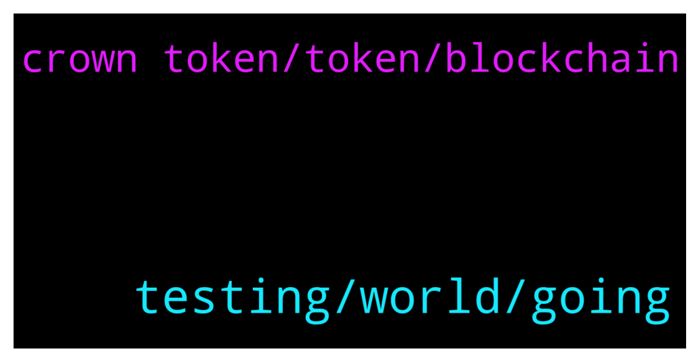

# **@de_fi**
 ## Analysis for **2022-01-24** - **2022-01-25**.

---

## 📊 **Basic Stats**

**n_messages_sent**: 36

---

---

## 🔝 **Top keywords and related messages**

1. **testing, world, going**

    @Bax_the_Wonderer --- *5 mins of work and you can win merch you like* **--->** [TG Discussion](https://t.me/de_fi/235438)

    @xnatasx --- *For this group we just volunteerer.  Better to contact projects you like.* **--->** [TG Discussion](https://t.me/de_fi/235389)

    @Bax_the_Wonderer --- *Right now we are connected to bsc testnet and doing open public testing. At the end of testing we plan to award  40 lucky testers by fulfilling their orders from testing* **--->** [TG Discussion](https://t.me/de_fi/235436)

    @tetetag --- *Well, question is team and technology. And what users get* **--->** [TG Discussion](https://t.me/de_fi/235416)

    @saivamshi12 --- *Also its a project that will change how invoice financing works, by replacing the work banks do* **--->** [TG Discussion](https://t.me/de_fi/235263)

    @saivamshi12 --- *Hello Guys,   Heard about polytrade launching its mainnet on 30th jan, have been following this project for months now.  This project is going to disrupt the trade financial ecosystem, already partnered with SME chambers of india  😍  its going to be a boon to the businesses all over the world. 🤩🤩  wouldnt miss out for the world.* **--->** [TG Discussion](https://t.me/de_fi/235255)

2. **crown token, token, blockchain**

    @tetetag --- *Difficult. Staking is a way more simple thing* **--->** [TG Discussion](https://t.me/de_fi/235444)

    @Bax_the_Wonderer --- *First E-com shop with integrated contract on blockchain and payment with metamask and crypto* **--->** [TG Discussion](https://t.me/de_fi/235424)

    @tetetag --- *Probably you just know Midas DAO, Crown is their token* **--->** [TG Discussion](https://t.me/de_fi/235403)

    @tetetag --- *Mate and what is your opinion on Midas, crown token?* **--->** [TG Discussion](https://t.me/de_fi/235398)

    @yososo --- *What’s are people’s thoughts on Russia Ukraine and it’s impact on coin?* **--->** [TG Discussion](https://t.me/de_fi/235392)

