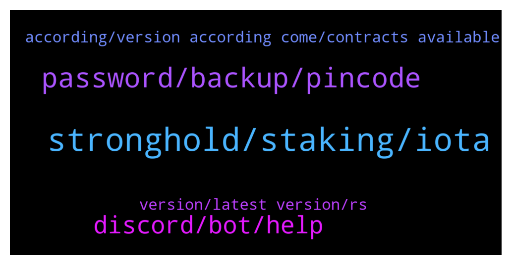

# **@iotatangle**
 ## Analysis for **2022-01-24** - **2022-01-25**.

---

## 📊 **Basic Stats**

**n_messages_sent**: 81

---

---

## 🔝 **Top keywords and related messages**

1. **stronghold, staking, iota**

    @PiernasLocas --- *There is a project called TanglePay for android. I saw it in the google playstore that it has the possibility to do the staking. I didnt try it because i prefer to wait for a recommendation from iota foundation.  Do you know if they approved that wallet?  Thanks* **--->** [TG Discussion](https://t.me/iotatangle/307592)

    @⠠⠵ Lucas! --- *There were some red flags last time I checked it: no full source code release and no stronghold usage in published one. I would definitely not recommend tanglepay wallet.* **--->** [TG Discussion](https://t.me/iotatangle/307597)

    @Amit --- *Can i stake ioda using my Android* **--->** [TG Discussion](https://t.me/iotatangle/307590)

    @⠠⠵ Lucas! --- *👍 Is the only way to guarantee the are no undisclosed backdoors in the application. Also, although it is "only" for convenience, the stronghold level is isolation has a clear objective: providing a higher security to critical data (like the seed) from compromised operating systems. And smartphones are very risky ones.* **--->** [TG Discussion](https://t.me/iotatangle/307636)

    @gjarete --- *Thanks for the question. not providing stronghold file is only not providing an alternative way to "login".* **--->** [TG Discussion](https://t.me/iotatangle/307638)

    @gjarete --- *Hi! I'm Garrett from TanglePay. Thanks guys for commenting! I just want to point out that not implementing support of Stronghold file is not making the app less secure. It is only making it less convenient. And we will update it once the IF library support that. =)* **--->** [TG Discussion](https://t.me/iotatangle/307629)

2. **password, backup, pincode**

    @Nikson36 --- *hello is there any way to recover the password from the Firefly wallet 24 words I don't have I only know the pincode and there is a backup copy* **--->** [TG Discussion](https://t.me/iotatangle/307527)

    @Nikson36 --- *I don't have anything remotely, maybe you can look in some folder the password is stored, I just forgot the password, but I didn't save the words* **--->** [TG Discussion](https://t.me/iotatangle/307540)

    @Nikson36 --- *I don't see anything wrong here and I can prove that this is my wallet, I know the pincode and I made the transfer to this wallet from my account to the Binance* **--->** [TG Discussion](https://t.me/iotatangle/307552)

    @Nikson36 --- *I can provide all transactions proving that this is my wallet. if possible, please help* **--->** [TG Discussion](https://t.me/iotatangle/307554)

    @Nikson36 --- *I don't have it, just a pincode and a backup* **--->** [TG Discussion](https://t.me/iotatangle/307531)

    @Nikson36 --- *I don't have a password to unlock, I only know the pincode and I have a backup. That is all* **--->** [TG Discussion](https://t.me/iotatangle/307570)

3. **discord, bot, help**

    @sergyjer --- *I know all this, I thought there was a discord* **--->** [TG Discussion](https://t.me/iotatangle/307576)

    @PiernasLocas --- *Again answer deleted by the bot 😭* **--->** [TG Discussion](https://t.me/iotatangle/307557)

    @PiernasLocas --- *The bot from this group is working bad because is like the second time that im writing something and it is deleted and it wasnt an image or link.  it was simple text with details about the difference between staking and nft* **--->** [TG Discussion](https://t.me/iotatangle/307488)

    @itsmedev --- *Sorry for that. You are right. It's text only. I pasted above.* **--->** [TG Discussion](https://t.me/iotatangle/307490)

    @PiernasLocas --- *If this help on something I sent them some screen captures to see their answer.  They didnt say too much anyway..  This is what they replied.* **--->** [TG Discussion](https://t.me/iotatangle/307622)

    @Tahmis --- *Everybody! We have a new admin on the channels! Please welcome Basti to the role 😎💪* **--->** [TG Discussion](https://t.me/iotatangle/307502)

4. **according, version according come, contracts available**

    @⠠⠵ Lucas! --- *https://github.com/TanglePay/TanglePay-Mobile  Not many updates in 3 months though* **--->** [TG Discussion](https://t.me/iotatangle/307633)

    @Jonny --- *Hi, What has been updated on firefly version 1.3.3?* **--->** [TG Discussion](https://t.me/iotatangle/307611)

    @HappypusNFT --- *when the smart  contracts will be available ?* **--->** [TG Discussion](https://t.me/iotatangle/307518)

    @⠠⠵ Lucas! --- *Here you can see all releases and changelogs: https://github.com/iotaledger/firefly/releases* **--->** [TG Discussion](https://t.me/iotatangle/307613)

    @Tahmis --- *Yeah, according to that it should come this week :)* **--->** [TG Discussion](https://t.me/iotatangle/307579)

5. **version, latest version, rs**

    @potatooe --- *No, only through official Firefly wallet (desktop):  https://firefly.iota.org/* **--->** [TG Discussion](https://t.me/iotatangle/307591)

    @Tahmis --- *Firefly Desktop 1.3.3 has been released. This contains a fix for an account syncing issue which was introduced in 1.3.1.   Changelog:  This version aims to solve syncing issues that where introduced because of a change in wallet.rs, between Firefly version 1.3.0 and 1.3.1 and have since changed again in the latest version of wallet.rs.   * Update wallet library dependency to latest version #2183  Update in app or download here: https://firefly.iota.org/ GitHub release: https://github.com/iotaledger/firefly/releases/tag/desktop-1.3.3 Report a bug: https://github.com/iotaledger/firefly/issues* **--->** [TG Discussion](https://t.me/iotatangle/307563)

    @⠠⠵ Lucas! --- *It pays even buying dedicate hardware to run Firefly 😜* **--->** [TG Discussion](https://t.me/iotatangle/307628)

    @⠠⠵ Lucas! --- *Moreover, when such a great wallet as Firefly is available* **--->** [TG Discussion](https://t.me/iotatangle/307627)

    @Nikson36 --- *можно как то восстановить пароль от кошелька Firefly* **--->** [TG Discussion](https://t.me/iotatangle/307520)

