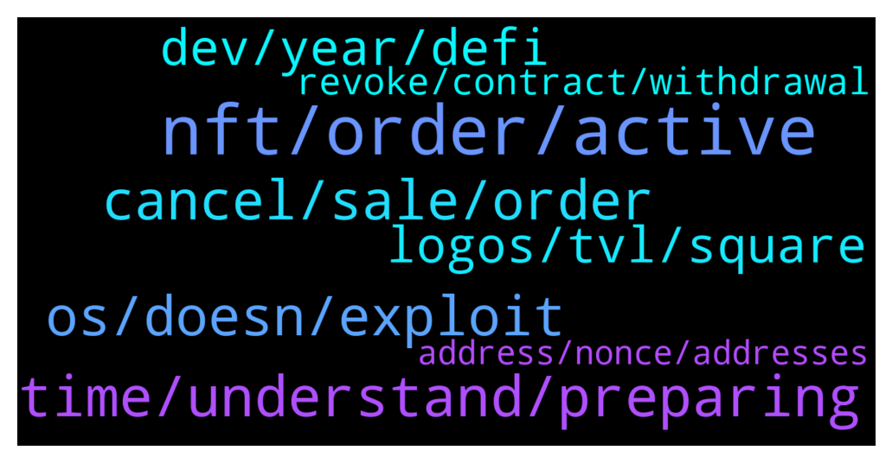

# **@lobsters_chat**
 ## Analysis for **2022-01-24** - **2022-01-25**.

---

## 📊 **Basic Stats**

**n_messages_sent**: 251

---

---

## 🔝 **Top keywords and related messages**

1. **nft, order, active**

    @sonicblend --- *The bug is related to selling a NFT and buying the same one back. It sounds like you didn't sell, so there's nothing to do.* **--->** [TG Discussion](https://t.me/lobsters_chat/318316)

    @BasicVersion --- *at what point was moving an nft back and forth from a wallet cheaper than canceling a listing* **--->** [TG Discussion](https://t.me/lobsters_chat/318372)

    @nickbtts --- *https://medium.com/@informationtokendao/the-case-of-the-disappearing-erc-1155-tokens-bc43a05ce7f  some more info on Opensea issue here.  Summary:  If you placed a sell order and did not cancel, it remains active even if you sell the NFT (default 6 months on Opensea). If you buy back, it is still active, but *doesn't show on opensea frontend* Open orders show correctly on Rarible  The above discusses 1155 as it applies to whole collection, not individual pieces. It makes sense as you have to make a tx to cancel the order, it's not incorporated in a sell tx. So it's a frontend problem, and has been raised with Opensea multiple times over last months.* **--->** [TG Discussion](https://t.me/lobsters_chat/318300)

    @henkreative30 --- *what i can't understand is how this can affect my nft. can i lose it? Can you buy it for me at a very cheap price?* **--->** [TG Discussion](https://t.me/lobsters_chat/318331)

    @ivangbi --- *Mikael playing with code for fun. This is not related to Gearbox Protocol except giving a perk to GEAR holders and Lobster NFT holders. It is just a cool learning experience he had with Solidity 8. Hint: updating the code + making adapters for the next releases Eyes* **--->** [TG Discussion](https://t.me/lobsters_chat/318664)

    @meme_ill --- *So many things undervalued now considering the protocols are getting the NFTs* **--->** [TG Discussion](https://t.me/lobsters_chat/318253)

2. **time, understand, preparing**

    @aorfevrebr --- *can't you do that with https://www.coinpayments.net/supported-coins-all ?  (I may say shit, I just opened the website a long time ago and I think you can do it there)* **--->** [TG Discussion](https://t.me/lobsters_chat/318493)

    @baldr --- *preparing to file a petition to add 🥲 emoji to post reactions* **--->** [TG Discussion](https://t.me/lobsters_chat/318296)

    @coine_r --- *The same ignorance is displayed in that thread* **--->** [TG Discussion](https://t.me/lobsters_chat/318405)

    @nickbtts --- *Kickback is cool too (but not what you need in terms of infra) https://polygon.kickback.events/* **--->** [TG Discussion](https://t.me/lobsters_chat/318486)

    @cute0x --- *Why would u be scared? I don’t understand ur frustration…* **--->** [TG Discussion](https://t.me/lobsters_chat/318348)

    @ivangbi --- *@andrecronje u gonna let people rest and say if u snapshooted or nah 😄* **--->** [TG Discussion](https://t.me/lobsters_chat/318284)

3. **os, doesn, exploit**

    @coine_r --- *Er, a fairly significant amount of that problem is very much due to the language, or perhaps more accurately, "le EVM":  https://github.com/ethereum/EIPs/issues/1662  When you're forced to jump through a million hoops to get anything non-trivial functional, it shouldn't be any surprise bugs are waiting in the cracks* **--->** [TG Discussion](https://t.me/lobsters_chat/318390)

    @SpikeSpiege1 --- *Jonesdao totally screwed their distro so they have to refund and do it all over again.  Doesn't give me much confidence in the team https://twitter.com/Fiskantes/status/1485982669947166728* **--->** [TG Discussion](https://t.me/lobsters_chat/318703)

    @khanHamzah --- *it just hangs on my browser very often and doesnt save code. Every time i reopen it - its blank* **--->** [TG Discussion](https://t.me/lobsters_chat/318562)

    @rocket_fuel --- *"doesn't work" in the sense it fails often, or doesn't suit your workflow somehow?* **--->** [TG Discussion](https://t.me/lobsters_chat/318561)

    @yic_alex --- *You are absolutely right. Now that the issue is known OS should definitely move to fix it. In fact they should have done so when it first surfaced a month ago or so. Puzzles me why they didnt act and improve UX. You would imagine this is important to someone working there...* **--->** [TG Discussion](https://t.me/lobsters_chat/318432)

    @adrianleb --- *srsly this is why we can't have nice things, this is why the ux wont improve, you can't blame users who are new to an ecosystem defending a company now valued 13b+ profiting from this misunderstanding they are enabling* **--->** [TG Discussion](https://t.me/lobsters_chat/318429)

4. **cancel, sale, order**

    @mann0000 --- *well, sellers cutting corners to avoid paying $30 to cancel sales properly on assets worth $50k+ definitely played a role* **--->** [TG Discussion](https://t.me/lobsters_chat/318383)

    @zariat_5D --- *it seems straightforward to just prompt users to cancel sale offers on transfer* **--->** [TG Discussion](https://t.me/lobsters_chat/318415)

    @henkreative30 --- *So should we cancel our sell orders? Im trying to understand that bug. Dont know how to protect my  lob* **--->** [TG Discussion](https://t.me/lobsters_chat/318311)

    @zariat_5D --- *what i mean is that i don't think it was a matter of users being cheap as much as just being unaware. i'm seeing a lot of "they shouldn't have tried to get around the fees" when i genuinely don't think that was the issue.   is it not possible to prompt "cancel sale offer" before allowing users to transfer assets?* **--->** [TG Discussion](https://t.me/lobsters_chat/318399)

    @henkreative30 --- *So must i cancel and create a new sale order? Or just cancel it?* **--->** [TG Discussion](https://t.me/lobsters_chat/318314)

    @ivangbi --- *OOMFG PLEASE STOP WHY DID I BUY* **--->** [TG Discussion](https://t.me/lobsters_chat/318291)

5. **dev, year, defi**

    @G03an --- *I think it is 5,8 mil actually, instead of 800k* **--->** [TG Discussion](https://t.me/lobsters_chat/318594)

    @SpikeSpiege1 --- *You could prob just audit contracts only and make $10k a week. At least during last year that was low end for an audit.* **--->** [TG Discussion](https://t.me/lobsters_chat/318550)

    @Light --- *Actually, been meaning to ask for a while, but what’s the average salary for a blockchain dev? Say solidity or rust.. say the dev is senior web2 and mid-level solidity* **--->** [TG Discussion](https://t.me/lobsters_chat/318543)

    @RobAnon --- *A year of auditing for 520K? I'd honestly rather be building 🙃 but I guess that kind of dev does exist* **--->** [TG Discussion](https://t.me/lobsters_chat/318553)

    @RobAnon --- *I'm both dev and CEO, so my actual industry experience is fairly short But my frens who do contract work are charging about 350K/year* **--->** [TG Discussion](https://t.me/lobsters_chat/318549)

    @bensams0 --- *if you're in the US, that's super low end* **--->** [TG Discussion](https://t.me/lobsters_chat/318547)

6. **logos, tvl, square**

    @Monkeyontheloose --- *has someone seen a industry mapping of protocols with logos?  looking for a list of existing crypto project logos, to make sure im not copying someone* **--->** [TG Discussion](https://t.me/lobsters_chat/318533)

    @w00tcake --- *And LiquidDriver and Tarrot made it 🤟🏼* **--->** [TG Discussion](https://t.me/lobsters_chat/318589)

    @ivangbi --- *Oh so it was TVL based* **--->** [TG Discussion](https://t.me/lobsters_chat/318584)

    @RobAnon --- *Unrelated but blz check DM Ivan* **--->** [TG Discussion](https://t.me/lobsters_chat/318640)

    @PmRiviere --- *Yes was created and branded before Andre leaked the name* **--->** [TG Discussion](https://t.me/lobsters_chat/318631)

    @DeadMeatHK --- *Was looking sketchy for LQDR for a while there.* **--->** [TG Discussion](https://t.me/lobsters_chat/318590)

7. **revoke, contract, withdrawal**

    @yic_alex --- *I am not sure whether revoking helps actually.* **--->** [TG Discussion](https://t.me/lobsters_chat/318322)

    @fozzysbo --- *Let’s say you approve a contract to do an action. On removal of that approval can the contract trigger an action inside the revoke function?* **--->** [TG Discussion](https://t.me/lobsters_chat/318456)

    @adrianleb --- *revoke.cash or this yes, no moar spam* **--->** [TG Discussion](https://t.me/lobsters_chat/318350)

    @sentinelv --- *you can use etherscan to revoke too* **--->** [TG Discussion](https://t.me/lobsters_chat/318347)

    @henkreative30 --- *So i revoke it here? @adrianleb* **--->** [TG Discussion](https://t.me/lobsters_chat/318338)

    @adrianleb --- *ppl advise against revoking because it literally bricks OS* **--->** [TG Discussion](https://t.me/lobsters_chat/318336)

