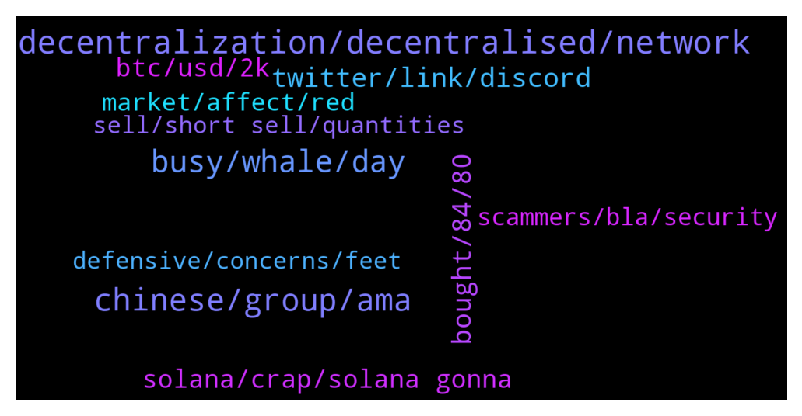

# **@solana**
 ## Analysis for **2022-01-24** - **2022-01-25**.

---

## 📊 **Basic Stats**

**n_messages_sent**: 1090

---

---

## 🔝 **Top keywords and related messages**

1. **decentralization, decentralised, network**

    @zet07 --- *Centralized takes power of the people, it is like a huge dictator that cou cannot and should not trust  Decentralized is like a open field of people who like the idea and join in, with the time, power comes trough the people to the people* **--->** [TG Discussion](https://t.me/solana/917173)

    @bhnoww --- *I wouldn't be so sure - the market has proved ppl doesn't care about centralization* **--->** [TG Discussion](https://t.me/solana/916601)

    @Sevith --- *I dont know everything, im saying most peoples understanding of 'decentralization' is a misunderstanding; You were referring to the coins themselvs, and supply as some means of decentralization which is incorrect? distribution!=decentralization.* **--->** [TG Discussion](https://t.me/solana/917197)

    @Sevith --- *Well, we can argue about the monetary properties of a network but there can still be decentralization without those other aspects, someone mentioned consensus which is more or less a by product of the decentralization itself. We don't NEED these things for a 'decentralized thing'  I just think a lot of peoples perspectives are skewed on what decentralization really is. like I said its just the network itself. You can have a very distributed network geographically, but said token might be controlled by like a small % of people running that network. (super majority etc etc) So decentralization has nothing to do with the monetary properties of a system, thats the DISTRIBUTION aspect of it. I just think some people are confused about it (as we were talking earlier)* **--->** [TG Discussion](https://t.me/solana/917281)

    @Sevith --- *He's specifically referring to the development of bitcoin.  I have already stated this several times;.....................  DECENTRALIZATION ONLY HAS TO DO WITH THE GEOPHRAPHICAL NETWORK DISTRIBUTION OF NODES IN A PARTICULAR SYSTEM; Nothing more; Nothing less.* **--->** [TG Discussion](https://t.me/solana/917170)

    @Sevith --- *(had a meeting)  In blockchain, decentralization refers to the transfer of control and decision-making from a centralized entity (individual, organization, or group thereof) to a distributed network  (Hence the distributed network part)  Without a distributed network, there is no decentralization, it all lies in the network layer itself, and nothing else as i stated before several times.* **--->** [TG Discussion](https://t.me/solana/917279)

2. **chinese, group, ama**

    @Burnt_B --- *awesome :) thanks @McNicholas and thank you everyone for joining in* **--->** [TG Discussion](https://t.me/solana/918396)

    @cryptolover1987 --- *Please join 🇨🇳 Chinese: @SolanaCHN 🇨🇳 https://weibo.com/SolanaNews 🇨🇳 Chinese WeChat ID: Solana_SOLdier* **--->** [TG Discussion](https://t.me/solana/915672)

    @mahib45 --- *🌐 INTERNATIONAL GROUPS  🇸🇦🇵🇸 Arabic: @SolanaArabic 🇦🇺 Australian : @SolanaAustralia 🇧🇩 Bangladesh: @SolanaBangladesh 🇧🇷 Brazil: @SolanaBrasil 🇨🇳 Chinese: @SolanaCHN 🇨🇳 https://weibo.com/SolanaNews 🇨🇳 Chinese WeChat ID: Solana_SOLdier 🇫🇷 France https://discord.gg/5KPMCCgau6 🇮🇳 Indian: @SolanaIndia 🇮🇩 Indonesian: @SolanaIndonesian 🇯🇵 Japanese: @SolanaJapan 🇰🇷 Korean: @SolanaKor 🇵🇰 Pakistan: @SolanaPakistan 🇵🇭 Philippines: @SolanaFilipino 🇷🇺 Russian: @SolanaRus 🇹🇭 Thailand: @Solanathaicommunity 🇹🇷 Turkish: @SolanaTurkish 🇪🇸 Spanish: @SolanaSpanish 🇻🇳 Vietnamese: @SolanaVietnam* **--->** [TG Discussion](https://t.me/solana/917548)

    @cryptolover1987 --- *There are too many!  Check out this 👇🏻 🔗 https://solana.com/ecosystem/explore?categories=game* **--->** [TG Discussion](https://t.me/solana/918238)

    @mahib45 --- *Please join 🇨🇳 Chinese: @SolanaCHN 🇨🇳 https://weibo.com/SolanaNews 🇨🇳 Chinese WeChat ID: Solana_SOLdier* **--->** [TG Discussion](https://t.me/solana/918266)

    @Realkucci --- *Why not talk in this group* **--->** [TG Discussion](https://t.me/solana/918680)

3. **busy, whale, day**

    @Gdfuhfd --- *I go all in at 230😭😭😭* **--->** [TG Discussion](https://t.me/solana/916729)

    @Gdfuhfd --- *Damn I feel like am dying😭* **--->** [TG Discussion](https://t.me/solana/916757)

    @mayday110011 --- *It's true handler sleeps in the mausoleum 😂* **--->** [TG Discussion](https://t.me/solana/915152)

    @Arslan --- *and it's top 10 soo acknowledge this beast stop shitting around dude* **--->** [TG Discussion](https://t.me/solana/915541)

    @Cryptopoke --- *shib and doge having better performance in this downtrend, sadly my friends laugh at me now* **--->** [TG Discussion](https://t.me/solana/916054)

    @Burnt_B --- *awe the whole squad is here ❤️* **--->** [TG Discussion](https://t.me/solana/918378)

4. **twitter, link, discord**

    @Annie5212 --- *Where can I follow the platform's twitter!* **--->** [TG Discussion](https://t.me/solana/917770)

    @McNicholas --- *Indeed. A relevant Twitter thread from SBF: https://twitter.com/SBF_FTX/status/1485839805707698176* **--->** [TG Discussion](https://t.me/solana/918560)

    @undying28 --- *Which tweet. Nothing anywhere is mentioned about what exactly caused this issue. Duplicated txn? Really?* **--->** [TG Discussion](https://t.me/solana/915807)

    @novatexh --- *I tried that but it asks me to use my phone number, which for technical reasons I can't provide -.-" any workaround this? thanks for the reply* **--->** [TG Discussion](https://t.me/solana/918222)

    @Burnt_B --- *then another one that is not linked to my twitter, not owned by me, but with the same images.* **--->** [TG Discussion](https://t.me/solana/918562)

    @Burnt_B --- *One of them shows that my twitter (twitter.com/burntbanksy) that you can go through. and every step of the process confirms that this is "my collection"* **--->** [TG Discussion](https://t.me/solana/918561)

5. **bought, 84, 80**

    @medasyko --- *I bought 100 tokens at $92 dollars a pop* **--->** [TG Discussion](https://t.me/solana/915457)

    @Kbs --- *Then buy now so 4x u wil receive if it wil be 230 again which it wil for sure tomorrow or next life* **--->** [TG Discussion](https://t.me/solana/916754)

    @Kbs --- *Exactly i bought at 150.. Then 122 then 103 then 84 now.. No more money left* **--->** [TG Discussion](https://t.me/solana/916722)

    @Sunoanshul --- *I am also bought at 124 😢 20 sol* **--->** [TG Discussion](https://t.me/solana/915712)

    @Zac --- *100X from here? come on bruh* **--->** [TG Discussion](https://t.me/solana/916346)

    @Kbs --- *Can go as low as  75-80...50 impossible more on up rending next month n march April* **--->** [TG Discussion](https://t.me/solana/915732)

6. **solana, crap, solana gonna**

    @Akshay --- *Solana is dropping the most :(* **--->** [TG Discussion](https://t.me/solana/915780)

    @ayin16 --- *what's wrong with solana why did it fall* **--->** [TG Discussion](https://t.me/solana/917457)

    @LetsGoRide --- *Solana is getting hit hard cause it's not living up to it's potential with tps. It's a while off before truly an Eth killer* **--->** [TG Discussion](https://t.me/solana/915458)

    @naachodf --- *and wtf people saying solana isnt working?* **--->** [TG Discussion](https://t.me/solana/915462)

    @<UNK> --- *Well you’re not really smart are you. That’s not solanas fault tho* **--->** [TG Discussion](https://t.me/solana/915393)

    @machaalany --- *If ur a crap doesn't mean solana is a crap noob* **--->** [TG Discussion](https://t.me/solana/915406)

7. **btc, usd, 2k**

    @Kbs --- *Yesterday Btc was 35.2k solana was 98.. Today btc is 35.2k solana is 87...wt went wrong we not following btc anymore* **--->** [TG Discussion](https://t.me/solana/915797)

    @Cryptopoke --- *BTC went down from 39k to 35k  and solana went from 142 to 87,  Just imagine if BTC fall to 30k.....* **--->** [TG Discussion](https://t.me/solana/915729)

    @okbro1 --- *Sol is only top 10 coin that is 65% cheaper than ATH......buy n enjoy 10x from here minimum if btc hit 100k...* **--->** [TG Discussion](https://t.me/solana/915564)

    @pnzfox --- *Last year today BTC $35K,  sol $3. don't be short-sighted* **--->** [TG Discussion](https://t.me/solana/915819)

    @okbro1 --- *Gain if it wil go 250...be positive dnt be afraid of 7-8 usd down... Think of future. If btc 70k again sol wil hit 300* **--->** [TG Discussion](https://t.me/solana/915548)

    @Kbs --- *Wrong stop fud... Btc went from 43k to 34k... Sol from 142 to 87..that's 23. 7% btc fall  sol 37% fall* **--->** [TG Discussion](https://t.me/solana/915740)

8. **market, affect, red**

    @Maryheleny --- *The market almost collapse  Fear everywhere  I predicted this but some people didn't believe me  Now they are on my dm* **--->** [TG Discussion](https://t.me/solana/917717)

    @taaisen --- *Everybody is losing money, only the captain should go down with his ship. I’m not waiting for the violins to play on the titanic sir* **--->** [TG Discussion](https://t.me/solana/916143)

    @Ali_Mohsenii --- *Yea that's why 81% of ADA investors are in lose 😂* **--->** [TG Discussion](https://t.me/solana/917080)

    @Ali_Mohsenii --- *Lol did you even look at the market?* **--->** [TG Discussion](https://t.me/solana/917242)

    @Gdfuhfd --- *All market is down..We need to calm down* **--->** [TG Discussion](https://t.me/solana/916394)

    @BabyLixin --- *The market is starting to look like it is picking up.* **--->** [TG Discussion](https://t.me/solana/917714)

9. **scammers, bla, security**

    @luke_gallo --- *Guys not even a second After i joined this group and 5 ppl contacted me, all scammers* **--->** [TG Discussion](https://t.me/solana/917615)

    @jagabanoflala --- *You haven't gotten into any transaction with me and you open your whole mouth to call me a scammer. Just look at the level of your mentality* **--->** [TG Discussion](https://t.me/solana/915623)

    @Robert --- *Damn scammers disguised as beautiful women in here. 😂* **--->** [TG Discussion](https://t.me/solana/916840)

    @Z --- *Just sent one messages... And scammers start bombarding messages... Huh... Rose bla bla bla...* **--->** [TG Discussion](https://t.me/solana/918320)

    @AlexsMommy352 --- *Wow!  I can't even keep up with all the blocking and declining phone calls and groups I've been added to since I posted a question here.....lots of scammers.  Worse then reddit* **--->** [TG Discussion](https://t.me/solana/915348)

    @grisha --- *from solflare.......  fuking scammers writing  dm....* **--->** [TG Discussion](https://t.me/solana/915250)

10. **defensive, concerns, feet**

    @nofearnickishere --- *And you are free to make claims that are not based in reality :)* **--->** [TG Discussion](https://t.me/solana/917552)

    @purrrwooof --- *Well alright it's your right to stick to your illusions* **--->** [TG Discussion](https://t.me/solana/917551)

    @Kbs --- *I better understand your definition than his... He is on drugs may be copy paste from Google definition* **--->** [TG Discussion](https://t.me/solana/917189)

    @Kbs --- *That's wt i told him.. He says it's false... Read up* **--->** [TG Discussion](https://t.me/solana/917175)

    @zet07 --- *Then he cannot understand it or stacks to many subjects on it additionaly* **--->** [TG Discussion](https://t.me/solana/917176)

    @Bobby --- *Isn't that the way it's supposed to be?? If my boots won't keep my feet dry during a lite shower and my feet get wet am I supposed to overlook that?* **--->** [TG Discussion](https://t.me/solana/917350)

