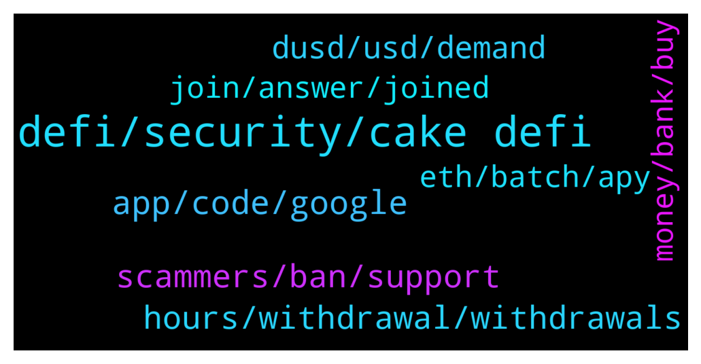

# **@CakeDeFi_EN**
 ## Analysis for **2022-01-25** - **2022-01-26**.

---

## 📊 **Basic Stats**

**n_messages_sent**: 245

---

---

## 🔝 **Top keywords and related messages**

1. **defi, security, cake defi**

    @zachgax --- *Cake is not an exchange or a spot trading platform. Why are people always so impatient to transfer in/out of Cake? LM,staking,lending are all long term services.* **--->** [TG Discussion](https://t.me/CakeDeFi_EN/167950)

    @JL --- *Bigger platforms have no problems withdrawing within minutes, why cake so special? Because it's successful ? I doubt so, cake and defichain is full of bugs since day 1. A whitelist should NOT be needed to be checked further, period. This is utterly counter-productive.* **--->** [TG Discussion](https://t.me/CakeDeFi_EN/168026)

    @Bald --- *What's the cheapest way to deposit fund to cake defi? Currently I transfer LTC from Crypto.com to Cake Defi (Crypto.com take 0.001LTC fee). Then in Cake Defi I need to swap LTC to DFI (Cake take 5%). Thereafter I need to swap DFI to BTC & ETH (another 5% + 5%)* **--->** [TG Discussion](https://t.me/CakeDeFi_EN/167860)

    @YyeapY --- *should i use trc network when i withdraw frm other wallet to cake?* **--->** [TG Discussion](https://t.me/CakeDeFi_EN/168076)

    @Kangoroooo2000 --- *If you dont like Cake and dont believe in defichain so why are you here?🤔 We prefer cake defichain lovers and dont need the haters, period😇* **--->** [TG Discussion](https://t.me/CakeDeFi_EN/168030)

    @Cedric --- *Nice I love cake haters not welcome pls* **--->** [TG Discussion](https://t.me/CakeDeFi_EN/168071)

2. **app, code, google**

    @apoyzkie09 --- *And I am already verified.. can I still put someone else referral on my account? And How.* **--->** [TG Discussion](https://t.me/CakeDeFi_EN/168006)

    @Larry --- *How do I change my two-factor authentication device for my Cake account?* **--->** [TG Discussion](https://t.me/CakeDeFi_EN/168486)

    @yldz_ahmt_1905 --- *There is an e-government in Turkey, I download the address registration document there as pdf and send it* **--->** [TG Discussion](https://t.me/CakeDeFi_EN/168523)

    @DmgBautista --- *That may indeed happen sometimes, but it's not a Cake thing.   As soon as the app is reviewed by the appstore and gets its approvall after checked for virus and other improper code, all depends on the app store to place it. Usually they try and do it fast, but sometimes it gets a bit of delay, its not a Cakedefi thing to control as it's a third party who is in charge for the distribution, in this case, google appstore.* **--->** [TG Discussion](https://t.me/CakeDeFi_EN/167806)

    @CHRIS090919 --- *Please how can one get the 2FA code.* **--->** [TG Discussion](https://t.me/CakeDeFi_EN/167926)

    @Mike J --- *My verification is being rejected anytime, I don't know what kind of document you need* **--->** [TG Discussion](https://t.me/CakeDeFi_EN/167973)

3. **hours, withdrawal, withdrawals**

    @JL --- *Care to show data evidence? I have never experienced a smooth withdrawal before, even to dex wallet takes 1 day! And withdrawal out of cake took 50 hours!!* **--->** [TG Discussion](https://t.me/CakeDeFi_EN/168017)

    @JL --- *Oh really? 99% of my withdrawals are not. Where did your 90% even come from?* **--->** [TG Discussion](https://t.me/CakeDeFi_EN/168005)

    @fabioandreatta --- *Yes hodlnaut has a very similar system to ours. around 48-hours  Take a look at this article: https://www.publish0x.com/cryptosensei/after-cryptocoms-hack-i-found-out-more-about-hodlnauts-and-c-xznxzrl* **--->** [TG Discussion](https://t.me/CakeDeFi_EN/168034)

    @weng --- *Look at hodlnaut, they are a lending platform in SG but do they practice 72 hours withdrawal period? NO.* **--->** [TG Discussion](https://t.me/CakeDeFi_EN/168032)

    @JL --- *Duh! U didnt read ? I mentioned 72 hours already* **--->** [TG Discussion](https://t.me/CakeDeFi_EN/167993)

    @StarGazerTM --- *hah i know i wait from saturday morning* **--->** [TG Discussion](https://t.me/CakeDeFi_EN/167837)

4. **scammers, ban, support**

    @weng --- *You mean road to 50 cents? Admin pls ban him , he spread fud* **--->** [TG Discussion](https://t.me/CakeDeFi_EN/168137)

    @fabioandreatta --- *We are open for constructive critism, constant complaining is a violation of our community guidelines.* **--->** [TG Discussion](https://t.me/CakeDeFi_EN/168073)

    @DmgBautista --- *Please lets keep communication here friendly and civilized. Insulting other users will not solve any issue you may have, but will easily grant you a temporary ban. We have living room rules here. Please respect your fellow community users 🙂* **--->** [TG Discussion](https://t.me/CakeDeFi_EN/168035)

    @TwoDsireCrypto --- *There is NO NEED to yell* **--->** [TG Discussion](https://t.me/CakeDeFi_EN/167948)

    @YSL --- *Pls ban them .. they are unreasonable and it’s here to scream and yell..* **--->** [TG Discussion](https://t.me/CakeDeFi_EN/168080)

    @fabioandreatta --- *I want to remind you that we are open for constructive critism, constant complaining is a violation of our community guidelines. You raised your concerns and shared your thoughts, let’s end this discussion right here. Thank you for your feedback* **--->** [TG Discussion](https://t.me/CakeDeFi_EN/168056)

5. **dusd, usd, demand**

    @DmgBautista --- *Yes DUSD has been dropping enough to offset the gain you felt in the DPDBC. DUSD has been trading already at almost 1,3$ usd aproximatelly, while currently is something around 1,1$ usd. It will drop further (my opinion only) once we get closer to the hardfork since many users are planning on exiting the pools, which will cause a drop in demand and further proximity to an actual 1$usd.* **--->** [TG Discussion](https://t.me/CakeDeFi_EN/168388)

    @DmgBautista --- *Hi! That update was an unplanned  emergency update, to stop the possibility of exploit the atomic swap beta feature, therefore the added time that many exchanges took to accomodate it. The current hardfork is a planned one, that aims to provide the tools to bring parity with USD to the Defichain DUSD* **--->** [TG Discussion](https://t.me/CakeDeFi_EN/168476)

    @CuteLovingMomo --- *0.00000133 dTSLA 😅 I feel so wasted that why i want do swapping* **--->** [TG Discussion](https://t.me/CakeDeFi_EN/167936)

    @Manvydasm --- *Does anybody know, when the new dusd-dURTH pool will start paying rewards?* **--->** [TG Discussion](https://t.me/CakeDeFi_EN/168379)

    @Manvydasm --- *Can dusd drop to 70-60-50% usd value if many users sell it?* **--->** [TG Discussion](https://t.me/CakeDeFi_EN/168407)

    @mholdy.xpr --- *Can someone explain to me simply what dusd is? Is it pegged to the dollar? Any info or helpful forum would be appreciated!* **--->** [TG Discussion](https://t.me/CakeDeFi_EN/168424)

6. **join, answer, joined**

    @jezzkng --- *in addition to the FAQ mentioned in below, you can cross reference this page  https://support.google.com/accounts/answer/185839?hl=en&co=GENIE.Platform%3DDesktop* **--->** [TG Discussion](https://t.me/CakeDeFi_EN/167932)

    @JL --- *And no answer. Thanks for typing anyway* **--->** [TG Discussion](https://t.me/CakeDeFi_EN/167996)

    @DmgBautista --- *You can join the Defichain group, there you will find the needed answers :)  https://t.me/defiblockchain* **--->** [TG Discussion](https://t.me/CakeDeFi_EN/167864)

    @Bald --- *I see. Thanks for the info* **--->** [TG Discussion](https://t.me/CakeDeFi_EN/167873)

    @Rumi --- *I want to understand what I'm doing there...* **--->** [TG Discussion](https://t.me/CakeDeFi_EN/168180)

    @Michael_Schredl --- *Take a look at https://cake.zendesk.com/hc/en-us/articles/360035528272-How-long-does-it-take-for-my-withdrawal-to-be-processed- :)* **--->** [TG Discussion](https://t.me/CakeDeFi_EN/167992)

7. **eth, batch, apy**

    @YSL --- *I thought you are working in caledefi .. thanks a lot* **--->** [TG Discussion](https://t.me/CakeDeFi_EN/167851)

    @Manvydasm --- *Ok, but current apy is shown 0%* **--->** [TG Discussion](https://t.me/CakeDeFi_EN/168381)

    @Cammy2904 --- *Lol 😂 you know what a normal bank account gives you? 0.01% APY. YES you read that right. So everything from 40% and up APR is just heaven* **--->** [TG Discussion](https://t.me/CakeDeFi_EN/168473)

    @Rumi --- *Then I have to calculate the 0.3013243 ETH : 12 months?* **--->** [TG Discussion](https://t.me/CakeDeFi_EN/168175)

    @Cedric --- *Apy is also drop from 500 to 100 I need 3 years breakeven* **--->** [TG Discussion](https://t.me/CakeDeFi_EN/168107)

    @Willy --- *Hey guys, Can any one explain me, why the rewards decreasing and the pice is falling? For my understanding shows the decreasing rewards that’s more people come inside and why is falling the pice?* **--->** [TG Discussion](https://t.me/CakeDeFi_EN/168097)

