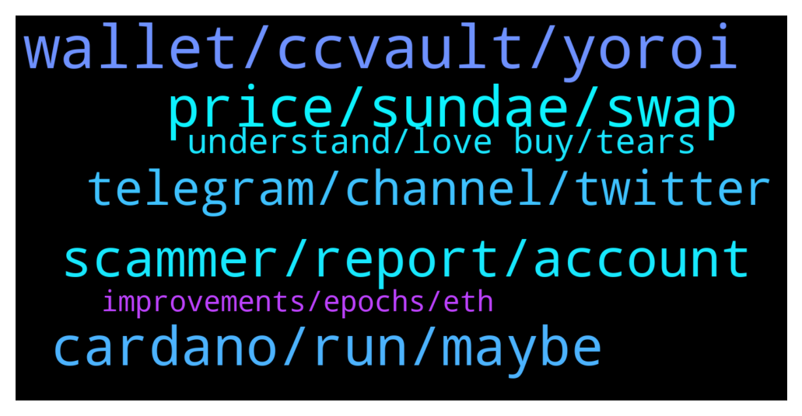

# **@Cardano**
 ## Analysis for **2022-01-25** - **2022-01-26**.

---

## 📊 **Basic Stats**

**n_messages_sent**: 138

---

---

## 🔝 **Top keywords and related messages**

1. **wallet, ccvault, yoroi**

    @Rambod20 --- *any one else having issues with their Daedalus wallet NOT ONLY syncing/connecting with the node? (I'm not referring to the node taking long time to reach 100% sync. it simply doesn't connect.)* **--->** [TG Discussion](https://t.me/Cardano/775730)

    @BinK18 --- *Ccvault is the best ada wallet* **--->** [TG Discussion](https://t.me/Cardano/775859)

    @dilavima30 --- *How can i set up nami wallet ?* **--->** [TG Discussion](https://t.me/Cardano/775479)

    @apex_pool_spo --- *then it is normal. the network has many transactions in the last weeks.* **--->** [TG Discussion](https://t.me/Cardano/775804)

    @vechain4life --- *Trying to send ADA from ccvault to binance.  It’s taking forever to write tx to a block* **--->** [TG Discussion](https://t.me/Cardano/775634)

    @Barbedouce --- *Hi, i'm using in the same time CCVault mainnet & testnet. I connect to minswap on testnet, then sundaeswap mainnet. When i do this, there is a mistake : minswap switch to mainnet, with the wallet i chose for sundaeswap. I think this kind of mistake can lead to some people lossing funds. Be carefull.* **--->** [TG Discussion](https://t.me/Cardano/775893)

2. **price, sundae, swap**

    @Lgbeano --- *That pool is over saturated but you can still add ₳. I'm not sure if they will be included in their ispo or not, you would need to ask the sundaeswap team.* **--->** [TG Discussion](https://t.me/Cardano/775772)

    @ZeroOne101 --- *i am wondering if anyone knows if it is still possible to stake for sundae ispo ?* **--->** [TG Discussion](https://t.me/Cardano/775763)

    @KimAnna --- *Where can I see my earned staking of sundaeswap?* **--->** [TG Discussion](https://t.me/Cardano/775701)

    @ZeroOne101 --- *hmmmm.... ok . one more question . i staked some ada in the nerd sundae pool like 2 weeks back ... can i just add coins to that wallet ? how will i know if there is still room to add more coins ?* **--->** [TG Discussion](https://t.me/Cardano/775769)

    @juancmtzr3 --- *Thank! How much you recommend to stake? Min* **--->** [TG Discussion](https://t.me/Cardano/775679)

    @Voorval --- *Hello Can someone help me?  When i want to swap on Sundeaswap and for example i want to buy Sundea for ada. When i swap the price is for example 0.85 cent. But when the transaction will complete and  the price of sundea drops to 0.79. Will the transaction do it on 0.79 or still for 0.85* **--->** [TG Discussion](https://t.me/Cardano/775401)

3. **cardano, run, maybe**

    @vechain4life --- *Hydra better speed this up or Cardano is toast* **--->** [TG Discussion](https://t.me/Cardano/775648)

    @arautom --- *Hey, I'm writing an article about Cardano and was doing a research about Project Catalyst, and one doubt about some official data that I found emerged. There's someone who I could talk about this in private?* **--->** [TG Discussion](https://t.me/Cardano/775466)

    @Khalid --- *So many noisy cardano haters now on social media because of sundaeswap issues. Is it really cardano's limitations that caused these problems? or did the sundaeswap team rushed the release? Will there be an official statement from IOG addressing these concerns?* **--->** [TG Discussion](https://t.me/Cardano/775892)

    @yournic --- *is there a wallet browser where I can see the value of my accrued tokens on the Cardano network?   i.e. like zapper.fi on eth* **--->** [TG Discussion](https://t.me/Cardano/775596)

    @Magi --- *Show how ? Which Plattform ?     I hope maybe cardano   Because  In the Future a many different people  Can’t use it because it’s not Safe at all  And for me it’s not for the humanity   To many people will withdraw they money into a nft scam  Or giveaway scam   You know that’s not safe at all   It’s the Truth look at  For me is crypto nice but for my parents or my sisters  Its too dangerous   Because of scammers   That’s why it’s never happend this year without scammer fix   And a payback for people who can proof a scam !! My opinion   I know you all a the best pros in the world and Bachelor of science 😂😂🤡* **--->** [TG Discussion](https://t.me/Cardano/775601)

    @atc1235 --- *guys, i run a node myself and i'm aware that in a few minutes cardano is updating some parameters. Do i have to update any config files or that'll run by itself for my node?* **--->** [TG Discussion](https://t.me/Cardano/775547)

4. **scammer, report, account**

    @Magi --- *I need help against a scammer who steal my whole Ada from binance with scam* **--->** [TG Discussion](https://t.me/Cardano/775167)

    @Magi --- *You need a platform scammer free  Without this   Nothing is possible* **--->** [TG Discussion](https://t.me/Cardano/775590)

    @Lgbeano --- *I'm not private messaging you, so if you are receding a message from an account that looks like me, just block and report* **--->** [TG Discussion](https://t.me/Cardano/775749)

    @glitch04 --- *Look at the dm they just sent not even in the group* **--->** [TG Discussion](https://t.me/Cardano/775595)

    @Lgbeano --- *Unfortunately scam (fraud) is a multi billion dollar industry world wide, it is not limited to crypto. Nation states struggle to deal with it because they don't work well together. Victim is usually in an entirely different country to criminal* **--->** [TG Discussion](https://t.me/Cardano/775759)

    @glitch04 --- *Chances are that is a scammer* **--->** [TG Discussion](https://t.me/Cardano/775583)

5. **telegram, channel, twitter**

    @ZeroOne101 --- *thanks ... yeah i dont know how to reach them ... as i said earlier my messages are just disappearing after i post them in the telegram  community chat...* **--->** [TG Discussion](https://t.me/Cardano/775773)

    @Lgbeano --- *They more likely have a discord server over a telegram channel... have you tried discord?   https://discord.gg/sundae* **--->** [TG Discussion](https://t.me/Cardano/775774)

    @Grip9 --- *Can some kick this bots to the moon?* **--->** [TG Discussion](https://t.me/Cardano/775659)

    @benohanlon --- *Charles in this Twitter Space right now https://twitter.com/i/spaces/1MnGnkzLWWVJO* **--->** [TG Discussion](https://t.me/Cardano/775280)

    @Lgbeano --- *Looking on their website, I can't actually see a telegram channel, so that is likely a scam channel which is why your messages are being deleted* **--->** [TG Discussion](https://t.me/Cardano/775776)

    @glitch04 --- *Bring that up with telegram, those users are not even in the channel but can view it from outside and message users* **--->** [TG Discussion](https://t.me/Cardano/775594)

6. **understand, love buy, tears**

    @Magi --- *That’s what I mean that’s very very difficult to understand for normal people   But I know I understand* **--->** [TG Discussion](https://t.me/Cardano/775605)

    @joranondakits --- *people in this world are weird* **--->** [TG Discussion](https://t.me/Cardano/775593)

    @KyR14c0s --- *Wrong impression and my brain could not translate well what i was reading hehehheheh* **--->** [TG Discussion](https://t.me/Cardano/775811)

    @Zyroxa --- *You better ask here https://t.me/CardanoStakePoolWorkgroup 😊👍🏻* **--->** [TG Discussion](https://t.me/Cardano/775548)

    @cryptoustt --- *oh apparently now I can 👍* **--->** [TG Discussion](https://t.me/Cardano/775888)

    @KyR14c0s --- *i even had a call hehehhehehehee* **--->** [TG Discussion](https://t.me/Cardano/775805)

7. **improvements, epochs, eth**

    @apex_pool_spo --- *no, where did you get that impression from? it is actually going to be worse for a period, when other DEXes will also lunch, but in a few months (my expectation) we will see some big improvements. there is also a hard fork schedules for February (theoretically), I am not sure if the CIP31, CIP32 and CIP33 will be included or not. If yes, we will see the improvements much sooner.* **--->** [TG Discussion](https://t.me/Cardano/775810)

    @Lgbeano --- *Yeah they only ran their ispo for 5 epochs* **--->** [TG Discussion](https://t.me/Cardano/775768)

    @KyR14c0s --- *yes but it took much more time than other days ... they were not supposed to fix this in this epoch ?* **--->** [TG Discussion](https://t.me/Cardano/775809)

    @ZeroOne101 --- *does anyone have thoughts on them only ipso'in for 5 epochs ? compared to most other projects length , and also considering the hype , that this is a pretty measly offering , no ?* **--->** [TG Discussion](https://t.me/Cardano/775777)

    @apex_pool_spo --- *there was a parameter change, but it was something minor, we won't see noticeable improvements from that (my personal guess).* **--->** [TG Discussion](https://t.me/Cardano/775812)

    @Barbedouce --- *They work without compromise to build for the better and trough the time; so we are just at the beginning of the optimisation, that's it.* **--->** [TG Discussion](https://t.me/Cardano/775898)

