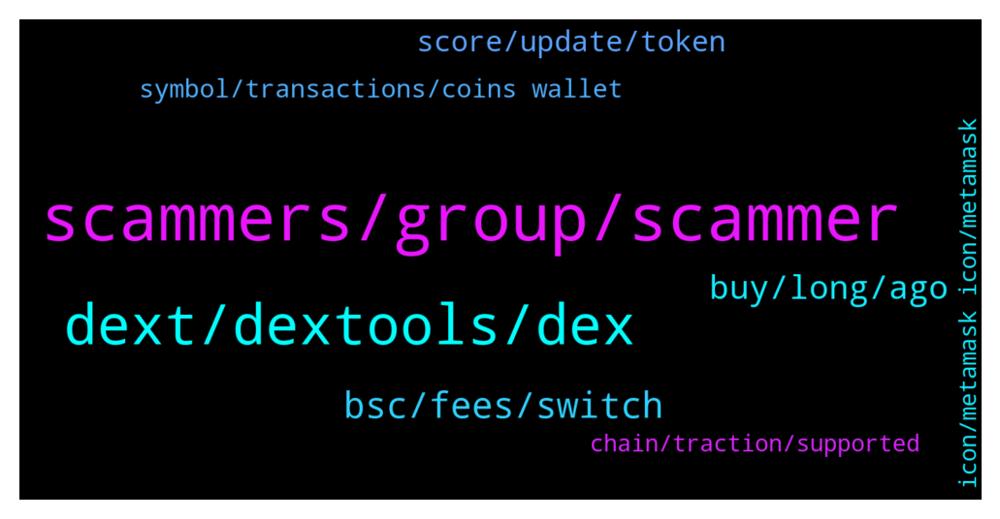

# **@DEXToolsCommunity**
 ## Analysis for **2022-01-24** - **2022-01-26**.

---

## 📊 **Basic Stats**

**n_messages_sent**: 219

---

---

## 🔝 **Top keywords and related messages**

1. **scammers, group, scammer**

    @NikoDikooo --- *No worries. Take your time. I will provide a screenshot via DM if needed for accurate numbers et cetera. Going to sleep now since I live in Sweden. We’ll be in touch 🙏* **--->** [TG Discussion](https://t.me/DEXToolsCommunity/328186)

    @Drake --- *Yes people should be aware of scammers instead posting… people will be afraid of using DEXT Stanes I hope you understand me* **--->** [TG Discussion](https://t.me/DEXToolsCommunity/328590)

    @hmk18990 --- *Hotpairs are not for sale! Also admins never dm you or request for funds! So don’t fall for scammers who told you to trend your tokens!* **--->** [TG Discussion](https://t.me/DEXToolsCommunity/328198)

    @hmk18990 --- *if you've any questions you can directly ask here in the group* **--->** [TG Discussion](https://t.me/DEXToolsCommunity/328313)

    @Jeoffrey_thewatcher --- *do you have any job vacancy for community moderator/manager?? i can manage both philippines community and english community.* **--->** [TG Discussion](https://t.me/DEXToolsCommunity/328551)

    @stanes --- *This is a support channel, I prefer people here being aware scammers are around.* **--->** [TG Discussion](https://t.me/DEXToolsCommunity/328582)

2. **dext, dextools, dex**

    @Dannie970 --- *How do I apply for dextool trending?* **--->** [TG Discussion](https://t.me/DEXToolsCommunity/327922)

    @thorex30 --- *DEXT is available on matic too?* **--->** [TG Discussion](https://t.me/DEXToolsCommunity/328094)

    @pedrosfernandez --- *I have Eth, Mana and DEXT* **--->** [TG Discussion](https://t.me/DEXToolsCommunity/328613)

    @Bandolero1986 --- *If i launch a project how can i add the project to dextools and to have a dextools chart* **--->** [TG Discussion](https://t.me/DEXToolsCommunity/327944)

    @wikkibikki --- *Is the price for Dextool advertisement* **--->** [TG Discussion](https://t.me/DEXToolsCommunity/328480)

    @napascual --- *Not from Dextools, we don't provide an Api yet. You could use the chart tools to calculate that manually though* **--->** [TG Discussion](https://t.me/DEXToolsCommunity/328509)

3. **bsc, fees, switch**

    @pedrosfernandez --- *Could I user BSC too ?* **--->** [TG Discussion](https://t.me/DEXToolsCommunity/328589)

    @gumbercules --- *lower fees on BSC but less decentralized chain* **--->** [TG Discussion](https://t.me/DEXToolsCommunity/327928)

    @TheFutureHour --- *we just discovered a small issue in our bsc server, but it should be already fixed  would you check again and let us know please* **--->** [TG Discussion](https://t.me/DEXToolsCommunity/328847)

    @stanes --- *If there is still a bit of liquidity ou can try to resell them to get back a little something. On BSC fees are low so maybe it's worth it.* **--->** [TG Discussion](https://t.me/DEXToolsCommunity/328653)

    @stanes --- *You can also switch your BSC wallet to BSC chain and manually add this contract address (DEXT): 0xe91a8d2c584ca93c7405f15c22cdfe53c29896e3* **--->** [TG Discussion](https://t.me/DEXToolsCommunity/328631)

    @bastardganpunk --- *No, it’s on bsc and eth* **--->** [TG Discussion](https://t.me/DEXToolsCommunity/328096)

4. **buy, long, ago**

    @pedrosfernandez --- *Hope this contract will stay for a long time because I Hodl all coins for long time* **--->** [TG Discussion](https://t.me/DEXToolsCommunity/328684)

    @pedrosfernandez --- *is it because of the old contract ?* **--->** [TG Discussion](https://t.me/DEXToolsCommunity/328650)

    @stanes --- *Contract doesn't have liquidity since beginning of  July and there are two warning messages on the page telling people to don't buy it 🤷‍♂️* **--->** [TG Discussion](https://t.me/DEXToolsCommunity/328676)

    @BubblesTU --- *but 70 days most of that contract was liquidated* **--->** [TG Discussion](https://t.me/DEXToolsCommunity/328673)

    @BubblesTU --- *oh its okay we know that, our current TVL  is 35,037,691$  We started 4 days ago* **--->** [TG Discussion](https://t.me/DEXToolsCommunity/328404)

    @stanes --- *But don't expect getting more than few dollars as there is no liquidity left.* **--->** [TG Discussion](https://t.me/DEXToolsCommunity/328659)

5. **score, update, token**

    @JoeyDieleman --- *Score depends on the age of the token, liquidity and the amount of available social links. Also it the validation of the contract is taken into account* **--->** [TG Discussion](https://t.me/DEXToolsCommunity/328369)

    @Ibraahiiim --- *Please how do you score a token* **--->** [TG Discussion](https://t.me/DEXToolsCommunity/328368)

    @lil_cri --- *No one just what to trend my token* **--->** [TG Discussion](https://t.me/DEXToolsCommunity/328200)

    @benc2c --- *Any idea how to update the token's website and other info on dex or it's automated?* **--->** [TG Discussion](https://t.me/DEXToolsCommunity/327913)

    @JoeyDieleman --- *The score consist on multiple categories, creation score grows when more transactions are made* **--->** [TG Discussion](https://t.me/DEXToolsCommunity/328374)

    @bastardganpunk --- *If you want to add socials to your tokenpairpage, please update etherscan.io or bscscan.com or coingecko.com  We pull info from there.    For the logo please update coinGecko or TrustWallet.* **--->** [TG Discussion](https://t.me/DEXToolsCommunity/327918)

6. **symbol, transactions, coins wallet**

    @pedrosfernandez --- *Here is the transactions : https://bscscan.com/tx/0xef29ced18791cce8501f7ccc99181a58c1d32808da6e7c4a7151dfa53c1b7ead https://bscscan.com/tx/0x0e6c4a1b0a1e8f4509b7a3ecd2e20937f8735e606bfb1c21f9b418113b52354d https://bscscan.com/tx/0x044e65b49893f68184444800ac88721cdbccc0ac8b84850fb2b0035e1f399a41* **--->** [TG Discussion](https://t.me/DEXToolsCommunity/328556)

    @pedrosfernandez --- *I lost arround 160$ in this transaction I think... ?* **--->** [TG Discussion](https://t.me/DEXToolsCommunity/328668)

    @pedrosfernandez --- *I lost this coins then ?* **--->** [TG Discussion](https://t.me/DEXToolsCommunity/328652)

    @Leonel --- *hello I have a question, when I click on a couple below the transactions appear and next to "maker" it says "others" and there is a symbol of some people and a number enclosed in a box and next to it the symbol of a filter , what does that mean?* **--->** [TG Discussion](https://t.me/DEXToolsCommunity/328734)

    @stanes --- *I already helped you, the coins are in your wallet.* **--->** [TG Discussion](https://t.me/DEXToolsCommunity/328577)

    @stanes --- *What is your issue with these tx? Coins are in your wallet.* **--->** [TG Discussion](https://t.me/DEXToolsCommunity/328557)

7. **icon, metamask icon, metamask**

    @IceManCrypton --- *how do you bring the favorites tab back up* **--->** [TG Discussion](https://t.me/DEXToolsCommunity/327959)

    @pedrosfernandez --- *I click on the Metamask Icon but still don't have any coins* **--->** [TG Discussion](https://t.me/DEXToolsCommunity/328595)

    @stanes --- *Did you click on the icon when you were on the right page?  https://www.dextools.io/app/bsc/pair-explorer/0x4b729d5d871057f3a9c424792729217cde72410d* **--->** [TG Discussion](https://t.me/DEXToolsCommunity/328598)

    @stanes --- *On the left of the email icon, the fox.* **--->** [TG Discussion](https://t.me/DEXToolsCommunity/328605)

    @pedrosfernandez --- *ok let me find the Metamask icon* **--->** [TG Discussion](https://t.me/DEXToolsCommunity/328588)

    @bastardganpunk --- *There is a little icon in the corner. Just click it.* **--->** [TG Discussion](https://t.me/DEXToolsCommunity/327960)

