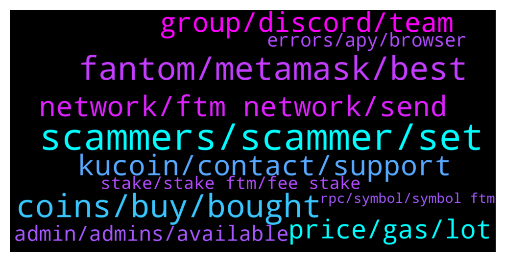

# **@Fantom_English**
 ## Analysis for **2022-01-25** - **2022-01-26**.

---

## 📊 **Basic Stats**

**n_messages_sent**: 338

---

---

## 🔝 **Top keywords and related messages**

1. **scammers, scammer, set**

    @bboldbayar --- *Wow i just got 5 scammers dm me* **--->** [TG Discussion](https://t.me/Fantom_English/642314)

    @ronald --- *Because they are cheap copy  scam coins.* **--->** [TG Discussion](https://t.me/Fantom_English/641977)

    @Chip --- *I've wasted their time in DMs on many occasions - always got the impression they don't know much about crypto, just following scripts like a cell centre operation* **--->** [TG Discussion](https://t.me/Fantom_English/641859)

    @Chip --- *There are so many now some actually tell you to delete forum posts, so other scammers can't DM* **--->** [TG Discussion](https://t.me/Fantom_English/642318)

    @zenkert --- *I am so disappointed. No scammer contacted me the last 24h. 😭😢* **--->** [TG Discussion](https://t.me/Fantom_English/641628)

    @fashi0nable --- *Lol the bots on this server are badddd* **--->** [TG Discussion](https://t.me/Fantom_English/641852)

2. **fantom, metamask, best**

    @Tilkesh --- *Can fantom give good return in future??* **--->** [TG Discussion](https://t.me/Fantom_English/641121)

    @METAROCKETMAN --- *What’s the best launchpad on fantom?* **--->** [TG Discussion](https://t.me/Fantom_English/641917)

    @squareeyez --- *I cant seem to swap some UST on Fantom / Metamask I received. Any suggestions on how to swap it for Fantom? I've tried so many Swappers I'm losing track. 👍* **--->** [TG Discussion](https://t.me/Fantom_English/641343)

    @Dolph --- *What is the best place to get fantom? Having trouble getting it from okex to metamask* **--->** [TG Discussion](https://t.me/Fantom_English/641068)

    @CryptoBloc365 --- *Is there really only 71 validators on fantom network? 🥶 hope they will increase the limite to be fully decentralized some day.* **--->** [TG Discussion](https://t.me/Fantom_English/641954)

    @shamdog97 --- *I can’t trade anything on my metamask because it won’t let me send fantom to my fantom wallet on metamask* **--->** [TG Discussion](https://t.me/Fantom_English/641829)

3. **coins, buy, bought**

    @bonisu --- *Any recommendations for Canadian buyers ? I buy from CDC, but it is etc 20 coins* **--->** [TG Discussion](https://t.me/Fantom_English/641752)

    @bonisu --- *Do u mean I have to sell my FTM first  ? And convert to stable coin. Then send to polygon and bridge?* **--->** [TG Discussion](https://t.me/Fantom_English/641784)

    @pumphighweed --- *Btc hovering around 36k thank God I bought other altcoins a bit, still have some money to DCA to buy more when it go deeper. . 😅* **--->** [TG Discussion](https://t.me/Fantom_English/641632)

    @cryptoduke_i --- *been a holder since IDO bro 0.06* **--->** [TG Discussion](https://t.me/Fantom_English/641642)

    @cryptoduke_i --- *other coins I bought dipped but HTD didn't* **--->** [TG Discussion](https://t.me/Fantom_English/641635)

    @pumphighweed --- *am currently in profit I recently bought at pancake 0.4, today 0.5 because the game is released, not bad.* **--->** [TG Discussion](https://t.me/Fantom_English/641640)

4. **kucoin, contact, support**

    @yea_imtoyin --- *Hey guyss I transferred ftm from my metamask to KuCoin (ftm) for about 40mins now and it hasn’t reflected, any issue with that* **--->** [TG Discussion](https://t.me/Fantom_English/640801)

    @nat_nat2525 --- *Ahhh. That’s the problem. Kucoin runs on the eth chain. You’ve probably lost it all in the transfer. Contact kucoin support. But I believe that is the problem.* **--->** [TG Discussion](https://t.me/Fantom_English/640823)

    @Reid --- *Probs just use kucoin to get BNB and then everswap* **--->** [TG Discussion](https://t.me/Fantom_English/641199)

    @JarekS --- *Hello Is the phantom network experiencing any technical problems at present? I've been waiting a few hours for the transfer of FTM from KuCoin to my wallet* **--->** [TG Discussion](https://t.me/Fantom_English/640716)

    @Janevietani --- *check your tx hash on ftmscan.com , if success , contact Kucoin support and send tx hash to them* **--->** [TG Discussion](https://t.me/Fantom_English/641566)

    @CoffCapital --- *anyone know what's going on with Kucoin?  Trying to w/d and it says "address unavailable."* **--->** [TG Discussion](https://t.me/Fantom_English/641181)

5. **network, ftm network, send**

    @Ryan --- *Hey guys, sorry if it’s a silly question - I’m trying to send my ftm to meta mask. From what I can find online, I send it to my eth address, which I’ve got ready to do. Im also curious can I send it on the ftm network or does it have to be the erc20? Thanks in advance 👍* **--->** [TG Discussion](https://t.me/Fantom_English/642291)

    @Janevietani --- *you can check it on ftmscan* **--->** [TG Discussion](https://t.me/Fantom_English/641272)

    @Janevietani --- *faucet are only for new user need ftm for first tx on network* **--->** [TG Discussion](https://t.me/Fantom_English/642390)

    @Nock out tomo --- *Hi, I bridged ftm bsc to ftm network from spookyswap But i have received anyftm in metamask, that i can not pay fee with this, What is anyftm?* **--->** [TG Discussion](https://t.me/Fantom_English/641781)

    @Cryptopratz --- *I choose ftm network to deposit* **--->** [TG Discussion](https://t.me/Fantom_English/641564)

    @Kinesias --- *you can use the ftm network but first you have to set it up in your metamask by yourself* **--->** [TG Discussion](https://t.me/Fantom_English/642298)

6. **group, discord, team**

    @pajamasfreak --- *We don’t have that group, sorry* **--->** [TG Discussion](https://t.me/Fantom_English/641390)

    @Janevietani --- *global , we have team all over around the world* **--->** [TG Discussion](https://t.me/Fantom_English/641583)

    @ShortTheBanks --- *I am from DEUS Finance team and we are building on FTM. I would like to talk to the Marketing Team of FTM to collab on Twitter with our marketing activities. Who should I get in touch with?* **--->** [TG Discussion](https://t.me/Fantom_English/642004)

    @GEMUni - Official Com..... --- *I'm having issues with joining the discord group* **--->** [TG Discussion](https://t.me/Fantom_English/640631)

    @ramhub1 --- *If I manage the Turkey group* **--->** [TG Discussion](https://t.me/Fantom_English/641393)

    @cryptoduke_i --- *sure who doesn't like a green project😁* **--->** [TG Discussion](https://t.me/Fantom_English/641638)

7. **price, gas, lot**

    @topcat0112358 --- *The current beta is ~180%, so if BTC were to drop 5%, FTM would drop 9%. (Markets are pretty heavily macro driven at the moment, based the rates environment, so this doesn't account for something changing with one coin or the other.)* **--->** [TG Discussion](https://t.me/Fantom_English/641732)

    @MathuranathM --- *Cause ftm is pretty good price right now* **--->** [TG Discussion](https://t.me/Fantom_English/642345)

    @asadwaheed --- *Can see somone tell me what would be ftm price if btc is at 35.5k?* **--->** [TG Discussion](https://t.me/Fantom_English/641718)

    @Solmoon90 --- *Will I lose a lot sending 500 dollar ftm worth to fwallet?* **--->** [TG Discussion](https://t.me/Fantom_English/641435)

    @Christoph --- *@MathuranathM Oh really? But I have enough FTMs to pay for a lot of gas. Small amount moving it back cost a lot of ETH gas* **--->** [TG Discussion](https://t.me/Fantom_English/642376)

    @forliferz --- *u do know it already did a 200x* **--->** [TG Discussion](https://t.me/Fantom_English/640618)

8. **admin, admins, available**

    @EVAIRaresh --- *Hey guys! Any admins available that I could speak to?😄* **--->** [TG Discussion](https://t.me/Fantom_English/642192)

    @NFT for Metaverse --- *Hi guys! any admin or Dev i can dm? Thank you!* **--->** [TG Discussion](https://t.me/Fantom_English/641462)

    @nate_hy --- *is this real admin or what?* **--->** [TG Discussion](https://t.me/Fantom_English/641614)

    @pajamasfreak --- *Any job available please look at our site.* **--->** [TG Discussion](https://t.me/Fantom_English/642197)

    @OkamiNFTs --- *Wow very helpful admin, thank you!* **--->** [TG Discussion](https://t.me/Fantom_English/642052)

    @Johnnyfantom --- *Just keep in mind who the admins here are* **--->** [TG Discussion](https://t.me/Fantom_English/640780)

9. **errors, apy, browser**

    @Captain --- *maybe try to empty cache and hard reload your browser? also you would need to ask the people from the platform you are using as that is not a FTM issue something is wrong on your end or the site you are using* **--->** [TG Discussion](https://t.me/Fantom_English/641774)

    @Budd Kurtis --- *Have you tried clearing your cache? You should refresh and try again* **--->** [TG Discussion](https://t.me/Fantom_English/641843)

    @xROSHIIx --- *it says dropped instead of failed* **--->** [TG Discussion](https://t.me/Fantom_English/641552)

    @Dolph --- *Just don't send it to dex. It goes missing* **--->** [TG Discussion](https://t.me/Fantom_English/641122)

    @yea_imtoyin --- *I have gotten it just now thanks* **--->** [TG Discussion](https://t.me/Fantom_English/640825)

    @Captain --- *I don't really have anything to do with it I just know that that error is generally caused by malformed write requests which are caused by browser errors or site errors I know firefox tends to have these errors more than chromium browsers do* **--->** [TG Discussion](https://t.me/Fantom_English/641783)

10. **stake, stake ftm, fee stake**

    @bboldbayar --- *Where can i stake my ftm* **--->** [TG Discussion](https://t.me/Fantom_English/642311)

    @KaueBistriche --- *i'm trying to stake in fWallet. it says i dont have balance, but i have then in my metamask. Already connected my metamask to the fWallet. What can i do?* **--->** [TG Discussion](https://t.me/Fantom_English/640682)

    @Mcjig --- *you need to have more than 10 ftm to be able to stake* **--->** [TG Discussion](https://t.me/Fantom_English/640696)

    @Beefy --- *Best place to stake? Or add to any LPs?* **--->** [TG Discussion](https://t.me/Fantom_English/641655)

    @Anar --- *Where do you stake your ftm?* **--->** [TG Discussion](https://t.me/Fantom_English/641274)

    @kim4928 --- *How can I stake the FTM token? Which one is most popular?* **--->** [TG Discussion](https://t.me/Fantom_English/640881)

