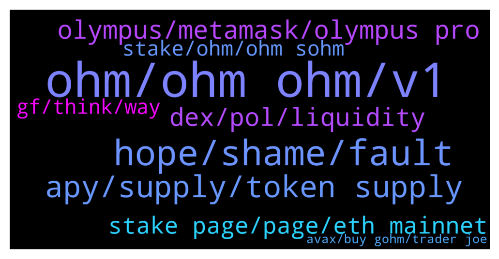

# **@OlympusTG**
 ## Analysis for **2022-01-25** - **2022-01-26**.

---

## 📊 **Basic Stats**

**n_messages_sent**: 900

---

---

## 🔝 **Top keywords and related messages**

1. **ohm, ohm ohm, v1**

    @Palancapa --- *the thing is, if Ohm drops another 90% from here, it takes an 10x to get back to its original price..* **--->** [TG Discussion](https://t.me/OlympusTG/170223)

    @Soragin --- *not trying to ridicule you. I also bought high first time.. All i did the way down was buying more.. so i 10- timed my stack this weekend. Maybe buy some more and let Ohm do his thing.. you will be happy later... much later than intended.. i know that* **--->** [TG Discussion](https://t.me/OlympusTG/168638)

    @nfwaple --- *my journey of OHM started when someone sent me 1 sOHM as a gift 😂* **--->** [TG Discussion](https://t.me/OlympusTG/168971)

    @jejesabis --- *I have OHM but it doesnt show up there* **--->** [TG Discussion](https://t.me/OlympusTG/169599)

    @Kng3000 --- *Senior dev said one more test is scheduled before docking happen on an ama* **--->** [TG Discussion](https://t.me/OlympusTG/169159)

    @nfwaple --- *it would be nice to see how things develop, since OHM is still learning things as we go, there is no one to refer to* **--->** [TG Discussion](https://t.me/OlympusTG/169980)

2. **hope, shame, fault**

    @nfwaple --- *isn't everyone already expecting one now* **--->** [TG Discussion](https://t.me/OlympusTG/169434)

    @Host_Matt --- *so you really think we're going back up soon* **--->** [TG Discussion](https://t.me/OlympusTG/169457)

    @nfwaple --- *I don't think there is any excuse* **--->** [TG Discussion](https://t.me/OlympusTG/170038)

    @SMNFT7 --- *Seems like we’re gonna have another really rough month in February. Brace yourselves😪* **--->** [TG Discussion](https://t.me/OlympusTG/170372)

    @Host_Matt --- *All I'm saying is instead of only focusing on how much you're down, figure out why it happened, and how to make sure it doesn't happen next time* **--->** [TG Discussion](https://t.me/OlympusTG/168610)

    @Jonathan --- *Logic, time down 90% all his fault.  Ohm down 95% all your fault.  Am i getting it right now. Ohm 🚀🚀🚀* **--->** [TG Discussion](https://t.me/OlympusTG/170165)

3. **apy, supply, token supply**

    @CryptoAlex1 --- *Why is the APY dropping everyday and so fast?* **--->** [TG Discussion](https://t.me/OlympusTG/169221)

    @Palancapa --- *and also, the APY seems unsustainable to me* **--->** [TG Discussion](https://t.me/OlympusTG/169975)

    @jamiemarkets --- *But it won’t ever be something crazy like 80k APY again* **--->** [TG Discussion](https://t.me/OlympusTG/170483)

    @mrmiyagi68 --- *Or are there extra rewards im missing out on next to the apy?* **--->** [TG Discussion](https://t.me/OlympusTG/170113)

    @Host_Matt --- *no one can make long timeframe assumptions like that apy can drop below 1k in 110 days* **--->** [TG Discussion](https://t.me/OlympusTG/170521)

    @Palancapa --- *i think the high APY perhaps screwed it up? maybe too many people with too big of a bag are trying to dump it* **--->** [TG Discussion](https://t.me/OlympusTG/170261)

4. **olympus, metamask, olympus pro**

    @vipdent --- *I bought on Friday at $70  Totally newbie with Ohm and staking etc  ( I have some other cryptos but all in wallet ).   Very easy - once you have done it :-)  Transfer money to an exchange ( I use Binance but any big exchange will do).   Open a MetaMask account.  ( chrome extension or phone app).  Write down your 12 words.  ( do not share with anyone - ever).   In your exchange buy ETH with your currency.  Withdraw all the ETH to the address from MetaMask  ( the blue long address).   After 2-3 minutes the ETH appear in MetaMask.   Go to Olympus.finance  Click ( tap) enter app Then click wallet.  Then get on sushiswap or get on uniswap.  ( sushiswap didn’t work for me.  Transaction timed out 3 times.  So I used uniswap).   In uniswap, tap on connect wallet.   Go back to MetaMask.  It should ask you if you want to connect.  There is a small gas fee.  Click accept.  ( in my case nothing happened.  I had to close MetaMask.  Open it again - and then the window appeared)  Now uniswap ( or sushiswap) can see your wallet.  Select “from “ ETH.  It will show you your ETH balance.  Select “TO” ohm v2  Do not select MAX.  I did this mistake.  Leave £15 ( $20) for gas fees.  I had to transfer again.  I didn’t have enough for the bloody gas fees.   And convert to ohm v2.   Now import the token ohm.  Address of ohm can be found on their DOCs. Their website.   https://docs.olympusdao.finance/main/contracts/tokens  You need ohm v2.  Somewhere in the middle.   Add this token in MetaMask.  Your balance will appear.  I also added sohm and gohm in MetaMask wallet.  All addresses from their website above.   Then go to Olympus.  Tap wallet.  Connect.  Go back to MetaMask to approve the connection.  ( in my case didn’t work again. Close MetaMask. Open it again.  The window appears.  Approve connection. )  Now you can stake.  Max.  I chose sOHM.   Again you need to approve it in MetaMask.  There are again gas fees :(  That’s it.   Good luck.   It took me 4-5 hours to do it.  I feel you.   If any issues, reply here.* **--->** [TG Discussion](https://t.me/OlympusTG/168905)

    @nazray --- *Yeap! You're going to have to import the token. Best choice is to go onto the Olympus webpage and find the instructions there* **--->** [TG Discussion](https://t.me/OlympusTG/170649)

    @Adrew --- *This there anyway some project can partner with olympus* **--->** [TG Discussion](https://t.me/OlympusTG/169864)

    @vipdent --- *I don’t intend in investing anymore for now in Olympus   Let’s see how it goes* **--->** [TG Discussion](https://t.me/OlympusTG/168929)

    @theMagicUnicorn --- *Olympus Pro Spotlight is a series where we highlight our Olympus Pro cohort partners to give Ohmies insights into what our partners are building, how their token works, and why they chose Olympus Pro. https://olympusdao.medium.com/olympus-pro-spotlight-keep3r-fixed-forex-e575e5864ae8* **--->** [TG Discussion](https://t.me/OlympusTG/170336)

    @MelnykNikola --- *Why does Olympus cost $107 on Zerion?* **--->** [TG Discussion](https://t.me/OlympusTG/169354)

5. **dex, pol, liquidity**

    @J --- *It is a stable swap DEX and so it would be owning things like USDC-USDT lps* **--->** [TG Discussion](https://t.me/OlympusTG/170012)

    @J --- *Basically do you know of any DEX that is doing POL, basically trying to own various lp for various pools in your DEX, want to see an example and evaluate to see if it’s a good idea.* **--->** [TG Discussion](https://t.me/OlympusTG/169999)

    @nfwaple --- *if you're a dex what's your goal from POL though? are you owning someone else's liquidity or you have a token for your own dex?* **--->** [TG Discussion](https://t.me/OlympusTG/169993)

    @J --- *I am part of a DEX and is wondering is it is a good idea to use the trading fee to buy liquidity for various pools.* **--->** [TG Discussion](https://t.me/OlympusTG/169983)

    @nfwaple --- *if you heard of the UST-MIM degen strategy, something like that* **--->** [TG Discussion](https://t.me/OlympusTG/170294)

    @J --- *Well the governance token is currently the reward token for the pools, by owning the lps, it reduces inflationary reward and also accrue swap fee from the pools.* **--->** [TG Discussion](https://t.me/OlympusTG/170001)

6. **stake page, page, eth mainnet**

    @noexec --- *Just go there and u will find a stake page* **--->** [TG Discussion](https://t.me/OlympusTG/169585)

    @nfwaple --- *you can still see them in the stake page* **--->** [TG Discussion](https://t.me/OlympusTG/169870)

    @nfwaple --- *go to the stake page on ETH mainnet* **--->** [TG Discussion](https://t.me/OlympusTG/169862)

    @Host_Matt --- *enter app, connect metamask, under dashboard you'll see stake* **--->** [TG Discussion](https://t.me/OlympusTG/169590)

    @nfwaple --- *if you go to the stake page on eth mainnet you can see your staked balance there* **--->** [TG Discussion](https://t.me/OlympusTG/170594)

    @nfwaple --- *you can go to the stake page on ETH mainnet and see your sOHM equivalent* **--->** [TG Discussion](https://t.me/OlympusTG/168853)

7. **stake, ohm, ohm sohm**

    @RecoDedon --- *How can I buy and stake ohm the easiest and cheapest way?* **--->** [TG Discussion](https://t.me/OlympusTG/168886)

    @Zammo999 --- *When I goto swap eth for ohm in MetaMask it only gives me 4 for £500? Can I buy Gohm amd then stake ?* **--->** [TG Discussion](https://t.me/OlympusTG/169762)

    @nfwaple --- *v2 OHM and stake, or just get gOHM* **--->** [TG Discussion](https://t.me/OlympusTG/170322)

    @nfwaple --- *or get OHM v2 and stake* **--->** [TG Discussion](https://t.me/OlympusTG/169274)

    @RecoDedon --- *And the only difference between sohm and ohm is that sohm are ohm which I use for the staking process?!* **--->** [TG Discussion](https://t.me/OlympusTG/169294)

    @jejesabis --- *do I need to wrap ohm to sohm?* **--->** [TG Discussion](https://t.me/OlympusTG/169602)

8. **gf, think, way**

    @Kellydiana86 --- *Why has to be this way!* **--->** [TG Discussion](https://t.me/OlympusTG/169414)

    @ricky_ciapparelli --- *Yes but now it’s different lol…* **--->** [TG Discussion](https://t.me/OlympusTG/169424)

    @tommyboz22 --- *The majority of braindead people think so. Watch and learn buddy.* **--->** [TG Discussion](https://t.me/OlympusTG/169440)

    @Palancapa --- *i was thinking it is but articles and stuff are telling me it isnt* **--->** [TG Discussion](https://t.me/OlympusTG/169939)

    @ceFarzin --- *Its the most convenient way 😬* **--->** [TG Discussion](https://t.me/OlympusTG/170439)

    @TurboLaserClip --- *the same as with old gf and new gf* **--->** [TG Discussion](https://t.me/OlympusTG/169696)

