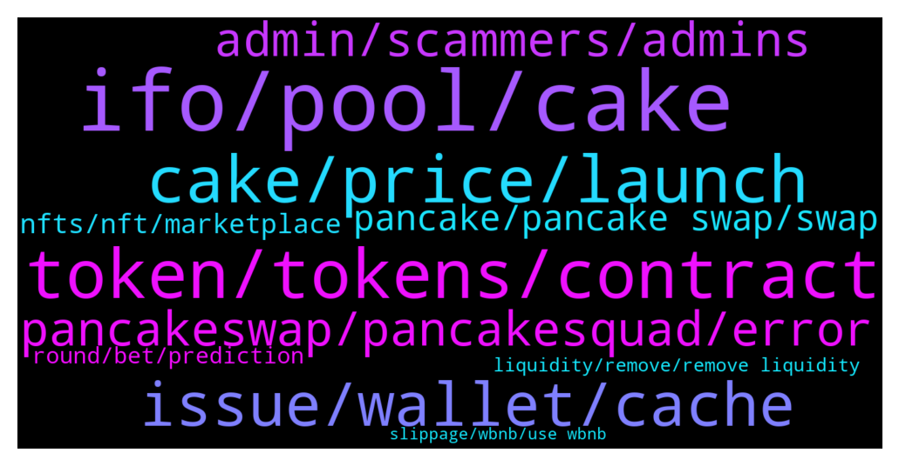

# **@PancakeSwap**
 ## Analysis for **2022-01-25** - **2022-01-26**.

---

## 📊 **Basic Stats**

**n_messages_sent**: 1028

---

---

## 🔝 **Top keywords and related messages**

1. **ifo, pool, cake**

    @Mohd --- *Hello Guys .. what is the different between auto cake pool and IFO Cake Pool* **--->** [TG Discussion](https://t.me/PancakeSwap/2300598)

    @citorange --- *why the ifo rules change everytime ? this is really annoying* **--->** [TG Discussion](https://t.me/PancakeSwap/2304047)

    @HAITIENLK --- *The farm/pool has a dead line, or it doesn't. you can see it countdown, if there is a deadline. or other pools without deadline, pls follow our channel.* **--->** [TG Discussion](https://t.me/PancakeSwap/2302083)

    @Cryptolovervsu --- *Sometimes shows that Staking pool is Ended please unsatke your cakes!!!?, am surprised!!!* **--->** [TG Discussion](https://t.me/PancakeSwap/2303324)

    @QV_zz --- *why are you surprised? all pools except the cake pools have an end date* **--->** [TG Discussion](https://t.me/PancakeSwap/2303326)

    @Luukku1 --- *Unstake and stake on the other one. No IFO is live currently, that is why you can't participate.* **--->** [TG Discussion](https://t.me/PancakeSwap/2303628)

2. **token, tokens, contract**

    @TomorrowlandForLife --- *You should ask token's owner about this* **--->** [TG Discussion](https://t.me/PancakeSwap/2302851)

    @Ceddi200 --- *Probably it’s a bad token. Can you contact the community that owns it.* **--->** [TG Discussion](https://t.me/PancakeSwap/2302473)

    @Godbabybeby --- *Is XTZ token limited on cmc* **--->** [TG Discussion](https://t.me/PancakeSwap/2304244)

    @HAITIENLK --- *ask team of that token mate.* **--->** [TG Discussion](https://t.me/PancakeSwap/2303625)

    @Luukku1 --- *I have no clue what token it even is* **--->** [TG Discussion](https://t.me/PancakeSwap/2303638)

    @Ceddi200 --- *I don’t have information about that. If I should guess it should be the token. Maybe nft could be implemented. 😁* **--->** [TG Discussion](https://t.me/PancakeSwap/2302486)

3. **cake, price, launch**

    @bdaciousx --- *Why in website NFT costs BNB, if it would be changed to CAKE the volume will go up, why its not done, any reason for BNB insted of native CAKE for CAKE website ?* **--->** [TG Discussion](https://t.me/PancakeSwap/2301306)

    @BaldMullet --- *I don’t know but I just bought 130 $CAKE and am waiting!* **--->** [TG Discussion](https://t.me/PancakeSwap/2303053)

    @ngabriel22 --- *Why cake is inflationary ? There is more supply* **--->** [TG Discussion](https://t.me/PancakeSwap/2300722)

    @Lolfmlimsogay --- *You wouldn't happen to know cake launch price would you? Or lowest price. Just tryna get best deal.* **--->** [TG Discussion](https://t.me/PancakeSwap/2301467)

    @ramtin17286 --- *Yep Not dollars You will get Cake Like you put 1000 cake  After 1 year  You give 500 cake 1500 cake* **--->** [TG Discussion](https://t.me/PancakeSwap/2303746)

    @VIPSolaire --- *Because before we have strong support….wish stop mint more cakes* **--->** [TG Discussion](https://t.me/PancakeSwap/2302250)

4. **issue, wallet, cache**

    @HAITIENLK --- *clear cache and try again bro.* **--->** [TG Discussion](https://t.me/PancakeSwap/2301909)

    @HAITIENLK --- *website is normal. pls restart and try again* **--->** [TG Discussion](https://t.me/PancakeSwap/2303412)

    @satelliteastro --- *Problem solved for me - Owner wallet was not exempt from max wallet - worked then for me* **--->** [TG Discussion](https://t.me/PancakeSwap/2304642)

    @SecuestPcs --- *Please explain your issue in detail and as clearly as possible - we can’t read your mind.    ⁃ Which wallet are you using?   ⁃ Which type of device are you using?   ⁃ Which browser are you using?   ⁃ What exactly do you need assistance for?   ⁃ What error are you getting?* **--->** [TG Discussion](https://t.me/PancakeSwap/2302602)

    @Robertoluccini --- *I did it but it says insufficient funds for the network fee* **--->** [TG Discussion](https://t.me/PancakeSwap/2301186)

    @QV_zz --- *dunno mate. try again after clearing your cache/refreshing* **--->** [TG Discussion](https://t.me/PancakeSwap/2302557)

5. **pancakeswap, pancakesquad, error**

    @Stavrosaek21 --- *are you an admin or a dev? Do you know what PANCAKESWAP BUTTONS interact with? PANCAKESWAP PLATFORM* **--->** [TG Discussion](https://t.me/PancakeSwap/2304565)

    @AgentW --- *Cannot add THETA to pancakeswap When inserting address, finds nothing* **--->** [TG Discussion](https://t.me/PancakeSwap/2301703)

    @BoltMatt --- *Why has DAO VC gone? I can no longer see it on pancakeswap and when I paste the contract adress into pancakeswap it no longer comes up with anything* **--->** [TG Discussion](https://t.me/PancakeSwap/2302556)

    @Stavrosaek21 --- *So your pancakeswap button does do not anything because of my contract? easy and evasive explanation* **--->** [TG Discussion](https://t.me/PancakeSwap/2304633)

    @satosh1_nakamoto --- *You can find all communities available in the PancakeSwap official website, here: https://docs.pancakeswap.finance/contact-us/telegram* **--->** [TG Discussion](https://t.me/PancakeSwap/2302065)

    @mitkargin1 --- *hello everyone pancakeswap I also encountered an error pancakeswap automatically sent 6.8 BNB to a different address I need to talk to who about it* **--->** [TG Discussion](https://t.me/PancakeSwap/2302037)

6. **admin, scammers, admins**

    @Edan --- *how do i block dm its so annoying so many scammers* **--->** [TG Discussion](https://t.me/PancakeSwap/2300994)

    @QV_zz --- *use metamask. never trust anyone that DMs you first. never share your private key/phrase.* **--->** [TG Discussion](https://t.me/PancakeSwap/2301463)

    @nnothing2 --- *some user here get scam by follow dm that why it's auto delete when someone say dm. . it's the pancake security process to prevent their user. mr.Dixie* **--->** [TG Discussion](https://t.me/PancakeSwap/2301491)

    @SecuestPcs --- *Do not write anything about DM.* **--->** [TG Discussion](https://t.me/PancakeSwap/2301479)

    @TomorrowlandForLife --- *Admins NEVER DM you first so that is not the real Ceddi let me tell you Did you give your seed phrase or enter any link??* **--->** [TG Discussion](https://t.me/PancakeSwap/2302666)

    @glacierair --- *THANKS CATU.  YOUR A SCAMMER and LIAR.  You are not admin* **--->** [TG Discussion](https://t.me/PancakeSwap/2302983)

7. **pancake, pancake swap, swap**

    @Emillion7 --- *Hi guys Im new to pancake, Im looking to buy Saito as I can see on coinmarketcap, there is a pool busd/saito on pancake. But I can't find saito token at all. any guidance please?* **--->** [TG Discussion](https://t.me/PancakeSwap/2303768)

    @Moayad1985 --- *Hello, I wanted bought Token from pancake swap, but I got the address from a fake group for this token and they have contract on pancake, now I want sell them but I can't, why that can't sell them and get back my money?* **--->** [TG Discussion](https://t.me/PancakeSwap/2300780)

    @Roflmfaoatfsmd --- *Uhhh... Did I do something wrong? Was just tryna share how to use pancake swap. I would have posted in chat gladly* **--->** [TG Discussion](https://t.me/PancakeSwap/2301478)

    @studygroup1401 --- *Hello everyone,  Can anyone help me with these questions: 1. How can I connect two trustwallets at the same time to pancakeswap? 2. If I disconnect my trustwallet from pancakeswap after staking my cakes, will I lose all my staked cakes? Somebody please help.* **--->** [TG Discussion](https://t.me/PancakeSwap/2302612)

    @sheraz1297 --- *When I try to sell a coin on pancakeswap the conversion seems wrong .. it’s showing my tokens convert to 0.09 BNB when it should be 0.30 BNB ..  anyone know why* **--->** [TG Discussion](https://t.me/PancakeSwap/2302877)

    @Roflmfaoatfsmd --- *OK tyvm. I don't know if you scrolled up he asked how to use pancake swap. I made a video showing how to use it that was all. Was well intentioned.* **--->** [TG Discussion](https://t.me/PancakeSwap/2301481)

8. **nfts, nft, marketplace**

    @pensacolatr --- *Do you have any idea about prices on other nft marketplaces? People paying 2k$ as GAS fee on other chains. So 2k$ for pancakesquad is almost free.* **--->** [TG Discussion](https://t.me/PancakeSwap/2304257)

    @ajj2882 --- *Nft utility was coming.  Y’all should have got one* **--->** [TG Discussion](https://t.me/PancakeSwap/2304328)

    @Ceddi200 --- *Get the image of your nft and upload as a profile picture* **--->** [TG Discussion](https://t.me/PancakeSwap/2301772)

    @Paulchidex --- *Common PancakeSwap,  add Easter and Christmas Competition Nft holders also, it's just a total of 100holders* **--->** [TG Discussion](https://t.me/PancakeSwap/2304152)

    @DonLuann --- *no i don't, im a newbie especially to nfts. But the whole bear market thing has gotten me interested in buying nfts, and 2k for me is a lot of money. But if nfts really is something beyond than a simple image then i can uderstand what ya'll mean. I will be studying further about pancakeswaps NFTS since i plan on investing on its token for the long long term* **--->** [TG Discussion](https://t.me/PancakeSwap/2304264)

    @kenlina --- *BEST NFT! shittyy NFTs in etherium for +20K $ with no utility....  Pancakesquad selling like crazy and people delisting* **--->** [TG Discussion](https://t.me/PancakeSwap/2304205)

9. **round, bet, prediction**

    @jenlianl --- *Im scared to keep doing prediction now until i resolve that bet lol* **--->** [TG Discussion](https://t.me/PancakeSwap/2301914)

    @SuperLuckyInvestor --- *but im bet correctly. 2.4x im lost my winning and my bet of $160. pancakeswap cant just take my money! they not even refund my bet as well.* **--->** [TG Discussion](https://t.me/PancakeSwap/2301458)

    @gmaxi07 --- *For prediction round 39518, the entry value is 370.75 which is not even close to last 3 minutes.Still you think team don’t control price ? Still you want us to believe it’s fair system ?* **--->** [TG Discussion](https://t.me/PancakeSwap/2302269)

    @gmaxi07 --- *In prediction why round round 39412 end up to burn ?* **--->** [TG Discussion](https://t.me/PancakeSwap/2301435)

    @Kimberleycody --- *For the Prediction (BETA), the round history’s close price is $0.000?? Is this a glitch or???? The prize pool was 16.028 BNB. Can the admin enable me to send the screenshot???* **--->** [TG Discussion](https://t.me/PancakeSwap/2304649)

    @HAITIENLK --- *How to check history rounds you played? 1. Go to BscScan page of Prediction contract. 2. Scroll down to “8. getUserRounds”. 3. Type in your wallet address under “user(address)”. 4. Set “cursor(uint256)" to 0 and “size(uint256)" to 1000. 5. Tap “Query” 6. Rounds you entered will show below in the first row. (after “uint256[]:”)  How to check if a round is claimable? 1. Scroll down to “4. claimable”. 2. Type in the round id you want to check under "epoch(uint256)”. 3. Type in your wallet address under “user(address)”. 4. Tap “Query” 5. If a round is claimable, it will show “true”. 6. Note: ⬆️ If you saw a round returns "false", yet it shows on the UI, it's most likely has been claimed already.  How to claim? 1. Go to BscScan page of Prediction contract. 2. Tap “🔴 Connect to Web3” 3. Use MetaMask or WalletConnect to connect. 4. Scroll down to “3. claim” 5. Type in round number you want to claim in an array format. Put round numbers within [] and separate them with “,” 6. Tap “Write” 7. Confirm on wallet* **--->** [TG Discussion](https://t.me/PancakeSwap/2301919)

10. **liquidity, remove, remove liquidity**

    @Stavrosaek21 --- *anyone having issue removing liquidity and solution?* **--->** [TG Discussion](https://t.me/PancakeSwap/2304535)

    @LETDIR --- *Hello can't remove liquidity from my token, how to fix this issue, i'm in v2 already* **--->** [TG Discussion](https://t.me/PancakeSwap/2304472)

    @Ceddi200 --- *I asked two guys recently tell me the liquidity provided. Non of them was able to tell* **--->** [TG Discussion](https://t.me/PancakeSwap/2304558)

    @Dockters --- *on V1 maybe not longer avaible for adding more liquidity, just move on V2 before you got problem 😅* **--->** [TG Discussion](https://t.me/PancakeSwap/2303185)

    @Ruslan --- *Good afternoon. Can't remove liquidity in USDC - BUSD LP* **--->** [TG Discussion](https://t.me/PancakeSwap/2301905)

    @satelliteastro --- *Hi having difficulties removing liquidity - Is this part of the website down on pancake swap?* **--->** [TG Discussion](https://t.me/PancakeSwap/2304445)

