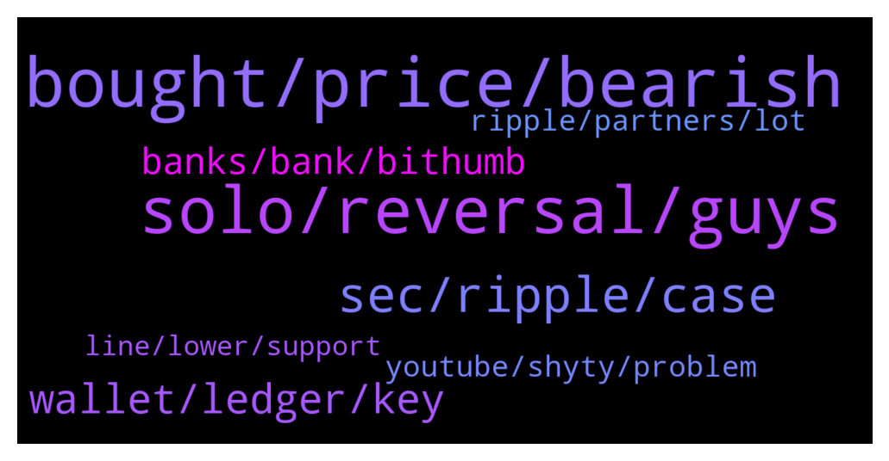

# **@Ripple**
 ## Analysis for **2022-01-25** - **2022-01-26**.

---

## 📊 **Basic Stats**

**n_messages_sent**: 242

---

---

## 🔝 **Top keywords and related messages**

1. **bought, price, bearish**

    @SaiNaveenChanumolu --- *Bought xrp 3 months back only to see it's dip week by week 🥲* **--->** [TG Discussion](https://t.me/Ripple/3045463)

    @xuavin --- *I am fairly new with xrp since 2021. Every single day on youtube a lot of them keep saying that xrp will pump, xrp will be to the moon and they will flip the switch on xrp .... and so on and I see nothing of such. I bought xrp at $1.30 and now it gone down more than a half.* **--->** [TG Discussion](https://t.me/Ripple/3045826)

    @pdogg123 --- *Apparently you must be new to xrp then.* **--->** [TG Discussion](https://t.me/Ripple/3045633)

    @Riiggo --- *10k wouldn't be life changing it might get you a nice car or maybe pay off some debt but you wouldn't be in xrp if that's all your after* **--->** [TG Discussion](https://t.me/Ripple/3046184)

    @xuavin --- *Good news that XRP will goes pass $5. But the bad news is not still 2025* **--->** [TG Discussion](https://t.me/Ripple/3045621)

    @Bharat_xrp --- *What are  the price prediction for xrp* **--->** [TG Discussion](https://t.me/Ripple/3045731)

2. **solo, reversal, guys**

    @Check10Check11 --- *You requested me to get a public profile pic so i now have one.* **--->** [TG Discussion](https://t.me/Ripple/3045873)

    @ibnusob666 --- *Lol , i dont know how to respon this* **--->** [TG Discussion](https://t.me/Ripple/3045781)

    @anuj90322 --- *Us risk tolerance determined by personality or circumstances?* **--->** [TG Discussion](https://t.me/Ripple/3046196)

    @Riiggo --- *The most successful people had to hit rock bottom first......the mind is very powerful and you don't know what you are capable of until your in that position* **--->** [TG Discussion](https://t.me/Ripple/3046204)

    @ReiTeh --- *True! But to each their own. Some ppl have higher risk tolerance* **--->** [TG Discussion](https://t.me/Ripple/3046194)

    @ReiTeh --- *Ohh this would be interesting. I will have the opportunity to test my emotional maturity.* **--->** [TG Discussion](https://t.me/Ripple/3046330)

3. **sec, ripple, case**

    @Cointh88 --- *XRP community baffled as Ripple loses another 3 weeks amid SEC’s 180º on Hinman’s speech  The plaintiff has made a 180º turn by suggesting that the speech wasn’t merely peripheral to actual policy formulation”, but was in fact an “essential link” in the SEC’s deliberative process with respect to Ether” and other digital assets.   https://financefeeds.com/xrp-community-baffled-ripple-loses-another-3-weeks-amid-secs-180o-hinmans-speech/* **--->** [TG Discussion](https://t.me/Ripple/3045814)

    @CasperLayer1 --- *Well with the new motion its clear law suit isnt ending anywhere soon Lawyer Deaton talked about atleast end Q2 begin Q3.  Sec got what they wanted. Im totally out until some New news. Money is Just stuck doing nothing* **--->** [TG Discussion](https://t.me/Ripple/3045985)

    @pdogg123 --- *Really !!!  There a little thing called a lawsuit filed against them* **--->** [TG Discussion](https://t.me/Ripple/3045872)

    @Jakes1993 --- *Is anyone else waiting for FED meeting outcome before making a move?* **--->** [TG Discussion](https://t.me/Ripple/3046260)

    @Jake_ripple_XRP --- *Sounds like perjury? What is the judge to think about the SEC saying Hinman speech is peripheral to actual policy formulation - and then saying it was an "essential link" in the SEC's deliberative process with respect to other digital assets?* **--->** [TG Discussion](https://t.me/Ripple/3045838)

    @gerrymchugh --- *And the video that surfaced of J.Clayton saying that Bill Hinman's speech was "our" official guidance... it's hard to believe a word they say.* **--->** [TG Discussion](https://t.me/Ripple/3045841)

4. **wallet, ledger, key**

    @Hermingwayy --- *Safepal hardware wallet is cool. But for software wallet, I can recommend Atomic wallet.* **--->** [TG Discussion](https://t.me/Ripple/3045591)

    @Cataneo02 --- *Well in that case paper back is the best choice the divice is just an extra lil tool* **--->** [TG Discussion](https://t.me/Ripple/3045914)

    @Cataneo02 --- *Those electric divices are not secure imo it's like a phone it could just not turn on all of a sudden for no reason* **--->** [TG Discussion](https://t.me/Ripple/3045910)

    @Jack0777 --- *Cheers I will look onto that. I'm using trust wallet at the moment* **--->** [TG Discussion](https://t.me/Ripple/3046156)

    @anuj90322 --- *Got it...will buy directly from ledger website* **--->** [TG Discussion](https://t.me/Ripple/3045541)

    @Cataneo02 --- *But that's not a problem I almost know my private key by memory* **--->** [TG Discussion](https://t.me/Ripple/3045927)

5. **banks, bank, bithumb**

    @xlmshark --- *as per btc, seems to be pretty much done.* **--->** [TG Discussion](https://t.me/Ripple/3046245)

    @Tinkabellagal --- *Bithumb to block crypto withdrawals to unverified private wallets  Bithumb users in South Korea have just two days to perform another round of KYC in order to whitelist their personal wallets, or crypto withdrawals will be blocked.  https://cointelegraph.com/news/bithumb-to-block-crypto-withdrawals-to-unverified-private-wallets* **--->** [TG Discussion](https://t.me/Ripple/3045812)

    @marianmp --- *But if they officially accept krypto it's everyone s Winn .....people get rich and banks ....but they are to gready to let ordinary people get rich ,cause then they won't borrow money from there banks and banks loose money ...* **--->** [TG Discussion](https://t.me/Ripple/3046268)

    @Futurenights --- *Look at the Bitcoin and then at stock market. 😉* **--->** [TG Discussion](https://t.me/Ripple/3045780)

    @Idiot_who_invested_crypto --- *Those crooks only looking ways to gain power over crypto and tax it to the death* **--->** [TG Discussion](https://t.me/Ripple/3045614)

    @Riiggo --- *This is crypto no one knows 🤷🏽‍♂️* **--->** [TG Discussion](https://t.me/Ripple/3045582)

6. **youtube, shyty, problem**

    @SVII_6 --- *Where did you see this? Is there a video link?* **--->** [TG Discussion](https://t.me/Ripple/3046308)

    @marianmp --- *You tube is a shyty place to receive infos sometimes* **--->** [TG Discussion](https://t.me/Ripple/3045470)

    @JustNNM --- *Twitter and youtube are not inside info* **--->** [TG Discussion](https://t.me/Ripple/3045756)

    @marianmp --- *YouTube is not the problem.....the problem are shyty youtouber s* **--->** [TG Discussion](https://t.me/Ripple/3045477)

    @lucinogenu --- *If “YouTube” says it it must be true* **--->** [TG Discussion](https://t.me/Ripple/3045474)

    @jarilitmanen1 --- *YouTube. 😂😂 like they have a clue* **--->** [TG Discussion](https://t.me/Ripple/3045441)

7. **ripple, partners, lot**

    @alfidanger --- *does xrp have multiple partners? is ripple x still running its business?* **--->** [TG Discussion](https://t.me/Ripple/3046277)

    @Russty007 --- *Xrp is probably the only major crypto that the Fed can put their hands on because it’s a US company... so it can also become the “gold Standard” of crypto... but in a sense it makes it centralized because it can be governed by laws of the state* **--->** [TG Discussion](https://t.me/Ripple/3046020)

    @gerrymchugh --- *XRP is less centralised that lot of people think, Ripple do not run majority of nodes - most are run by others. Lot of people confuse token ownership with centralisation, because Ripple hold a lot of XRP, but in reality BTC and ETH are also mostly owned by very few large wallets.* **--->** [TG Discussion](https://t.me/Ripple/3045961)

    @Jake_ripple_XRP --- *It seems there have been some government agencies that have given XRP high marks... like the Federal Reserve... Perhaps Biden's executive order to investigate and assess the crypto space will prove to be very good for XRP... Eternally hopeful!* **--->** [TG Discussion](https://t.me/Ripple/3045612)

    @JustNNM --- *XRP has no partners, never had. Ripple is still building partnerships and buildings its network use footprint.  All info is on Ripples website and in the pinned messages* **--->** [TG Discussion](https://t.me/Ripple/3046278)

    @OliverBurton --- *Hey guys, do you think that XRP will be listed on some sort of decentralized coingecko site?* **--->** [TG Discussion](https://t.me/Ripple/3046344)

8. **line, lower, support**

    @Briggslet --- *True.. the weekly chart shows we are on last year march support.. our resistance at present is geting lower and lower with every bounce. If we dont break through the resistance .. we are likely to drop through the support. Then lower prices are par for course.. and our next support line is at about 0.41* **--->** [TG Discussion](https://t.me/Ripple/3046321)

    @Jakes1993 --- *Do you think price will drop soon again? Any bad news out there?* **--->** [TG Discussion](https://t.me/Ripple/3045722)

    @Briggslet --- *Stochastic has not given a buy yet RSI is still in down trend line ADX still has buyers out of the market however sellers are also starting to dwindle. MACD is down Awsome oscilator is down .. no buy signal yet. We are hugging the bottom line of the bollinger bands. We are below the 30 moving average an just above 20p moving average. SAR parabole is also still in down trend* **--->** [TG Discussion](https://t.me/Ripple/3046322)

    @Voltaire123 --- *Nothing. We were going from 0.95$ dec 2021 to 0.6$ now.* **--->** [TG Discussion](https://t.me/Ripple/3046119)

    @Jodxb2311 --- *Every number you can think of has been mentioned in recent weeks as and months.  If you only care about the price.   Do a bit of research and ask yourself a set of questions.  Do you see value in the price today,  ask yourself what your expectations are for the coming weeks months and years based on your research.  Make a decision, buy, sell, HODL  We are all trading against one another at the end of the day.* **--->** [TG Discussion](https://t.me/Ripple/3045738)

    @ReiTeh --- *When the time is right. No one knows. But it will definitely hit 1 dollar* **--->** [TG Discussion](https://t.me/Ripple/3046337)

