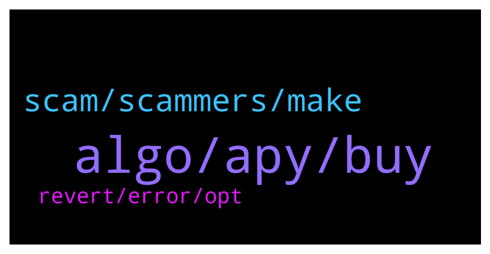

# **@algorand**
 ## Analysis for **2022-01-25** - **2022-01-26**.

---

## 📊 **Basic Stats**

**n_messages_sent**: 173

---

---

## 🔝 **Top keywords and related messages**

1. **algo, apy, buy**

    @monerowhale --- *Is this better than staking from your ledger Nano c* **--->** [TG Discussion](https://t.me/algorand/335395)

    @NightAlgorand --- *You can check it here https://www.algorand.com/ecosystem/use-cases* **--->** [TG Discussion](https://t.me/algorand/335215)

    @NightAlgorand --- *Hi there, you can download Algorand Wallet here https://algorandwallet.com/* **--->** [TG Discussion](https://t.me/algorand/335394)

    @ladadida --- *is this how u calculate the APY* **--->** [TG Discussion](https://t.me/algorand/335205)

    @mcmaxims --- *Yes, @NightAlgorand and @MackDenver doing a great job :)* **--->** [TG Discussion](https://t.me/algorand/335219)

    @jumpfetus --- *that's not exactly right. You deposit USD to Coinbase, then on Coinbase Pro you "deposit" the USD from your Coinbase account, THEN buy Algo on Pro and you can send it immediately* **--->** [TG Discussion](https://t.me/algorand/335313)

2. **scam, scammers, make**

    @MackDenver --- *If you receive such a dm, report them too* **--->** [TG Discussion](https://t.me/algorand/335270)

    @CryptoSLP --- *Thanks. I never do. Bunch of scammers thinking I'm some noob* **--->** [TG Discussion](https://t.me/algorand/335149)

    @auronsan --- *they fight for their life from money scam* **--->** [TG Discussion](https://t.me/algorand/335274)

    @Kendalljazz --- *I’ve gotten like 6 scam messages in last 30 minutes* **--->** [TG Discussion](https://t.me/algorand/335295)

    @hackman31 --- *They should change their information on the site* **--->** [TG Discussion](https://t.me/algorand/335280)

    @Awesome --- *So just carry on and ignore?* **--->** [TG Discussion](https://t.me/algorand/335269)

3. **revert, error, opt**

    @MackDenver --- *Can you try clearing your cache and try again?* **--->** [TG Discussion](https://t.me/algorand/335474)

    @Azcmichael --- *I have done that yet I can't opt in* **--->** [TG Discussion](https://t.me/algorand/335475)

    @Azcmichael --- *Admin please help I can't opt in to my Algorand wallet on tinyman* **--->** [TG Discussion](https://t.me/algorand/335472)

    @BBeniek --- *Hmm interesting, when I'm using LTE this error doesn't appear* **--->** [TG Discussion](https://t.me/algorand/335439)

    @MackDenver --- *Hello Beniek, Please make sure you are properly connected to the internet.* **--->** [TG Discussion](https://t.me/algorand/335435)

    @MackDenver --- *Maybe, hope you will find a better solution.* **--->** [TG Discussion](https://t.me/algorand/335263)

