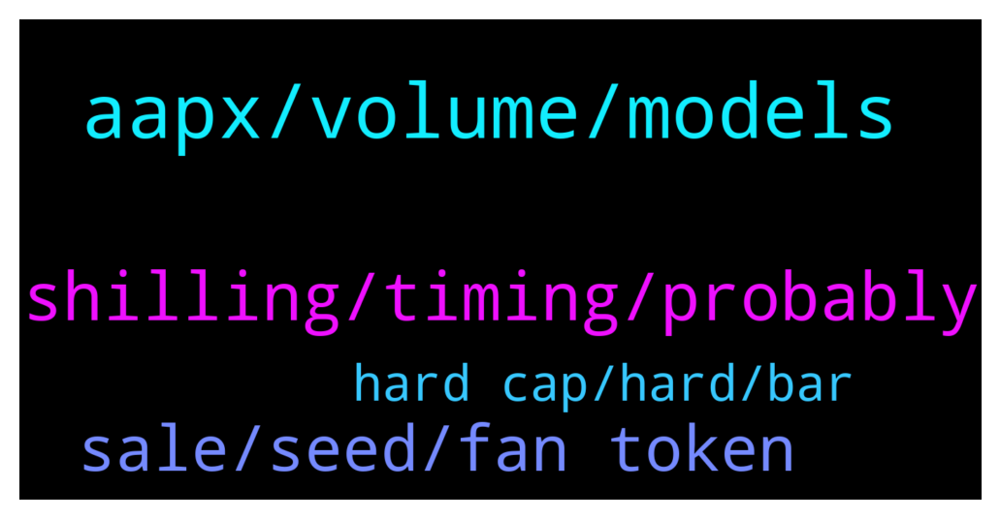

# **@ampnetapxchat**
 ## Analysis for **2022-01-21** - **2022-01-26**.

---

## 📊 **Basic Stats**

**n_messages_sent**: 59

---

---

## 🔝 **Top keywords and related messages**

1. **aapx, volume, models**

    @MelonHusk --- *Don't tell me Ampnet is raising more money?* **--->** [TG Discussion](https://t.me/ampnetapxchat/36814)

    @jakovtradingmentor --- *ofc if raise is successful, which seems like it is, a percentage of that raise is going to ampnet for aapx buybacks* **--->** [TG Discussion](https://t.me/ampnetapxchat/36817)

    @North --- *Fomo will increase as it gets towards  $500K. No way this doesn't get funded. Great news and hopefully we get some more details for AmpNet once we know it's going ahead* **--->** [TG Discussion](https://t.me/ampnetapxchat/36773)

    @matejmz --- *Yeah I expected more info. Also maybe give a recap what role AAPX has in this. What are the buybacks etc. There is hardly any community around AMPnet anymore, so we can't carry this and I guess most of the OGs don't want to shill anymore... Anyway it looks good that 40% was already sold.* **--->** [TG Discussion](https://t.me/ampnetapxchat/36743)

    @PFCBLic --- *Maybe we can have some basic function to understand impact on aapx in correlation with complete campaign  For example:  "If total volume of Vatreni campaign is fullfilled we expect N revenues that will be directed to buyback in volume of N or will be put for staking in volume of N and so on"?  I would say this is ok start regarding presales* **--->** [TG Discussion](https://t.me/ampnetapxchat/36744)

    @Tinus_Tussengas_1984 --- *I think he is asking which 70% you mean. I am also wondering where I can see that. I suppose you are referring to the funding of the post of 25 january from ampnet announcements?* **--->** [TG Discussion](https://t.me/ampnetapxchat/36804)

2. **shilling, timing, probably**

    @North --- *I didn't mean you guys 😂 that's what we are here for. And frankly we will probably do it anyway unless you say the timing is unwise* **--->** [TG Discussion](https://t.me/ampnetapxchat/36781)

    @jakovtradingmentor --- *but the community, you guys, you can do so if you're motivated to* **--->** [TG Discussion](https://t.me/ampnetapxchat/36780)

    @North --- *@jakovtradingmentor what do you think about timing of any shilling to Chiliz community? They obviously have aligned interests and so would probably be interested here too, but we should take care to not get ahead of ourselves* **--->** [TG Discussion](https://t.me/ampnetapxchat/36775)

    @North --- *Are we as the community allowed to talk about it here even or will posts be deleted? I had no idea it was even running yet, I thought you guys were still working on tokenomics and going to release more info* **--->** [TG Discussion](https://t.me/ampnetapxchat/36740)

    @jakovtradingmentor --- *could you elaborate by what you mean with shilling to chilliz community?* **--->** [TG Discussion](https://t.me/ampnetapxchat/36776)

    @mislavjavor --- *The community can of course promote* **--->** [TG Discussion](https://t.me/ampnetapxchat/36741)

3. **sale, seed, fan token**

    @Tinus_Tussengas_1984 --- *is there somewhere we can see the progress on the prudenzzafc fan token seed sale?* **--->** [TG Discussion](https://t.me/ampnetapxchat/36828)

    @Tinus_Tussengas_1984 --- *ah oke, so no actual token sale. thanks :) (Y)* **--->** [TG Discussion](https://t.me/ampnetapxchat/36831)

    @jakovtradingmentor --- *The only fan token seed sale ongoing right now on AMPnet platform is Vatreni Token* **--->** [TG Discussion](https://t.me/ampnetapxchat/36830)

    @mislavjavor --- *Once the token sale starts, we need to keep silent* **--->** [TG Discussion](https://t.me/ampnetapxchat/36734)

    @AvanaLu --- *40% of Vatreni tokens sold already 👍* **--->** [TG Discussion](https://t.me/ampnetapxchat/36731)

    @mislavjavor --- *As can we, when the sale is complete* **--->** [TG Discussion](https://t.me/ampnetapxchat/36742)

4. **hard cap, hard, bar**

    @mislavjavor --- *Hey all, the bar counts until hard cap is reached, the percentage until the hard cap i* **--->** [TG Discussion](https://t.me/ampnetapxchat/36808)

    @Tinus_Tussengas_1984 --- *thanks m8. that loading bar is looking strange btw... i assume its to see the progress in time to the deadline instead of the percentage of funding 😋* **--->** [TG Discussion](https://t.me/ampnetapxchat/36806)

    @mislavjavor --- *there should be a dot like this, where the soft cap is* **--->** [TG Discussion](https://t.me/ampnetapxchat/36812)

    @mislavjavor --- *so the percentage can be 130%, 150%, etc...* **--->** [TG Discussion](https://t.me/ampnetapxchat/36810)

    @AvanaLu --- *So softcap is 500k? What's the hardcap?* **--->** [TG Discussion](https://t.me/ampnetapxchat/36813)

