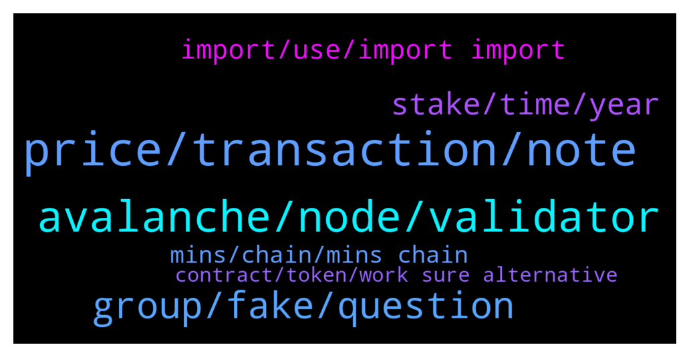

# **@avalancheavax**
 ## Analysis for **2022-01-25** - **2022-01-26**.

---

## 📊 **Basic Stats**

**n_messages_sent**: 154

---

---

## 🔝 **Top keywords and related messages**

1. **price, transaction, note**

    @Block_Monkey --- *Transfered some AVAX from my P chain to C chain. Does not show. The transaction shows that it is in Atomic Memory. What is that and how do I get it?* **--->** [TG Discussion](https://t.me/avalancheavax/324653)

    @BluSpark --- *My understanding is it shows the AVAX value but at the current dollar price* **--->** [TG Discussion](https://t.me/avalancheavax/324596)

    @Nicolas_A --- *you can click on the dollar value to show price either at time of transaction or current. Only shows for transactions that are old enough* **--->** [TG Discussion](https://t.me/avalancheavax/324597)

    @zoran --- *Hello. Can someone explain how it is possible that when I want to make some transactions on defi I have 0 avax required for transaction note.* **--->** [TG Discussion](https://t.me/avalancheavax/324322)

    @Andwolfski --- *Thank you.  So if you kept them on avalanche, they will always be a true 1:1 peg? Or could the price of weth on avax go below eth price?* **--->** [TG Discussion](https://t.me/avalancheavax/324321)

    @h4f123x --- *Hi what price did investors get in at for the $230m raise back in July 2021?* **--->** [TG Discussion](https://t.me/avalancheavax/324560)

2. **avalanche, node, validator**

    @Sephiroth --- *All Avalanche Validator Nodes hosted on @Allnodes were successfully updated to the latest 1.7.4 version. If you host your node there, no actions with node from your side are required. https://twitter.com/allnodes/status/1485849066789642240* **--->** [TG Discussion](https://t.me/avalancheavax/324420)

    @SOG231 --- *Permit me to ask this noob question please! What’s a validator node?* **--->** [TG Discussion](https://t.me/avalancheavax/324522)

    @jjfirh --- *Hi all, when running a validator node, would the private key be stored anywhere on the disk unencrypted, or it will be just in the memory during runtime?* **--->** [TG Discussion](https://t.me/avalancheavax/324517)

    @TheSEOdude --- *Heya, where can I find Dex aggregators list which supports Avalanche* **--->** [TG Discussion](https://t.me/avalancheavax/324473)

    @wow1234567890 --- *Hello, any idea of where to lock liquidity on Avalanche? TrustSwap isn't working on Avalanche since about 5 days* **--->** [TG Discussion](https://t.me/avalancheavax/324457)

    @mikiro --- *No! You only have to point the avalanche wallet to your validator’s node id and enter a few details such as lock up time. Then you sign that operation once with your private key* **--->** [TG Discussion](https://t.me/avalancheavax/324519)

3. **group, fake, question**

    @scarcitywhale --- *There’s an airdrop scam happening now that I’d like to report* **--->** [TG Discussion](https://t.me/avalancheavax/324553)

    @Nicolas_A --- *No but ref link which aren't allowed here* **--->** [TG Discussion](https://t.me/avalancheavax/324436)

    @scarcitywhale --- *yes. Horrible. Stole tokens from me because it’s 100% same branding/name everything as this group* **--->** [TG Discussion](https://t.me/avalancheavax/324556)

    @Liam --- *Something very strange is happening, all my money is gone* **--->** [TG Discussion](https://t.me/avalancheavax/324276)

    @Andwolfski --- *No,  but explain this one to me. This guy provided a random seed phrase, how does he get your money?* **--->** [TG Discussion](https://t.me/avalancheavax/324323)

    @TheSEOdude --- *Need more haha if there are.* **--->** [TG Discussion](https://t.me/avalancheavax/324476)

4. **stake, time, year**

    @p123452 --- *Hey Nicolas! Thanks for the reply! Is there any way to quantify how much more exactly eg. a formula to calculate that yield as a function of staking time* **--->** [TG Discussion](https://t.me/avalancheavax/324628)

    @João --- *I still dont understand very well about that stake* **--->** [TG Discussion](https://t.me/avalancheavax/324498)

    @p123452 --- *Hey guys! Does anybody know if the staking rewards have higher apy if I stake longer in any way? e.g. do I get more rewards if I stake 1 full year compared to 3 months at a time for an entire year? or do I get the same rewards?* **--->** [TG Discussion](https://t.me/avalancheavax/324626)

    @dantheman2012 --- *How do i participate in Avalaunch idos? Is there a tier structure?* **--->** [TG Discussion](https://t.me/avalancheavax/324348)

    @p123452 --- *That is great! Thank you! Do you, by any chance, know how they calculate the reward apy though?* **--->** [TG Discussion](https://t.me/avalancheavax/324637)

    @Nicolas_A --- *Yes it’s a bit higher when you stake longer. You get more if you stake 1 year than compounding 3 months at a time* **--->** [TG Discussion](https://t.me/avalancheavax/324627)

5. **import, use, import import**

    @Block_Monkey --- *I checked each option for chain import, but all say nothing to import.* **--->** [TG Discussion](https://t.me/avalancheavax/324657)

    @oathtobarbatos --- *Check this tutorial, you'll find useful information there! https://docs.avax.network/build/tutorials/nodes-and-staking/* **--->** [TG Discussion](https://t.me/avalancheavax/324523)

    @oathtobarbatos --- *Yeah, use the import option on the Advanced tab* **--->** [TG Discussion](https://t.me/avalancheavax/324655)

    @gfrancaviglia --- *try to update the balance, and if it doesn't show correctly, try to use the IMPORT function in the advanced menù* **--->** [TG Discussion](https://t.me/avalancheavax/324654)

    @faggins --- *Ty will give it a try.* **--->** [TG Discussion](https://t.me/avalancheavax/324537)

    @Nicolas_A --- *Copy your Metamask address and use it for C chain withdrawal on Kucoin* **--->** [TG Discussion](https://t.me/avalancheavax/324287)

6. **mins, chain, mins chain**

    @EJoker99 --- *https://docs.avax.network/build/tutorials/nodes-and-staking/run-avalanche-node  follow this page ,when synchronization is complete,can use RPC-API Service with C-chain ?* **--->** [TG Discussion](https://t.me/avalancheavax/324389)

    @sen666 --- *i has wait for 5days, but it not completed* **--->** [TG Discussion](https://t.me/avalancheavax/324643)

    @sen666 --- *everybody,  how long is the node completed,   usualy* **--->** [TG Discussion](https://t.me/avalancheavax/324550)

    @sen666 --- *who know,   i build the node, and it has sync in 5 days.  it very slowly.   i see the C-chain is not complete,  and the ETA will be more and more,  it increase 80h to 160h,   this's right?* **--->** [TG Discussion](https://t.me/avalancheavax/324549)

    @Nicolas_A --- *If your VPS isn't super fast that's not anormal. Faster syncing is coming soon* **--->** [TG Discussion](https://t.me/avalancheavax/324644)

    @sen666 --- *how long the avax node is sync completed?* **--->** [TG Discussion](https://t.me/avalancheavax/324548)

7. **contract, token, work sure alternative**

    @partybara --- *Here's a direct link to the mint: https://nfts.partyswap.io/* **--->** [TG Discussion](https://t.me/avalancheavax/324350)

    @oathtobarbatos --- *Joe LP token? I'd suggest you to ask in their Telegram channel* **--->** [TG Discussion](https://t.me/avalancheavax/324534)

    @Nicolas_A --- *If Team Finance doesn't work I'm not sure I don't know an alternative beside doing it with your own smart contract* **--->** [TG Discussion](https://t.me/avalancheavax/324459)

    @clownslice --- *Sorry, I didnt realise  For anyone interested in the wallet you can visit www.nash.io to check it out 👍🏼* **--->** [TG Discussion](https://t.me/avalancheavax/324444)

    @emmx37 --- *Please can someone give me the contract address of MORE token?* **--->** [TG Discussion](https://t.me/avalancheavax/324666)

