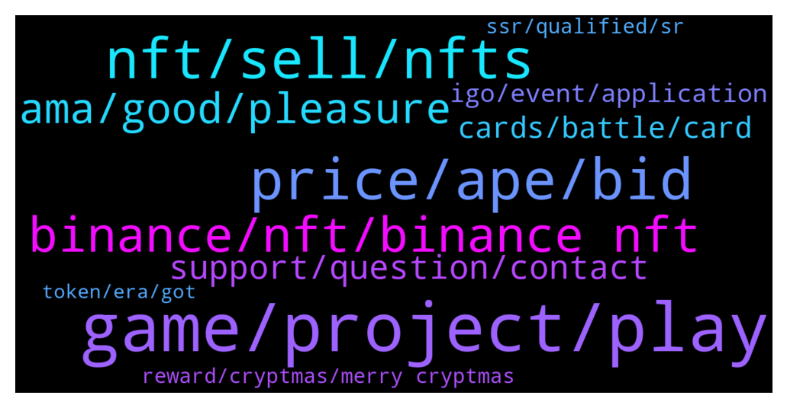

# **@binancenfts**
 ## Analysis for **2022-01-25** - **2022-01-26**.

---

## 📊 **Basic Stats**

**n_messages_sent**: 450

---

---

## 🔝 **Top keywords and related messages**

1. **game, project, play**

    @Bikase --- *Is your smart contract audited? Does Era7 aims to be a truly global project? Any plan to integrate local languages support? Finnally, is your platform open to everyone where small investor/users like me are given oppurtunity to join?  (Q). What is Com2uS, NCsoft, Nexon, and Netmarble Let's explain to me??  #ERA7  .* **--->** [TG Discussion](https://t.me/binancenfts/444232)

    @cocoteaaa --- *I’ve seen the roadmap from your website and I was amazed that it was up to 2026. My question is how confident are you that your team will able to achieve what’s in your roadmap?  #ERA7 @DmitriPro* **--->** [TG Discussion](https://t.me/binancenfts/444266)

    @cryptotwillight --- *What are most key and unique features you add on the game Era7 that's makes it the most  unique than other GameFi projects  ?? #Era7* **--->** [TG Discussion](https://t.me/binancenfts/444234)

    @Bikase --- *Anyone give me era7 website link* **--->** [TG Discussion](https://t.me/binancenfts/444000)

    @arianagrinder89 --- *just google it. top result is official era7 website* **--->** [TG Discussion](https://t.me/binancenfts/444016)

    @Dinc3 --- *Hi! @DmitriPro   The main problem on NFT Card Games is balance! Most of the games are Play to Win so how much you spend money, that much you can earn. How is this with ERA 7? Do you plan to make your game as fair as possible?  #ERA7* **--->** [TG Discussion](https://t.me/binancenfts/444246)

2. **price, ape, bid**

    @T_Pecunia --- *👀nice floor price rising on these quick* **--->** [TG Discussion](https://t.me/binancenfts/443015)

    @unsiiii --- *175$  more expensive if you look at others* **--->** [TG Discussion](https://t.me/binancenfts/443973)

    @MartinYosef --- *it's most in most favorite both in the lowest price* **--->** [TG Discussion](https://t.me/binancenfts/442505)

    @limeandginger --- *New BDSM bears - 29 BUSD!* **--->** [TG Discussion](https://t.me/binancenfts/442840)

    @Inosuke1 --- *Cheap on market throw your bids* **--->** [TG Discussion](https://t.me/binancenfts/443755)

    @stylesses --- *Let’s go bid  YONDU▵ 27╳55 ▵ NFT PRIDE* **--->** [TG Discussion](https://t.me/binancenfts/443667)

3. **nft, sell, nfts**

    @John_superhuman --- *How can I transfer BUSD to nft marketplace account ?? I want to buy nft* **--->** [TG Discussion](https://t.me/binancenfts/443560)

    @Mjjfnnfnfffjk --- *who can teach me how to buy nft* **--->** [TG Discussion](https://t.me/binancenfts/443036)

    @ChibiMaya_bnb --- *If you bought when you sell then It is discounted 1 or 2% only after nft is sold* **--->** [TG Discussion](https://t.me/binancenfts/443131)

    @unsiiii --- *am selling cheap.  Crypton NFT2* **--->** [TG Discussion](https://t.me/binancenfts/443968)

    @Larissa Popow :) --- *lol well i love nfts 😊* **--->** [TG Discussion](https://t.me/binancenfts/443763)

    @arianagrinder89 --- *Still no demand for your nfts? Last time we talked you were thinking of nft fragmentation* **--->** [TG Discussion](https://t.me/binancenfts/443854)

4. **binance, nft, binance nft**

    @AbsHamza --- *Beginning to look like binance rugged us! How is it so hard to get answers that are seemingly so simple? @Sahib_BNB @captainbnb @Dean_Khan* **--->** [TG Discussion](https://t.me/binancenfts/442828)

    @LuciferJones --- *I did, as I said in my initial message and after they did an internal check, they said that Binance will be distributing the BigTime Mystery box to my Binance profile* **--->** [TG Discussion](https://t.me/binancenfts/442548)

    @BLyricss --- *please help me to create NFT on binance exchange* **--->** [TG Discussion](https://t.me/binancenfts/442703)

    @ChibiMaya_bnb --- *on binance only authorized creators but you can mint, upload them, on partner through wallets, featured.market* **--->** [TG Discussion](https://t.me/binancenfts/443590)

    @Its_me_mhs --- *But,this site announced that is a a produce of binance & will be listed soon..* **--->** [TG Discussion](https://t.me/binancenfts/442817)

    @LuciferJones --- *From Paid Network's team, but they said that they are collecting the winners info (email and Binance ID) and will forward them to Binance.* **--->** [TG Discussion](https://t.me/binancenfts/442538)

5. **ama, good, pleasure**

    @Chritslonas --- *Really It's a great AMA, it was a big pleasure to me...* **--->** [TG Discussion](https://t.me/binancenfts/444332)

    @Bikase --- *I think you are my inspiration also* **--->** [TG Discussion](https://t.me/binancenfts/444532)

    @lulu22505 --- *How are you? You are my inspiration sir🥰* **--->** [TG Discussion](https://t.me/binancenfts/444526)

    @devonrog --- *I see ... Wondering y u listed so low🤭* **--->** [TG Discussion](https://t.me/binancenfts/442506)

    @Naikgauresh481 --- *Great Ama  @DmitriPro  @Kenikky  Thank you* **--->** [TG Discussion](https://t.me/binancenfts/444315)

    @Bikase --- *It’s really good and informative ama* **--->** [TG Discussion](https://t.me/binancenfts/444320)

6. **support, question, contact**

    @docyeii --- *how?  the admins from MNA says to ask here  then u say we ask the support 😑* **--->** [TG Discussion](https://t.me/binancenfts/442811)

    @Dean_Khan --- *You can also confirm it from support team* **--->** [TG Discussion](https://t.me/binancenfts/442809)

    @Fang47 --- *Sorry I have not enough knowledge about it.Admin will help you☺️* **--->** [TG Discussion](https://t.me/binancenfts/443737)

    @AbsHamza --- *Some say they have, I beg to differ! We’re waiting for confirmation* **--->** [TG Discussion](https://t.me/binancenfts/443019)

    @RealJassia --- *Can you please clear your question?* **--->** [TG Discussion](https://t.me/binancenfts/444061)

    @razomaru --- *I reach their CS and this is what they said* **--->** [TG Discussion](https://t.me/binancenfts/442873)

7. **cards, battle, card**

    @DmitriPro --- *Good question. In one Master card is locked 30 Battle cards. That's a reason, because relatively to the game itself, you are purchasing whole set of cards, just mint and play* **--->** [TG Discussion](https://t.me/binancenfts/444288)

    @DmitriPro --- *GOT utility:  1. The synthesis upgrade of the battle card requires the consumption of GOT and ERA Token, and more vital cards can get more rewards in the game.  2. Resetting the Master card also requires GOT 3. There will be GOT rewards for daily tasks and weekly competitive rankings.* **--->** [TG Discussion](https://t.me/binancenfts/444178)

    @DmitriPro --- *After a player enters the game, they will need to purchase an NFT master card to summon the battle card.  After having 30 battle cards, he can engage in PVE and PVP battles. To synthesize higher-level cards, the battle card needs to consume GOT and ERA Token.  Thus, if you have a stronger card, you can get more rewards in the game.  GOT can be obtained through the trading market as an essential resource in the game. In summary, below are the use-cases of each token:* **--->** [TG Discussion](https://t.me/binancenfts/444176)

    @DmitriPro --- *Especially in the PvE mode that requires the use of different strategic combinations of Battle Cards to compete favorably.  Here are some additional info to know about the Master Cards and NFT boxes.  Each Box contains a random Master Card from 28 characters in 7 races in the game. MasterCard has four types: Common, Rare, Epic and Legendary. The probability of obtaining a Master Card of a particular attribute: Legend 1.2%, Epic7.8%, Rare 33%, Common 58%. Before the game goes live, holder of the NFT boxes will need to unseal the boxes.  Lastly, the Master Cards will be available for sale in the marketplace.* **--->** [TG Discussion](https://t.me/binancenfts/444164)

    @DmitriPro --- *Master Cards will be valuable to holders in different ways. They can be used for accessing the PVP mode, PVE mode, Expert Alliance (daily) mode, Ranked competitions (monthly) and World Cups (fortnightly).* **--->** [TG Discussion](https://t.me/binancenfts/444162)

    @DmitriPro --- *MasterCards will also be used to summon Battle Cards everyday.  Battle Card has mining function. They will also be used to attack and defend with the passing of each round. Some cards will have characteristic enabling the effects that transcend rounds. Moreover, Battle Card are of four different qualities: common, rare, epic and legendary. The value of the Battle Cards stem from the fact that they are a mandatory requirement for playing the game.* **--->** [TG Discussion](https://t.me/binancenfts/444163)

8. **igo, event, application**

    @DmitriPro --- *We have an even bigger event that is slated for February - the launch of the Era 7 Alpha Version test.  During all of these events, we will be gradually unveiling the game's specific details via news releases that will cover gameplay teasers, staking programs, and more.  For a detailed guide on how to participate in the IGO, please take some time to read the post below.  https://www.binance.com/en/blog/nft/binance-nft-introducing-a-fair--equal-way-to-buy-nfts-421499824684903261* **--->** [TG Discussion](https://t.me/binancenfts/444199)

    @Kenikky --- *So about this exciting IGO event you're launching* **--->** [TG Discussion](https://t.me/binancenfts/444168)

    @DmitriPro --- *This is the best time to participate in IGO (Initial Game Offering)* **--->** [TG Discussion](https://t.me/binancenfts/444166)

    @DmitriPro --- *Right away, I would like to state that we have spent the last few weeks putting different things together to prepare adequately for our IGO sale event.* **--->** [TG Discussion](https://t.me/binancenfts/444140)

    @DmitriPro --- *We are currently in the stage of the upcoming release of the whitelist test of the main version of the game and our IGO comes up later this month. Specifically on the 12:00 PM UTC ,27th of January.* **--->** [TG Discussion](https://t.me/binancenfts/444113)

    @cocoteaaa --- *Looking forward on the IGO ❤️* **--->** [TG Discussion](https://t.me/binancenfts/444312)

9. **reward, cryptmas, merry cryptmas**

    @bngenterprises --- *Thnx for cryptmas metaverse mystery box reward, I get  Alice - 1 Gala - 0.4 CHR - 16.90 ENJ - 6.19 SAND - 4* **--->** [TG Discussion](https://t.me/binancenfts/443722)

    @rizanzan --- *The rewards have not yet been given.* **--->** [TG Discussion](https://t.me/binancenfts/442890)

    @docyeii --- *looks like no reward has been distributed yet @Dean_Khan* **--->** [TG Discussion](https://t.me/binancenfts/442808)

    @razomaru --- *Hello, I've been holding this for so long and I haven't got the rewards yet. Any admin here can accommodate me with my issue.* **--->** [TG Discussion](https://t.me/binancenfts/442777)

    @Sashko123z --- *In the description of the promotion, it was said that the reward will be in the form of a set of 8 coins, and not 2* **--->** [TG Discussion](https://t.me/binancenfts/443384)

    @tomtraan --- *When will the Merry Cryptmas Mystery Box reward distributed?* **--->** [TG Discussion](https://t.me/binancenfts/442731)

10. **ssr, qualified, sr**

    @Boobz --- *So I have 2 ssr and 4 gala Sr and didn't receive even half a cent :(* **--->** [TG Discussion](https://t.me/binancenfts/443664)

    @AbsHamza --- *Think that’s probably it. I had same plus 1 SSR which I got some ENJ and 1 Alice token* **--->** [TG Discussion](https://t.me/binancenfts/443381)

    @Thien --- *I think 2 ssr and 4sr still have qualified for ssr collection and  sr collection by the rule, right?* **--->** [TG Discussion](https://t.me/binancenfts/443868)

    @AbsHamza --- *Wow 😳 sorry to hear that, they weren’t listed at those times? Honestly don’t know how they’ve done their calculations but def odd if you’ve had them that long* **--->** [TG Discussion](https://t.me/binancenfts/443818)

    @Boobz --- *Yeah iv had them since the 26th of Dec* **--->** [TG Discussion](https://t.me/binancenfts/443816)

    @Boobz --- *I just talked to support about the distribution and I was told that  Each user is only qualified for only one sub promotion.. meaning if you have 2SSR and 4SR you are only eligible for the SSR prize pool not both or all 3..* **--->** [TG Discussion](https://t.me/binancenfts/443848)

