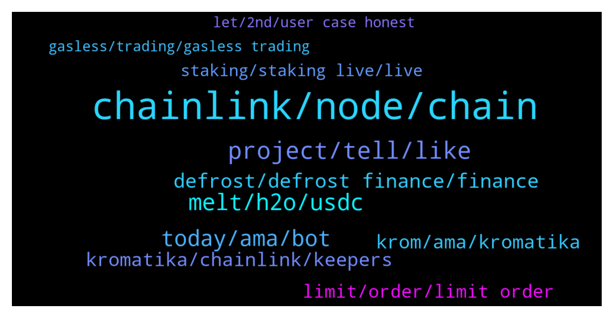

# **@chainlinkofficial**
 ## Analysis for **2022-01-25** - **2022-01-26**.

---

## 📊 **Basic Stats**

**n_messages_sent**: 229

---

---

## 🔝 **Top keywords and related messages**

1. **chainlink, node, chain**

    @Linkederic --- *The LINK token is used to pay Chainlink node operators for their oracle services (on-chain data aggregation and submission & off-chain computation services). In addition, once Chainlink staking goes live, Chainlink node operators will be able to deposit a specific amount of LINK as collateral in order to be elegible to service specific requests. This was first outlined in the original whitepaper.  See also: https://blog.chain.link/explicit-staking-in-chainlink-2-0/* **--->** [TG Discussion](https://t.me/chainlinkofficial/368740)

    @Sylvarantt --- *If you execute your plans properly I can see how you could easily become a specialized data provider node. I'd strongly suggest hopping onto our technical Discord server if you have questions along the way:  https://chain.link/discord* **--->** [TG Discussion](https://t.me/chainlinkofficial/369405)

    @marcromeron --- *Hi guys! If you're a newcomer and want to know more about Chainlink I'll host an AMA at 3 pm UTC. Check this post: https://twitter.com/stalkerscrypto/status/1484879861810622471?s=21* **--->** [TG Discussion](https://t.me/chainlinkofficial/369432)

    @Linkederic --- *China has a telegram group, it’s called @chainlinkfans (unofficial) and please also feel free to check out our Chinese communities (official) here:  https://blog.chain.link/chainlink-chinese-communities/* **--->** [TG Discussion](https://t.me/chainlinkofficial/369291)

    @gicappaemme --- *Hello guys. I am new to ChainLink and I am literally amazed by it. I have a question: if the most of its infrastructures is built on Ethereum Mainnet, would it make sense to run a node on Polygon or another EVM Compatible Chain? There would be a request in that case? Hope you can answer me! Thank you all 🙏* **--->** [TG Discussion](https://t.me/chainlinkofficial/369389)

    @Sandeep_9879 --- *Why chainlink 2.o is not covered CCIP* **--->** [TG Discussion](https://t.me/chainlinkofficial/368987)

2. **project, tell, like**

    @DefiMichele --- *I'd actually like to start with two recent news we have had. Last week we have initialized our forum and governance mechanism, with a first vote already passed and implemented (within 24h from the vote if I may brag!)* **--->** [TG Discussion](https://t.me/chainlinkofficial/368947)

    @marcromeron --- *Where can the audience follow you and your project?* **--->** [TG Discussion](https://t.me/chainlinkofficial/368964)

    @Joypokkamol --- *What’s next on your project’s roadmap that we may expect soon?* **--->** [TG Discussion](https://t.me/chainlinkofficial/369544)

    @Joypokkamol --- *As always, we are interested in what makes your project special?* **--->** [TG Discussion](https://t.me/chainlinkofficial/369516)

    @Joypokkamol --- *Before we go into the details, could you please introduce yourself and tell us a bit of your background?* **--->** [TG Discussion](https://t.me/chainlinkofficial/369505)

    @DefiMichele --- *From that moment on, we focused on finding a way to create a project that would be self-sustainable in the long run and provide benefits to the community.* **--->** [TG Discussion](https://t.me/chainlinkofficial/368872)

3. **melt, h2o, usdc**

    @Lukasz --- *hi I have questions this coin is deflationary?? it burning mechanism?* **--->** [TG Discussion](https://t.me/chainlinkofficial/368633)

    @DefiMichele --- *If users mint their own H2O and farm MELT, they are at no risk of loss, as opposed to buy MELT on the market* **--->** [TG Discussion](https://t.me/chainlinkofficial/368934)

    @DefiMichele --- *So to recap, you deposit LPs on other paltforms - get yields - get H2O - get MELT - get more MELT & USDC - boost your H2O to get even more MELT* **--->** [TG Discussion](https://t.me/chainlinkofficial/368907)

    @DefiMichele --- *Once users have staked, they can use sMELT (staked form of MELT) to go back and boost their minting APY.* **--->** [TG Discussion](https://t.me/chainlinkofficial/368906)

    @DefiMichele --- *Once users have H2O, our stablecoin, they can use it to farm rewards in MELT (our governance token) which can then be staked in farms and pools, both on our platform or on other projects (like trader joe.)* **--->** [TG Discussion](https://t.me/chainlinkofficial/368877)

    @DefiMichele --- *Let us suppose you have 10k USDC on Benqi. You can commit those qiUSDC to Defrost and retain all of thei yields on those from Benqi itself, while getting H2O and farming MELT. You lose nothing but a small stability fee.* **--->** [TG Discussion](https://t.me/chainlinkofficial/368898)

4. **today, ama, bot**

    @Joypokkamol --- *Hi everyone, please be ready in 10 minutes! https://twitter.com/marcromerona/status/1485663625499009029* **--->** [TG Discussion](https://t.me/chainlinkofficial/369481)

    @Joypokkamol --- *Alright! I won’t take any more of your valuable time. Thank you very much, Vladimir for today.* **--->** [TG Discussion](https://t.me/chainlinkofficial/369578)

    @DefiMichele --- *Thank you Mark for front-running your bot and sharing some images of ours 🤝* **--->** [TG Discussion](https://t.me/chainlinkofficial/368939)

    @DefiMichele --- *hi everybody, excited to be here 😃 Thank you for having me* **--->** [TG Discussion](https://t.me/chainlinkofficial/368861)

    @marcromeron --- *Welcome and thank you for your time today.* **--->** [TG Discussion](https://t.me/chainlinkofficial/368860)

    @Joypokkamol --- *Happy to have you with us today.* **--->** [TG Discussion](https://t.me/chainlinkofficial/369509)

5. **defrost, defrost finance, finance**

    @DefiMichele --- *You're not the first one asking I must say! We came up with the name Defrost as a branding strategy. Because we launched on AVAX - and as of now we are only available there - we wanted something that recalled snow and ice. So we are Defrost Finance, our stablecoin is H2O and our governance token is MELT (Defrost your LPs to MELT the Avalanche and get H2O 🔥)* **--->** [TG Discussion](https://t.me/chainlinkofficial/368881)

    @DefiMichele --- *... and we came up with Defrost!* **--->** [TG Discussion](https://t.me/chainlinkofficial/368873)

    @marcromeron --- *Joining us from the Defrost Finance team, we have Michele - @DefiMichele.* **--->** [TG Discussion](https://t.me/chainlinkofficial/368859)

    @CryptoDefiPhoenix --- *Is there a price discussion group?* **--->** [TG Discussion](https://t.me/chainlinkofficial/368653)

    @marcromeron --- *Do you have any demo video about Defrost Finance platform?* **--->** [TG Discussion](https://t.me/chainlinkofficial/368909)

    @marcromeron --- *A lot of info in here.  I'm just curious about the name of the project. Why Defrost?* **--->** [TG Discussion](https://t.me/chainlinkofficial/368880)

6. **krom, ama, kromatika**

    @Joypokkamol --- *What is the best way for someone watching today to get started with Kromatika?* **--->** [TG Discussion](https://t.me/chainlinkofficial/369538)

    @Zibbaay --- *Do we post the questions somewhere before the AMA or will we just ask here directly for the KROMATIKA team?* **--->** [TG Discussion](https://t.me/chainlinkofficial/368735)

    @Joypokkamol --- *I am just curious about Krom-E. Could you please tell us who is Krom-E?* **--->** [TG Discussion](https://t.me/chainlinkofficial/369553)

    @Joypokkamol --- *Nice! Lastly, where can the audience follow Kromatika and stay updated?* **--->** [TG Discussion](https://t.me/chainlinkofficial/369555)

    @Joypokkamol --- *AMA with Kromatika today at 10 am (ET)  https://twitter.com/marcromerona/status/1485663625499009029* **--->** [TG Discussion](https://t.me/chainlinkofficial/369418)

    @bigbrofly --- *Here for the $KROM AMA :)* **--->** [TG Discussion](https://t.me/chainlinkofficial/369494)

7. **kromatika, chainlink, keepers**

    @terranjourneys --- *Chainlink keepers are being used by kromatika* **--->** [TG Discussion](https://t.me/chainlinkofficial/369595)

    @Sylvarantt --- *Forwarding it!  Carevski: An interesting fact is that Kromatika Protocol was part of Chainlink’s Fall hackathon back in September/November 2021. We had the idea already refined so we applied for the hackathon. You can find our submission here: https://devpost.com/software/kromatika, along with a small demo. Kromatika has won the “on the rise” reward at that time and here we are now rising :). Even then we knew Chainlink could be part of our solution. This is where our interest in Chainlink started and grew to be a collaboration.* **--->** [TG Discussion](https://t.me/chainlinkofficial/369531)

    @Joypokkamol --- *We will have a community Q&A with Kromatika in just a few moments, which recently announced that it integrates Chainlink Keepers to secure and automate limit order functionality in a decentralized environment. https://twitter.com/Smart_Contract/status/1483801417190101001?s=20* **--->** [TG Discussion](https://t.me/chainlinkofficial/369488)

    @carevski --- *Kromatika has also deployed all its smart contracts and integrated with Chainlink keepers on Ethereum mainnet. We are only waiting on the final security audit with Certik to complete before we open the protocol to everyone.* **--->** [TG Discussion](https://t.me/chainlinkofficial/369543)

    @carevski --- *so a lots of interesting integrations happening between Kromatika and Chainlink behind the scene.* **--->** [TG Discussion](https://t.me/chainlinkofficial/369539)

    @Joypokkamol --- *It is fascinating to see Kromatika Integrate with Chainlink Keepers.* **--->** [TG Discussion](https://t.me/chainlinkofficial/369527)

8. **limit, order, limit order**

    @John --- *what makes this product different than other limit order solutions?* **--->** [TG Discussion](https://t.me/chainlinkofficial/369564)

    @carevski --- *- There is no risk for sandwich attacks or swap price manipulations, - Since limit orders are implemented as liquidity provision around a given limit price, there are additional LP fees EARNED instead* **--->** [TG Discussion](https://t.me/chainlinkofficial/369524)

    @carevski --- *- The limit orders are not subject to any swap fees,  - There is no price slippage as found in AMM,* **--->** [TG Discussion](https://t.me/chainlinkofficial/369523)

    @carevski --- *Traditionally a limit order trade is achieved by doing a swap. With these two new concepts, a swap can be avoided and a trade can be done differently.* **--->** [TG Discussion](https://t.me/chainlinkofficial/369518)

    @carevski --- *Limit orders are not a new concept, they exist in centralized exchanges and also to some degree on decentralized exchanges as well.* **--->** [TG Discussion](https://t.me/chainlinkofficial/369513)

    @carevski --- *In order to have a sound limit trade system timing is everything. Basically, once a limit order reaches the target price, that limit order needs to be closed. This is where we rely on Chainlink Keepers to do what they are designed to do and help us close and fulfill eligible limit orders.* **--->** [TG Discussion](https://t.me/chainlinkofficial/369536)

9. **staking, staking live, live**

    @Sandeep_9879 --- *Dear chainlink team , what are next focussing projects after Staking and CCIP* **--->** [TG Discussion](https://t.me/chainlinkofficial/368984)

    @manhhhg --- *How can I see how much LINK one node staking?* **--->** [TG Discussion](https://t.me/chainlinkofficial/369606)

    @bjk_krtl --- *Can you give information about the link? How to stake?* **--->** [TG Discussion](https://t.me/chainlinkofficial/369246)

    @Cryptodjens --- *Any idea when the. Staking can go live?* **--->** [TG Discussion](https://t.me/chainlinkofficial/368761)

    @Linkederic --- *Staking is not yet live https://t.me/chainlinkofficial/364360* **--->** [TG Discussion](https://t.me/chainlinkofficial/369608)

    @Linkederic --- *Staking is not yet live. This article provides an overview of explicit staking from the Chainlink 2.0 Whitepaper. This presentation by Sergey discusses staking and the difference between implicit and explicit staking, while in this other presentation Sergey announced the team is planning to implement some form of staking in 2022.  As a rule the team doesn’t offer timelines for development targets. You can follow development progress via github.  Anything you find out there claiming to be "LINK staking" is actually some form of either lending or yield farming, which is out of the scope of this channel.* **--->** [TG Discussion](https://t.me/chainlinkofficial/369248)

10. **let, 2nd, user case honest**

    @Joypokkamol --- *Here is the short demo: https://twitter.com/KromatikaFi/status/1477698017012731905* **--->** [TG Discussion](https://t.me/chainlinkofficial/369541)

    @DefiMichele --- *We want users to take as much responsibility as possible 😃* **--->** [TG Discussion](https://t.me/chainlinkofficial/368950)

    @DefiMichele --- *Looks like you guys have built a heck of a user case!* **--->** [TG Discussion](https://t.me/chainlinkofficial/368927)

    @DefiMichele --- *To be honest, our devs have been forcing us to do it 😂* **--->** [TG Discussion](https://t.me/chainlinkofficial/368924)

    @marcromeron --- *Let's move to the 2nd one* **--->** [TG Discussion](https://t.me/chainlinkofficial/368885)

    @marcromeron --- *Let's start with our first question....* **--->** [TG Discussion](https://t.me/chainlinkofficial/368868)

