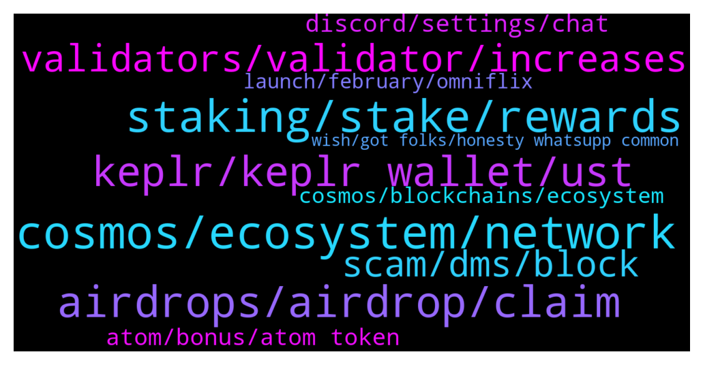

# **@cosmosproject**
 ## Analysis for **2022-01-25** - **2022-01-26**.

---

## 📊 **Basic Stats**

**n_messages_sent**: 395

---

---

## 🔝 **Top keywords and related messages**

1. **cosmos, ecosystem, network**

    @AtomDragon --- *Oh Hi Zoltan. I see you are hard at work, here, as usual. Cosmos network is in good hands with you sir. (I always thought you were a slightly better admin than jazz)* **--->** [TG Discussion](https://t.me/cosmosproject/481284)

    @waynefong --- *Hi everyone,  the latest weekly ⚛ Cosmos ⚛ stats is here. 👇  🌎 https://twitter.com/kysenpool/status/1485831043659616257?s=21* **--->** [TG Discussion](https://t.me/cosmosproject/480674)

    @ClintJ007 --- *@CoinMarketCap How come Cosmos is never listed as a top 100 gainer on your homepage? Seems suspicious 🧐 #cosmos $atom https://t.co/xeFiMEn3J7* **--->** [TG Discussion](https://t.me/cosmosproject/480504)

    @ZoltanAtom --- *Hi there,please join to Cosmos discord for your technical questions ;  https://discord.gg/vcExX9T* **--->** [TG Discussion](https://t.me/cosmosproject/481246)

    @jugadornumero12cabj --- *Hello! We did a Cosmos Ecosystem proposal tracker! It's a #Telegram bot that tracks new proposals in 27 networks. ——- more info here: https://twitter.com/CitadelDAO/status/1484984862268346368* **--->** [TG Discussion](https://t.me/cosmosproject/480788)

    @ZoltanAtom --- *Hello there,the best way is to be stay updated latest news keeping in touch community. Follow Cosmos announcement channel, Join Ecosystem channel! And also check at pinned message other Cosmos community groups.   https://t.me/CosmosEcosystemChat* **--->** [TG Discussion](https://t.me/cosmosproject/481495)

2. **staking, stake, rewards**

    @DAD_DEFI --- *hi all!   where can we see staking APR% on each chain?* **--->** [TG Discussion](https://t.me/cosmosproject/481301)

    @Matt_Blocks_United --- *It changes based on the number of total tokens staked in the outstanding supply. The more of the supply is staked, the lower the staking yield because the reward pie is divided up between more wallet addresses.   But remember, stakers gobble up the new supply while inflation dilutes those who don't stake.* **--->** [TG Discussion](https://t.me/cosmosproject/480561)

    @bmx777 --- *14.73% this percentage is the same for all validators when staking space?* **--->** [TG Discussion](https://t.me/cosmosproject/481478)

    @. --- *Guys please help!!! I just installed keplr and started staking, how long till I receive rewards?* **--->** [TG Discussion](https://t.me/cosmosproject/481308)

    @ZoltanAtom --- *Transactions are happening on-chain and gas fees are going to validators and there shouldn’t be big difference between wallets which are just user interface. But I think there is a technical explanation for this. It’s better to ask Devs on Discord;  https://discord.gg/vcExX9T* **--->** [TG Discussion](https://t.me/cosmosproject/481551)

    @oleg_moskovskiy --- *Is it possible to withdraw delegated tokens in a cosmostation earlier than after 21 days?  What will happen?* **--->** [TG Discussion](https://t.me/cosmosproject/480773)

3. **airdrops, airdrop, claim**

    @babauziu --- *Heyy, I am new to atom and I'd like to ask about the staking:) Is there a minimal amount in order to be eligible for airdrops?   Also, someone said that not all validators make you eligible? Is that true?  Thanks!* **--->** [TG Discussion](https://t.me/cosmosproject/480828)

    @Victor --- *Hi Newb here Ive have just over 50 Cosmos staked for just shy of a year in an Exodus wallet am I eligible for airdrops* **--->** [TG Discussion](https://t.me/cosmosproject/481039)

    @Humble --- *Nice is there an airdrop where can we check* **--->** [TG Discussion](https://t.me/cosmosproject/481231)

    @FFYG_crypto4life --- *It really I didn’t claim the airdrop , it will be great to walk me through the procedure and for exodus I will migrate from it to the recommended ones u mentioned above Zoltan 😍* **--->** [TG Discussion](https://t.me/cosmosproject/481516)

    @B1ockCha1n --- *yea , thats right. EVMOS airdrop dropped?* **--->** [TG Discussion](https://t.me/cosmosproject/481359)

    @AtomJazz --- *Some also call it airdrop collector 😁* **--->** [TG Discussion](https://t.me/cosmosproject/481352)

4. **keplr, keplr wallet, ust**

    @Hodler --- *hey how. I got a missmatch sequence error with my Keplr Wallet extension. Who am I going to contact in this case? Keplr or my validator ?* **--->** [TG Discussion](https://t.me/cosmosproject/481382)

    @bbergbahn --- *Normally you can see from Keplr but if you need more details here can provide you https://chain-monitor.cros-nest.com/d/Cros-nest/block-chains?orgId=1&var-chain_id=cosmoshub-4 but not every chain yet* **--->** [TG Discussion](https://t.me/cosmosproject/481303)

    @AtomJazz --- *You can reach Keplr team through https://keplr.crunch.help/   Can't help in any other way as they're third party service provider 🤷🏼‍♀️* **--->** [TG Discussion](https://t.me/cosmosproject/480400)

    @DAD_DEFI --- *anyways, any Keplr guys here?  just to confirm. i can send $UST from CEX to KEPLR terra address right?   only issue is sending $UST from Keplr to any Terra address.* **--->** [TG Discussion](https://t.me/cosmosproject/481313)

    @DAD_DEFI --- *just to confirm. i can send $UST from CEX to KEPLR terra address right?   only issue is sending $UST from Keplr to any Terra address.* **--->** [TG Discussion](https://t.me/cosmosproject/481334)

    @LED7NFT --- *I want to download Keplr wallet on android. Is it scam or real ? Because i see on playstore Keplr wallet app.* **--->** [TG Discussion](https://t.me/cosmosproject/481543)

5. **validators, validator, increases**

    @J --- *Ah ok. I thought maybe it was safer to go with the most popular validators but you’re saying less popular increases airdrops?* **--->** [TG Discussion](https://t.me/cosmosproject/481045)

    @ZnLeft --- *Right cool. And what about the validators? Anything you could recommend?* **--->** [TG Discussion](https://t.me/cosmosproject/480981)

    @salvigno --- *Guys can you recommend me a good validator?* **--->** [TG Discussion](https://t.me/cosmosproject/480519)

    @AtomJazz --- *I'd recommend any validator outside of the top 20 personally, distributing your tokens to validators lower on the list increases the decentralization of the network, decreases your risk of "slashing" (which is already low), and increases your odds of airdrops.* **--->** [TG Discussion](https://t.me/cosmosproject/481040)

    @TicoJohnny --- *They're legit, just in good interest of decentralizing the network it's good to spread your stack amongst a few validators* **--->** [TG Discussion](https://t.me/cosmosproject/480523)

    @TicoJohnny --- *It also is just a good rule of thumb to help to decentralize the network.* **--->** [TG Discussion](https://t.me/cosmosproject/481050)

6. **scam, dms, block**

    @rudeflow --- *U kno wat sucks to ask for help from the real guy then get scammed by the fraudster just learned that the hard way* **--->** [TG Discussion](https://t.me/cosmosproject/480939)

    @cryptonats1 --- *Can a scammer dm me I am Bored.* **--->** [TG Discussion](https://t.me/cosmosproject/481582)

    @ZoltanAtom --- *Hi there,please join Bitsong channel and learn from there! Also be aware of scammers. Block/report all coming DMs  https://t.me/bitsong_ico* **--->** [TG Discussion](https://t.me/cosmosproject/480884)

    @Dani --- *I hope all the scammer spend the money they fraud from people in medicines!!!* **--->** [TG Discussion](https://t.me/cosmosproject/480410)

    @bbergbahn --- *Sir the one who DM you is Scammer* **--->** [TG Discussion](https://t.me/cosmosproject/481324)

    @TicoJohnny --- *Believe it's called Binance Scam Chain* **--->** [TG Discussion](https://t.me/cosmosproject/481142)

7. **discord, settings, chat**

    @Peter Schiff --- *So who was I on the phone for hours with?* **--->** [TG Discussion](https://t.me/cosmosproject/480951)

    @ramonwinti --- *This chat is not accessible... Is it only me?* **--->** [TG Discussion](https://t.me/cosmosproject/481119)

    @chibuzordaniel --- *Why is entering discord frustrating? Can anyone help out pls?* **--->** [TG Discussion](https://t.me/cosmosproject/480731)

    @chibuzordaniel --- *All the admins have ignored  It is painful, I have been trying to enter the channel for the past 24hours* **--->** [TG Discussion](https://t.me/cosmosproject/481079)

    @thiagorochaoc --- *The problem I'm having is not on their list. Do you know a chat, email or something?* **--->** [TG Discussion](https://t.me/cosmosproject/480608)

    @TicoJohnny --- *You may have failed the captcha* **--->** [TG Discussion](https://t.me/cosmosproject/481120)

8. **atom, bonus, atom token**

    @teletaster --- *hi! Iheard that there is change on tokenomics of ATOM, where could I find this info? at its medium post? Thanks.* **--->** [TG Discussion](https://t.me/cosmosproject/481255)

    @cometyty --- *Can anyone tell how to claim the bonus ATOM..* **--->** [TG Discussion](https://t.me/cosmosproject/481421)

    @unicornpoopwizard --- *I only have 1 ATOM tho* **--->** [TG Discussion](https://t.me/cosmosproject/480540)

    @william28619 --- *Only ATOM? where do i read how this works? sorry new to the ecosystem* **--->** [TG Discussion](https://t.me/cosmosproject/480411)

    @SanNL --- *That the atom token is almost not used and that mostly reason why atom is 10B is cause of all the airdrops (so not sustainable long term).* **--->** [TG Discussion](https://t.me/cosmosproject/481446)

    @kmtm12 --- *Please ask travala to list ATOM      https://twitter.com/travalacom/status/1486017826053771266?s=21* **--->** [TG Discussion](https://t.me/cosmosproject/480919)

9. **cosmos, blockchains, ecosystem**

    @lolwutakel --- *i read a few times these days about dual rewards on cosmos, can someone tell me what this means?* **--->** [TG Discussion](https://t.me/cosmosproject/480458)

    @kimhanp --- *I have some question about ABCI Ecosystem Is it translate rust, python, C++,... to another language that adapt in cosmos blockchain? Or something else?* **--->** [TG Discussion](https://t.me/cosmosproject/481245)

    @ramonwinti --- *Can the Cosmos network be added under custom rpc on Metamask or is a wallet specific for Cosmos required?  If so, which one do you recommend?* **--->** [TG Discussion](https://t.me/cosmosproject/480997)

    @AtomJazz --- *Well the stake is a bit top heavy, especially don't like centralized exchanges like Binance or Coinbase so high in the voting power category other than that there's no central point of power, no CEO, no one entity controlling the decision making. It can always be better but overall I'd say Cosmos hub is sufficiently decentralized.* **--->** [TG Discussion](https://t.me/cosmosproject/481073)

    @AtomJazz --- *Polkadot is also trying to be multichain but it's far more exclusive than Cosmos. Anyone can built on Cosmos without any condition. This is a strong narrative* **--->** [TG Discussion](https://t.me/cosmosproject/481583)

    @Cryptolinkindia --- *We want to integrate Cosmos chain in our wallet* **--->** [TG Discussion](https://t.me/cosmosproject/481432)

10. **launch, february, omniflix**

    @Lebron --- *any news when it will launch?  at what year ?* **--->** [TG Discussion](https://t.me/cosmosproject/480484)

    @WaveDave1988 --- *The nft market place is gonna launch on the 29th of jan if I'm not mistaken* **--->** [TG Discussion](https://t.me/cosmosproject/480687)

    @AtomJazz --- *Likely but nothing official for now* **--->** [TG Discussion](https://t.me/cosmosproject/480483)

    @AtomJazz --- *They postponed the launch. February 28 is the new date if I'm not mistaken* **--->** [TG Discussion](https://t.me/cosmosproject/481361)

    @ZoltanAtom --- *Hi there,Omniflix is about to launch too afaik. Join Omniflix community and Learn more what’s coming next and when ;  https://t.me/OmniFLixChat* **--->** [TG Discussion](https://t.me/cosmosproject/480701)

    @WaveDave1988 --- *Sorry, it will launch end of February* **--->** [TG Discussion](https://t.me/cosmosproject/480689)

