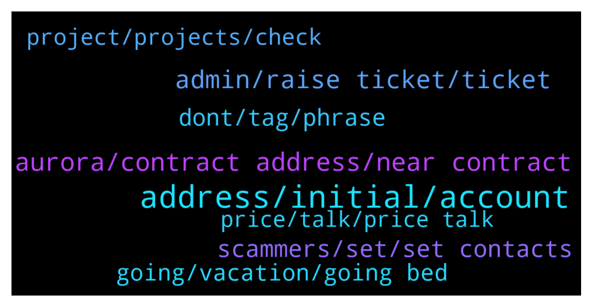

# **@cryptonear**
 ## Analysis for **2022-01-25** - **2022-01-26**.

---

## 📊 **Basic Stats**

**n_messages_sent**: 693

---

---

## 🔝 **Top keywords and related messages**

1. **address, initial, account**

    @fabrianable --- *can my near be returned?  I sent the wrong address to the initial deposit* **--->** [TG Discussion](https://t.me/cryptonear/299326)

    @Jamorson --- *I deposited five near in my account 2/3 are now in storage with the fees I have available 1.3 near this was only a trial will I ever receive those back into my account just asking* **--->** [TG Discussion](https://t.me/cryptonear/298567)

    @DarasLabi --- *can you tell me the fees?if i want to send it from binance to wallet?\* **--->** [TG Discussion](https://t.me/cryptonear/299117)

    @stevenn00 --- *then how if i want send my near to exchange* **--->** [TG Discussion](https://t.me/cryptonear/297603)

    @fabrianable --- *help me, I sent the wrong address to the initial deposit* **--->** [TG Discussion](https://t.me/cryptonear/299259)

    @TheGo1denBull --- *You need to get the exchange near address in your account if it's a cex like kucoin or binance.* **--->** [TG Discussion](https://t.me/cryptonear/297606)

2. **aurora, contract address, near contract**

    @cuiking --- *Awesomenear com say Aurora built on NEAR so I'm was confused* **--->** [TG Discussion](https://t.me/cryptonear/297655)

    @Zhekar1998 --- *In AURORA pool work on another way* **--->** [TG Discussion](https://t.me/cryptonear/298111)

    @harryfrottercrypto --- *Lol what is this wheres my aurora* **--->** [TG Discussion](https://t.me/cryptonear/297957)

    @crackedfingers --- *ah thats no good, i'll go back to aurora chain* **--->** [TG Discussion](https://t.me/cryptonear/298049)

    @GeorgePro1 --- *Aurora is side chain of near* **--->** [TG Discussion](https://t.me/cryptonear/297631)

    @JohnnyNguyen91 --- *Near like Dot, and Aurora like Kusama, right?* **--->** [TG Discussion](https://t.me/cryptonear/297651)

3. **admin, raise ticket, ticket**

    @Brownhawks_Memolabs --- *l can't send a dm. Guess l could contact mutual contacts* **--->** [TG Discussion](https://t.me/cryptonear/299002)

    @spectre011 --- *I cant dm you first @iamkemoo please dm me* **--->** [TG Discussion](https://t.me/cryptonear/299185)

    @ammaMod --- *He should add me as contact before i could message him* **--->** [TG Discussion](https://t.me/cryptonear/298150)

    @Kripto_Raptor --- *what was your issue?  you can Dm me about it* **--->** [TG Discussion](https://t.me/cryptonear/299408)

    @larry_lang --- *hmm u can DM me, Raptor is in his break^^ better not disturb him^^* **--->** [TG Discussion](https://t.me/cryptonear/298961)

    @cuiking --- *Many only admin can see dat* **--->** [TG Discussion](https://t.me/cryptonear/297682)

4. **scammers, set, set contacts**

    @cuiking --- *The more I chat here. More those scammers DM me at the end of the day there will be about 50 to 100 scammers in my DM* **--->** [TG Discussion](https://t.me/cryptonear/297771)

    @larry_lang --- *yea, pls be careful, also let block those guys who want to scam u* **--->** [TG Discussion](https://t.me/cryptonear/298770)

    @mikikaczura --- *i got info about hacked account* **--->** [TG Discussion](https://t.me/cryptonear/299044)

    @simeonfx --- *I just hope I don’t miss the good updates thinking it’s scam* **--->** [TG Discussion](https://t.me/cryptonear/298190)

    @rahulgoel007 --- *And if u have username let me know I will check and ban that guy from here too* **--->** [TG Discussion](https://t.me/cryptonear/298225)

    @rahulgoel007 --- *The 2nd link is the scammers near account* **--->** [TG Discussion](https://t.me/cryptonear/298160)

5. **dont, tag, phrase**

    @Stelcy_Chelsey --- *😎🙄 @kenjay60  you are Dead 😜* **--->** [TG Discussion](https://t.me/cryptonear/299019)

    @cuiking --- *He want me to answer him so fast 😁* **--->** [TG Discussion](https://t.me/cryptonear/297757)

    @NEARverse_xd --- *Dont know what are you talking about ;_; what not good🤔🤔* **--->** [TG Discussion](https://t.me/cryptonear/298052)

    @Doganalpaslan1 --- *İ was looking for this 😇* **--->** [TG Discussion](https://t.me/cryptonear/298397)

    @Anabeli2 --- *I only asked a simple question* **--->** [TG Discussion](https://t.me/cryptonear/297541)

    @kv9990 --- *And to finish that,here's my meme 😎 https://twitter.com/kvikash007/status/1438260711474356224* **--->** [TG Discussion](https://t.me/cryptonear/298312)

6. **going, vacation, going bed**

    @GeorgePro1 --- *How is it going @Stelcy_Chelsey   It’s been a long I see you here 👀* **--->** [TG Discussion](https://t.me/cryptonear/297577)

    @cuiking --- *How long will ur vacation last?* **--->** [TG Discussion](https://t.me/cryptonear/297699)

    @GeorgePro1 --- *Good morning 🌞    How is it going?* **--->** [TG Discussion](https://t.me/cryptonear/297946)

    @spectre011 --- *How are you doing my friend ?* **--->** [TG Discussion](https://t.me/cryptonear/298262)

    @NearFritz --- *Hey Hey Hey, am on vacation cause I love my occupation* **--->** [TG Discussion](https://t.me/cryptonear/297697)

    @crypto_blckhntr --- *Hello to the NEAR family, why is everyone silent today?* **--->** [TG Discussion](https://t.me/cryptonear/299287)

7. **project, projects, check**

    @VegaPopa --- *Very very good project more potential than solana* **--->** [TG Discussion](https://t.me/cryptonear/298978)

    @GeorgePro1 --- *Maybe someone from the community will help. I like all the projects building on near. Each of them has a unique use case.* **--->** [TG Discussion](https://t.me/cryptonear/298752)

    @dehraw --- *Ok thanks, will check it out. Do you guys have any personal favorites (I will do my own due diligence but just curious)?* **--->** [TG Discussion](https://t.me/cryptonear/298751)

    @cuiking --- *I think d NEAR CEO was a bit hash on Solana ceo on some of the hardware questions* **--->** [TG Discussion](https://t.me/cryptonear/299034)

    @rahulgoel007 --- *You can have a look at here Contains are the projects build on near https://awesomenear.com/projects/* **--->** [TG Discussion](https://t.me/cryptonear/298748)

    @CatPurry --- *Does near have an IDO launchpads??* **--->** [TG Discussion](https://t.me/cryptonear/298429)

