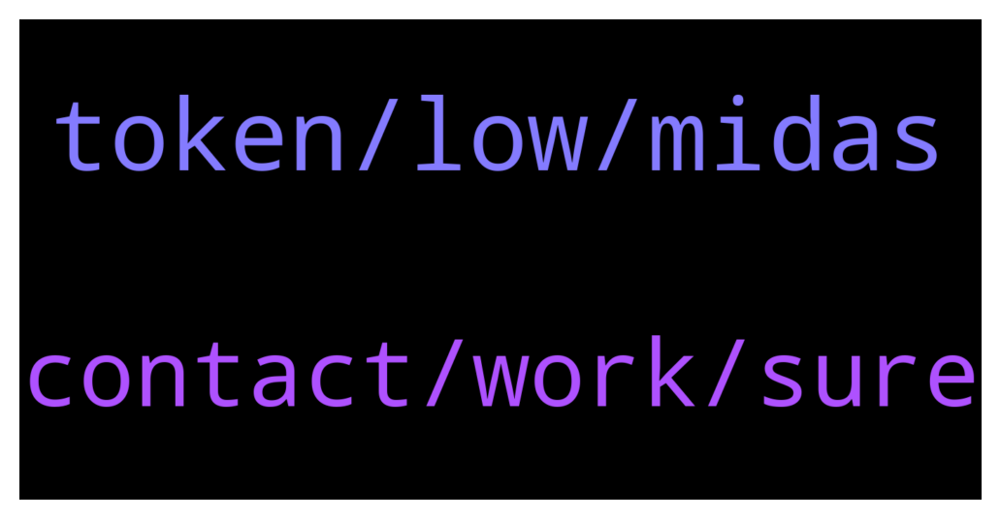

# **@de_fi**
 ## Analysis for **2022-01-25** - **2022-01-26**.

---

## 📊 **Basic Stats**

**n_messages_sent**: 45

---

---

## 🔝 **Top keywords and related messages**

1. **token, low, midas**

    @Taum2 --- *I think i found solid project. Want to know what you guys think of it.  Safechaintoken sct. Low supply, low mc, staking is live and swap is coming. Do you come across this project?* **--->** [TG Discussion](https://t.me/de_fi/235594)

    @dereksilva --- *Proposal to merge Abracadabra and Wonderland   https://medium.com/the-defi-wonderland/frog-nation-abracadabra-and-wonderland-united-front-276cb0d723ab* **--->** [TG Discussion](https://t.me/de_fi/235592)

    @xnatasx --- *BTC to 1 million, maybe, by 2030 according to ARK ETH market cap up to $20 Trillion in 10 years Lots of BTC, ETH/DeFi in this report  https://research.ark-invest.com/hubfs/1_Download_Files_ARK-Invest/White_Papers/ARK_BigIdeas2022.pdf* **--->** [TG Discussion](https://t.me/de_fi/235590)

    @Im --- *I'd prefer to invest some of my money elsewhere, given the current situation of the financial markets. Please suggest a worthwhile project to me.* **--->** [TG Discussion](https://t.me/de_fi/235617)

    @tetetag --- *Midas bridges defi with metaverse & p2e projects. Allowing staking and minting. And they are coming with nodes soon, but backs after* **--->** [TG Discussion](https://t.me/de_fi/235417)

    @crypto_thalia --- *Big caps in the crypto space have not been making praise worthy moves off late unlike alts. The space has been a witness to an impeccable journey of in 2021. With Defi you expanding and NFT all we can do is hold altho farm to earn while we hold as well* **--->** [TG Discussion](https://t.me/de_fi/235558)

2. **contact, work, sure**

    @xnatasx --- *For this group we just volunteerer.  Better to contact projects you like.* **--->** [TG Discussion](https://t.me/de_fi/235389)

    @Taum2 --- *They launched q4 2021 i think.* **--->** [TG Discussion](https://t.me/de_fi/235602)

    @xnatasx --- *Don't know if I heard of it, and not sure sure I have.* **--->** [TG Discussion](https://t.me/de_fi/235400)

    @Bax_the_Wonderer --- *5 mins of work and you can win merch you like* **--->** [TG Discussion](https://t.me/de_fi/235438)

    @Hazz99dk --- *Who should I contact for AMA proposal ?* **--->** [TG Discussion](https://t.me/de_fi/235546)

    @tetetag --- *So what do you mean by work here?* **--->** [TG Discussion](https://t.me/de_fi/235439)

