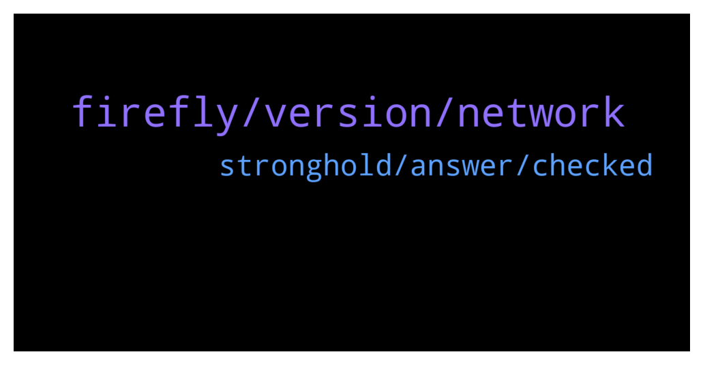

# **@iotatangle**
 ## Analysis for **2022-01-25** - **2022-01-26**.

---

## 📊 **Basic Stats**

**n_messages_sent**: 48

---

---

## 🔝 **Top keywords and related messages**

1. **firefly, version, network**

    @⠠⠵ Lucas! --- *https://github.com/TanglePay/TanglePay-Mobile  Not many updates in 3 months though* **--->** [TG Discussion](https://t.me/iotatangle/307633)

    @potatooe --- *No, only through official Firefly wallet (desktop):  https://firefly.iota.org/* **--->** [TG Discussion](https://t.me/iotatangle/307591)

    @Amit --- *Can i stake ioda using my Android* **--->** [TG Discussion](https://t.me/iotatangle/307590)

    @gjarete --- *Yes. We don't update a lot, only for new functions like staking. We will keep the github together with the app update from next update* **--->** [TG Discussion](https://t.me/iotatangle/307635)

    @Jonny --- *Hi, What has been updated on firefly version 1.3.3?* **--->** [TG Discussion](https://t.me/iotatangle/307611)

    @Tahmis --- *(discord) christian.saur [Assembly] [Touchpoint Update]  Hey all!  I just wanted to share a quick overview over last week's new additions to Touchpoint as we've brought in a couple of really interesting projects!  **The Fans Together:** A DAO on the Iota protocol to provide fan ownership and fan participation of and in Professional Sports Clubs (https://thefanstogether.io/)  **Tangleswap: **TangleSwap is an AMM Decentralized Exchange (DEX) aimed at providing a wide portfolio of IOTA DeFi solutions (https://tangleswap.exchange/)  **Cryptobuddy:** Cryptobuddy is a crypto sales event aggregator and research platform. They also invest through their venture arm, lately with a focus on gaming and metaverse plays, but also eyeing the DeFi space (https://cryptobuddy.info/#/)  **Mesh+:** Mesh+ is designed to provide decentralized network coverage for the LoRa IoT ecosystem and capable to sustain telecommunications on a global scale due to usage of 2.4Ghz frequency spectrum (https://meshplus.io/)  **GAT Network & MintedVodka:** Gat Network is a web of connected NFT trading & gaming project. It is centered around Minted Vodka, the next-gen crypto-assets marketplace and NFT toolbox. Around MintedVodka, GAT Network invents, builds and connects on-chain gaming experiences (https://gat.network/minted-vodka/)  **Elysi**: ELYSI is a permissionless, decentralized metaverse experience that brings together multiple-blockchains for an endless world of customisable NFT and smart contract experiences in a virtual reality created by the users (https://elysi.io/#/)  Excited to have all of them! In addition, we had more calls with exciting projects and investors that we are working on bringing in, so expect this group to keep growing 🙂* **--->** [TG Discussion](https://t.me/iotatangle/307656)

2. **stronghold, answer, checked**

    @gjarete --- *Thanks for the question. not providing stronghold file is only not providing an alternative way to "login".* **--->** [TG Discussion](https://t.me/iotatangle/307638)

    @⠠⠵ Lucas! --- *👍 Is the only way to guarantee the are no undisclosed backdoors in the application. Also, although it is "only" for convenience, the stronghold level is isolation has a clear objective: providing a higher security to critical data (like the seed) from compromised operating systems. And smartphones are very risky ones.* **--->** [TG Discussion](https://t.me/iotatangle/307636)

    @gjarete --- *Hi! I'm Garrett from TanglePay. Thanks guys for commenting! I just want to point out that not implementing support of Stronghold file is not making the app less secure. It is only making it less convenient. And we will update it once the IF library support that. =)* **--->** [TG Discussion](https://t.me/iotatangle/307629)

    @⠠⠵ Lucas! --- *Yeah, when I checked it, they had one only commit IIRC and not a single line of code for stronghold. I don't think anything changed, because they would likely use it for marketing.* **--->** [TG Discussion](https://t.me/iotatangle/307624)

    @potatooe --- *Ahh yes, forgot about them. Tanglepay is legitimate from what i understand, but use your own discretion. The IF doesnt validate projects if my understanding is correct* **--->** [TG Discussion](https://t.me/iotatangle/307595)

    @⠠⠵ Lucas! --- *Oh. One last question, when you kindly can answer. I believe it's the case: why does the app on play store say it makes use of stronghold when it's not true?* **--->** [TG Discussion](https://t.me/iotatangle/307640)

