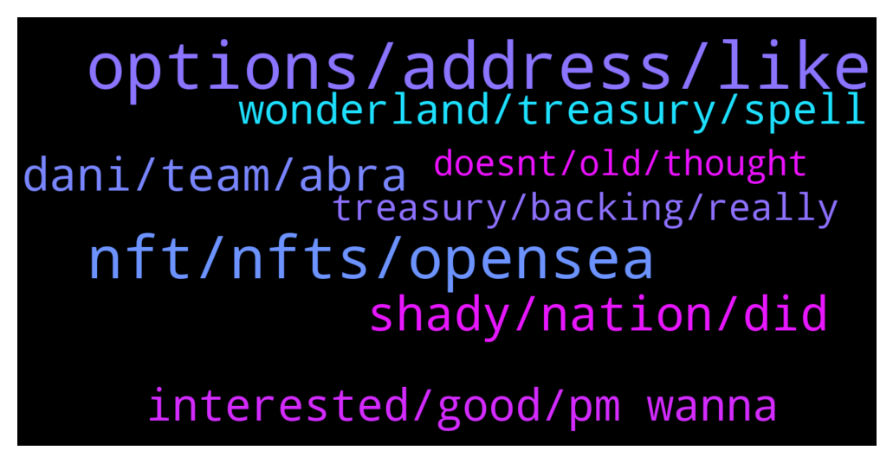

# **@lobsters_chat**
 ## Analysis for **2022-01-25** - **2022-01-26**.

---

## 📊 **Basic Stats**

**n_messages_sent**: 334

---

---

## 🔝 **Top keywords and related messages**

1. **options, address, like**

    @ahboyash --- *GM sers, would appreciate anyones comments on how I can better this spreadsheet! ☺️  https://twitter.com/ahboyash/status/1485939275065868289?s=20* **--->** [TG Discussion](https://t.me/lobsters_chat/318851)

    @Edward --- *Options strategy protocols on Arbitrum, do they exist yet? I've just heard of something called JonesDAO but I can't find anything on their site which talks about the details of their options strat* **--->** [TG Discussion](https://t.me/lobsters_chat/318689)

    @harithk17 --- *think some of you noticed earlier, but sharing a cool feature (if i may say so myself) for all EVM-chain addresses =) https://twitter.com/etherscan/status/1485968502284775424* **--->** [TG Discussion](https://t.me/lobsters_chat/318650)

    @ShardYaco --- *Yep. Address generation algorithm does not care about the content of your contract. Just your address and nonce* **--->** [TG Discussion](https://t.me/lobsters_chat/318540)

    @DAOhound --- *Is there an ibbtc bridge? Arbitrum to polygon* **--->** [TG Discussion](https://t.me/lobsters_chat/318870)

    @stkmaAkita --- *i think if the rows were grouped by type of chain (evm compatible, layer 2, etc), color coded and if the links were replaced with an embedded link (CTRL + K) it would look prettier* **--->** [TG Discussion](https://t.me/lobsters_chat/318855)

2. **nft, nfts, opensea**

    @sonicblend --- *I stand corrected, also image_url isn't cached if it is a svg (they don't recommend). Looks like this NFT uses:    "animation_url": "https://viewer.generativedungeon.com/5",  Whereby animation_url is: A URL to a multi-media attachment for the item. The file extensions GLTF, GLB, WEBM, MP4, M4V, OGV, and OGG are supported, along with the audio-only extensions MP3, WAV, and OGA.  Animation_url also supports HTML pages, allowing you to build rich experiences and interactive NFTs using JavaScript canvas, WebGL, and more. Scripts and relative paths within the HTML page are now supported. However, access to browser extensions is not supported.* **--->** [TG Discussion](https://t.me/lobsters_chat/318978)

    @yic_alex --- *OpenSea is reimbursing users who sold NFTs below market value due to UI issue  https://www.theblockcrypto.com/post/131443/opensea-reimburses-users-sold-nfts-below-market-value-ui-issue?utm_source=telegram&utm_medium=social* **--->** [TG Discussion](https://t.me/lobsters_chat/318635)

    @ivangbi --- *Mikael playing with code for fun. This is not related to Gearbox Protocol except giving a perk to GEAR holders and Lobster NFT holders. It is just a cool learning experience he had with Solidity 8. Hint: updating the code + making adapters for the next releases Eyes* **--->** [TG Discussion](https://t.me/lobsters_chat/318664)

    @naps62 --- *Hi everyone. does anyone know of any ticketing solutions with nft integrations? I'm looking for something probably too specific (unlikely to exist), but just getting a sense of the available options would help  e.g. using NFTs as tickets, but also as just discount codes for later buying tickets. integrations with existing ticketing systems would be a great plus* **--->** [TG Discussion](https://t.me/lobsters_chat/318482)

    @optional1t --- *I saw a project doing a NFT game on opensea kinda interesting  You can play it lol* **--->** [TG Discussion](https://t.me/lobsters_chat/318975)

    @engineerking --- *Cool idea. Dynamic nfts are sick.. What other cool ideas hooking into markets or real world chainlink info and having the nft changing?* **--->** [TG Discussion](https://t.me/lobsters_chat/318712)

3. **shady, nation, did**

    @mann0000 --- *two pigeons don't breed eagles I think* **--->** [TG Discussion](https://t.me/lobsters_chat/318936)

    @ivangbi --- *There must be a catch, where 🤔* **--->** [TG Discussion](https://t.me/lobsters_chat/318935)

    @da0man --- *why did Daniele betray the Frog nation? He said he works for the people...* **--->** [TG Discussion](https://t.me/lobsters_chat/318804)

    @engineerking --- *He letting the 🐸 nation down... Sad day* **--->** [TG Discussion](https://t.me/lobsters_chat/318781)

    @ivangbi --- *Trying to look for a shady move* **--->** [TG Discussion](https://t.me/lobsters_chat/318934)

    @eager_to_learn --- *Important 🧵 ending with a call to action (though mostly for citizens of burgerland):  https://twitter.com/jerrybrito/status/1486349099314130952* **--->** [TG Discussion](https://t.me/lobsters_chat/319030)

4. **dani, team, abra**

    @kindeagle --- *Live AMA with Dani, right now: https://twitter.com/i/spaces/1MYxNnByYBbxw?s=20* **--->** [TG Discussion](https://t.me/lobsters_chat/319021)

    @Tiarizzi93 --- *https://twitter.com/OlympusIntern/status/1486128623232950274?t=el603g3TCN4uW8hrR9Yo0A&s=19  Time down 50% in a matter of hours as Dani WMEMO gets liquidated on Abra, it seems* **--->** [TG Discussion](https://t.me/lobsters_chat/318769)

    @SpikeSpiege1 --- *Jonesdao totally screwed their distro so they have to refund and do it all over again.  Doesn't give me much confidence in the team https://twitter.com/Fiskantes/status/1485982669947166728* **--->** [TG Discussion](https://t.me/lobsters_chat/318703)

    @w00tcake --- *And LiquidDriver and Tarrot made it 🤟🏼* **--->** [TG Discussion](https://t.me/lobsters_chat/318589)

    @river0x --- *Abracadbra is still unaudited, it's astonishing that such an important DeFi stable hasn't got one* **--->** [TG Discussion](https://t.me/lobsters_chat/319002)

    @ivangbi --- *Oh so it was TVL based* **--->** [TG Discussion](https://t.me/lobsters_chat/318584)

5. **interested, good, pm wanna**

    @easeev --- *We participated in The Graph one and it was good* **--->** [TG Discussion](https://t.me/lobsters_chat/318835)

    @RobAnon --- *Not yet, writing them today 😛 Doing this and a thousand other things* **--->** [TG Discussion](https://t.me/lobsters_chat/318715)

    @EerieEight --- *I'd be interested in having one done for spooky can I pm you?* **--->** [TG Discussion](https://t.me/lobsters_chat/319003)

    @saintsal --- *thanks - what did you like?* **--->** [TG Discussion](https://t.me/lobsters_chat/318836)

    @optional1t --- *If anyone wanna take a look at it https://opensea.io/collection/generativedungeon* **--->** [TG Discussion](https://t.me/lobsters_chat/318976)

    @h3kufc --- *this talks is really good too https://wallet.fail/* **--->** [TG Discussion](https://t.me/lobsters_chat/318752)

6. **wonderland, treasury, spell**

    @Angelentropy --- *Just a guess, since Wonderland is below backing, buying the treasury via Abra is buying inventory/treasury at a discount* **--->** [TG Discussion](https://t.me/lobsters_chat/318950)

    @DAOhound --- *Yes more or less  This is an exit from wonderland that retains as much value as is reasonable* **--->** [TG Discussion](https://t.me/lobsters_chat/319033)

    @Ying --- *Wonderlands claim for treasury safety concern ( potential exploit), buyback is not automated.* **--->** [TG Discussion](https://t.me/lobsters_chat/318983)

    @justsomedeveloper --- *Isn’t it kinda like a giant spell short where Daniele and Sifu can offload their depreciating asset into stables (which wonderland treasury contains of for the most part iirc) without needing to find someone to buy 18b spell otc?* **--->** [TG Discussion](https://t.me/lobsters_chat/319029)

    @river0x --- *We wrote a report on Wonderland and it's as you might expect https://www.defisafety.com/pqrs/143* **--->** [TG Discussion](https://t.me/lobsters_chat/319000)

    @tiequan --- *Pretty stupid too, the largest tranche in mim’s degenbox is wonderland’s portion funded from their own treasury* **--->** [TG Discussion](https://t.me/lobsters_chat/318971)

7. **treasury, backing, really**

    @ivangbi --- *Oh and another follow up then: this allows him to manage it however he wants without having to keep redemption memes or other “backing” principles. It becomes a spendable treasury instead of being required to not syphon it out* **--->** [TG Discussion](https://t.me/lobsters_chat/318951)

    @yic_alex --- *It doesn't matter whether you automate it. If you get hit by massive liquidity at once due to a spike in selling and/or liquidations this will be the result. Otherwise you'd need to put 100% of the treasury into the limit order. Which of course defeats the whole purpose because it's supposed to generate yield.  Imho the whole issue behind the OHM model is that it's running on people who don't understand that they're funding a treasury and in turn get nothing more than a ticket to participate in a self referential staking ponzi. They somehow don't seem to connect with the fact that the hard cash doesn't remain in the same system since the treasury follows different rules - which are depending on the fork arbitrarily decided by it's inventors.* **--->** [TG Discussion](https://t.me/lobsters_chat/318848)

    @yic_alex --- *The whole idea of trying to defend the price actively to keep it above backing seems weird. It just burns through the treasury in times of market irrationality. If the people truly believe in your ponzi, it should return to the backing price either way. However, you can't really rely on that if you're running the whole thing on leverage with a cult like following.* **--->** [TG Discussion](https://t.me/lobsters_chat/318844)

    @DeadMeatHK --- *When we say "backing" are we referring to current treasury market value or only the portion of the treasury that's not TIME? If the latter, is it really "below backing"?* **--->** [TG Discussion](https://t.me/lobsters_chat/318954)

    @Angelentropy --- *Should not include time but need to take a deep look on their treasury if it really is below backing* **--->** [TG Discussion](https://t.me/lobsters_chat/318963)

    @DAOhound --- *Good question. My first reaction is that there’s a difference in goals between the examples given and the the monetary policy used in each should complement it. Buybacks above the absolute floor ($1) lower the backing in a more extreme way than dilution or aggressive rebasing ever could holding a peg is the goal of some, deploying a. asset to be a single point of speculation for an entire treasury probably shouldn’t be vulnerable to a policy that drains the treasury itself, whether it be for the sake of hype or even stability. That gets complicated when you have leverage built on top of that and buybacks can potentially protect your more adventurous investors, but if I had positions of size where liquidation-hunting and buyback gaming was an option for me, it’d be logical for me to do it.   That said I don’t run a project or hold any position of guidance, I’m a lone investor screaming into the void and I’m probably wrong on top of that* **--->** [TG Discussion](https://t.me/lobsters_chat/318897)

